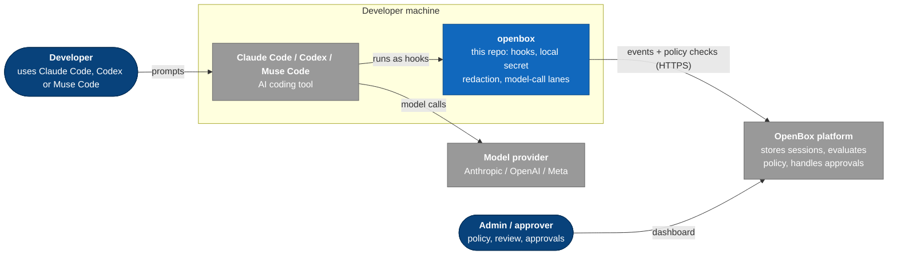

# OpenBox Shift-Left

Governance for the AI coding tools your developers already use.

If your team uses [Claude Code](https://claude.com/claude-code), [OpenAI
Codex](https://openai.com/codex) or Meta's Muse Code, `openbox` lets your
organization see and control what those tools do: the prompts sent, the commands run, the files
changed, the tokens spent, and whether each action was allowed.

`openbox` is one small binary installed on each developer machine. It is a
client: it connects to an **OpenBox platform** your organization already runs
(hosted or self-hosted), which stores the events and decides the policy.



## How it works

Claude Code, Codex and Muse Code can run a program at fixed moments, called **hooks**:
when a session starts, when you submit a prompt, before a tool runs, after it
finishes. `openbox init` registers itself as those hooks. On every hook call,
`openbox`:

1. turns the tool's event into one common event shape;
2. removes secrets from any text, on your machine, before anything is sent;
3. for a tool call or a prompt, asks the platform's policy and applies the
   answer **before** the action runs (allow, block, wait for approval, or
   halt the session);
4. sends everything else to the platform in the background;
5. stamps each git commit with the session that made it, so a deploy can be
   traced back to a session ([lineage](docs/lineage.md)).

Hooks cannot see the requests sent to the model, so on Claude Code and Codex
`openbox` also runs small local background services, the **model-call lanes**,
that record them. Muse Code's calls are checked before they are sent, and
recorded (model, token counts and ids only) by redirecting its own telemetry
export to a local receiver. See [Architecture](docs/architecture.md) for the full picture.

## Quickstart

**You need:**

- macOS or Linux, with Claude Code, Codex or Muse Code installed. (Windows builds but is
  not tested end to end.)
- An OpenBox platform. With the hosted service, the default URLs are correct.
- An **organization API key** from the dashboard, **Organization → API Keys**.
  It starts with `obx_key_` and needs the `create:agent` and `read:agent`
  scopes. A key that starts with `obx_` but not `obx_key_` is an agent key and
  will not work ([why](docs/getting-started.md#2-get-the-right-credential)).

### 1. Install

```bash
curl -fsSL https://raw.githubusercontent.com/OpenBox-AI/openbox-shift-left/main/install.sh | bash
openbox version
```

This downloads a prebuilt binary, checks its hash and puts it in
`~/.local/bin`. No Go toolchain needed.

### 2. Connect your organization

```bash
openbox auth
```

It asks for three values; press Enter to keep a default:

```
Backend URL (control plane)   [https://api.openbox.ai]:
Core URL (data plane)         [https://core.openbox.ai]:
Organization control token (obx_key_… or JWT):   ← paste; not echoed
```

> **Self-hosting?** Answer **both** URL prompts with your own hosts. If you
> change only one, events go to the hosted service and fail with a 401.

### 3. Govern a tool

```bash
openbox init --provider claude-code
```

This registers an agent for Claude Code on your platform and adds the hooks to
your user-wide settings. Every Claude Code session on this machine is now
governed, in any folder, including sessions already open.

Using Codex? Run `openbox init --provider codex` (and trust the new hooks with
`/hooks` inside Codex). Using Muse Code 1.4.0 or newer? Run
`openbox init --provider muse`; it installs hooks and points Muse's own
telemetry export at a local receiver instead of Meta's destinations (metadata
only; `openbox uninstall` puts your previous setting back). Run `init` once per
tool; running it again is safe.

### 4. Check it

```bash
openbox doctor
```

`doctor` shows each tool's identity, every setting and where its value came
from, whether the platform is reachable, and anything that is silently not
working. Then use your tool as normal.

The full walkthrough, with CI setup, approvals and troubleshooting, is in
**[Getting started](docs/getting-started.md)**.

## Good to know

- **Enforcement is always on.** It acts on your organization's policy, so
  until a policy is published nothing is blocked and you only get visibility.
- **It fails closed.** If a policy check gets no answer from the platform, that
  one action is denied. The next action gets a fresh attempt.
- **Content is sent by default.** Prompts, replies, tool commands and file
  contents are sent after local secret redaction. Turn it off per tool with
  `"content_capture": false`. See [Data and privacy](docs/data-and-privacy.md).
- **Credentials are plaintext files** under `~/.openbox/`, readable by anything
  running as you, including the coding agent. See
  [Credentials](docs/credentials-and-secrets.md).
- **It detects bypass; it does not prevent it.** A developer can remove the
  hooks or route model calls around the lanes. Both show up in the record and
  in `openbox doctor`. To make governance mandatory, deploy the managed
  settings in [`deployments/managed/`](deployments/managed/) with your MDM.

## Commands

| Command | What it does |
|---|---|
| `openbox auth` | Save your platform URLs and organization key. |
| `openbox init --provider <claude-code\|codex\|muse>` | Register that tool's agent and install its hooks. Once per tool. |
| `openbox doctor` | Show what is in effect, where each value came from, and what is wrong. |
| `openbox trace` | Read the local record of what `openbox` did, per session. |
| `openbox uninstall` | Remove everything `openbox` installed, including credentials. |
| `openbox version` | Print the version. |

## Supported tools

| | Claude Code | Codex | Muse Code |
|---|---|---|---|
| Session, prompt and tool events | yes | yes | yes |
| Enforcement | block, approval, redact, halt | block, redact, halt (approval becomes block) | block, redact, halt (approval and halt render as a plain refusal) |
| Model calls recorded | yes (transport lane) | token usage; on macOS the request and reply too, once the relay has seen Codex | model, tokens and response id only (telemetry lane); each call is also checked before it is sent |
| Org mandate file | managed settings | `requirements.toml` | hooks file and policy (unverified keys) |

Muse Code's hook payloads and refusal answers were observed on Muse 1.4.1;
what is still unverified is listed in the
[adapter README](internal/adapters/muse/README.md#unverified-and-what-would-settle-it).
Details: [Provider coverage](docs/coverage.md).

## Documentation

| Doc | Read it to |
|---|---|
| [Getting started](docs/getting-started.md) | install, configure, operate and troubleshoot |
| [Data and privacy](docs/data-and-privacy.md) | see what is sent and how to turn it off |
| [Credentials and secrets](docs/credentials-and-secrets.md) | see where keys live and what the redactor catches |
| [Architecture](docs/architecture.md) | understand the design, the diagrams and the code layout |
| [Lineage](docs/lineage.md) | trace a deploy back to a commit and a session |
| [Contributing](docs/contributing.md) | build, test and send a change |

Reference, for adapter authors and platform integrators:
[Provider coverage](docs/coverage.md) ·
[Event contract](docs/dev-event-contract.md) ·
[Wire mapping](docs/mapping.md).

## License

[Apache License 2.0](LICENSE).
