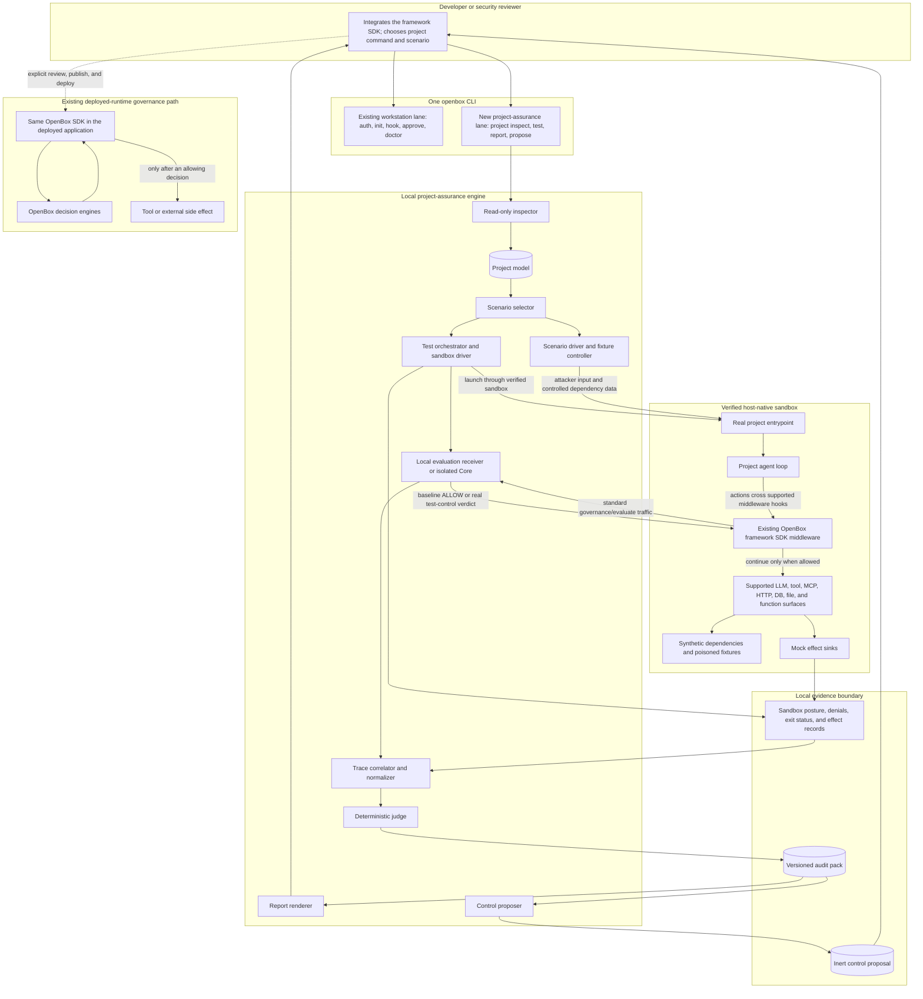
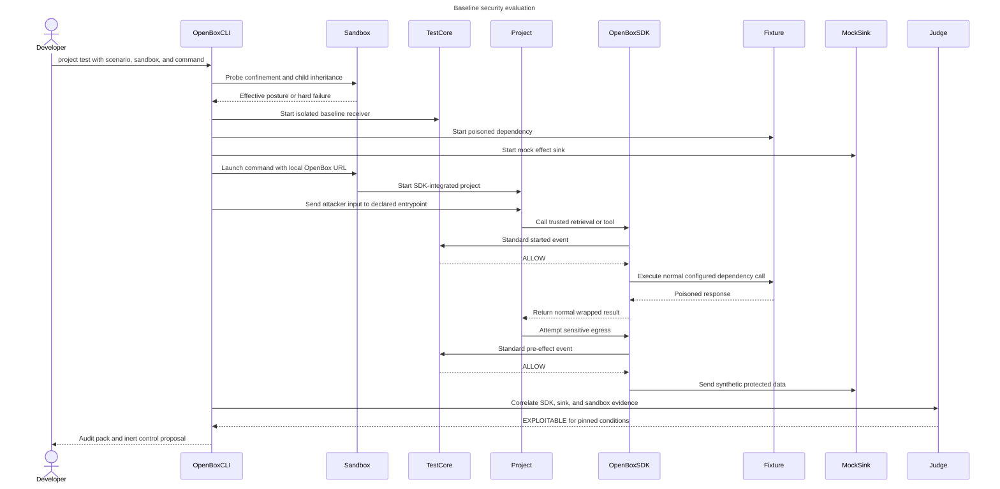
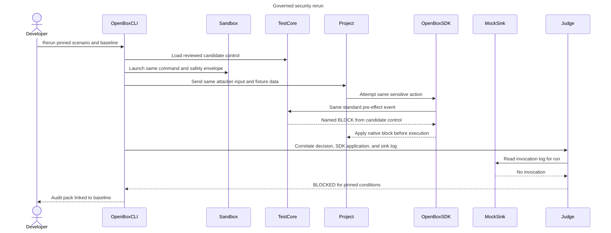
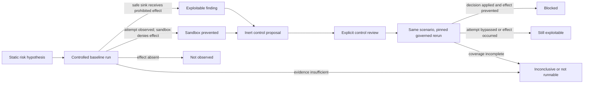

# Shift Left project security evaluation

Status: **superseded for execution; retained as design input.**
Created: 2026-08-17. Updated: 2026-09-02.

> **Read this first.** The delivered lane is
> [`plans/260825-1623-lean-openshell-project-assurance/plan.md`](../plans/260825-1623-lean-openshell-project-assurance/plan.md),
> and the shipped user surface is [`docs/project-assurance.md`](../docs/project-assurance.md).
> This document's CLI shape and several of its mechanisms were **not** built and
> are not reachable: `project test --scenario ID --sandbox DRIVER`, the local
> evaluation receiver, the governed rerun, the `exploitable` / `blocked` /
> `sandbox_prevented` / `not_observed` outcome vocabulary, and the
> `runtime_enforceable` / `observable_only` / `code_change_required` / `blind`
> control-reachability classes. Those survive only inside the frozen
> `openbox.audit-pack/v1` historical read contracts.
>
> What shipped instead: `project evaluate` runs one developer image in pinned
> OpenShell against local Core; a native-host skill produces an untrusted
> issue-only candidate; `project finalize` independently reverifies it offline,
> captures GET-only target posture, and seals an advisory report whose
> recommendations are inert. The reachability classification is replaced by a
> frozen catalog bound to agent-runtime routes plus a per-issue
> `recommendation_mapping`; the substantive reason the old class existed —
> never recommending a developer-machine hook as production protection — is
> preserved structurally rather than by label.
>
> The sections below remain useful as the reasoning behind the evidence
> contract, the dual-authority model, the outcome/confidence split and the
> "what it must not say" list, all of which did carry forward. Treat the CLI
> surface, artifact layout and phase plan as historical.

Its original implementation plan,
[`plans/260819-1600-project-security-evaluation/plan.md`](../plans/260819-1600-project-security-evaluation/plan.md),
is itself superseded and is a decision record only.

## Proposed direction

Replace the separate `openbox-audit` idea with a second, explicit product lane
inside the existing `openbox` CLI:

1. **Workstation governance** governs supported coding-agent actions while
   software is being built. This is the current hook-based Shift Left product.
2. **Project assurance** inspects and exercises an agentic application, judges
   bounded security scenarios, and proposes where OpenBox should govern its
   deployed runtime.

The second lane should live under `openbox project`, not in the current hook
engine and not in a second executable. Its first release should be local-first,
read-only by default, and produce versioned evidence artifacts. It must not edit
source, publish policy, register an agent, or claim runtime governance merely
because a scan or test completed.

A behavioral `project test` has one explicit integration precondition: the
project runs through the existing OpenBox SDK for its framework, such as
[openbox-langchain-sdk-python](https://github.com/OpenBox-AI/openbox-langchain-sdk-python),
[openbox-langgraph-sdk-python](https://github.com/OpenBox-AI/openbox-langgraph-sdk-python),
or [@openbox-ai/openbox-mastra-sdk](https://github.com/OpenBox-AI/openbox-mastra-sdk).
That SDK is the semantic observation layer inside the application. A separately
verified sandbox then launches the project and supplies the containment and
external-effect layer. Static `inspect` remains useful without an SDK, but it
cannot produce a behavioral verdict.

This direction develops the earlier
[agent-audit brainstorm](../../openbox-agent-audit-brainstorm.md) using the
current Shift Left architecture and the ecosystem findings in
[Codex](../kb/codex.md), [Claude Code](../kb/claude-code.md),
[Cursor](../kb/cursor.md), and [DeepSeek Harness](../kb/deepseek-harness.md).
Where the documents differ, this draft supersedes the brainstorm's separate
`openbox-audit` binary and SDK scan-mode proposals; the brainstorm remains
historical design input.

## Security evaluation at a glance

Security evaluation is not one scan and it is not one policy decision. It is a
bounded evidence loop:

1. inspect the project without executing it;
2. select a versioned scenario from the discovered attack surface;
3. run the SDK-integrated project inside a disclosed sandbox and fixture
   envelope;
4. correlate SDK events with sandbox, fixture, and sink evidence, then judge
   them with deterministic predicates;
5. emit an audit pack and an inert control proposal; and
6. only after explicit review, load the candidate into an isolated real
   decision engine and rerun the same scenario to determine whether the named
   control actually blocked the effect.

Static inspection can produce a risk hypothesis. Only a controlled run can
produce a behavioral outcome. Only a governed rerun that observes the decision,
its application, and prevention of the side effect can produce `blocked`.

### System architecture

This is the target architecture. Boxes in the project-assurance and controlled-
execution lanes are proposed Shift Left components. The framework SDKs already
exist; the local evaluation receiver, sandbox drivers, correlator, and artifact
contracts do not exist in this repository today.



The existing workstation lane still uses `provider.HookEngine` and
`adapters/common/hookflow`. The new project lane shares the executable,
configuration conventions, identity, redaction vocabulary, and reporting
language, but it has its own orchestration and artifacts. In particular, a
project test is not a synthetic coding-host hook event.

There is no SDK "scan mode" in this architecture. The SDK behaves as normal
middleware and uses its existing framework lifecycle and generic hook
instrumentation. For evaluation, Shift Left points its configurable OpenBox API
URL at an isolated local receiver using a test identity. The receiver records
the standard `/api/v1/governance/evaluate` traffic and returns `ALLOW` during a
baseline run. A governed rerun must obtain its verdict from the real candidate
decision logic in an isolated test instance; a hard-coded `BLOCK` response
would prove only that the SDK can raise an error, not that the proposed control
matches the attack.

The SDK observes semantic actions but does not create the sandbox, drive the
application, inject arbitrary in-process tool returns, or prove that an
external effect occurred. The scenario driver supplies attacker input and
poisoned data through controllable project boundaries such as HTTP fixtures,
mock MCP servers, seeded retrieval stores, or dependency injection. Mock sinks
record allowed test effects. If the required seam is unavailable, the scenario
is `not_runnable`; the evaluator must not imply that the SDK substituted a tool
result.

The sandbox is complementary. It constrains filesystem, process, credential,
and network effects and records its effective posture and denials. It does not
replace the SDK's inside-the-agent trace. A host sandbox is acceptable only
when its exact version, configuration, inheritance to the project process, and
failure behavior are captured. If confinement cannot be established, `test`
must stop rather than silently execute the project unsandboxed.

The runtime-governance box is outside the default local evaluation path.
`inspect`, `report`, `propose`, and a baseline `test` do not publish controls or
send synthetic findings to it. A governed rerun is a separate, explicitly
authorized mode and needs an isolated test identity until core-side separation
of synthetic events from trust, attestation, and production history is proven.

### Evaluation sequence

Static `inspect` precedes execution and returns a project model plus expected SDK
coverage, never a behavioral verdict. The first sequence is the controlled
baseline. The poisoned dependency result and egress destination are fixtures;
the run can observe the prohibited effect without reaching a real target.

#### Baseline run



The SDK observes and wraps the project's normal dependency call; the fixture,
not the SDK, supplies the poisoned result.

#### Governed rerun

After explicit review, the same scenario can be rerun with the candidate loaded
into a real isolated decision engine:



### Component and authority contract

| Component | Owns | Must not imply or do |
|---|---|---|
| CLI command layer | Command routing, disclosure, consent boundary, run manifest | Hide project execution behind `inspect` or `report` |
| Inspector | Static project graph and coverage gaps | Import or execute project code; claim exploitability |
| Scenario selector | Versioned test selection and finding-bound hypotheses | Treat generated scenarios as findings |
| Test orchestrator | Sandbox selection, capability probes, budgets, process lifecycle | Execute without the explicit `test` boundary or accept a silent unsandboxed fallback |
| Existing framework SDK | Emit supported semantic actions and apply returned governance verdicts | Claim that unsupported or bypassed operations were observed |
| Local evaluation receiver | Capture standard SDK traffic under a test identity; return baseline or real isolated-control decisions | Pollute production history or use a hard-coded verdict as policy proof |
| Scenario driver and fixtures | Drive the declared entrypoint; provide poisoned dependencies and mock sinks | Pretend to substitute an arbitrary in-process tool result |
| Host sandbox driver | Constrain outer effects and attest effective filesystem, process, credential, and network posture | Stand in for the SDK's semantic trace or claim a sandbox denial is an OpenBox block |
| Correlator and judge | Link SDK intent to fixture/sink effects; apply stable deterministic predicates | Let an LLM assign `blocked` or silently pass missing evidence |
| Audit pack and reports | Exact snapshot, inputs, traces, judgments, limits, renderings | Treat SARIF or Markdown as the authoritative evidence store |
| Proposer | Map a finding to a present or required interception point | Edit source, register agents, or publish controls |
| Production deployment | Publish a reviewed control to the deployed decision path after test proof | Convert a mock result, test block, or model refusal into a production-enforcement claim |

### Dual-evidence and SDK coverage contract

"The SDK captures all agent actions" is a useful product goal, but the
evidence contract must be narrower: it captures all actions that cross an
enabled, supported hook in the installed framework SDK and base
instrumentation. The exact surface varies by adapter and version. For example,
the LangChain and LangGraph packages add framework-owned tool and LLM lifecycle
events, while the
[Python base SDK](https://github.com/OpenBox-AI/openbox-sdk-python) supplies
supported HTTP, database, file, and function hooks. The Mastra SDK has its own
workflow, activity, signal, and operational-span mapping. An unwrapped library,
raw socket, native extension, child process, skipped tool, or disabled
instrumentor can remain outside that semantic trace.

Every run must therefore record a machine-readable coverage manifest with:

- framework and exact framework version;
- OpenBox framework SDK and base SDK package versions;
- initialization path and project entrypoint;
- enabled lifecycle, LLM, tool, HTTP, database, file, function, and other
  instrumentors;
- skipped types, ignored endpoints, content redaction, and truncation posture;
- a startup probe result for every action class claimed as observed; and
- known uncovered libraries, subprocesses, tools, MCP internals, and sinks.

The evaluator then correlates two independent evidence channels:

| Evidence channel | Establishes | Does not establish alone |
|---|---|---|
| OpenBox SDK trace | Which supported semantic action the agent requested, with framework context and pre/post lifecycle | That the real external effect occurred or that unsupported paths were absent |
| Sandbox, fixture, and mock-sink evidence | Which bounded process/network/file effect occurred or was denied | Why the agent chose it or which framework action caused it |
| Correlated evidence | The supported agent action and its observed or prevented effect under the exact test envelope | General safety outside the pinned snapshot, versions, scenario, and coverage |

No SDK event means either no covered action or missing coverage; it never means
"the agent did nothing" without supporting outer evidence.

### Evidence and control loop

The shared atom is a normalized security invariant, not necessarily a core span
predicate. For example: "after consuming untrusted content, the agent must not
send protected data to an unapproved destination." The evaluator compiles that
invariant into three related predicates where the available surfaces permit it:

- a baseline observation predicate over the trace and mock-sink record;
- a candidate runtime predicate over attributes the OpenBox decision engine can
  actually receive before the effect; and
- a governed-rerun predicate requiring evidence that the decision was issued,
  applied, and prevented the effect.

If the runtime predicate cannot be expressed against a present pre-effect
interception point, the result is `observable_only`, `code_change_required`, or
`blind`—not a fabricated control. Field names and semantics must be validated
against the runtime decision contract before a proposal is called
`runtime_enforceable`.



## Why this belongs in one CLI

Both lanes answer one product question: **where can an agent act, what evidence
do we have, and where can OpenBox enforce a decision?** They can share identity,
configuration, redaction primitives, artifact conventions, and reporting
language. A second binary would duplicate those boundaries and make developers
choose between two products whose subjects overlap.

They should still remain separate workflows:

| Dimension | Workstation governance | Project assurance |
|---|---|---|
| Subject | Coding-agent session on a developer machine | Agentic application and its runtime graph |
| Trigger | Ambient native host hooks | Explicit CLI command |
| Unit | One prompt, tool call, turn, or lifecycle event | Project model, scenario, trace, finding, proposal |
| Timing | Synchronous gate plus asynchronous telemetry | Offline inspection and controlled tests |
| Current authority | Host hook can allow, deny, ask, or rewrite where supported | Baseline receiver observes and allows; an isolated governed rerun may exercise a reviewed control through the existing project SDK |
| Failure policy | Provider ceiling plus configured fail-open/fail-closed | Inconclusive/not-runnable; never silently pass |
| Evidence destination | OpenBox governance events and local spool | Local, content-addressed audit pack in the MVP |

The current [architecture](../docs/architecture.md) deliberately centers
`provider.HookEngine`, thin coding-host adapters, and a one-event synchronous
`/api/v1/governance/evaluate` call. Project assurance has different semantics
and must not be squeezed into that interface.

## Product contract

### What the feature should say

> Shift Left models the project's agent, tools, trust boundaries, and data
> flows; runs the SDK-integrated application under selected security scenarios
> in a verified sandbox; correlates instrumented agent behavior with bounded
> external effects; and suggests reviewed OpenBox runtime controls for reachable
> risks.

### What it must not say

- "The project is secure." Only named scenarios under named conditions were
  evaluated.
- "Runtime is governed." The SDK test integration and proposal are not proof
  that the control was published to the deployed decision path or is effective
  there.
- "No event means no action." Missing instrumentation is a coverage gap.
- "The model refused, so the control worked." A refusal is model behavior, not
  host enforcement.
- "Source inspection proved behavior." Static reachability and runtime
  observation are different evidence levels.
- "A block in a mock is a production block." Test fidelity and integration
  point must travel with every result.

### Delivery form

Deliver project assurance as a coordinated set of existing and new pieces, not
as a new framework runtime:

1. the developer's application integrates the existing OpenBox SDK matching
   its framework;
2. `openbox project` provides inspection, scenario orchestration, deterministic
   judgment, reporting, and proposals;
3. a local evaluation receiver captures the SDK's normal wire traffic under an
   isolated test identity;
4. a host-specific sandbox driver launches the developer's normal project
   command with bounded filesystem, process, credentials, and network access,
   or verifies an equivalent sandbox inherited from the invoking agent host;
5. local fixture services and mock sinks make attacker-controlled inputs and
   effects safe and observable; and
6. a content-addressed audit pack is the handoff to local review and CI.

The MVP needs no SDK fork, SDK scan mode, always-on daemon, or production Core
write. The new product work is the orchestrator, local receiver, sandbox-driver
contract, scenario fixtures, correlation/judgment, and artifact schemas.

## Recommended CLI surface

Keep stages explicit so the user can see when application code or external
services may run:

```text
openbox project inspect [path] [--output DIR]
openbox project test [path] --scenario ID --sandbox DRIVER -- PROJECT_COMMAND...
openbox project report [--format markdown|json|sarif]
openbox project propose [--format json|markdown]
```

- `inspect` is read-only and does not import or execute application code. It
  builds a project model from manifests, configuration, and source, including
  the detected framework SDK and expected coverage. It atomically publishes
  exactly `project-snapshot.json`, `project-model.json`, and `sdk-coverage.json`
  under `.openbox/inspect/<inspection-id>/` or the exact `--output` directory;
  this standalone directory has no manifest and is not an audit pack.
- `test` is the explicit execution boundary. It names the sandbox driver,
  network posture, credential posture, mocks, and selected scenarios before
  starting.
  It requires a supported OpenBox framework SDK and a project command, starts
  the local receiver, overlays the SDK's API URL and test identity, verifies
  sandbox confinement, and then launches that command. A hard-coded production
  OpenBox endpoint or an unverified sandbox is `not_runnable`.
  Its manifest records `baseline` or `governed`; a governed run also pins the
  baseline pack, control version, SDK coverage, isolated decision engine, and
  test identity.
- `report` renders existing artifacts; it performs no new tests.
- `propose` emits inert candidate controls and integration guidance; it never
  publishes or applies them.

Do not add a one-shot `evaluate` alias initially. It would hide the boundary
between reading source and executing an agentic project. It also risks confusion
with the existing `/governance/evaluate` endpoint, which decides one live
runtime event rather than judging a multi-event security scenario.

If the old `openbox-audit` binary was externally released, keep only a thin
deprecation shim that prints the equivalent `openbox project` command. Do not
maintain two engines.

## Project model

Inspection should produce a graph, not a flat framework checklist. Suggested
nodes and edges are:

- agents and subagents;
- model-provider routes;
- built-in tools and MCP servers/tools;
- prompts, memory, retrieval stores, and untrusted content sources;
- credentials and identity boundaries;
- human approvals;
- sandbox, filesystem, process, and network boundaries;
- telemetry and persistence sinks;
- external APIs and other egress destinations; and
- OpenBox SDK, hook, policy, or gateway integration points that are actually
  present.

Every discovered edge should carry:

- source location and detector;
- whether it is declared, inferred, or observed;
- conditions that make it reachable;
- data classification, when known;
- actor/credential used;
- available interception point; and
- unresolved uncertainty.

The model is a hypothesis that tests refine. Dynamic registration, reflection,
runtime configuration, remote MCP inventories, and opaque SDK behavior can all
make static discovery incomplete.

## Scenario and judgment model

A security test should be a versioned scenario with five explicit parts:

1. **Preconditions**: required model, tools, fixture data, credentials, and
   integration fidelity.
2. **Stimulus**: the user input or injected untrusted content.
3. **Expected security invariant**: what must not happen, independent of a
   particular framework's wording.
4. **Observation plan**: the trace points and external sinks that can establish
   the effect.
5. **Judgment predicate**: a deterministic predicate over normalized trace data.

The first high-value scenario from the prior brainstorm remains a sound thin
slice: an indirect prompt injection in an untrusted tool/retrieval result that
attempts a sensitive egress action. Run it with a controlled poisoned result and
a mocked egress sink. The evaluator should distinguish:

- the model repeated or followed the instruction;
- the application attempted the sensitive action;
- a runtime control intercepted the action;
- the mock effect sink received the request;
- the host sandbox denied the effect; and
- the trace could not observe one of those steps.

A model refusal is useful behavioral evidence but is not equivalent to an
interceptor blocking the action.

### Outcome vocabulary

Use outcome and confidence as separate fields:

| Outcome | Meaning |
|---|---|
| `exploitable` | The prohibited effect reached its safe substitute sink under the declared conditions. |
| `blocked` | A named OpenBox control returned a blocking decision, the SDK applied it before execution, and the sink was not invoked. |
| `sandbox_prevented` | The SDK observed the prohibited attempt, but the test-only host sandbox denied its effect; this is not OpenBox runtime enforcement. |
| `not_observed` | The effect was observable but did not occur in this run; this is not a general safety claim. |
| `inconclusive` | Evidence was ambiguous, incomplete, or contradictory. |
| `not_runnable` | Preconditions, safe fixtures, or instrumentation were unavailable. |

Record confidence, repetitions, model/provider/version, runner version,
configuration hashes, and non-determinism separately. Never translate one
`not_observed` run into "not vulnerable."

### Evidence ladder

Each claim should name its evidence level:

1. `documented` — vendor or project documentation says the surface exists;
2. `discovered` — source/configuration contains the surface;
3. `callable` — the test harness can reach the entry point;
4. `observed` — a controlled run produced the stated behavior;
5. `repeated` — the observation held over the declared repetition matrix; and
6. `release_qualified` — the same behavior was validated for a pinned supported
   release and environment.

Source inspection can improve test design. It cannot promote a closed-host or
deployed-runtime claim by itself.

## Control reachability

Every finding needs a separate control-reachability classification:

| Class | Meaning |
|---|---|
| `runtime_enforceable` | A present OpenBox runtime interception point sees the action before its effect. |
| `host_enforceable` | A coding-host hook can govern the development action, but not the deployed application's equivalent action. |
| `observable_only` | OpenBox can record the event but sees it too late or lacks a blocking response. |
| `code_change_required` | A specific application integration or wrapper is needed before OpenBox can govern it. |
| `blind` | No reliable observation or interception point was found. |

This prevents the most dangerous category error in the feature: recommending a
developer-machine hook as though it protected production runtime.

## Versioned artifacts

Passive inspection uses a separate, fixed local directory:

```text
.openbox/inspect/<inspection-id>/
  project-snapshot.json
  project-model.json
  sdk-coverage.json
```

It has no `manifest.json`, index, or audit-pack authority. A completed run uses
the accepted content-addressed pack shape:

```text
.openbox/audit/<run-id>/
  manifest.json
  objects/
    sha256/
      <64-lowercase-hex-digest>
```

Recommended schema identifiers:

- `openbox.project-model/v1`
- `openbox.security-test/v1`
- `openbox.sdk-coverage/v1`
- `openbox.sandbox-posture/v1`
- `openbox.audit-pack/v1`
- `openbox.policy-proposal/v1`

`manifest.json` should hash every input and output and record tool versions,
working-tree state, project command, SDK packages, local receiver identity,
sandbox driver and effective posture, selected scenarios, network posture, and
content-retention posture. SARIF is a rendering of findings, not the
authoritative trace.

The audit pack should contain or address all material inputs so a reviewer can
reproduce the judgment without trusting a mutable working tree. Sensitive raw
content can be withheld, but the omission and its effect on confidence must be
explicit.

## Runtime control proposals

A proposal should connect the same normalized predicate across three things:

1. the observed exploit or risky reachability;
2. the OpenBox interception point that could see it; and
3. the rerun predicate that would demonstrate a block.

Each proposal should include:

- finding and scenario identifiers;
- exact integration location or missing boundary;
- candidate OpenBox policy/configuration;
- required event attributes and content posture;
- expected verdict and failure policy;
- enforcement classification;
- operational and false-positive risks; and
- a rerun recipe.

The proposal is deliberately inert. A future `openbox project apply` would
cross source-edit, control-plane-write, and possibly deployment boundaries. It
requires its own authority design and ADR; it should not be implied by
`propose`.

## Implementation boundary

### Reuse from Shift Left

- the single `openbox` executable and shared authentication/config discovery;
- the existing OpenBox framework SDKs, base-SDK wire contract, identity model,
  and conformance fixtures without adding an evaluation-specific SDK mode;
- host-native confinement rather than a second general-purpose sandbox;
- local secret-detection/redaction primitives where their input contract fits;
- stable identity, hashing, signing, and content-posture vocabulary;
- provider-agnostic design discipline; and
- existing reportable posture concepts and SARIF-compatible finding fields.

Reuse should be semantic, not accidental. For example, the current developer
event spool is not automatically a suitable security-test trace store.

### Keep separate

- `provider.HookEngine` remains the coding-host event SPI. Project detectors and
  test runners need a different interface.
- `adapters/common/hookflow` remains the synchronous workstation gate. It should
  not orchestrate project tests.
- `/api/v1/governance/evaluate` remains a one-event runtime decision endpoint.
  The local receiver may implement this wire contract to capture test events,
  but the endpoint should not ingest an offline audit pack or determine
  exploitability.
- Developer telemetry and test evidence should not share storage implicitly;
  doing so would pollute operational evidence with synthetic attack runs.
- The production OpenBox control plane must not receive baseline attack traffic;
  test identity formatting alone is not proof of server-side isolation.

An initial package shape could be:

```text
assurance/
  model/
  inspect/
  scenario/
  fixture/
  receiver/
  sandbox/
  correlate/
  judge/
  report/
  propose/
contracts/
  project-model/
  security-test/
  audit-pack/
cli/cmd/openbox/
  project_*.go
```

Go should own discovery, the local receiver, sandbox orchestration, normalized
artifacts, deterministic judgment, and reporting. The application still starts
through its normal Python, TypeScript, or other project command. A small
versioned SDK descriptor may map each supported package to its configuration
keys, readiness probes, and event capabilities, but it must not reimplement the
framework or SDK. Scenario drivers and fixture services should remain
out-of-process where practical. Do not embed framework-specific trace semantics
in the Go core; normalize the standard SDK wire events and declare differences
through coverage metadata.

## Safe execution contract

`openbox project test` may execute untrusted project code and model-generated
actions. It must run only under a verified sandbox driver with no silent
unsandboxed fallback. The CLI must disclose and capture:

- whether imports/application code will run;
- sandbox provider and version, effective filesystem scope, inheritance to
  child processes, denial probe, and unavailable/fallback behavior;
- network default and each permitted destination;
- the loopback path to the local evaluation receiver and mock services;
- credential source, environment scrubbing, and proof that production
  credentials are absent;
- external services replaced by mocks;
- temporary workspace and cleanup behavior;
- maximum calls, time, tokens, and spend; and
- whether raw prompts, tool data, or traces leave the machine.

A sandbox driver may launch the project through a host's standalone sandbox
command, or verify confinement inherited because the agent host launched
`openbox project test` inside its own sandbox. There is no generic "agentic host
sandbox" API to assume across Codex, Claude Code, and other hosts. Both forms
must satisfy the same capability probes and evidence contract.

Default test packs should use synthetic secrets and mock sinks. Real production
credentials or destructive targets should be rejected unless a future,
explicitly authorized mode defines a stronger contract.

The SDK's configured OpenBox URL must be overlaid to the local receiver without
editing project source. If the project hard-codes a production endpoint, fails
its SDK readiness probe, or cannot reach the receiver from inside the sandbox,
the run is `not_runnable`. Network access should default to loopback fixture and
mock endpoints; an external model provider is an explicit allow-listed test
dependency with its exact destination and data posture recorded.

## Lean delivery sequence

### Phase 0 — contracts and passive inspection

- Add the core artifact schemas and deterministic manifest.
- Detect Python/TypeScript dependencies, declared agents, tools, MCP, model
  routes, and exact OpenBox framework SDK integration points without importing
  code.
- Emit an SDK readiness and expected-coverage manifest, including the normal
  project command the developer must supply.
- Emit coverage gaps and no security verdict beyond static findings.

Exit proof: the same clean fixture produces byte-stable normalized artifacts;
dynamic fixtures are marked incomplete rather than guessed.

### Phase 1 — one controlled scenario

- Support one existing framework SDK and one verified host-sandbox driver.
- Add the local receiver, SDK startup probes, poisoned dependency fixture, and
  mock egress sink.
- Implement the indirect-prompt-injection to mocked-egress baseline scenario
  through the project's normal entrypoint and SDK configuration.
- Correlate model/tool/result/egress SDK events with sink and sandbox evidence,
  then judge them deterministically.
- Support `exploitable`, `sandbox_prevented`, `not_observed`, `inconclusive`,
  and `not_runnable`.

Exit proof: the vulnerable fixture's supported actions appear in the SDK trace,
its synthetic protected data reaches only the mock sink, unallowlisted egress
is denied, no production OpenBox endpoint receives test events, and disabling a
required SDK hook turns the result into a declared coverage failure rather than
a pass.

### Phase 2 — reports and proposals

- Produce Markdown, JSON, and SARIF from the same audit pack.
- Generate an inert policy proposal for the already integrated SDK surface.
- Load the proposal into the real isolated decision engine and rerun the same
  controlled fixture through the same SDK interception point.

Exit proof: every report statement links to artifact evidence, and the proposal
cannot mutate source or production control-plane state. `blocked` requires the
named decision, SDK application before execution, and proof that the mock sink
was not invoked.

### Phase 3 — ecosystem adapters

- Add SDK descriptors, readiness probes, and normalized coverage mappings based
  on evidence and adoption, not framework name count.
- Add host-sandbox drivers only where effective confinement, child inheritance,
  and fail-closed behavior can be probed.
- Require controlled behavior tests for each framework SDK and sandbox/version
  pair; package presence or documentation alone is not release qualification.

## Decisions still required

Before implementation, resolve these in an ADR or plan:

1. Exact schema names and compatibility policy.
2. Which existing OpenBox framework SDK and representative project form the
   first runnable target.
3. Which agent-host sandbox is the first supported driver and how its effective
   confinement is attested rather than inferred.
4. The exact local receiver subset for auth validation, evaluation, approvals,
   signing, and the isolated real decision engine.
5. Which fixture seams are required for the first scenario and how a project
   declares its callable entrypoint.
6. Which raw evidence may leave the machine and the default retention policy.
7. Whether audit packs are ever uploaded; a new endpoint, table, or service
   requires an ADR under repository policy.
8. How the SDK proves it intercepted the same flow that the test
   exploited.
9. Whether the prior `openbox-audit` name ever shipped and therefore needs a
   compatibility shim.

## Bottom line

The feature should answer **"when this SDK-integrated agentic project ran under
this scenario and sandbox, what actions did OpenBox observe, what bounded
effects occurred, and did a named OpenBox control stop the same flow?"** It
should not answer the broader and unprovable **"is this project secure?"**
