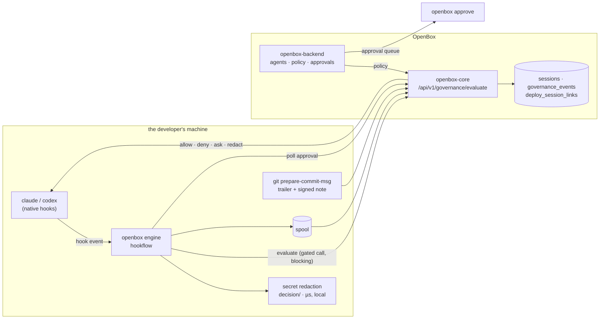

# Architecture

One static binary, one engine, one thin adapter per coding tool. Adding a tool is
an adapter; it is never a fork of the engine.

## The shape

Two paths, deliberately separate:

- **A gated tool call waits for OpenBox to decide it.** Every gated PreToolUse call
  is evaluated by `/evaluate` before the tool runs
  ([ADR-0017](adr/ADR-0017-inline-policy-evaluation.md)). One policy
  implementation, on the server. This path has no daemon and no socket
  ([ADR-0006](adr/ADR-0006-in-process-decider.md) is untouched — a bounded outbound
  call is not a resident process). The model-call gateway
  ([ADR-0021](adr/ADR-0021-openbox-local-gateway.md)) is a resident process, and it
  is a third path rather than a change to this one: opt-in, per machine, and
  reaching a surface no hook can see.

  This is the trade the ADR argues: enforcement now depends on reaching the control
  plane, and under the default `fail_closed:false` a gated call PROCEEDS when it
  cannot be reached. What it buys is that an org whose policy is hand-written rego
  is actually enforced — the local evaluator could never evaluate that at all, so
  those gates simply opened.

  The one thing that stays local is **secret redaction**: it must run before content
  leaves the machine, and it sees the whole body where the server sees at most the
  first 64KB.
- **Telemetry is spooled and flushed off the hot path.** A slow or absent OpenBox
  cannot slow a tool call or block one; undelivered events are retried, not dropped.
  Delivery is near-real-time by default: after an event is spooled, the hook nudges a
  detached, debounced flusher for its session (`hookflow.RealtimeTrigger`, ~2s
  window), so events are queryable in core while the session is still running. The
  hook process itself still performs zero network I/O — its worst case is one
  lockfile check plus, at most once per window, spawning the flusher. SessionEnd's
  flush remains the completeness safety net, and `realtime_flush:false` /
  `OPENBOX_REALTIME=0` restores batch-at-session-end. Overlapping drains cannot
  double-count: spool rotation is an atomic rename and core deduplicates on each
  event's Idempotency-Key.

## Modules

| Module | What it owns |
|---|---|
| `provider/` | the SPI: `Installer` (install time) and `HookEngine` (runtime + capabilities) |
| `adapters/common/hookflow/` | **the engine** — spool, duration stash, advisory sink, findings loop, the enforce cascade, inline evaluation, approval hold, rewake |
| `adapters/claude-code/`, `adapters/codex/` | one thin adapter each: native event shape, mapper, `OutputContract`, installer |
| `adapters/common/devconfig/`, `adapters/common/git/` | shared config/posture resolution; commit trailer, notes and attestation |
| `client/` | the openbox-core client: wire payload, AIP signing, verdict parsing |
| `decision/` | local secret detection and redaction (all that survives [ADR-0017](adr/ADR-0017-inline-policy-evaluation.md)) |
| `cli/` | the `openbox` CLI — `auth`, `init`, `dev verify`, `hook`, `approve`, `doctor`, `managed` |
| `actions/openbox-git-action/` | commit → deploy lineage for CI |
| `contracts/dev-event/` | the normalized event contract + wire mapping + conformance suite |

An adapter is only four things: its native hook shape, its mapper, an
`OutputContract` (how it spells a hook response, where a redactable body lives, what
an approval verdict becomes) and its installer. If something is
provider-agnostic it belongs in `hookflow` or `devconfig` — that rule exists because
the engine was once copy-pasted per adapter, and the copies drifted on the
enforcement path.

## Governance levels

Each install runs at exactly one level, and reports which:

| Level | What happens | Cost to a tool call |
|---|---|---|
| **Observe** (default) | normalized telemetry, lineage, cost. Never blocks. | none — spooled |
| **Advisory** | verdicts and guardrail findings are recorded and surfaced back into the session, never applied | none |
| **Enforce** (default since [ADR-0016](adr/ADR-0016-default-install-posture.md)) | the PreToolUse and UserPromptSubmit gates apply the verdict: deny/block, ask, or redact — and a HALT stops the whole session ([ADR-0020](adr/ADR-0020-prompt-gate-and-halt-session-stop.md)) | one round-trip to `/evaluate` per gated hook, bounded by the provider's hook ceiling |

Enforce is three named things, not three tiers. They are independent — any one can
be on without the others:

- **Local secret redaction.** A Write/Edit body is scanned before anything leaves
  the machine; a detected secret is replaced and the call proceeds with the redacted
  body (redact-and-continue) rather than being blocked. On by default
  (`secret_detection`). Detection is two layers: **231 format rules** — nine
  hand-rolled regexes (`decision/secrets.go`) beneath gitleaks' 222
  (`decision/gitleaks.go`, D-OSS-4) — then a keyword-and-entropy layer for values in
  no known format. What that reaches, and the two shapes it does not, is measured in
  [data-and-privacy.md](data-and-privacy.md#what-the-scanner-catches--and-where-it-stops).
- **Inline evaluation.** The gated call is sent to `/evaluate` and the verdict is
  applied before the tool runs. Every gated class, not a risk-selected subset —
  risk is a property of the policy. Prompts gate the same way: `UserPromptSubmit`
  evaluates the `PromptSubmitted` event before the prompt is processed, and a
  HALT/BLOCK blocks (and erases) the prompt ([ADR-0020](adr/ADR-0020-prompt-gate-and-halt-session-stop.md)).
  If the control plane cannot be reached, the
  org's `fail_closed` decides: fail-open proceeds (the default), fail-closed denies.
  No retry: one hiccup must not become a client-side amplifier across every tool
  call of every session.
- **HALT ends the session.** A HALT the control plane returns is a session
  verdict, not a call verdict: the response carries Claude Code's
  `continue:false` (the turn stops immediately) and a local latch
  (`halted-sessions/` beside the other sinks) refuses every later prompt and
  tool call in that session with no re-evaluation — `--resume` included. BLOCK
  stays per-call. A *synthesized* HALT — the fail-closed outage answer, an
  unanswered approval — never ends the session: only the server's own HALT
  does. Codex has no session-stop lever, so a HALT there renders as its
  strongest per-call deny and no latch is written.
- **Findings.** Asynchronous guardrail and drift findings surfaced back into the
  session after the fact. Off by default (`findings`).

`REQUIRE_APPROVAL` is the one verdict that is a *question* rather than an answer:
the server files it as a real record and the hook holds briefly for a decision.

## Approvals

A gated call is filed as a real governance event with an approval window, and the
session holds briefly (~20s) while someone answers. Answer inside the hold and the
call proceeds and the developer sees nothing. Nobody answers and the call is denied
with the approval reference in the reason — and if the decision lands later, a
background watcher wakes the session with the outcome.

An approver is a separate principal with its own credential: the dashboard,
`openbox approve`, or a bounded autonomous approver
([ADR-0012](adr/ADR-0012-autonomous-approver.md)). Approving on the machine that
filed the request is refused by default.

## Posture as evidence

Every session start reports its own effective posture — enforce on/off,
fail-open/closed, who decides and what happens when they are unreachable, content
capture, provider-managed config — so the control plane can tell a governed machine
from an ungoverned one without trusting the endpoint's word for it. `openbox doctor` prints the same thing locally, with the
provenance of each value (default, your config, environment, or org mandate).

## Assurance — what the evidence proves

Being precise here is part of the product.

- **Commit attribution.** The `OpenBox-Session` trailer records which session was
  live when a commit was made. That is an *inferred claim*, and a trailer can be
  hand-written. Server-side ownership verification raises it to `attributed`.
  Cryptographic `verified` requires the signed attestation note
  ([ADR-0010](adr/ADR-0010-signed-commit-attestation.md)): the commit hook signs an
  envelope into `refs/notes/openbox-attest`, the deploy action carries it, and core
  marks `verified` only when ownership **and** an accepted attestation both hold. CI
  must fetch that ref, which is not the default.
- **The signing key is readable by anything running as the developer.** It sits in
  plaintext at `~/.openbox/.env` — `0600` on macOS/Linux, and on Windows `0600` is
  a no-op so other local accounts can read it too
  ([ADR-0015](adr/ADR-0015-plaintext-credential-file.md)). The coding agent under
  governance runs arbitrary commands as that user, so it can read the key it is
  being attested with. Attestation therefore proves **origin-of-config** — a
  machine holding this agent's key produced this event or commit — and **not**
  tamper-resistance against the developer or against the agent they run. The OS
  keychain this replaced did not actually change that (it was unlocked for the
  desktop session and readable by the same processes); the plaintext file makes it
  legible. On an approver install the same file also holds an org key that can
  create and rotate agents fleet-wide, which is a strictly larger blast radius
  than one agent's seed.
- **A project can hold a registration from an older engine until the next
  `init`.** Hooks live in a file on the developer's machine, so an install run
  with a different `HOME` used to leave a second OpenBox entry beside the current
  one — both engines then fired for every hook, storing every governed tool call
  twice, and an older engine reports fewer fields than the current one. `init` now
  removes its own redundant entries — at another engine path, or the same one
  registered twice — and prints what it retired, and `openbox doctor` reports both
  conditions for the directory it is run from. Two limits stay: the repair happens
  **only when `init` is next run in that directory**, and events already stored are
  not corrected — so a fleet's history can contain duplicates that no client-side
  change removes.
- **Enforcement.** The gate is a hook in the developer's own config. Until the
  provider's managed configuration is deployed (`deploy/managed/`), a developer can
  remove it: prevention without assurance. For Codex the hook itself cannot yet be
  mandated — a `requirements.toml` cannot define one — so the shipped mandate pins
  approval and sandbox modes instead.
- **Model calls are governed only if the local gateway is installed, and it is
  OPT-IN.** `openbox init --gateway` (ADR-0021) points this machine's
  `ANTHROPIC_BASE_URL` at a loopback daemon that relays every model call and can
  refuse one on a policy verdict. Without it, tool calls are governed and model
  calls are not — the hooks never see a model request. Three limits are worth
  stating plainly rather than discovering:
  - **The base claim is DETECTION, not prevention.** A developer can unset one
    environment variable. That is *visible* — a session with model turns and no
    gateway spans is queryable, and `openbox doctor` reports the exposure at every
    tier including the healthy one. It is not prevented. Root-owning the config via
    MDM stops the developer editing the FILE; a shell export still wins for a
    process launched from that shell. Only egress control closes it, and that is
    the org's to deploy — see [the MDM recipe](gateway-mdm-recipe.md).
  - **Refusal has never been tried against a real session.** The status code and
    error body a refusal uses are provisional: Claude Code's retry logic matches on
    upstream error wording, so a wrong shape makes a policy denial look transient
    and get retried around, or disables a capability for the rest of the session.
    ADR-0021 §9 holds that open, and phase 06 descopes to observe-only if no shape
    qualifies.
  - **Whether subscription-OAuth traffic follows `ANTHROPIC_BASE_URL` is still
    unresolved for THIS lane** (ADR-0021 §8). If it does not, the gateway covers
    API-key/console orgs only.
    What *has* been measured (2026-08-27) is the bigger question behind it: the
    terminal CLI follows the variable and **the desktop app does not**, and
    subscription-OAuth model calls are capturable by two other means that need no
    base-URL change at all — 97 calls observed, every one carrying OAuth
    authorization and none carrying `x-api-key` (openbox-logger run
    `20260827T063932Z-225cac`). [ADR-0022](adr/ADR-0022-native-telemetry-and-transport-lanes.md)
    builds both lanes, so the open question is now about this lane's reach rather
    than about a class of developer being ungoverned. **Both lanes now exist and
    are installable** (2026-08-30) — see the bullet below for what that does and
    does not buy.
  - **A compressed body is recorded as a marker, not as content.** The client's own
    `Accept-Encoding` is relayed verbatim, so a provider may legitimately answer
    `gzip` — and compressed bytes are opaque to the secret detector, which would
    attach an unredacted, unreadable body while every redaction guarantee held
    vacuously. So such a body is not captured at all. The honest limit is preferred to
    decompressing an upstream-controlled body on an unauthenticated loopback listener.
  - **A relayed call that never gets a response still leaves a record.** The request
    body reaches the provider before the transport reports failure, so a caller that
    hangs up mid-POST has already sent its prompt. That case emits a span with no
    status rather than nothing — otherwise any local process could suppress its own
    record by not waiting for the answer, and the bypass-detection argument above
    rests on a bypass leaving a hole rather than leaving no trace.
  - **Anything that can reach loopback can call the gateway, including a web page.**
    The daemon performs no caller authentication; ADR-0021 names the loopback bind
    as the caller boundary, and for *relaying* that is defensible — a caller
    supplies its own credential, so it gains no access it did not already have.
    But loopback is not a user boundary on a shared machine, and it is not a
    browser boundary at all: a page the developer visits can `fetch()`
    `http://127.0.0.1:8788/v1/messages` as a CORS-simple request, which is *sent*
    even though the reply cannot be read cross-origin. **Capture is now wired
    (2026-08-26), so the "bounded because it stores nothing" clause this bullet
    used to carry is spent.** What replaces it is narrower and worth stating
    exactly, because the two sub-vectors no longer have the same answer:

    - **A cross-origin web page: bounded, incidentally.** Evidence is filed only
      for a call carrying `X-Claude-Code-Session-Id`, and a custom request header
      is not CORS-simple — it forces a preflight, and the gateway forwards
      preflights upstream rather than granting them. A page can therefore still
      make the relay *forward* a request, but it cannot make it *record* one. This
      falls out of requiring a real session id, not from a caller check; it holds
      only while that requirement does.
    - **A local process: LIVE.** Anything running as the developer can set the
      header and have its content redacted, signed with the developer's key and
      stored as that developer's governance evidence — evidence forgery by an
      unauthenticated local caller, exactly as this bullet predicted. It is the
      same trust boundary ADR-0015 already concedes for the signing key (anything
      running as the developer can read it), so it grants no new *capability* — but
      it does make forgery cheaper, and a governance record that can be written by
      any local process should say so.

    Closing it still means adding a caller check (an `Origin`/`Sec-Fetch-Site`
    rejection, or a loopback token) to a relay documented as transparent, which is
    a product decision and is **not** made yet. Related and smaller: the relay
    buffers up to 64 MiB per in-flight request with no concurrency cap, so the same
    unauthenticated listener is a local memory-pressure lever.
- **Two more model-call lanes exist, and both are verified by REPLAY rather than by
  running** ([ADR-0022](adr/ADR-0022-native-telemetry-and-transport-lanes.md)).
  `openbox init --provider claude-code --full` installs a local OTLP **telemetry**
  receiver (`:otel:`) and an in-path CONNECT/TLS **transport** relay (`:proxy:`)
  alongside the hooks; `--remove-all` backs every lane out. What that buys, and what
  it does not:
  - **The evidence is replay, not operation.** Real recorded traffic runs through the
    shipped code path on a host that cannot bind a socket, with the relay's upstream
    dial substituted. That proves the bytes forwarded and captured, the mapping, the
    gate and the caps. It proves nothing about bind, listen, TLS to a real socket, or
    what core stores — **no control plane has ever received one of these events.**
    One thing the replay does not reach HAS been run separately: a synthetic OTLP
    export crossed the receiver's real HTTP intake end to end on a bind-capable host
    (phase 09). Two limits on that: the export was **JSON**, while production is
    configured for `http/protobuf` — so **no test drives the protobuf decoder, which
    is the only path real traffic takes** — and the real client has never exported
    to this lane at all. The dormant `testbed/46-otel-lane.sh` and `47-transport.sh`
    are what would change that.
  - **The desktop and OAuth coverage these lanes were built for is unconfirmed.**
    That is the whole reason they exist, and it is intent rather than measurement
    until a real client is put behind them.
  - **The telemetry lane is suppressible by the thing it observes.** It is the
    governed tool reporting its own calls — the weakest claim in this product, and it
    must never be averaged with the two in-path lanes. OD4 is the compensating
    control: telemetry silence on an otherwise-active session is a **finding**, not
    an absence. `openbox doctor` names the elected producer and warns when the
    elected lane has nothing listening behind it.
  - **Exactly one lane may emit per model call, and that is a correctness property.**
    The three namespaces are deliberately disjoint so core's dedupe cannot absorb one
    lane's event as another's — which means two lanes emitting both STORE, and every
    token count doubles with no error anywhere. The election is derived from where
    the tool's settings actually route model calls and is answered per record;
    resolving it once at daemon start shipped exactly that double-count into review.
  - **Neither in-path lane refuses a call.** Both carry a written, tested refusal
    path that nothing calls, for the same reason the gateway's is dormant: the
    refusal shape Claude Code does not retry around is unprobed
    ([ADR-0021](adr/ADR-0021-openbox-local-gateway.md) §9). `probes/refusal-injector/`
    is the instrument; it needs a bind-capable host, a real install and credentials.
  - **The transport lane installs a CA on the developer's machine, and that is a real
    downgrade accepted for coverage.** It is generated once, stored beside the
    credentials under `~/.openbox/` with no more protection than they have, and
    anything running as the developer can read it — the same boundary
    [ADR-0015](adr/ADR-0015-plaintext-credential-file.md) already concedes for the
    signing key. What bounds it is **name constraint at generation**: the CA is
    constrained to the single intercepted host, so a leaked key cannot mint a usable
    certificate for anything else, and the allowlist holds that one host
    (`api.anthropic.com`) while everything else is blind-tunnelled. `--remove-all`
    deletes the CA rather than leaving a trusted signing key behind a relay that is
    gone.
  - **The lane does not chain through a corporate proxy.** `transport.New` clears the
    six proxy environment variables in its constructor, because a daemon that
    inherits the `HTTPS_PROXY` the installer wrote would dial itself until sockets
    run out. Owned rather than hidden: an org that requires an upstream proxy cannot
    use this lane today.
  - **~97% of model-call request bodies are truncated before egress.** Measured, not
    estimated: 96.75% of 5,049 recorded request bodies exceed the 65,536-rune cap
    (p50 529,175, max 2,566,660; run `20260827T063932Z-225cac`). Response bodies:
    0.06%. Under OD1(c) the tail of an oversized body exists nowhere org-side, so
    content-based policy and every reader see the head only. This is accepted, not a
    defect — but a reader must not assume a captured call is a complete call.
- **Local secret detection has a measured reach, and two shapes fall outside it.**
  231 format rules catch a known credential by SHAPE wherever it appears. Anything
  in no known format is caught only by the keyword-and-entropy layer, and that layer
  has two documented misses: the recognised keyword must sit **adjacent** to the
  delimiter, so `AWS_ACCESS_KEY_ID=<unrecognised value>` is invisible while
  `access_key=<same value>` is caught; and a high-entropy value beside an
  unrecognised key name is invisible below the 4.5-bit floor, which is deliberate —
  lowering it would flag every git SHA and UUID, and on the enforce path the
  redactor **rewrites the developer's file**, so a false positive corrupts real
  content. Both are measured, not assumed
  ([data-and-privacy.md](data-and-privacy.md#what-the-scanner-catches--and-where-it-stops)).
  The same redactor also fires on a base64 literal in a source assignment, which
  rewrote three of this repo's own test files during the gitleaks adoption.
- **The credential guard bounds direct requires, not transitive code**
  ([ADR-0023](adr/ADR-0023-credential-guard-scope.md)). `gateway/` must never read
  the developer's provider credential; its own files are scanned for that and its
  direct imports are held to a two-module allowlist. What no test bounds is
  arbitrary transitive code linked into the binary — accepted, and named, because
  the alternative was an allowlist too long to read. That was already the real
  boundary: the previous check matched only `github.com/…` requirements, so a direct
  `golang.org/x/…` one was invisible to it. Each module that takes a dependency now
  carries its own allowlist — `gateway/guard_test.go`, `decision/guard_test.go`,
  `telemetry/guard_test.go`, `transport/guard_test.go`,
  `contracts/dev-event/conformance/deps_test.go` — and adding to one is a decision,
  which is why they fail first. **Do not widen an allowlist to make a direct import
  pass**; that inverts the ADR's reasoning.

  Dependencies are module-scoped, not repo-wide. Measured 2026-08-30 from each
  `go.mod`:

  | Module | Direct external requires | `go.sum` lines | Bounded by |
  |---|---|---|---|
  | `telemetry/` | **11** — 8 × `go.opentelemetry.io/collector/*` (incl. `receiver/otlpreceiver` v0.159.0), `otel/metric`, `otel/trace`, `go.uber.org/zap` | 187 | `telemetry/guard_test.go` |
  | `transport/` | **1** — `elazarl/goproxy` v1.9.0 | 432 | `transport/guard_test.go` |
  | `decision/` | **1** — `zricethezav/gitleaks/v8` v8.30.1 | 420 | `decision/guard_test.go` |
  | `cli/` | **3** — `kardianos/service` v1.3.0, `google/renameio/v2`, `golang.org/x/term` | 625 | — |
  | `adapters/common/devconfig/` | **2** — `pelletier/go-toml/v2`, `joho/godotenv` | — | — |
  | `adapters/common/hookflow/` | **1** — `google/renameio/v2` | — | — |
  | `contracts/dev-event/conformance/` | **1** — `santhosh-tekuri/jsonschema/v6` v6.0.3 | — | `deps_test.go` |
  | `gateway/` | **0** external | 420 | `gateway/guard_test.go` |
  | every other module | **0** | — | — |

  **otlpreceiver's transitive tree is an accepted cost, stated with the numbers
  phase 09 measured** rather than smoothed into "a few libraries": **492 transitive
  packages and 124 modules in the graph** for `telemetry/`, against 381 and 206 for
  `gateway/` — and a **leak check of zero**, since `gateway`, `decision`, `client`,
  `cli` and both adapters have no collector require at all. The module boundary is
  what holds that, and each guard is what holds the boundary.

  The binary is the visible half. Phase 09 measured a minimal `main` linking the
  receiver at **18.8 MB against a 2.3 MB baseline — +16.5 MB**, which is the number
  OD5 accepted, on a shipped binary that was then **17.0 MB**. The delivered binary
  is **40,287,986 bytes (38.4 MB)**, measured on darwin/arm64 via the release path
  (`GOWORK=off`) on 2026-08-30 — roughly **5 MB more than that estimate**, and it
  carries goproxy and the transport lane as well as telemetry. Recorded rather than
  rounded: the decision was made on the smaller number.
- **The inline-evaluation path has not been exercised against a live stack.**
  Every claim below about enforcement rests on tests that drive the real hook
  against a local `/evaluate` stub — which is real HTTP and the real gate, but not
  a real control plane. In particular, **that a raw-rego org is now enforced is
  unproven**, and that is the headline argument for the change
  ([ADR-0017](adr/ADR-0017-inline-policy-evaluation.md)). The testbed phase that
  would prove it exists and has not run.
- **Enforcement depends on reaching the control plane, and under the default it
  is bypassable.** Every gated tool call is decided by a synchronous `/evaluate`
  call ([ADR-0017](adr/ADR-0017-inline-policy-evaluation.md)); there is no local
  policy to fall back on. If the control plane cannot be reached, the org's
  `fail_closed` setting decides, and it defaults to **fail-open** — so blocking a
  single hostname disables enforcement for that developer. An org that needs
  enforcement to survive a developer who does not want it must set `fail_closed`,
  and accept that a control-plane outage then blocks work. This replaced a local
  evaluator that kept deciding while offline; the trade is deliberate, and the
  reason it was worth making is that hand-written rego could never be evaluated
  locally at all, so those orgs' gates simply opened.
- **A control-plane verdict is applied even when no policy authored it.** The
  enforce path trusts every `/evaluate` HALT as a policy decision, and core can
  express an operational precondition failure as one: once its record of a session
  goes terminal — observed when a `SessionEnded` was recorded while the session was
  still live — it answers every later event `HALT` ("Session is no longer active")
  with **no policy id and no governance event**. Both default-posture mitigations
  miss it: "inert until your org publishes a policy" is falsified directly, and
  fail-open never engages because the failure policy covers *no verdict*, not *a
  HALT verdict*. One such HALT latches the server-side session, so the remainder of
  that session denies until a new session restores a pending record — and the
  denial itself stores no governance event, so the control plane holds no record of
  the blocking it did. Since [ADR-0020](adr/ADR-0020-prompt-gate-and-halt-session-stop.md)
  the client treats every server HALT as a session stop, so this precondition
  failure now **ends the session outright** rather than denying calls until the
  server record clears — a deliberately accepted consequence (the owner chose
  uniform HALT trust over client-side discrimination), remedied when the core-side
  fix lands (plan 260814-2235). The live diagnosis and
  the options are in
  [`debug-260814-1231-session-no-longer-active-halt.md`](../plans/reports/debug-260814-1231-session-no-longer-active-halt.md).
- **Content-based policy sees at most the first 64KB of a write.** Bodies are
  truncated by `capBody` (`client/payload.go`) before egress, so a rule that would
  match past that offset does not fire. Content-based policy is not a complete
  check on large files. Local secret detection is not subject to this — it runs
  before the cap and sees the whole body.
- **Absence of events is not evidence of absence of activity.** A bare
  `openbox init` governs the current directory only
  ([ADR-0016](adr/ADR-0016-default-install-posture.md)), because that is the only
  scope the CLI can actually activate by itself — global activation is a
  managed-settings deployment an administrator performs. Sessions started anywhere
  else produce **no rows at all**, so an auditor cannot distinguish an
  uninitialized project from an idle week, and enforcement applies only where
  `init` ran. Fleet coverage requires `--scope global` plus managed settings;
  Codex is user-scoped either way. `printGovernedScope` names the governed
  directory at install time so the gap is visible at the moment it is created
  rather than discovered from an empty dashboard.
- **Egress.** OpenBox chooses where *its own* telemetry goes. Without the gateway it
  does not proxy, intercept or allow-list the coding tool's traffic to its model
  provider — that is the provider's plane plus your network controls, and OpenBox
  records that posture as evidence. With the gateway
  ([ADR-0021](adr/ADR-0021-openbox-local-gateway.md)) it carries and records the
  model call, but it still allow-lists nothing and still refuses nothing: the
  refusal path is unwired. Everything else the tool talks to is untouched either
  way.
- **Policy integrity is no longer a client-side claim.** There is no local bundle to
  sign, hash or verify ([ADR-0017](adr/ADR-0017-inline-policy-evaluation.md)), so
  the client makes no integrity claim about policy at all — the control plane holds
  the policy it applied and its own record of applying it.
  `require_verified_bundle` still parses and does nothing; it is deliberately absent
  from the reported posture, because a control that cannot engage must not appear as
  one.
- **Telemetry evidence is event-level, plus one span per captured model turn.** A
  developer session produces `governance_events` rows and their Merkle leaves. A
  tool call is two events — `ActivityStarted` then `ActivityCompleted`, sharing an
  `activity_id` — each independently evaluated and each with its own leaf, and
  **no `spans` row** ([ADR-0013](adr/ADR-0013-tool-call-as-activity.md)). The
  spans shift-left used to send for tool calls were fabricated by hand to satisfy
  a wire shape; removing them removed a layer of evidence that was never measuring
  anything, but it is a removal, and the tree is shallower than an agent-runtime
  session's.

  One exception, added deliberately
  ([ADR-0018](adr/ADR-0018-dev-turn-content-carrier.md)): with content capture on,
  a model turn carries **one** span whose response body is the assistant's reply,
  because core's goal-alignment engine reads assistant text from `payload.Spans`
  and from no other field. Those spans get span-level Merkle leaves and
  server-side `semantic_type` classification, and their text is retained
  server-side. Two honesty notes on that span: its classification attributes are
  **synthesized** — they describe an HTTP request the client never made, because
  that is the only input core's classifier accepts, and every such span carries
  `openbox.span_synthetic: true` so an auditor can tell — and it is a stopgap,
  retired by [openbox-core#130](https://github.com/OpenBox-AI/openbox-core/issues/130).
  With `content_capture: false` the hook path writes no span rows at all.

  **The gateway is a second span producer, and it behaves differently in both
  respects** ([ADR-0021](adr/ADR-0021-openbox-local-gateway.md)). Its span describes a
  real observed HTTP exchange, so nothing about it is synthesized — and part of it
  ships with capture **off**: the method, URL, status and credential fingerprint are
  structural evidence for account binding, so a privacy switch does not remove them.
  Only the headers and bodies are gated. The two producers ride mutually exclusive
  events and their activity ids are in disjoint namespaces, so neither absorbs the
  other in core's dedupe. One consequence is a silent gap rather than an error:
  a gateway span carries the provider's **raw** response body, which is not the shape
  core's alignment extractor parses, so a gateway-observed turn contributes nothing to
  goal alignment. Alignment for those turns comes from the hook path or not at all.
- **Token usage is stored, aggregated and queryable.** Per-turn model + usage is
  emitted as an `llm_completion` activity pair
  ([ADR-0014](adr/ADR-0014-turn-as-activity-and-identifier-allowlist.md)), and the
  core-side extractor that aggregates activities has **merged**
  (`ExtractModelMetricsFromActivity`, verified at `develop` 68f0398; PR #125
  merged as `0643ad3`). The same change excludes `llm_completion` from core's
  **tool** metrics, so turn events no longer appear as a fictional tool. This
  paragraph previously said the work was "awaiting merge" and that the pollution
  was live; both statements are retired.
- **Tool success is reported.** An `ActivityCompleted` carries `status`
  (`completed`/`failed`), derived from which provider hook fired and not gated on
  content — it is the field core's per-tool success metric reads, and no producer
  had ever written it. Claude Code only: Codex exposes no failure hook and no exit
  code, so its tool success stays unknown rather than assumed
  (ADR-0018).
- **Neither cost table prices the current models, and they fail differently.**
  `claude-opus-5`, `claude-fable-5`, `claude-opus-4-8`, `gpt-5.6-sol` and
  `gpt-5.5` are absent from core's Go table and the backend's TS one. core falls
  back to a default 1.00/3.00 per M — wrong but non-zero; the backend skips an
  unpriced model entirely, so it contributes nothing to `total_cost` *and does not
  appear in the cost breakdown at all*. Dev-session spend is therefore mispriced
  or invisible until those tables are updated, which is a pricing decision rather
  than a client one.
- **Codex reports usage per session, not per turn.** Its `Stop` hook exists in
  v0.145.0 and this adapter deliberately does not wire it, so its usage arrives as
  one `<session>:usage:rollup` activity. Scope, not a provider limit — the upgrade
  path is to subscribe `Stop` and delta the cumulative total.
- **The transcript projection's INV-2 guarantee is now an allowlist, and it
  carries content.** It used to be structural: the parser bound only numeric
  fields, so content could not enter memory. Binding the model id — required,
  because the model is the backend's aggregation key — replaced that with a curated
  allowlist enforced by a test. The 2026-08-25 amendment added the turn's
  **thinking**, which is the first free-form content in it, so the allowlist's
  contents stopped being self-limiting as well as its form. The test is
  load-bearing and mutation-tested against the removal of either the redaction or
  the cap; ADR-0014 and its amendment say so rather than leaving an older, stronger
  claim in place.
- **Thinking capture goes further than the provider's own telemetry.** Anthropic's
  OpenTelemetry export redacts extended thinking unconditionally, with every
  content flag enabled, and no hook carries it — so the session transcript is the
  only source. Capturing it is a decision an org makes about its own machine, and
  `content_capture: false` turns it off with everything else.

## Verification

`testbed/` is a mock-free end-to-end suite: it drives real headless sessions against
a real local OpenBox and asserts what arrived — including the content gate in BOTH
directions: with capture on, the tool command, the file body, the tool output and
the turn's thinking all egress; with capture off, none of them do. The thinking
half is asymmetric on purpose — presence is a skip when the session produced no
block (no prompt can make a model think a chosen phrase), while absence is strict,
because absence needs no cooperation from a model.

That used to read "tool commands and file bodies never egress on an **observe**
event", which was SL3-SEC-3 — an unconditional, structural guarantee, because tool
content had no field to land in. [ADR-0019](adr/ADR-0019-full-content-capture.md)
P1 retired it. What replaces it is a gate plus a redaction plus a cap, none of them
structural, which is why the suite asserts the closed direction as explicitly as the
open one. See [end-to-end tests](testbed/e2e.md).
