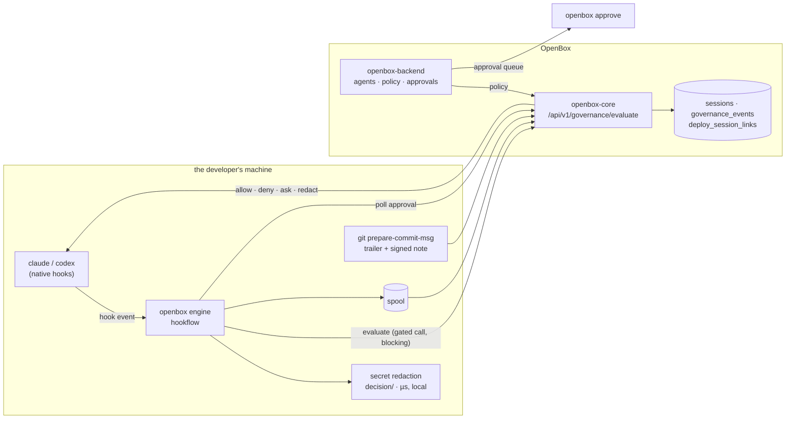

# Architecture

One static binary, one engine, one thin adapter per coding tool. Adding a tool is
an adapter; it is never a fork of the engine.

## The shape

Two paths, deliberately separate:

- **A gated tool call waits for OpenBox to decide it.** Every gated PreToolUse call
  is evaluated by `/evaluate` before the tool runs
  ([ADR-0017](adr/ADR-0017-inline-policy-evaluation.md)). One policy
  implementation, on the server. There is still no daemon and no socket
  ([ADR-0006](adr/ADR-0006-in-process-decider.md) is untouched — a bounded outbound
  call is not a resident process).

  This is the trade the ADR argues: enforcement now depends on reaching the control
  plane, and under the default `fail_closed:false` a gated call PROCEEDS when it
  cannot be reached. What it buys is that an org whose policy is hand-written rego
  is actually enforced — the local evaluator could never evaluate that at all, so
  those gates simply opened.

  The one thing that stays local is **secret redaction**: it must run before content
  leaves the machine, and it sees the whole body where the server sees at most the
  first 64KB.
- **Telemetry is spooled and flushed off the hot path.** A slow or absent OpenBox
  cannot slow a tool call or block one; undelivered events are retried, not dropped.
  Delivery is near-real-time by default: after an event is spooled, the hook nudges a
  detached, debounced flusher for its session (`hookflow.RealtimeTrigger`, ~2s
  window), so events are queryable in core while the session is still running. The
  hook process itself still performs zero network I/O — its worst case is one
  lockfile check plus, at most once per window, spawning the flusher. SessionEnd's
  flush remains the completeness safety net, and `realtime_flush:false` /
  `OPENBOX_REALTIME=0` restores batch-at-session-end. Overlapping drains cannot
  double-count: spool rotation is an atomic rename and core deduplicates on each
  event's Idempotency-Key.

## Modules

| Module | What it owns |
|---|---|
| `provider/` | the SPI: `Installer` (install time) and `HookEngine` (runtime + capabilities) |
| `adapters/common/hookflow/` | **the engine** — spool, duration stash, advisory sink, findings loop, the enforce cascade, inline evaluation, approval hold, rewake |
| `adapters/claude-code/`, `adapters/codex/` | one thin adapter each: native event shape, mapper, `OutputContract`, installer |
| `adapters/common/devconfig/`, `adapters/common/git/` | shared config/posture resolution; commit trailer, notes and attestation |
| `client/` | the openbox-core client: wire payload, AIP signing, verdict parsing |
| `decision/` | local secret detection and redaction (all that survives [ADR-0017](adr/ADR-0017-inline-policy-evaluation.md)) |
| `cli/` | the `openbox` CLI — `auth`, `init`, `dev verify`, `hook`, `approve`, `doctor`, `managed` |
| `actions/openbox-git-action/` | commit → deploy lineage for CI |
| `contracts/dev-event/` | the normalized event contract + wire mapping + conformance suite |

An adapter is only four things: its native hook shape, its mapper, an
`OutputContract` (how it spells a hook response, where a redactable body lives, what
an approval verdict becomes) and its installer. If something is
provider-agnostic it belongs in `hookflow` or `devconfig` — that rule exists because
the engine was once copy-pasted per adapter, and the copies drifted on the
enforcement path.

## Governance levels

Each install runs at exactly one level, and reports which:

| Level | What happens | Cost to a tool call |
|---|---|---|
| **Observe** (default) | normalized telemetry, lineage, cost. Never blocks. | none — spooled |
| **Advisory** | verdicts and guardrail findings are recorded and surfaced back into the session, never applied | none |
| **Enforce** (default since [ADR-0016](adr/ADR-0016-default-install-posture.md)) | the PreToolUse gate applies the verdict: deny, ask, or redact | one round-trip to `/evaluate`, bounded by the provider's hook ceiling |

Enforce is three named things, not three tiers. They are independent — any one can
be on without the others:

- **Local secret redaction.** A Write/Edit body is scanned before anything leaves
  the machine; a detected secret is replaced and the call proceeds with the redacted
  body (redact-and-continue) rather than being blocked. On by default
  (`secret_detection`).
- **Inline evaluation.** The gated call is sent to `/evaluate` and the verdict is
  applied before the tool runs. Every gated class, not a risk-selected subset —
  risk is a property of the policy. If the control plane cannot be reached, the
  org's `fail_closed` decides: fail-open proceeds (the default), fail-closed denies.
  No retry: one hiccup must not become a client-side amplifier across every tool
  call of every session.
- **Findings.** Asynchronous guardrail and drift findings surfaced back into the
  session after the fact. Off by default (`findings`).

`REQUIRE_APPROVAL` is the one verdict that is a *question* rather than an answer:
the server files it as a real record and the hook holds briefly for a decision.

## Approvals

A gated call is filed as a real governance event with an approval window, and the
session holds briefly (~20s) while someone answers. Answer inside the hold and the
call proceeds and the developer sees nothing. Nobody answers and the call is denied
with the approval reference in the reason — and if the decision lands later, a
background watcher wakes the session with the outcome.

An approver is a separate principal with its own credential: the dashboard,
`openbox approve`, or a bounded autonomous approver
([ADR-0012](adr/ADR-0012-autonomous-approver.md)). Approving on the machine that
filed the request is refused by default.

## Posture as evidence

Every session start reports its own effective posture — enforce on/off,
fail-open/closed, who decides and what happens when they are unreachable, content
capture, provider-managed config — so the control plane can tell a governed machine
from an ungoverned one without trusting the endpoint's word for it. `openbox doctor` prints the same thing locally, with the
provenance of each value (default, your config, environment, or org mandate).

## Assurance — what the evidence proves

Being precise here is part of the product.

- **Commit attribution.** The `OpenBox-Session` trailer records which session was
  live when a commit was made. That is an *inferred claim*, and a trailer can be
  hand-written. Server-side ownership verification raises it to `attributed`.
  Cryptographic `verified` requires the signed attestation note
  ([ADR-0010](adr/ADR-0010-signed-commit-attestation.md)): the commit hook signs an
  envelope into `refs/notes/openbox-attest`, the deploy action carries it, and core
  marks `verified` only when ownership **and** an accepted attestation both hold. CI
  must fetch that ref, which is not the default.
- **The signing key is readable by anything running as the developer.** It sits in
  plaintext at `~/.openbox/.env` — `0600` on macOS/Linux, and on Windows `0600` is
  a no-op so other local accounts can read it too
  ([ADR-0015](adr/ADR-0015-plaintext-credential-file.md)). The coding agent under
  governance runs arbitrary commands as that user, so it can read the key it is
  being attested with. Attestation therefore proves **origin-of-config** — a
  machine holding this agent's key produced this event or commit — and **not**
  tamper-resistance against the developer or against the agent they run. The OS
  keychain this replaced did not actually change that (it was unlocked for the
  desktop session and readable by the same processes); the plaintext file makes it
  legible. On an approver install the same file also holds an org key that can
  create and rotate agents fleet-wide, which is a strictly larger blast radius
  than one agent's seed.
- **A project can hold a registration from an older engine until the next
  `init`.** Hooks live in a file on the developer's machine, so an install run
  with a different `HOME` used to leave a second OpenBox entry beside the current
  one — both engines then fired for every hook, storing every governed tool call
  twice, and an older engine reports fewer fields than the current one. `init` now
  removes its own redundant entries — at another engine path, or the same one
  registered twice — and prints what it retired, and `openbox doctor` reports both
  conditions for the directory it is run from. Two limits stay: the repair happens
  **only when `init` is next run in that directory**, and events already stored are
  not corrected — so a fleet's history can contain duplicates that no client-side
  change removes.
- **Enforcement.** The gate is a hook in the developer's own config. Until the
  provider's managed configuration is deployed (`deploy/managed/`), a developer can
  remove it: prevention without assurance. For Codex the hook itself cannot yet be
  mandated — a `requirements.toml` cannot define one — so the shipped mandate pins
  approval and sandbox modes instead.
- **The inline-evaluation path has not been exercised against a live stack.**
  Every claim below about enforcement rests on tests that drive the real hook
  against a local `/evaluate` stub — which is real HTTP and the real gate, but not
  a real control plane. In particular, **that a raw-rego org is now enforced is
  unproven**, and that is the headline argument for the change
  ([ADR-0017](adr/ADR-0017-inline-policy-evaluation.md)). The testbed phase that
  would prove it exists and has not run.
- **Enforcement depends on reaching the control plane, and under the default it
  is bypassable.** Every gated tool call is decided by a synchronous `/evaluate`
  call ([ADR-0017](adr/ADR-0017-inline-policy-evaluation.md)); there is no local
  policy to fall back on. If the control plane cannot be reached, the org's
  `fail_closed` setting decides, and it defaults to **fail-open** — so blocking a
  single hostname disables enforcement for that developer. An org that needs
  enforcement to survive a developer who does not want it must set `fail_closed`,
  and accept that a control-plane outage then blocks work. This replaced a local
  evaluator that kept deciding while offline; the trade is deliberate, and the
  reason it was worth making is that hand-written rego could never be evaluated
  locally at all, so those orgs' gates simply opened.
- **Content-based policy sees at most the first 64KB of a write.** Bodies are
  truncated by `capBody` (`client/payload.go`) before egress, so a rule that would
  match past that offset does not fire. Content-based policy is not a complete
  check on large files. Local secret detection is not subject to this — it runs
  before the cap and sees the whole body.
- **Absence of events is not evidence of absence of activity.** A bare
  `openbox init` governs the current directory only
  ([ADR-0016](adr/ADR-0016-default-install-posture.md)), because that is the only
  scope the CLI can actually activate by itself — global activation is a
  managed-settings deployment an administrator performs. Sessions started anywhere
  else produce **no rows at all**, so an auditor cannot distinguish an
  uninitialized project from an idle week, and enforcement applies only where
  `init` ran. Fleet coverage requires `--scope global` plus managed settings;
  Codex is user-scoped either way. `printGovernedScope` names the governed
  directory at install time so the gap is visible at the moment it is created
  rather than discovered from an empty dashboard.
- **Egress.** OpenBox chooses where *its own* telemetry goes. It does not proxy,
  intercept or allow-list the coding tool's traffic to its model provider — that is
  the provider's plane plus your network controls. OpenBox records that posture as
  evidence.
- **Policy integrity is no longer a client-side claim.** There is no local bundle to
  sign, hash or verify ([ADR-0017](adr/ADR-0017-inline-policy-evaluation.md)), so
  the client makes no integrity claim about policy at all — the control plane holds
  the policy it applied and its own record of applying it.
  `require_verified_bundle` still parses and does nothing; it is deliberately absent
  from the reported posture, because a control that cannot engage must not appear as
  one.
- **Telemetry evidence is event-level, plus one span per captured model turn.** A
  developer session produces `governance_events` rows and their Merkle leaves. A
  tool call is two events — `ActivityStarted` then `ActivityCompleted`, sharing an
  `activity_id` — each independently evaluated and each with its own leaf, and
  **no `spans` row** ([ADR-0013](adr/ADR-0013-tool-call-as-activity.md)). The
  spans shift-left used to send for tool calls were fabricated by hand to satisfy
  a wire shape; removing them removed a layer of evidence that was never measuring
  anything, but it is a removal, and the tree is shallower than an agent-runtime
  session's.

  One exception, added deliberately
  ([ADR-0018](adr/ADR-0018-dev-turn-content-carrier.md)): with content capture on,
  a model turn carries **one** span whose response body is the assistant's reply,
  because core's goal-alignment engine reads assistant text from `payload.Spans`
  and from no other field. Those spans get span-level Merkle leaves and
  server-side `semantic_type` classification, and their text is retained
  server-side. Two honesty notes on that span: its classification attributes are
  **synthesized** — they describe an HTTP request the client never made, because
  that is the only input core's classifier accepts, and every such span carries
  `openbox.span_synthetic: true` so an auditor can tell — and it is a stopgap,
  retired by [openbox-core#130](https://github.com/OpenBox-AI/openbox-core/issues/130).
  With `content_capture: false` there are no span rows at all.
- **Token usage is stored, aggregated and queryable.** Per-turn model + usage is
  emitted as an `llm_completion` activity pair
  ([ADR-0014](adr/ADR-0014-turn-as-activity-and-identifier-allowlist.md)), and the
  core-side extractor that aggregates activities has **merged**
  (`ExtractModelMetricsFromActivity`, verified at `develop` 68f0398; PR #125
  merged as `0643ad3`). The same change excludes `llm_completion` from core's
  **tool** metrics, so turn events no longer appear as a fictional tool. This
  paragraph previously said the work was "awaiting merge" and that the pollution
  was live; both statements are retired.
- **Tool success is reported.** An `ActivityCompleted` carries `status`
  (`completed`/`failed`), derived from which provider hook fired and not gated on
  content — it is the field core's per-tool success metric reads, and no producer
  had ever written it. Claude Code only: Codex exposes no failure hook and no exit
  code, so its tool success stays unknown rather than assumed
  (ADR-0018).
- **Neither cost table prices the current models, and they fail differently.**
  `claude-opus-5`, `claude-fable-5`, `claude-opus-4-8`, `gpt-5.6-sol` and
  `gpt-5.5` are absent from core's Go table and the backend's TS one. core falls
  back to a default 1.00/3.00 per M — wrong but non-zero; the backend skips an
  unpriced model entirely, so it contributes nothing to `total_cost` *and does not
  appear in the cost breakdown at all*. Dev-session spend is therefore mispriced
  or invisible until those tables are updated, which is a pricing decision rather
  than a client one.
- **Codex reports usage per session, not per turn.** Its `Stop` hook exists in
  v0.145.0 and this adapter deliberately does not wire it, so its usage arrives as
  one `<session>:usage:rollup` activity. Scope, not a provider limit — the upgrade
  path is to subscribe `Stop` and delta the cumulative total.
- **The transcript projection's INV-2 guarantee is now an allowlist.** It used to
  be structural: the parser bound only numeric fields, so content could not enter
  memory. Binding the model id — required, because the model is the backend's
  aggregation key — replaced that with a curated allowlist enforced by a test.
  The test is load-bearing, and ADR-0014 says so rather than leaving the older,
  stronger claim in place.

## Verification

`testbed/` is a mock-free end-to-end suite: it drives real headless sessions against
a real local OpenBox and asserts what arrived — including that tool commands and
file bodies never egress on an **observe** event. (On a gated call they do, under
content capture and redacted first — ADR-0017.) See
[end-to-end tests](testbed/e2e.md).
