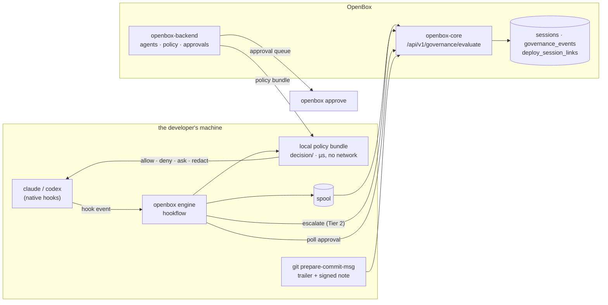

# Architecture

One static binary, one engine, one thin adapter per coding tool. Adding a tool is
an adapter; it is never a fork of the engine.

## The shape

Two paths, deliberately separate:

- **The hot path never waits on a network.** A tool call is decided against a local
  signed policy bundle, in microseconds, in-process
  ([ADR-0006](adr/ADR-0006-in-process-decider.md), [ADR-0005](adr/ADR-0005-native-policy-evaluator.md)).
  There is no daemon and no socket.
- **Telemetry is spooled and flushed off the hot path.** A slow or absent OpenBox
  cannot slow a tool call or block one; undelivered events are retried, not dropped.
  Delivery is near-real-time by default: after an event is spooled, the hook nudges a
  detached, debounced flusher for its session (`hookflow.RealtimeTrigger`, ~2s
  window), so events are queryable in core while the session is still running. The
  hook process itself still performs zero network I/O — its worst case is one
  lockfile check plus, at most once per window, spawning the flusher. SessionEnd's
  flush remains the completeness safety net, and `realtime_flush:false` /
  `OPENBOX_REALTIME=0` restores batch-at-session-end. Overlapping drains cannot
  double-count: spool rotation is an atomic rename and core deduplicates on each
  event's Idempotency-Key.

## Modules

| Module | What it owns |
|---|---|
| `provider/` | the SPI: `Installer` (install time) and `HookEngine` (runtime + capabilities) |
| `adapters/common/hookflow/` | **the engine** — spool, duration stash, advisory sink, findings loop, staleness gate, the enforce cascade, Tier-2 escalation, approval hold, rewake |
| `adapters/claude-code/`, `adapters/codex/` | one thin adapter each: native event shape, mapper, `OutputContract`, installer |
| `adapters/common/devconfig/`, `adapters/common/git/` | shared config/posture resolution; commit trailer, notes and attestation |
| `client/` | the openbox-core client: wire payload, AIP signing, verdict parsing |
| `decision/` | in-process enforcement: policy bundle, evaluator, secret detection, redaction |
| `cli/` | the `openbox` CLI — `init`, `dev verify/sync`, `hook`, `approve`, `doctor`, `managed` |
| `actions/openbox-git-action/` | commit → deploy lineage for CI |
| `contracts/dev-event/` | the normalized event contract + wire mapping + conformance suite |

An adapter is only four things: its native hook shape, its mapper, an
`OutputContract` (how it spells a hook response, where a redactable body lives, what
an approval verdict becomes) and its installer. If something is
provider-agnostic it belongs in `hookflow` or `devconfig` — that rule exists because
the engine was once copy-pasted per adapter, and the copies drifted on the
enforcement path.

## Governance levels

Each install runs at exactly one level, and reports which:

| Level | What happens | Cost to a tool call |
|---|---|---|
| **Observe** (default) | normalized telemetry, lineage, cost. Never blocks. | none — spooled |
| **Advisory** | verdicts and guardrail findings are recorded and surfaced back into the session, never applied | none |
| **Enforce** (`--enforce`) | the PreToolUse gate applies the verdict: deny, ask, or redact | one local policy evaluation |

Within enforce there are three tiers:

- **Tier 1 — local.** The signed bundle decides. Secret detection rewrites a
  Write/Edit body rather than blocking it (redact-and-continue).
- **Tier 2 — escalation.** High-risk classes (shell, MCP) are escalated
  synchronously to core, which brings guardrails, drift and org policy to bear. A
  degraded escalation follows the org's failure policy: fail-open proceeds,
  fail-closed denies.
- **Tier 3 — findings.** Asynchronous guardrail/drift findings are surfaced into the
  session after the fact.

`REQUIRE_APPROVAL` is the one verdict that is a *question*, not an answer, so it
escalates rather than being answered locally.

## Approvals

A gated call is filed as a real governance event with an approval window, and the
session holds briefly (~20s) while someone answers. Answer inside the hold and the
call proceeds and the developer sees nothing. Nobody answers and the call is denied
with the approval reference in the reason — and if the decision lands later, a
background watcher wakes the session with the outcome.

An approver is a separate principal with its own credential: the dashboard,
`openbox approve`, or a bounded autonomous approver
([ADR-0012](adr/ADR-0012-autonomous-approver.md)). Approving on the machine that
filed the request is refused by default.

## Posture as evidence

Every session start reports its own effective posture — enforce on/off,
fail-open/closed, bundle integrity and freshness, content capture, provider-managed
config, staleness — so the control plane can tell the tiers apart without trusting
the endpoint's word for it. `openbox doctor` prints the same thing locally, with the
provenance of each value (default, your config, environment, or org mandate).

## Assurance — what the evidence proves

Being precise here is part of the product.

- **Commit attribution.** The `OpenBox-Session` trailer records which session was
  live when a commit was made. That is an *inferred claim*, and a trailer can be
  hand-written. Server-side ownership verification raises it to `attributed`.
  Cryptographic `verified` requires the signed attestation note
  ([ADR-0010](adr/ADR-0010-signed-commit-attestation.md)): the commit hook signs an
  envelope into `refs/notes/openbox-attest`, the deploy action carries it, and core
  marks `verified` only when ownership **and** an accepted attestation both hold. CI
  must fetch that ref, which is not the default.
- **The signing key is readable by anything running as the developer.** It sits in
  plaintext at `~/.openbox/.env` — `0600` on macOS/Linux, and on Windows `0600` is
  a no-op so other local accounts can read it too
  ([ADR-0015](adr/ADR-0015-plaintext-credential-file.md)). The coding agent under
  governance runs arbitrary commands as that user, so it can read the key it is
  being attested with. Attestation therefore proves **origin-of-config** — a
  machine holding this agent's key produced this event or commit — and **not**
  tamper-resistance against the developer or against the agent they run. The OS
  keychain this replaced did not actually change that (it was unlocked for the
  desktop session and readable by the same processes); the plaintext file makes it
  legible. On an approver install the same file also holds an org key that can
  create and rotate agents fleet-wide, which is a strictly larger blast radius
  than one agent's seed.
- **Enforcement.** The gate is a hook in the developer's own config. Until the
  provider's managed configuration is deployed (`deploy/managed/`), a developer can
  remove it: prevention without assurance. For Codex the hook itself cannot yet be
  mandated — a `requirements.toml` cannot define one — so the shipped mandate pins
  approval and sandbox modes instead.
- **Enforcement depends on reaching the control plane, and under the default it
  is bypassable.** Every gated tool call is decided by a synchronous `/evaluate`
  call ([ADR-0017](adr/ADR-0017-inline-policy-evaluation.md)); there is no local
  policy to fall back on. If the control plane cannot be reached, the org's
  `fail_closed` setting decides, and it defaults to **fail-open** — so blocking a
  single hostname disables enforcement for that developer. An org that needs
  enforcement to survive a developer who does not want it must set `fail_closed`,
  and accept that a control-plane outage then blocks work. This replaced a local
  evaluator that kept deciding while offline; the trade is deliberate, and the
  reason it was worth making is that hand-written rego could never be evaluated
  locally at all, so those orgs' gates simply opened.
- **Content-based policy sees at most the first 64KB of a write.** Bodies are
  truncated by `capBody` (`client/payload.go`) before egress, so a rule that would
  match past that offset does not fire. Content-based policy is not a complete
  check on large files. Local secret detection is not subject to this — it runs
  before the cap and sees the whole body.
- **Absence of events is not evidence of absence of activity.** A bare
  `openbox init` governs the current directory only
  ([ADR-0016](adr/ADR-0016-default-install-posture.md)), because that is the only
  scope the CLI can actually activate by itself — global activation is a
  managed-settings deployment an administrator performs. Sessions started anywhere
  else produce **no rows at all**, so an auditor cannot distinguish an
  uninitialized project from an idle week, and enforcement applies only where
  `init` ran. Fleet coverage requires `--scope global` plus managed settings;
  Codex is user-scoped either way. `printGovernedScope` names the governed
  directory at install time so the gap is visible at the moment it is created
  rather than discovered from an empty dashboard.
- **Egress.** OpenBox chooses where *its own* telemetry goes. It does not proxy,
  intercept or allow-list the coding tool's traffic to its model provider — that is
  the provider's plane plus your network controls. OpenBox records that posture as
  evidence.
- **Policy integrity.** The client verifies a signed bundle at load — Ed25519, with
  expiry and an epoch floor against rollback
  ([ADR-0008](adr/ADR-0008-signed-policy-bundles.md)) — but the backend does not
  sign yet, so bundles load `unsigned` and are enforced anyway, with the state
  reported in the posture. `require_verified_bundle` refuses to enforce what did not
  verify; it defaults **off**, because turning it on before the backend signs leaves
  a fleet with no bundle at all.
- **Telemetry evidence is event-level, not span-level.** A developer session
  produces `governance_events` rows and their Merkle leaves, and **no `spans`
  rows at all** ([ADR-0013](adr/ADR-0013-tool-call-as-activity.md)). A tool call
  is two events — `ActivityStarted` then `ActivityCompleted`, sharing an
  `activity_id` — each independently evaluated and each with its own leaf. An
  auditor reading the Merkle tree for a dev session therefore sees event leaves
  only: there is no span-level attestation to check, and no server-side
  `semantic_type` classification, because core computes both from spans and a
  hook process has no OpenTelemetry to produce one. The spans shift-left used to
  send were fabricated by hand to satisfy a wire shape; removing them removes a
  layer of evidence that was never measuring anything, but it is a removal, and
  anyone reasoning about dev-session assurance should know the tree is shallower
  than an agent-runtime session's.
- **Token usage is write-only until the core-side extractor merges.** Per-turn
  model + usage is emitted as an `llm_completion` activity pair
  ([ADR-0014](adr/ADR-0014-turn-as-activity-and-identifier-allowlist.md)) and is
  stored and queryable — but every usage-aggregation path in core reads spans, and
  a dev session has none, so nothing surfaces in a dashboard until core aggregates
  activities. That work is implemented and CI-green in
  [openbox-core#125](https://github.com/OpenBox-AI/openbox-core/pull/125)
  (PROD-296) and awaiting merge. Until it merges, two things are true and worth
  stating rather than discovering: the numbers are in `governance_events` and
  nowhere else, and `llm_completion` additionally appears under core's **tool**
  metrics, because `ExtractToolMetric` accepts any non-empty `activity_type`.
  Neither is a shift-left defect; the same PR closes both.
- **Neither cost table prices the current models, and they fail differently.**
  `claude-opus-5`, `claude-fable-5`, `claude-opus-4-8`, `gpt-5.6-sol` and
  `gpt-5.5` are absent from core's Go table and the backend's TS one. core falls
  back to a default 1.00/3.00 per M — wrong but non-zero; the backend skips an
  unpriced model entirely, so it contributes nothing to `total_cost` *and does not
  appear in the cost breakdown at all*. Dev-session spend is therefore mispriced
  or invisible until those tables are updated, which is a pricing decision rather
  than a client one.
- **Codex reports usage per session, not per turn.** Its `Stop` hook exists in
  v0.145.0 and this adapter deliberately does not wire it, so its usage arrives as
  one `<session>:usage:rollup` activity. Scope, not a provider limit — the upgrade
  path is to subscribe `Stop` and delta the cumulative total.
- **The transcript projection's INV-2 guarantee is now an allowlist.** It used to
  be structural: the parser bound only numeric fields, so content could not enter
  memory. Binding the model id — required, because the model is the backend's
  aggregation key — replaced that with a curated allowlist enforced by a test.
  The test is load-bearing, and ADR-0014 says so rather than leaving the older,
  stronger claim in place.

## Verification

`testbed/` is a mock-free end-to-end suite: it drives real headless sessions against
a real local OpenBox and asserts what arrived — including that tool commands and
file bodies never egress. See [end-to-end tests](testbed/e2e.md).
