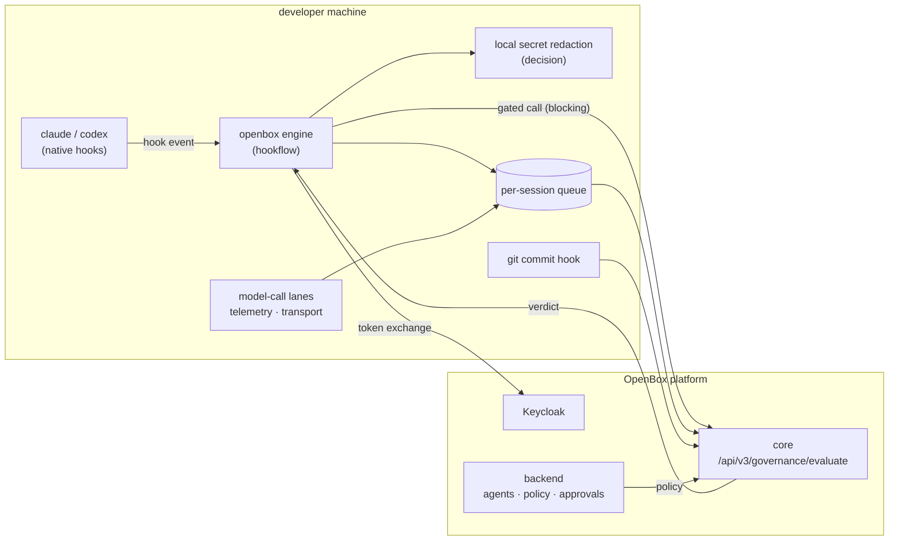

# Architecture

One static binary, one engine, and one thin adapter per coding tool. Adding a
tool means writing an adapter, not changing the engine.

## The shape

```mermaid
flowchart LR
  subgraph DEV["developer machine"]
    TOOL["claude / codex<br/>(native hooks)"]
    ENG["openbox engine<br/>(hookflow)"]
    RED["local secret redaction<br/>(decision)"]
    Q[("per-session queue")]
    LANES["model-call lanes<br/>telemetry · transport"]
    GIT["git commit hook"]
  end
  subgraph OB["OpenBox platform"]
    KC["Keycloak"]
    CORE["core<br/>/api/v3/governance/evaluate"]
    BE["backend<br/>agents · policy · approvals"]
  end
  TOOL -- "hook event" --> ENG
  ENG --> RED
  ENG -- "gated call (blocking)" --> CORE
  CORE -- "verdict" --> ENG
  ENG --> Q --> CORE
  LANES --> Q
  GIT --> CORE
  ENG -- "token exchange" --> KC
  BE -- "policy" --> CORE
```

`openbox` reuses the pipeline OpenBox already runs for agents in production.
Each installed tool registers as an agent (`kind=developer`), each coding
session is a child record of that agent, and events go to the same
`/api/v3/governance/evaluate` endpoint, with the same auth and the same
storage.

## How an event flows

1. The coding tool runs `openbox hook <provider> <event>` with its native
   payload on stdin.
2. The adapter maps that payload to one normalized event
   ([event contract](dev-event-contract.md)).
3. Any content (prompt, file body, tool output) goes through local secret
   redaction, then is cut to 64KB. Redaction must happen first: it is the only
   protection content has in transit.
4. **Gated events** (tool calls and prompts) are sent to `/evaluate` and the
   hook waits for the verdict before the action runs.
5. **Everything else** is appended to a per-session queue on disk and
   delivered in the background, usually within a couple of seconds.

### Why the server is the only decider

There is no local policy. Every gated call goes to the platform, and risk is a
property of the policy, not of the client. This means enforcement depends on
reaching the platform, but it also means any policy the platform can express
is actually enforced. An earlier local evaluator could not run hand-written
rego at all, so those rules silently never fired.

Secret redaction is the one thing that stays local. It has to run before
content leaves the machine, and it sees the whole body where the server sees
at most the first 64KB.

### Delivery and halts

- Hook events, the gate's own evaluation, and the lanes' model-call records
  all go through **one ordered queue per session**. There is one drainer per
  session, and events are delivered in the order they were appended.
- Every event gets **one delivery attempt**, plus **exactly one retry** when
  that attempt failed transiently: a timeout, a network error or a 5xx. A 401,
  a 429 or any other 4xx is not retried.
- If the platform still does not accept an event, the client **halts that
  session's current run**: it writes a local latch that refuses every later
  gated call, prompt and relayed model call in that run. A new session starts
  clean.
- When the gate's own evaluation fails transiently, the call is still denied,
  but the run is not halted on the spot: the call's record goes back to the
  queue, and its delivery attempt and retry decide.
- `WorkflowStarted` (session start) always reaches the platform before any
  other event of the run. Beyond that, ordering is best effort: a gate may
  send its own evaluation before older queued events if the queue is busy.

Why only one retry: a platform hiccup retried without limit by every tool call
of every session turns into a flood. One retry lets a long session survive a
brief blip, and a real outage still ends in a visible, bounded halt. The cost:
the platform only deduplicates a resend once it has finished processing the
first attempt, so a retry that races an attempt still in flight can store the
event twice.

The implementation lives in `internal/adapters/common/hookflow/`.

## Enforcement

A gated call's verdict is applied before the tool runs:

| Verdict | Effect |
|---|---|
| allow | proceed |
| block | refuse this one call or prompt |
| require approval | file an approval and wait (default 20s, less if the evaluation was slow); deny if nobody answers in time |
| halt | stop the session and latch it; every later call in the run is refused locally |

Enforcement is always on and always fails closed. The config keys that once
turned it off (`enforce`, `fail_closed`) still parse so `openbox doctor` can
warn about them, but they do nothing.

Local secret redaction also applies to a write: a detected secret in a
`Write`/`Edit` body is replaced before the file is written, and the call
proceeds with the redacted body.

**Approvals.** The approver is a separate person, using their own credentials
in the dashboard. Approving from the machine that filed the request is refused.
If a decision arrives after the wait, a background watcher wakes the session
with the result (Claude Code only).

**Posture as evidence.** Every session start reports its effective settings
(content capture, usage capture, managed config, and so on), so the platform
can tell a governed machine from an ungoverned one without trusting the
machine's word. `openbox doctor` prints the same, with the source of each
value.

## Identity and auth

Each governed tool registers its own `keycloak_workload` agent. `init`
generates an RSA key pair; the private key stays in `~/.openbox/<tool>/.env`.

To call the platform, the engine:

1. fetches core's bootstrap document using the agent's `obx_` API key;
2. signs a 60-second RS256 client assertion with the workload private key;
3. exchanges it at Keycloak for a bearer token.

The token is cached on disk for at most 270 seconds and reused by later hooks.
It is renewed while still valid, inside its last two minutes, so a gated hook
does not spend its evaluation budget on a bootstrap and a Keycloak exchange:
a slow renewal is cut short and the old token keeps serving, and each running
lane daemon renews every configured tool's cache in the background
(`cmd/openbox/tokenwarmer.go`; timings in
`internal/client/workloadauth/cache.go`). A cached token that gets a 401 is
deleted, not retried. A failure anywhere in
this exchange counts as a delivery failure: the call is denied and the run
halts.

A `did:aip:…` attribution label is derived from the agent id in memory. It is
never stored.

## Model-call lanes

Hooks do not carry the model request. Three **lanes** can observe model calls;
`init` installs the first two:

| Lane | What it is | Sees | `activity_id` namespace |
|---|---|---|---|
| `transport` | local HTTPS proxy with a machine-generated CA | real request and response bytes | `:proxy:` |
| `telemetry` | local OTLP receiver | the tool's own usage report, no content | `:otel:` |
| `gateway` | `ANTHROPIC_BASE_URL` relay (legacy, no longer installed) | request and response | `:gateway:` |

Rules that keep this correct:

- **Only one lane reports each call.** An election picks one per record, from
  where the tool's settings actually route model calls. In-path lanes beat
  telemetry because they see real bytes. Two lanes reporting the same call
  would double every token count with no error.
- **Namespaces never overlap**, so the platform's de-duplication cannot mistake
  one lane's record for another's.
- **Install order is a safety property**: write the service unit, start it,
  confirm it listens, and only then point the tool at it. Pointing the tool at
  a dead port would break every model call while `init` reported success.
  Uninstall reverses the order.
- **Containment is the intercept allowlist, not the certificate.** The
  transport CA is unconstrained. Only hosts in the per-provider table
  (`internal/transport/hosttable.go`) are decrypted; everything else is
  tunnelled untouched.
- The transport lane refuses a call only when its session's run is already
  halted. There is no per-call server verdict on model calls yet.

The lanes **detect** a bypass; they do not prevent one. A session with
hook-derived turns (`<session>:turn:<n>`) but no `:proxy:` rows made model
calls the relay never saw. Prevention needs managed settings plus network
egress control, which is the organization's job
([`deployments/managed/`](../deployments/managed/)).

## Lineage

A git hook stamps each commit with the session that made it and, for a commit
the agent made, sends a commit event into that session; a CI action links the
deploy to those commits, and the server grades each link against that event.
See [Lineage](lineage.md).

## Layout

One Go module, `github.com/openbox-ai/openbox-shift-left`. One row per
top-level directory, with what belongs there **and what does not**. A CI step
fails if a top-level directory has no row here.

| Directory | What belongs | What must not go here |
|---|---|---|
| `api/` | machine-readable contract artefacts; today, the dev-event JSON Schema | prose *about* the wire. `mapping.md` and `coverage.md` are documents, and they live in `docs/` |
| `build/` | packaging and release configuration (`.goreleaser.yaml`) | anything a build produces. Artefacts are git-ignored |
| `cmd/` | one directory per **shipped** executable, `main` package only | a binary nothing ships. A dev instrument belongs in `tools/` |
| `deployments/` | managed-settings artefacts an org deploys with its own MDM | anything read at runtime by this repo's own code, or anything this repo installs for you |
| `docs/` | design and user documents | anything a program parses |
| `init/` | **illustrative** copies of the supervisor units, and only that | a `go:embed`, or anything treated as authoritative. `internal/cli/laneservice` renders the real ones |
| `internal/` | every package this repo does not publish; which is all of them | a package meant for external import |
| `tools/` | supporting dev instruments; `corpusfixture`, `refusal-injector` | anything the release builds |

`install.sh` and `.github/workflows/` stay at the repository root because
`curl … | bash` needs a stable root URL and GitHub requires its own path.

### Inside `internal/`

| Package | What it owns |
|---|---|
| `provider/` | the adapter interface: `Installer` (install time) and `HookEngine` (runtime) |
| `adapters/common/hookflow/` | **the engine**: queue, delivery, enforcement, inline evaluation, approval hold, halts |
| `adapters/claude-code/`, `adapters/codex/` | one thin adapter each |
| `adapters/common/devconfig/` | config and settings resolution |
| `adapters/common/git/` | commit trailer, notes mirror, commit event |
| `client/` | the core client: auth, wire payload, verdict parsing |
| `decision/` | local secret detection and redaction |
| `telemetry/` | the local OTLP receiver (`:otel:` lane) |
| `transport/` | the HTTPS proxy (`:proxy:` lane) |
| `gateway/` | the legacy base-URL relay (`:gateway:` lane) |
| `cli/` | everything behind the `openbox` commands, including lane install (`activation`, `laneservice`) |
| `conformance/` | the event contract's conformance suite |
| `actions/openbox-git-action/` | commit-to-deploy lineage for CI |
| `depguard/` | dependency and layering guards |
| `trace/` | the local trace: per-day JSONL of everything every `openbox` process does, rotation and the reader behind `openbox trace`. Imports no repo package; the guarded subtrees never import it |

`internal/gateway/internal/dialhook` keeps a nested `internal/` on purpose: it
limits importers to the `internal/gateway` subtree.

**An adapter is four things:** its native hook shape, its mapper, an
`OutputContract` (how it writes a hook response and what an approval verdict
becomes), and its installer. Anything provider-agnostic belongs in `hookflow`
or `devconfig`. The engine was once copied per adapter, and the copies drifted
on the enforcement path.

**Layering is enforced by tests.** `internal/depguard` checks that no adapter
imports another and holds four subtrees (`telemetry`, `transport`, `decision`,
`gateway`) to an import allowlist. `internal/gateway` must never read the
developer's provider credential. Do not widen an allowlist just to make an
import pass.

## Known limits

- **Credentials are plaintext.** Anything running as the developer, including
  the governed agent, can read the agent's private key. A signed event proves
  which machine's key produced it, not that the developer could not tamper
  with it. See [Credentials](credentials-and-secrets.md).
- **Absence of events is not absence of activity.** A machine that never ran
  `init` sends nothing, and looks the same as an idle one.
- **Without managed settings, the developer can remove the hooks.** For Codex,
  hooks cannot be mandated at all; the shipped managed config pins approval and
  sandbox modes instead.
- **Content policy sees at most the first 64KB** of a body. Most model-call
  request bodies exceed that.
- **A platform HALT is trusted as a policy decision**, even when the platform
  issues it for an internal reason (for example "Session is no longer active").
- **Not verified against a live platform:** the model-call lanes (verified by
  replaying recorded traffic through the real code), and Windows at runtime.

## Verification

The governance evals (`go test -run TestGovernanceEval -v ./cmd/openbox/`) run
the real hook entrypoint against an in-process fake platform and check three
things: what the binary sent, what it showed the coding agent, and what it
left on disk. They check the content switch in both directions: with capture
on, commands, file bodies and tool output are sent; with capture off, none are.

The tests say nothing about what the platform does with the data. See
[Provider coverage § Evidence](coverage.md) for what is proven and by what.
