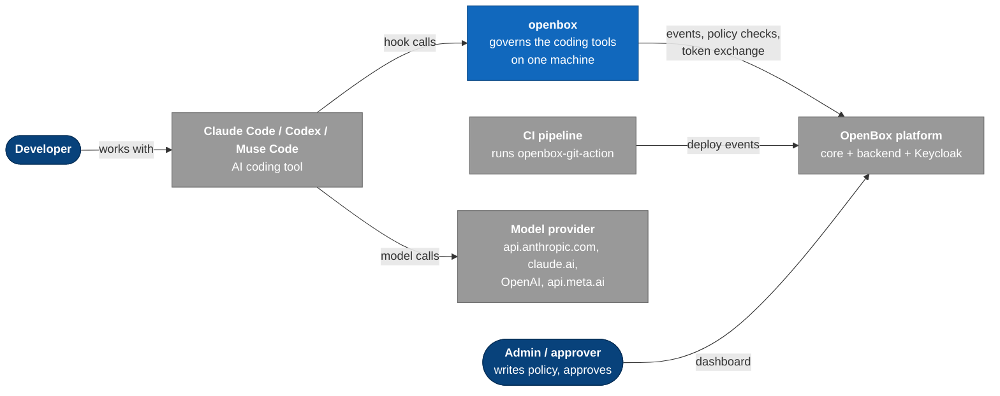
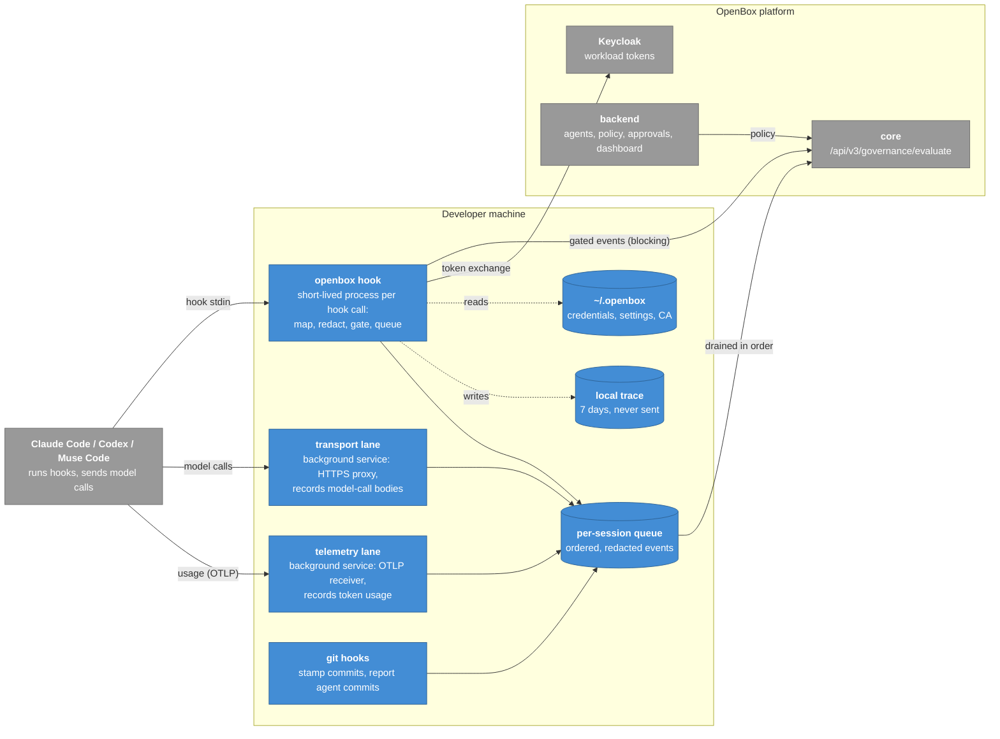
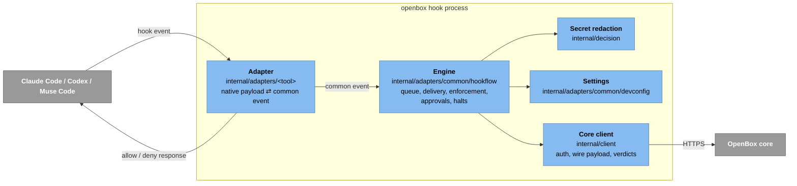
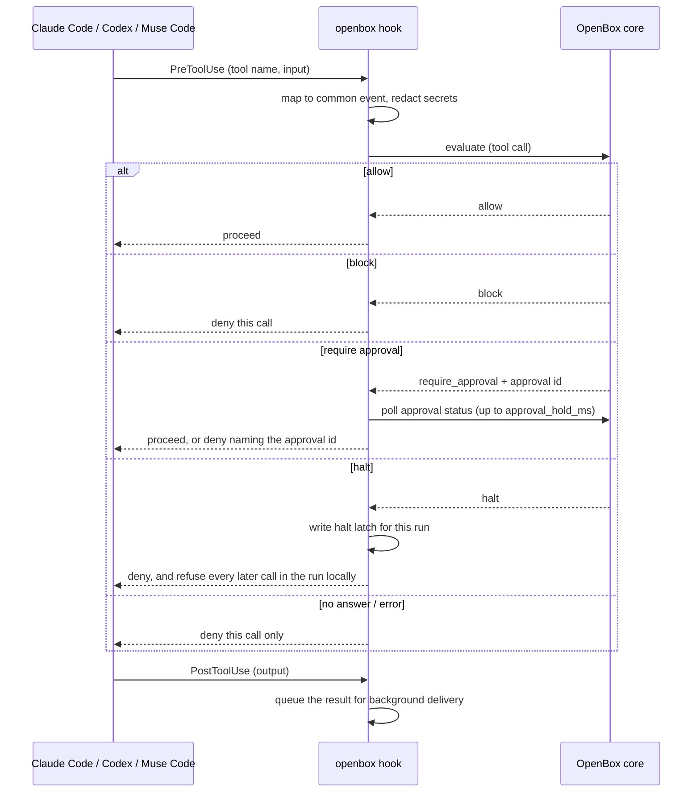

# Architecture

One static Go binary, one engine, and one thin **adapter** per coding tool.
Adding a tool means writing an adapter, not changing the engine.

`openbox` does not have its own backend. It onboards the developer's machine
onto the pipeline the OpenBox platform already runs for production agents:
each installed tool registers as an agent (`kind=developer`), each coding
session is a child record of that agent, and events go to the same
`/api/v3/governance/evaluate` endpoint with the same auth and storage.

## Key terms

| Term | Meaning |
|---|---|
| **Platform** | The OpenBox service `openbox` talks to. Two parts: **core** (data plane: receives events, evaluates policy) and **backend** (control plane: agents, policies, approvals, dashboard). |
| **Provider** / **tool** | A supported coding tool: `claude-code`, `codex` or `muse` (Muse Code). |
| **Adapter** | The per-tool code that reads the tool's native hook payload, maps it to the common event, and writes the tool's expected hook response. |
| **Engine** | The tool-independent code every adapter runs on (`hookflow`): queueing, delivery, enforcement, approvals, halts. |
| **Agent** | The identity one tool install has on the platform. One per tool per machine. |
| **Session** / **run** | One coding session. A run is one uninterrupted stretch of it; `--resume` continues a session in a new run. |
| **Gated event** | A tool call or a prompt. It waits for the platform's verdict before the action runs. Everything else is sent in the background. |
| **Verdict** | The platform's answer for a gated event: allow, block, require approval, or halt. |
| **Halt latch** | A small local file written after a HALT verdict. It refuses the rest of that run locally, without asking the platform again. |
| **Lane** | A local background service that records model calls, which hooks cannot see: `transport` (an HTTPS proxy) and `telemetry` (an OTLP receiver). |
| **Content capture** | The single switch (`content_capture`) that decides whether text bodies (prompts, replies, commands, file contents, tool output) are sent. |

## System context (C4 level 1)

Who and what `openbox` interacts with. The diagrams follow the
[C4 model](https://c4model.com): dark blue is a person, blue is `openbox`
itself, grey is outside this repo.

```mermaid
flowchart LR
  dev(["<b>Developer</b>"]):::person
  admin(["<b>Admin / approver</b><br/>writes policy, approves"]):::person
  tool["<b>Claude Code / Codex / Muse Code</b><br/>AI coding tool"]:::external
  ob["<b>openbox</b><br/>governs the coding tools<br/>on one machine"]:::system
  model["<b>Model provider</b><br/>api.anthropic.com, claude.ai,<br/>OpenAI, api.meta.ai"]:::external
  platform["<b>OpenBox platform</b><br/>core + backend + Keycloak"]:::external
  ci["<b>CI pipeline</b><br/>runs openbox-git-action"]:::external
  dev -- "works with" --> tool
  tool -- "hook calls" --> ob
  tool -- "model calls" --> model
  ob -- "events, policy checks,<br/>token exchange" --> platform
  ci -- "deploy events" --> platform
  admin -- dashboard --> platform
  classDef person fill:#08427b,stroke:#052e56,color:#fff
  classDef system fill:#1168bd,stroke:#0b4884,color:#fff
  classDef container fill:#438dd5,stroke:#2e6295,color:#fff
  classDef component fill:#85bbf0,stroke:#5d82a8,color:#000
  classDef store fill:#438dd5,stroke:#2e6295,color:#fff
  classDef external fill:#999999,stroke:#6b6b6b,color:#fff
```

## Containers (C4 level 2)

The processes and stores on a developer machine, and the platform parts they
reach.

```mermaid
flowchart LR
  tool["<b>Claude Code / Codex / Muse Code</b><br/>runs hooks, sends model calls"]:::external
  subgraph machine["Developer machine"]
    hook["<b>openbox hook</b><br/>short-lived process per hook call:<br/>map, redact, gate, queue"]:::container
    transport["<b>transport lane</b><br/>background service: HTTPS proxy,<br/>records model-call bodies"]:::container
    telemetry["<b>telemetry lane</b><br/>background service: OTLP receiver,<br/>records token usage"]:::container
    githook["<b>git hooks</b><br/>stamp commits, report agent commits"]:::container
    spool[("<b>per-session queue</b><br/>ordered, redacted events")]:::store
    config[("<b>~/.openbox</b><br/>credentials, settings, CA")]:::store
    trace[("<b>local trace</b><br/>7 days, never sent")]:::store
  end
  subgraph platform["OpenBox platform"]
    core["<b>core</b><br/>/api/v3/governance/evaluate"]:::external
    kc["<b>Keycloak</b><br/>workload tokens"]:::external
    backend["<b>backend</b><br/>agents, policy, approvals, dashboard"]:::external
  end
  tool -- "hook stdin" --> hook
  tool -- "model calls" --> transport
  tool -- "usage (OTLP)" --> telemetry
  hook -- "gated events (blocking)" --> core
  hook -- "token exchange" --> kc
  hook -. reads .-> config
  hook -. writes .-> trace
  hook --> spool
  transport --> spool
  telemetry --> spool
  githook --> spool
  spool -- "drained in order" --> core
  backend -- policy --> core
  classDef person fill:#08427b,stroke:#052e56,color:#fff
  classDef system fill:#1168bd,stroke:#0b4884,color:#fff
  classDef container fill:#438dd5,stroke:#2e6295,color:#fff
  classDef component fill:#85bbf0,stroke:#5d82a8,color:#000
  classDef store fill:#438dd5,stroke:#2e6295,color:#fff
  classDef external fill:#999999,stroke:#6b6b6b,color:#fff
```

Nothing needs to stay running for hooks to work: each hook call is its own
short process. The two lanes are the only long-running services, and `init`
installs them as launchd (macOS) or systemd (Linux) units.

## Components of the engine (C4 level 3)

What happens inside one `openbox hook` process.

```mermaid
flowchart LR
  tool["<b>Claude Code / Codex / Muse Code</b>"]:::external
  subgraph bin["openbox hook process"]
    adapter["<b>Adapter</b><br/>internal/adapters/&lt;tool&gt;<br/>native payload ⇄ common event"]:::component
    engine["<b>Engine</b><br/>internal/adapters/common/hookflow<br/>queue, delivery, enforcement,<br/>approvals, halts"]:::component
    redact["<b>Secret redaction</b><br/>internal/decision"]:::component
    cfg["<b>Settings</b><br/>internal/adapters/common/devconfig"]:::component
    client["<b>Core client</b><br/>internal/client<br/>auth, wire payload, verdicts"]:::component
  end
  core["<b>OpenBox core</b>"]:::external
  tool -- "hook event" --> adapter
  adapter -- "common event" --> engine
  engine --> redact
  engine --> cfg
  engine --> client
  client -- HTTPS --> core
  adapter -- "allow / deny response" --> tool
  classDef person fill:#08427b,stroke:#052e56,color:#fff
  classDef system fill:#1168bd,stroke:#0b4884,color:#fff
  classDef container fill:#438dd5,stroke:#2e6295,color:#fff
  classDef component fill:#85bbf0,stroke:#5d82a8,color:#000
  classDef store fill:#438dd5,stroke:#2e6295,color:#fff
  classDef external fill:#999999,stroke:#6b6b6b,color:#fff
```

## A gated tool call, step by step

```mermaid
sequenceDiagram
  participant T as Claude Code / Codex / Muse Code
  participant H as openbox hook
  participant C as OpenBox core
  T->>H: PreToolUse (tool name, input)
  H->>H: map to common event, redact secrets
  H->>C: evaluate (tool call)
  alt allow
    C-->>H: allow
    H-->>T: proceed
  else block
    C-->>H: block
    H-->>T: deny this call
  else require approval
    C-->>H: require_approval + approval id
    H->>C: poll approval status (up to approval_hold_ms)
    H-->>T: proceed, or deny naming the approval id
  else halt
    C-->>H: halt
    H->>H: write halt latch for this run
    H-->>T: deny, and refuse every later call in the run locally
  else no answer / error
    H-->>T: deny this call only
  end
  T->>H: PostToolUse (output)
  H->>H: queue the result for background delivery
```

### Why the platform is the only decider

There is no local policy. Every gated event goes to the platform, and risk is
a property of the policy, not of the client. Enforcement therefore depends on
reaching the platform, but any rule the platform can express is actually
enforced. An earlier local evaluator could not run hand-written policy at all,
so those rules silently never fired.

Secret redaction is the one thing that stays local. It has to run before
content leaves the machine, and it is the only protection content has in
transit.

### Delivery rules

- All events of a session go through **one ordered queue**, drained by one
  process at a time, in the order they were appended.
- Each event gets **one attempt**, plus **one retry** for a transient failure
  (timeout, network error, 5xx). A 401 is retried once with a freshly fetched
  token. Any other 4xx is not retried.
- **A delivery failure denies only the call it belongs to.** It never halts
  the run: the next gated call, prompt or model call gets its own attempt.
- **Only a HALT verdict halts a run.** `/clear` or `--resume` on Claude Code
  starts a new run and is not halted.
- **`WorkflowStarted` (session start) always reaches the platform first.**
  Beyond that, ordering is best effort: a gate may send its own evaluation
  before older queued events when the queue is busy.

Why only one retry: a platform hiccup retried without limit by every tool call
of every session becomes a flood. One retry lets a session survive a brief
blip, and a real outage still ends in each affected call being denied. The
cost: the platform deduplicates a resend only once it has finished the first
attempt, so a retry racing a slow first attempt can store an event twice.

### Identity and auth

Each tool registers its own agent, with a `keycloak_workload` identity. `init`
generates an RSA key pair and keeps the private key in `~/.openbox/<tool>/.env`.
To call the platform, the client signs a short-lived client assertion with that
key and exchanges it at Keycloak for a bearer token, cached on disk for a few
minutes and renewed before it expires (`internal/client/workloadauth/`). A
failure anywhere in that exchange counts as a delivery failure: the call is
denied, the run is not halted.

### Model-call lanes

| Lane | What it is | Sees | Installed for |
|---|---|---|---|
| `transport` | local HTTPS proxy with a machine-generated CA | real request and response bytes | Claude Code; Codex on macOS (through the system PAC) |
| `telemetry` | local OTLP receiver | the tool's own usage report, no content | Claude Code, Codex |

Rules that keep this correct:

- **Only one lane reports each model call.** An election, derived from where
  the tool's settings route model calls, picks one. Two lanes reporting the
  same call would double every token count. Codex's is derived from its
  `config.toml` and the system-PAC record, and the relay is elected over
  telemetry only after the PAC is committed **and** the relay has seen a Codex
  model call (a marker in Codex's spool directory). Both daemons resolve it
  from paths in their unit (`--codex-settings`, `--pac-record`), per record.
- **Each lane has its own `activity_id` namespace** (`:proxy:`, `:otel:`), so
  the platform's deduplication never merges one lane's record into another's.
  The model-call gate (`:llmgate:`, Muse's pre-send hook) has its own too.
- **Install order is a safety property:** write the service unit, start it,
  confirm it listens, and only then point the tool at it. Pointing the tool at
  a dead port would break every model call while `init` reported success.
  Uninstall reverses the order.
- **Containment is the host allowlist, not the certificate.** Only hosts in
  `internal/transport/hosttable.go` are decrypted; everything else is tunnelled
  untouched.
- The transport lane refuses a model call only when its run is halted.

The code also contains a third, older lane, `gateway` (a base-URL relay),
which `init` no longer installs.

**Muse Code has no lane.** Nothing in Meta's documentation shows that it trusts
a locally issued CA, follows the system PAC, carries a session header or
exports OTLP, so `init --provider muse` installs hooks only and `doctor` says
its model calls are not recorded. Its pre-send hook is evaluated as a
`model_call_gate` activity instead: a policy check, not a record of the call
(see [Coverage](coverage.md#1b-model-call-coverage-matrix)). `api.meta.ai` is a
host row of all three tools, so a relayed call on it is attributed by its
carrier header and skipped when none or several match.

## Layout

One Go module, `github.com/openbox-ai/openbox-shift-left`. One row per
top-level directory, with what belongs there **and what does
not**. A CI step fails if a top-level directory has no row here.

| Directory | What belongs | What must not go here |
|---|---|---|
| `api/` | machine-readable contract files; today, the dev-event JSON Schema | prose *about* the wire, which lives in `docs/` |
| `build/` | packaging and release configuration (`.goreleaser.yaml`) | anything a build produces; artefacts are git-ignored |
| `cmd/` | one directory per **shipped** executable (`openbox`, `openbox-git-action`), `main` package only | a binary nothing ships; a dev instrument belongs in `tools/` |
| `deployments/` | managed-settings files an org deploys with its own MDM | anything this repo's code reads at runtime or installs for you |
| `docs/` | design and user documents | anything a program parses |
| `init/` | **illustrative** copies of the lane service units, and only that | a `go:embed`, or anything treated as authoritative; `internal/cli/laneservice` renders the real ones |
| `internal/` | every package; this repo publishes no importable package | a package meant for external import |
| `tools/` | supporting dev instruments: `corpusfixture`, `refusal-injector` | anything the release builds |

`install.sh` and `.github/workflows/` stay at the root because `curl … | bash`
needs a stable URL and GitHub requires its own path.

### Inside `internal/`

| Package | What it owns |
|---|---|
| `provider/` | the adapter interface: `Installer` (install time) and `HookEngine` (runtime) |
| `adapters/common/hookflow/` | **the engine**: queue, delivery, enforcement, approvals, halts |
| `adapters/claude-code/`, `adapters/codex/`, `adapters/muse/` | one thin adapter each |
| `adapters/common/devconfig/` | settings and where each value comes from |
| `adapters/common/git/` | commit trailer, notes mirror, commit event |
| `client/` | the core client: auth, wire payload, verdict parsing |
| `decision/` | local secret detection and redaction |
| `transport/` | the HTTPS proxy lane |
| `telemetry/` | the OTLP receiver lane |
| `gateway/` | the older base-URL relay lane, plus the request/response capture shared with `transport` |
| `cli/` | everything behind the `openbox` commands, including lane install (`activation`, `laneservice`) |
| `trace/` | the local trace and the reader behind `openbox trace` |
| `conformance/` | the event contract's conformance suite |
| `actions/openbox-git-action/` | commit-to-deploy lineage for CI |
| `depguard/` | dependency and layering guards |

`internal/gateway/internal/dialhook` keeps a nested `internal/` on purpose: it
limits importers to the `internal/gateway` subtree.

**An adapter is four things:** its native hook shape, its mapper, an
`OutputContract` (how it writes a hook response and what an approval verdict
becomes), and its installer. Anything tool-independent belongs in `hookflow`
or `devconfig`. The engine was once copied per adapter, and the copies drifted
on the enforcement path.

**Layering is enforced by tests.** `internal/depguard` checks that no adapter
imports another and holds `telemetry`, `transport`, `decision` and `gateway`
to import allowlists. `internal/gateway` must never read the developer's
provider credential. Do not widen an allowlist just to make an import pass.

## Known limits

- **Credentials are plaintext.** Anything running as the developer, including
  the governed agent, can read the agent's private key. A signed event proves
  which machine's key produced it, not that nobody tampered with it. See
  [Credentials](credentials-and-secrets.md).
- **No events is not the same as no activity.** A machine that never ran
  `init` sends nothing and looks the same as an idle one.
- **Without managed settings, the developer can remove the hooks.** For Codex,
  hooks cannot be mandated at all; the shipped managed config pins approval
  and sandbox modes instead ([`deployments/managed/`](../deployments/managed/)).
- **Muse Code's runtime fails open.** Its payload shapes were read off Muse
  1.4.1 captures, but the answer shapes it accepts are unverified against a
  binary. A hook that crashes, times out or
  answers invalidly lets the action proceed; a deny-only `onFailure` successor
  and a non-zero exit on a gated crash backstop that. A payload over 256 KiB
  is never delivered to a hook: that gap is detected from Muse's own session
  log (a local finding, `doctor` count), not prevented. A local administrator
  can remove the hooks; an org-deployed managed hooks file is the only
  stronger option, and its policy keys are unverified.
- **The lanes detect bypass; they do not prevent it.** Unsetting one
  environment variable routes around them, which shows as a gap in the record.
  Prevention needs managed settings plus network egress control.
- **Content policy sees at most the first 64KB** of a body.
- **A platform HALT is trusted as a policy decision**, even when the platform
  issues it for an internal reason (for example "Session is no longer active").
- **Not verified against a live platform:** the model-call lanes (verified by
  replaying recorded traffic through the real code), and Windows at runtime.

## How it is verified

The governance evals (`go test -run TestGovernanceEval -v ./cmd/openbox/`) run
the real hook binary against an in-process fake platform and check what the
binary sent, what it showed the coding agent, and what it left on disk. They
say nothing about what the platform does with the data.
[Provider coverage § Evidence](coverage.md#5-evidence-what-is-proven-and-by-what)
lists each claim and the test that proves it.
