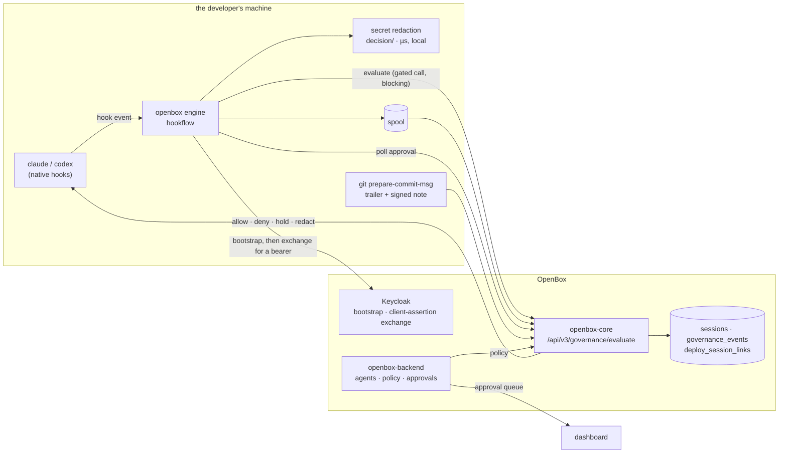

# Architecture

One static binary, one engine, one thin adapter per coding tool. Adding a tool
is an adapter; it is never a fork of the engine.

## The shape

```mermaid
flowchart LR
  subgraph TOOL["the developer's machine"]
    CC["claude / codex<br/>(native hooks)"]
    ENG["openbox engine<br/>hookflow"]
    RED["secret redaction<br/>decision/ · µs, local"]
    SPOOL[("spool")]
    GIT["git prepare-commit-msg<br/>trailer + signed note"]
  end
  subgraph OPENBOX["OpenBox"]
    KC["Keycloak<br/>bootstrap · client-assertion exchange"]
    CORE["openbox-core<br/>/api/v3/governance/evaluate"]
    BE["openbox-backend<br/>agents · policy · approvals"]
    DB[("sessions · governance_events<br/>deploy_session_links")]
  end
  CC -- "hook event" --> ENG
  ENG --> RED
  ENG -- "bootstrap, then exchange for a bearer" --> KC
  ENG -- "evaluate (gated call, blocking)" --> CORE
  CORE -- "allow · deny · hold · redact" --> CC
  ENG --> SPOOL --> CORE --> DB
  ENG -- "poll approval" --> CORE
  GIT --> CORE
  BE -- "policy" --> CORE
  BE -- "approval queue" --> DASH["dashboard"]
```

**Auth flow, once per cold identity:** the engine fetches core's bootstrap
document with the `obx_` API key alone, builds a 60-second RS256 client
assertion with the tool's workload private key, and exchanges it at Keycloak
for a bearer. The bearer and the bootstrap document share one lifetime, capped
at 270 seconds, cached to disk, and reused by the next hook until it expires;
a cached token that gets a flat 401 is deleted immediately rather than resent
(core answers 401 identically for a bad key and for a fault of its own).
Delivery is single-attempt and unconditionally fail-closed: Keycloak
unreachable, or any stage of this dance failing once a client exists to make
the attempt, is an explicit, proven non-acceptance exactly like a core outage
or a 401 from `/evaluate` itself -- the gated call denies and the run halts
(a durable, run-keyed latch) until a new session starts; nothing is held in a
spool waiting for a later retry. `/api/v3/auth/validate` is the one route that
also answers outside this dance, for a caller (doctor, git-action) that only
needs to confirm which agent a credential belongs to.

Two paths, deliberately separate:

- **A gated tool call waits for OpenBox to decide it.** Every gated PreToolUse
  call is evaluated by `/evaluate` before the tool runs. One policy
  implementation, on the server. This path has no daemon and no socket (a
  bounded outbound call is not a resident process). The model-call lanes are
  resident processes, and they are a third path rather than a change to this
  one: per machine, installed by the same `init`, and reaching a surface no hook
  can see.

That is the trade: enforcement now depends on reaching the control plane, and
it is unconditionally fail-closed -- a gated call denies when the control
plane cannot be reached or does not answer, and the run halts until a new
session starts (`fail_closed` stays parseable so `openbox doctor` can name it
as ignored; it no longer selects anything). What it buys is that an org whose
policy is hand-written rego is actually enforced; the local evaluator could
never evaluate that at all, so those gates simply opened.

The one thing that stays local is **secret redaction**: it must run before
content leaves the machine, and it sees the whole body where the server sees at
most the first 64KB.
- **Every producer shares one ordered, per-session queue, and every event gets
  exactly one delivery attempt** (owner ruling 2026-09-24, superseding the
  2026-09-01 hold-and-retry policy and the 2026-09-22 in-process-lanes
  ruling; decision record:
  [`decision-260925-0511-all-or-nothing-ordered-delivery.md`](../plans/260924-1911-ordered-session-event-queue/reports/decision-260925-0511-all-or-nothing-ordered-delivery.md)).
  Hook events, the enforcement gate's own escalation, and a lane daemon's own
  model-call records all append to and drain from the SAME per-session,
  per-tool spool (one drainer per session, 64 striped locks, append order ==
  delivery order); a hook process still performs zero network I/O of its own.
  **If core does not accept an event, for any reason** (a proven refusal, a
  5xx, a timeout, a 401, or a network fault at the request itself) **the
  client halts that run**: a write-if-absent latch refuses every later gated
  call, prompt and relayed model call of that run until a new session starts.
  Nothing is retried, redelivered, or held for a later attempt on a failure --
  only an event a drain never got to attempt (a cut pass, a budget that ran
  out) stays queued, never a failure. `SessionStart` and `SessionEnd` each send
  inline, in their own hook, within a window measured from the hook's own
  start, before anything else of the run can reach core; whatever that leaves
  queued falls back to a detached flusher (a 30-second attempt bound) spawned
  regardless of the realtime-flush toggle. Overlapping drains cannot
  double-count: a session's own stripe lock and core's Idempotency-Key dedupe
  together close that. The legacy `gateway` lane (superseded by `transport`;
  still running on any machine that installed it before) keeps this same
  spool-and-flush shape for its own records unchanged.
- **A gate drains its own session's backlog in slack, then evaluates.** Before
  escalating, a gated PreToolUse/UserPromptSubmit call drains whatever is
  already queued for its session (within the budget slack left after
  reserving one evaluation's worth) and re-reads the run's halt latch; a
  delivery failure or a HALT verdict the drain itself finds denies that call
  without ever escalating. A slow core never halts a run from inside a gate:
  an event the drain could not even start stays queued, and an event it sent
  but never heard back from within its own budget is requeued for the 30s
  drainers (core's idempotency key dedupes the one resulting resend); only an
  explicit non-acceptance halts.
- **A lane daemon's own records now queue through the same session spool the
  hooks use**, not an in-process bounded pool (superseding the 2026-09-22
  in-process ruling above): `telemetry` and `transport` each drain their
  session's own backlog in-process, single-flight per session, one attempt
  per record (30s bound). An append that never reaches the spool at all halts
  immediately -- a lane record has no gated call to deny synchronously, so the
  latch is the only non-silent outcome. Both daemons still run the same
  `Sweeper` as before for genuinely stale, never-attempted backlogs (30-day
  retirement, unrelated to an attempted-and-failed event, which is ledgered
  and gone immediately). `chat:` sessions are the one exception: they have no
  session-scoped hook events to interleave with, so they keep an in-process
  bounded pool (`hookflow.DeliverPool`, retimed to the same 30s per-emit
  bound); a chat record core does not accept latches that conversation
  (hashed, Windows-legal filename) instead of a run, and the relay refuses its
  next completion. Each daemon persists its drop count to a small status file
  (`hookflow.DeliverStatus`/`LaneQueue.Dropped()`) so `openbox doctor` -- a
  separate process with no channel into a running daemon's memory -- can
  print an unaccepted-record row per lane.

## Layout

One Go module, `github.com/openbox-ai/openbox-shift-left`. One row per top-level
directory, each saying what belongs in it **and what does not**; the second half
is the part that stops a directory quietly becoming a junk drawer.

| Directory | What belongs | What must not go here |
|---|---|---|
| `api/` | machine-readable contract artefacts; today, the dev-event JSON Schema | prose *about* the wire. `mapping.md` and `coverage.md` are documents, and they live in `docs/` |
| `build/` | packaging and release configuration (`.goreleaser.yaml`) | anything a build produces. Artefacts are git-ignored |
| `cmd/` | one directory per **shipped** executable, `main` package only | a binary nothing ships. A dev instrument belongs in `tools/` |
| `deployments/` | managed-settings artefacts an org deploys with its own MDM | anything read at runtime by this repo's own code, or anything this repo installs for you |
| `docs/` | design and user documents | anything a program parses |
| `init/` | **illustrative** copies of the supervisor units, and only that | a `go:embed`, or anything treated as authoritative. `internal/cli/laneservice` renders the real ones |
| `internal/` | every package this repo does not publish; which is all of them | a package meant for external import. Publishing one reopens the `/pkg` question |
| `tools/` | supporting dev instruments; `corpusfixture`, `refusal-injector` | anything the release builds. `tools/` is not a release surface |

`install.sh` and `.github/workflows/` stay at the repository root deliberately:
`curl … | bash` needs a root URL and GitHub demands its own path. Both are
tool-mandated, and completing the pattern by moving `install.sh` would break the
documented install command.

### Inside `internal/`

| Package | What it owns |
|---|---|
| `provider/` | the SPI: `Installer` (install time) and `HookEngine` (runtime + capabilities) |
| `internal/adapters/common/hookflow/` | **the engine**; spool, duration stash, advisory sink, findings loop, the enforce cascade, inline evaluation, approval hold, rewake |
| `internal/adapters/claude-code/`, `internal/adapters/codex/` | one thin adapter each: native event shape, mapper, `OutputContract`, installer |
| `internal/adapters/common/devconfig/`, `internal/adapters/common/git/` | shared config/posture resolution; commit trailer, notes and attestation |
| `client/` | the openbox-core client: wire payload, AIP signing, verdict parsing |
| `decision/` | local secret detection and redaction (all that survives) |
| `gateway/` | the local model-call relay: byte-identical forward, capture, the gate |
| `telemetry/` | the local OTLP receiver; the `:otel:` lane's intake |
| `transport/` | the in-path CONNECT/TLS relay; the `:proxy:` lane |
| `cli/` | everything behind the `openbox` commands: `prompt`, the gateway's install/inspect/emit halves, the read half of the managed-config reporter, and the three-lane install machinery (`activation`, `laneservice`, `atomicfile`) |
| `conformance/` | the event contract's conformance suite |
| `internal/actions/openbox-git-action/` | commit → deploy lineage for CI |
| `depguard/` | the dependency and layering guards |

`internal/gateway/internal/dialhook` keeps its **nested** `internal/`
deliberately: it restricts importers to the `internal/gateway` subtree, which is
the property it exists to have. Root `internal/` alone would not.

An adapter is only four things: its native hook shape, its mapper, an
`OutputContract` (how it spells a hook response, where a redactable body lives,
what an approval verdict becomes) and its installer. If something is
provider-agnostic it belongs in `hookflow` or `devconfig`; that rule exists
because the engine was once copy-pasted per adapter, and the copies drifted on
the enforcement path.

**Layering is enforced by tests now, not by the compiler.** Fifteen modules used
to make "no adapter imports another, and the CLI reaches them only through the
registry" mechanical; `internal/depguard` carries it instead, and a test is
weaker than a compiler. That is the accepted price of the collapse.

## Governance levels

Each install runs at exactly one level, and reports which:

| Level | What happens | Cost to a tool call |
|---|---|---|
| **Observe** (default) | normalized telemetry, lineage, cost. Never blocks. | none; spooled |
| **Advisory** | verdicts and guardrail findings are recorded and surfaced back into the session, never applied | none |
| **Enforce** (default since) | the PreToolUse and UserPromptSubmit gates apply the verdict: deny/block, hold for an approval, or redact; and a HALT stops the whole session | one round-trip to `/evaluate` per gated hook, bounded by the provider's hook ceiling |

Enforce is three named things, not three tiers. They are independent; any one
can be on without the others:

- **Local secret redaction.** A Write/Edit body is scanned before anything
  leaves the machine; a detected secret is replaced and the call proceeds with
  the redacted body (redact-and-continue) rather than being blocked. On by
  default (`secret_detection`). Detection is two layers: **231 format rules**,
  nine hand-rolled regexes (`decision/secrets.go`) beneath gitleaks' 222
  (`decision/gitleaks.go`), then a keyword-and-entropy layer for values
  in no known format. What that reaches, and the two shapes it does not, is
  measured in
  [credentials-and-secrets.md](credentials-and-secrets.md#what-the-scanner-catches-and-where-it-stops).
- **Inline evaluation.** The gated call is sent to `/evaluate` and the verdict
  is applied before the tool runs. Every gated class, not a risk-selected
  subset; risk is a property of the policy. Prompts gate the same way:
  `UserPromptSubmit` evaluates the `PromptSubmitted` event before the prompt is
  processed, and a HALT/BLOCK blocks (and erases) the prompt. Delivery is
  single-attempt and unconditionally fail-closed: an unreachable control
  plane, or any other proven non-acceptance, denies this call, and if the
  attempt was actually sent and explicitly refused (not merely never reached
  in the caller's own budget) the run halts until a new session starts. No
  retry: one hiccup must not become a client-side amplifier across every tool
  call of every session -- it becomes a halt instead.
- **HALT ends the session.** A HALT the control plane returns is a session
  verdict, not a call verdict: the response carries Claude Code's
  `continue:false` (the turn stops immediately) and a local latch
  (`halted-sessions/` beside the other sinks) refuses every later prompt and
  tool call in that session with no re-evaluation; `--resume` included. BLOCK
  stays per-call. A *synthesized* HALT, the fail-closed outage answer, an
  unanswered approval, never ends the session: only the server's own HALT does.
  Codex has no session-stop lever, so a HALT there renders as its strongest
  per-call deny and no latch is written.
- **Findings.** Asynchronous guardrail and drift findings surfaced back into the
  session after the fact. Off by default (`findings`).

`REQUIRE_APPROVAL` is the one verdict that is a *question* rather than an
answer: the server files it as a real record and the hook holds briefly for a
decision.

## Approvals

A gated call is filed as a real governance event with an approval window, and
the session holds briefly (~20s) while someone answers. Answer inside the hold
and the call proceeds and the developer sees nothing. Nobody answers and the
call is denied with the approval reference in the reason; and if the decision
lands later, a background watcher wakes the session with the outcome.

Whoever answers is a separate principal with their own credential, working from
the dashboard. Approving on the machine that filed the request is refused by
default.

## Posture as evidence

Every session start reports its own effective posture, enforce on/off,
fail-open/closed, who decides and what happens when they are unreachable,
content capture, provider-managed config, so the control plane can tell a
governed machine from an ungoverned one without trusting the endpoint's word for
it. `openbox doctor` prints the same thing locally, with the provenance of each
value (default, your config, environment, or org mandate).

## Assurance

Being precise here is part of the product.

### Identity, attribution and the gate

- **Commit attribution.** The `OpenBox-Session` trailer records which session
  was live when a commit was made. That is an *inferred claim*, and a trailer
  can be hand-written. Server-side ownership verification raises it to
  `attributed`. Cryptographic `verified` requires the signed attestation note :
  the commit hook signs an envelope into `refs/notes/openbox-attest`, the deploy
  action carries it, and core marks `verified` only when ownership **and** an
  accepted attestation both hold. CI must fetch that ref, which is not the
  default.
- **The signing key is readable by anything running as the developer.** It sits
  in plaintext at `~/.openbox/<tool>/.env`, one per governed tool; `0600` on
  macOS/Linux, and on Windows
  `0600` is a no-op so other local accounts can read it too. The coding agent
  under governance runs arbitrary commands as that user, so it can read the key
  it is being attested with. Attestation therefore proves **origin-of-config**,
  a machine holding this agent's key produced this event or commit, and **not**
  tamper-resistance against the developer or against the agent they run. The OS
  keychain this replaced did not actually change that (it was unlocked for the
  desktop session and readable by the same processes); the plaintext file makes
  it legible. The org key that can create and rotate agents fleet-wide is a
  strictly larger blast radius than one agent's seed, which is why it is kept
  out of every per-tool store: it lives only in the org-level `~/.openbox/.env`,
  where it is subject to exactly the same at-rest exposure described above.
- **A project can hold a registration from an older engine until the next
  `init`.** Hooks live in a file on the developer's machine, so an install run
  with a different `HOME` used to leave a second OpenBox entry beside the
  current one; both engines then fired for every hook, storing every governed
  tool call twice, and an older engine reports fewer fields than the current
  one. `init` now removes its own redundant entries, at another engine path, or
  the same one registered twice, and prints what it retired, and `openbox
  doctor` reports both conditions for the directory it is run from. Two limits
  stay: the repair happens **only when `init` is next run in that directory**,
  and events already stored are not corrected; so a fleet's history can contain
  duplicates that no client-side change removes.
- **Enforcement.** The gate is a hook in the developer's own config. Until the
  provider's managed configuration is deployed (`deployments/managed/`), a
  developer can remove it: prevention without assurance. For Codex the hook
  itself cannot yet be mandated, a `requirements.toml` cannot define one, so the
  shipped mandate pins approval and sandbox modes instead.
### Model calls and the lanes

- **Model calls are governed only where a lane is installed.** On Claude Code
  `init` brings up the transport relay and the telemetry receiver, retiring an
  older `ANTHROPIC_BASE_URL` gateway if it finds one; where no lane is packaged,
  tool calls are governed and model calls are not, because the hooks never see a
  model request. A lane records a model call; only the transport lane refuses
  one today, and only for a run some lane already latched -- a HALT verdict
  or a delivery failure, either one, checked locally with no `/evaluate` round
  trip -- the synchronous, per-call
  server-verdict refusal path is still written and has no production caller,
  pending the probe that would say what shape it must take. Three limits are
  worth stating plainly rather than discovering:
  - **The base claim is detection, not prevention.** A developer can unset one
    environment variable. That is *visible*, and the signal that makes it visible
    had to be rebuilt: it used to be "model turns with no gateway **spans**", which
    is now trivially true of every session, because no session gets span rows at
    all. It was in fact already vacuous before the spans were removed. The signal
    that can still tell the two states apart is the **`activity_id` namespace**: a
    session carrying hook-derived turns (`<session>:turn:<n>`) and **zero**
    `:gateway:` or `:proxy:` activity ids made model calls the relay never saw.
    `openbox doctor` reports the exposure at every tier including the healthy one,
    and now also reports a lane whose managed env keys have gone missing while its
    unit is installed and listening -- the case where routing was removed by
    something other than OpenBox. It is not prevented. Root-owning the config via
    MDM stops the developer editing the FILE; a shell export still wins for a
    process launched from that shell. Only egress control closes it, and that is
    the org's to deploy; see [the MDM recipe](gateway-mdm-recipe.md).
  - **Refusal has never been tried against a real session.** The status code and
    error body a refusal uses are provisional: Claude Code's retry logic matches on
    upstream error wording, so a wrong shape makes a policy denial look transient
    and get retried around, or disables a capability for the rest of the session.
    That decision holds that open, and phase 06 descopes to observe-only if no shape
    qualifies.
  - **Whether subscription-OAuth traffic follows `ANTHROPIC_BASE_URL` is still
    unresolved for THIS lane**. If it does not, the gateway covers
    API-key/console orgs only.
    What *has* been measured (2026-08-27) is the bigger question behind it: the
    terminal CLI follows the variable and **the desktop app does not**, and
    subscription-OAuth model calls are capturable by two other means that need no
    base-URL change at all; 97 calls observed, every one carrying OAuth
    authorization and none carrying `x-api-key` (openbox-logger run
    `20260827T063932Z-225cac`). Both lanes now exist and every `init` installs
    them, so the open question is about this lane's reach rather than about a
    class of developer being ungoverned; see the bullet below for what that does
    and does not buy.
  - **A compressed body is decompressed in the capture path; an undecodable one
    is recorded as a marker naming its encoding.** The client's own
    `Accept-Encoding` is relayed verbatim (`gzip, deflate, br, zstd`), so the
    provider chooses, and it chooses `br` for 89.5% of responses and `gzip` for
    the remaining 8.9% -- `br` on 74,477 of 83,190 recorded responses and `gzip`
    on 7,378, measured over an 8.4 GB corpus, zero exceptions. Both are decoded,
    on the teed copy only, so the bytes forwarded to the tool stay identical. Compressed bytes are opaque to the secret detector,
    which would otherwise attach an unredacted unreadable body while every
    redaction guarantee held vacuously, so an encoding outside the decode set is
    still not captured at all: the honest marker is preferred. The decode set is
    pinned to what the recorded corpus advertises by
    `TestTheDecodeSetCoversEveryEncodingTheCorpusAdvertises`, because the
    gzip-only set that preceded it rested on an unfalsifiable claim -- the
    measurement it cited recorded only that `Content-Encoding` was present, never
    which one.
  - **A relayed call that never gets a response still leaves a record.** The
    request
    body reaches the provider before the transport reports failure, so a caller that
    hangs up mid-POST has already sent its prompt. That case emits a span with no
    status rather than nothing; otherwise any local process could suppress its own
    record by not waiting for the answer, and the bypass-detection argument above
    rests on a bypass leaving a hole rather than leaving no trace.
  - **Anything that can reach loopback can call the gateway, including a web
    page.**
    The daemon performs no caller authentication; the loopback bind is
    the caller boundary, and for *relaying* that is defensible; a caller
    supplies its own credential, so it gains no access it did not already have.
    But loopback is not a user boundary on a shared machine, and it is not a
    browser boundary at all: a page the developer visits can `fetch`
    `http://127.0.0.1:8788/v1/messages` as a CORS-simple request, which is *sent*
    even though the reply cannot be read cross-origin. **Capture is now wired
    (2026-08-26), so the "bounded because it stores nothing" clause this bullet
    used to carry is spent.** What replaces it is narrower and worth stating
    exactly, because the two sub-vectors no longer have the same answer:

    - **A cross-origin web page: bounded, incidentally.** Evidence is filed only
      for a call carrying `X-Claude-Code-Session-Id`, and a custom request header
      is not CORS-simple; it forces a preflight, and the gateway forwards
      preflights upstream rather than granting them. A page can therefore still
      make the relay *forward* a request, but it cannot make it *record* one. This
      falls out of requiring a real session id, not from a caller check; it holds
      only while that requirement does.
    - **A local process: live.** Anything running as the developer can set the
      header and have its content redacted, signed with the developer's key and
      stored as that developer's governance evidence; evidence forgery by an
      unauthenticated local caller, exactly as this bullet predicted. It is the
      same trust boundary already conceded for the signing key (anything
      running as the developer can read it), so it grants no new *capability*; but
      it does make forgery cheaper, and a governance record that can be written by
      any local process should say so.

    Closing it still means adding a caller check (an `Origin`/`Sec-Fetch-Site`
    rejection, or a loopback token) to a relay documented as transparent, which is
    a product decision and is **not** made yet. Related and smaller: the relay
    buffers up to 64 MiB per in-flight request with no concurrency cap, so the same
    unauthenticated listener is a local memory-pressure lever.
- **Two more model-call lanes exist, and both are verified by replay rather than
  by running**. `openbox init --provider claude-code` installs a local
  OTLP **telemetry** receiver (`:otel:`) and an in-path CONNECT/TLS
  **transport** relay (`:proxy:`) alongside the hooks; `openbox uninstall` backs
  every lane out. A per-provider host table drives both the intercept
  allowlist and a `GET /proxy.pac` endpoint the relay now serves (below). **On
  macOS**, `openbox init` activates that PAC at the OS level itself, once the
  transport lane is up and its env keys are written (`cmd/openbox/systempac.go`,
  `internal/cli/activation/sysmacos.go`): one `sudo` authentication in the TTY,
  trust the CA in the System keychain and read it back, then set the PAC URL
  on every *enabled* network service and read that back too — record-before-write,
  with a `Pending` marker so a killed run can be reconciled, and any failure
  after a scope's PAC was set rolls that scope back. Declining, or having no
  controlling terminal at all, leaves the lane installed and env-routed with
  no half-state; `openbox doctor` reports the live per-scope state and any
  drift, and `openbox uninstall` restores every scope and untrusts the CA
  before deleting it. A second `openbox init` that finds its own prior
  activation still matching the live state re-prompts for nothing. **Linux and
  Windows report "not yet supported on this OS in this build" and make no OS
  write at all** — their P5-linux/P5-win probes have not run. What that buys,
  and what it does not:
  - **The evidence is replay, not operation.** Real recorded traffic runs
    through the
    shipped code path on a host that cannot bind a socket, with the relay's upstream
    dial substituted. That proves the bytes forwarded and captured, the mapping, the
    gate and the caps. It proves nothing about bind, listen, TLS to a real socket, or
    what core stores; **no control plane has ever received one of these events.**
    One thing the replay does not reach HAS been run separately: a synthetic OTLP
    export crossed the receiver's real HTTP intake end to end on a bind-capable host
    (phase 09). Two limits on that: the export was **JSON**, while production is
    configured for `http/protobuf`; so **no test drives the protobuf decoder, which
    is the only path real traffic takes**; and the real client has never exported
    to this lane at all. A live stack and a real desktop client
    are what would change that.
  - **The desktop and OAuth coverage these lanes were built for is
    unconfirmed.**
    That is the whole reason they exist, and it is intent rather than measurement
    until a real client is put behind them.
  - **The telemetry lane is suppressible by the thing it observes.** It is the
    governed tool reporting its own calls; the weakest claim in this product, and it
    must never be averaged with the two in-path lanes. an owner decision is the compensating
    control: telemetry silence on an otherwise-active session is a **finding**, not
    an absence. `openbox doctor` names the elected producer and warns when the
    elected lane has nothing listening behind it.
  - **Exactly one lane may emit per model call, and that is a correctness
    property.**
    The three namespaces are deliberately disjoint so core's dedupe cannot absorb one
    lane's event as another's; which means two lanes emitting both STORE, and every
    token count doubles with no error anywhere. The election is derived from where
    the tool's settings actually route model calls and is answered per record;
    resolving it once at daemon start shipped exactly that double-count into review.
  - **The transport lane now refuses a call locally; the legacy gateway lane
    still never does.** `cmd/openbox/transport.go` wires a latch-only
    `haltDecorator` behind `transport.WithGate`: it refuses a relayed POST
    when the run that call's session currently belongs to was already latched
    HALTed by some lane (`hookflow.SessionHalted`), with no `/evaluate` round
    trip; an unlatched call is allowed exactly as before. The `gateway` lane
    wires no gate at all. The synchronous, server-verdict refusal path both
    lanes share (`gateway.Gateway.WithGate`, `internal/gateway/refuse.go`) is
    still written and has no production caller: the refusal shape Claude
    Code does not retry around is unprobed. `tools/refusal-injector/` is the
    instrument; it needs a bind-capable host, a real install and credentials.
  - **The transport lane installs a CA on the developer's machine, and that is a
    real downgrade accepted for coverage.** It is generated once, stored beside
    the credentials under `~/.openbox/` with no more protection than they have,
    and anything running as the developer can read it — the same boundary
    already conceded for the signing key.
    **Decision record: what bounds a leaked key, reversed.** OD2 (2026-08-27)
    bounded it by generating the CA name-constrained to the single intercepted
    host, so a leaked key could mint a certificate for nothing else. An owner
    ruling (2026-09-22) **reverses OD2**, and the code now matches it: the CA
    is generated **unconstrained** (`internal/transport/ca.go` sets no
    `PermittedDNSDomains`), and containment is a per-provider intercept host
    table (`internal/transport/hosttable.go`) instead of the certificate —
    `claude-code` → exact `api.anthropic.com` plus `claude.ai` and its
    subdomains; `codex` → exact `api.openai.com` plus `chatgpt.com` and its
    subdomains; auth hosts (`auth.*`, bare `anthropic.com`/`openai.com`) are
    never listed. The intercept allowlist is the **union of the rows of
    installed providers**; a CONNECT for a host outside it is blind-tunnelled,
    never decrypted — that allowlist is the containment, not the certificate.
    A per-provider host table also drives the `GET /proxy.pac` endpoint the
    relay now serves (`PROXY <addr>; DIRECT` for a unioned host, `DIRECT`
    otherwise), wired as goproxy's `NonproxyHandler`; nothing yet points a
    browser or a tool's system proxy setting at it, so today it is reachable
    only if something already knows the URL. Stated plainly: an unconstrained
    CA means a leaked key can mint a certificate for **any** site this machine
    is made to trust the CA for, not only the intercepted one. Compensating
    controls: `0600` file permission on macOS/Linux (no at-rest protection on
    Windows), `openbox uninstall` deletes the CA rather than leaving a trusted
    signing key behind a relay that is gone, the relay binds loopback-only, and
    trust for the governed tool itself is env-scoped (`NODE_EXTRA_CA_CERTS`
    written into the tool's settings environment,
    `internal/cli/activation/keys.go`). **On macOS only**, `openbox init` also
    trusts the same CA in the System keychain
    (`security add-trusted-cert -d -r trustRoot`) as part of activating the
    system PAC (above), which is a second, wider blast radius the install
    report discloses every time activation is attempted or active: desktop
    apps *and* browser sessions on the union's hosts are now TLS-terminated by
    this relay too, using the same unconstrained key; a stopped relay still
    leaves the PAC's `; DIRECT` fallback in place, which is not egress
    control; and macOS may raise a second, separate confirmation for the trust
    change beyond the one `sudo` prompt. Linux and Windows keep env-scoped
    trust only, for now — no system keychain, no browser coverage.
    **A machine still holding an old constrained CA keeps working**: `CA.
    CanIssueFor` gates `Proxy.intercepts`, so a host the legacy CA cannot mint
    for stays blind-tunnelled rather than failing the handshake, even after the
    allowlist widens to name it. `openbox doctor` reports this as a "legacy
    constrained CA" finding naming the affected hosts and the remedy: re-run
    `openbox init`, which now re-issues the CA itself
    (`internal/transport/careissue.go`'s `ReissueIfNeeded`, called before the
    transport unit is reinstalled) — deleting both legacy files and generating
    a fresh, unconstrained pair under the same filenames — then restart the
    tool so it re-reads `NODE_EXTRA_CA_CERTS`. Idempotent: a machine whose CA
    already needed no re-issue, or that already went through it once, is
    untouched on every later `init`.
  - **The lane does not chain through a corporate proxy.** `transport.New`
    clears the
    six proxy environment variables in its constructor, because a daemon that
    inherits the `HTTPS_PROXY` the installer wrote would dial itself until sockets
    run out. Owned rather than hidden: an org that requires an upstream proxy cannot
    use this lane today.
  - **~97% of model-call request bodies are truncated before egress.** Measured,
    not
    estimated: 96.75% of 5,049 recorded request bodies exceed the 65,536-rune cap
    (p50 529,175, max 2,566,660; run `20260827T063932Z-225cac`). Response bodies:
    0.06%. Under an owner decision(c) the tail of an oversized body exists nowhere org-side, so
    content-based policy and every reader see the head only. This is accepted, not a
    defect; but a reader must not assume a captured call is a complete call.
### Secret detection

- **Local secret detection has a measured reach, and two shapes fall outside
  it.** 231 format rules catch a known credential by shape wherever it appears.
  Anything in no known format is caught only by the keyword-and-entropy layer,
  and that layer has two documented misses: the recognised keyword must sit
  **adjacent** to the delimiter, so `AWS_ACCESS_KEY_ID=<unrecognised value>` is
  invisible while `access_key=<same value>` is caught; and a high-entropy value
  beside an unrecognised key name is invisible below the 4.5-bit floor, which is
  deliberate; lowering it would flag every git SHA and UUID, and on the enforce
  path the redactor **rewrites the developer's file**, so a false positive
  corrupts real content. Both are measured, not assumed
  ([credentials-and-secrets.md](credentials-and-secrets.md#what-the-scanner-catches-and-where-it-stops)).
  The same redactor also fires on a base64 literal in a source assignment, which
  rewrote three of this repo's own test files during the gitleaks adoption.
### Dependency and layering guards

- **The dependency guard bounds a package subtree's direct imports, not
  transitive code**. `internal/gateway` must never read the developer's provider
  credential; its own files are scanned for that and its imports are held to a
  two-entry allowlist. What no test bounds is arbitrary transitive code linked
  into the binary; accepted, and named, because the alternative was an allowlist
  too long to read.

The bound used to be the module, and until 2026-08-30 there were fifteen of
them. With one module, `go.mod` names every external dependency in the
repository at once, so a `go.mod`-reading allowlist would either fail outright
or be "fixed" by widening to the union; which looks like a fix and removes the
control. The allowlists moved to `internal/depguard`, scoped by directory. **Do
not widen one to make an import pass**; that inverts the reasoning behind them.

**Four subtrees are guarded; the rest are not, and that is a named loss.**
Measured 2026-08-31, after the stdlib-and-OSS hardening pass added five direct
requires. Not one of them landed in a guarded subtree, so not one needed an
allowlist amendment -- which is the loss below, stated in numbers rather than in
principle:

  | Subtree | Direct external imports | Bounded by |
  |---|---|---|
  | `internal/telemetry` | **11**; 8 × `go.opentelemetry.io/collector/*` (incl. `receiver/otlpreceiver` v0.159.0), `otel/metric`, `otel/trace`, `go.uber.org/zap` | `internal/depguard` |
  | `internal/transport` | **1**; `elazarl/goproxy` v1.9.0 | `internal/depguard` |
  | `internal/decision` | **1**; `zricethezav/gitleaks/v8` v8.30.1 | `internal/depguard` |
  | `internal/gateway` | **0** external; and that is the strongest statement available, not a vacuous one | `internal/depguard`, plus its own credential scan |
  | `internal/conformance` | **1**; `santhosh-tekuri/jsonschema/v6` v6.0.3, plus `golang.org/x/text` transitively | `internal/depguard`, by package **closure** |
  | `internal/cli` + `cmd/` | **5**; `kardianos/service` v1.3.0, `google/renameio/v2`, `golang.org/x/term`, `tidwall/gjson`, `tidwall/sjson`; plus `google/go-cmp` in tests | **nothing** |
  | `internal/adapters/common/devconfig` | **3**; `pelletier/go-toml/v2`, `joho/godotenv`, `google/uuid` (the AIP attribution-label derivation) | **nothing** |
  | `internal/adapters/common/hookflow` | **2**; `google/renameio/v2`, `gofrs/flock` | **nothing** |
  | `internal/adapters/claude-code`, `internal/adapters/codex` | **3**; `gofrs/flock`, `tidwall/gjson`, `tidwall/sjson`; plus `google/go-cmp` in tests | **nothing** |
  | `internal/client` | **3**; `cenkalti/backoff/v5`, `golang-jwt/jwt/v5` (in `internal/client/workloadauth`, the RS256 client assertion), and `grpc/test/bufconn` inside `memhttptest`, which its own guard test forbids any non-test file to import | **nothing** |
  | everything else | **0** | **nothing** |

The rows saying **nothing** are the accepted loss: those subtrees never had a
guard, and what used to bound them was that adding a dependency meant editing
their own small `go.mod`. Now anything already in the union graph is importable
from them with no diff outside a `.go` file. `internal/conformance` is the one
checked by closure rather than by direct import, because `x/text` arrives
through `jsonschema` and an import walk cannot see it.

The whole repository has **25 direct external requires** in one `go.mod`. The
first 19 were the union of what the fifteen modules declared; the six added
since are `google/go-cmp` (tests only), `cenkalti/backoff/v5`, `gofrs/flock`,
`tidwall/gjson`, `tidwall/sjson`, and `google.golang.org/grpc` promoted from
indirect for `test/bufconn`.

**Otlpreceiver's transitive tree is an accepted cost, stated with the numbers
phase 09 measured** rather than smoothed into "a few libraries": **492
transitive packages and 124 modules in the graph** for `internal/telemetry`,
against 381 and 206 for `internal/gateway`. The **leak check of zero** was
measured while the repo was fifteen modules, and the module boundary is what
held it.

**That boundary is gone and the sentence that stood here claimed otherwise.**
One `go.mod` requires the collector, so what holds the separation now is the
import allowlists; and only for the four guarded subtrees in the table above.
`internal/client`, `internal/cli`, `hookflow` and both adapters could import
`go.opentelemetry.io/collector/*`, gitleaks or goproxy today and **nothing would
fail**. That is the same named loss, seen from the dependency side.

The binary is the visible half. Phase 09 measured a minimal `main` linking the
receiver at **18.8 MB against a 2.3 MB baseline; +16.5 MB**, which is the number
an owner decision accepted, on a shipped binary that was then **17.0 MB**. The delivered
binary is **40,311,474 bytes (38.4 MB)** on darwin/arm64, measured 2026-08-30
after the collapse; it was 40,287,986 before, so the layout change cost
**+0.06%**. (The earlier figure was measured with `GOWORK=off`, a mode that no
longer means anything; there is no workspace to switch off.) Either way it is
roughly **5 MB more than the estimate**, and it carries goproxy and the
transport lane as well as telemetry. Recorded rather than rounded: the decision
was made on the smaller number.
### Enforcement in practice

- **The inline-evaluation path has not been exercised against a live stack.**
  Every claim below about enforcement rests on tests that drive the real hook
  against a local `/evaluate` stub; which is real HTTP and the real gate, but
  not a real control plane. In particular, **that a raw-rego org is now enforced
  is unproven**, and that is the headline argument for the change. The test
  phase that would prove it exists and has not run.
- **Enforcement depends on reaching the control plane, and it is unconditionally
  fail-closed.** Every gated tool call is decided by a synchronous `/evaluate`
  call; there is no local policy to fall back on. If the control plane cannot
  be reached, or any delivery attempt (auth, the evaluation itself, a lane's
  own model-call record) does not get a proven acceptance, the call denies --
  and if that was an explicit, proven non-acceptance rather than the caller's
  own budget simply running out first, the whole run halts until a new session
  starts. `fail_closed` stays parseable so `openbox doctor` can name it as
  ignored; it no longer selects anything, and there is no way to make an
  outage proceed instead of denying. This replaced a local evaluator that kept
  deciding while offline; the trade is deliberate, and the reason it was worth
  making is that hand-written rego could never be evaluated locally at all, so
  those orgs' gates simply opened. Blocking a single hostname now denies every
  gated call for that developer rather than silently disabling enforcement for
  it; whether it also halts the run depends on how the block manifests -- a
  fast refusal (a reset connection, a proxy's own error page) is an explicit,
  proven non-acceptance and halts, while a silently dropped connection the
  caller's own attempt timeout catches first denies without halting, and the
  next call gets its own fresh attempt.
- **A control-plane verdict is applied even when no policy authored it.** The
  enforce path trusts every `/evaluate` HALT as a policy decision, and core can
  express an operational precondition failure as one: once its record of a
  session goes terminal, observed when a `SessionEnded` was recorded while the
  session was still live, it answers every later event `HALT` ("Session is no
  longer active") with **no policy id and no governance event**. The
  default-posture mitigation misses it: "inert until your org publishes a
  policy" is falsified directly, and unconditional fail-closed does not help
  distinguish this case either, since it governs what happens when core gives
  *no verdict*, not what happens to *a HALT verdict* core did give. One such
  HALT latches the
  server-side session, so the remainder of that session denies until a new
  session restores a pending record; and the denial itself stores no governance
  event, so the control plane holds no record of the blocking it did. The client
  now treats every server HALT as a session stop, so this precondition failure
  now **ends the session outright** rather than denying calls until the server
  record clears; a deliberately accepted consequence (the owner chose uniform
  HALT trust over client-side discrimination), remedied when the core-side fix
  lands.
- **Content-based policy sees at most the first 64KB of a write.** Bodies are
  truncated by `capBody` (`client/payload.go`) before egress, so a rule that
  would match past that offset does not fire. Content-based policy is not a
  complete check on large files. Local secret detection is not subject to this;
  it runs before the cap and sees the whole body.
### What the evidence covers

- **Absence of events is not evidence of absence of activity.** One `openbox
  init` governs every session on that machine, in any directory, so the gap is
  no longer between directories — it is between machines. A machine that never
  ran `init` produces **no rows at all**, and an auditor cannot distinguish it
  from an idle week. Coverage is what one install per machine gives; a mandate,
  which is what stops a developer removing it, is a managed-settings deployment
  an administrator performs. `printGovernedScope` states the scope and names the
  settings file it changed at install time, so what was governed is visible at
  the moment it happens rather than inferred from an empty dashboard.
- **Egress.** OpenBox chooses where *its own* telemetry goes. Where no lane is
  installed it does not proxy, intercept or allow-list the coding tool's traffic
  to its model provider; that is the provider's plane plus your network
  controls, and OpenBox records that posture as evidence. With an in-path lane it
  carries and records the model call, and it still allow-lists nothing; the
  transport lane also refuses a call locally when the run it belongs to was
  already latched -- a HALT verdict or a delivery failure, checked with no
  `/evaluate` round trip -- but a
  synchronous per-call server verdict is still unwired, and the legacy
  `gateway` lane refuses nothing at all. Everything else the tool talks to is
  untouched either way.
- **Policy integrity is no longer a client-side claim.** There is no local
  bundle to sign, hash or verify, so the client makes no integrity claim about
  policy at all; the control plane holds the policy it applied and its own
  record of applying it. `require_verified_bundle` still parses and does
  nothing; it is deliberately absent from the reported posture, because a
  control that cannot engage must not appear as one.
- **Telemetry evidence is event-level, and nothing else.** A developer session
  produces `governance_events` rows and their Merkle leaves. Every activity is two
  events, `ActivityStarted` then `ActivityCompleted`, sharing an `activity_id`,
  each independently evaluated and each with its own leaf, and **no `spans` row**.
  The spans shift-left used to send for tool calls were fabricated by hand to
  satisfy a wire shape; removing them removed a layer of evidence that was never
  measuring anything, but it is a removal, and the tree is shallower than an
  agent-runtime session's.

**There is no longer an exception.** A model turn used to carry one span holding
the assistant's reply, on the reasoning that core's goal-alignment engine read
assistant text from `payload.Spans` and from no other field. That span is gone,
and the two things that justified it both turned out to be wrong:

- **It was never stored.** Core parses `spans[]` on the normal path and then
  discards it; persistence is gated on `hook_trigger` plus a pre-existing event
  row, and this client deliberately never sets `hook_trigger`, because that would
  put a model turn on core's approval-bypass fingerprint path. So the span got no
  Merkle leaf, no server-side classification, and no retention -- the opposite of
  what this paragraph used to claim. Its synthesized `http.*` attributes, and the
  `openbox.span_synthetic: true` marker that made them honest, were feeding a
  classifier whose output was thrown away. Both are gone, and nothing
  fabricated took their place on a field that persists: the `http_*` pair rides
  `activity_input` only for the lanes that really observed it, because that
  field is emitted only alongside a captured request body.
- **Alignment no longer needs it, on the hook lane.** A tool call's
  `ActivityStarted`, carrying non-empty `activity_input`, resolves to a
  judgeable operation exactly as this bullet described; the span-based
  extractor survives only as a fallback for events with no activity input. A
  relayed model-call `ActivityStarted` does not follow this path at all —
  verified 2026-09-12, `isRelayedNonToolActivity` (`goal_alignment.go:456-458`,
  `:554-580`, openbox-core) drops it before `buildGoalOperation` runs — which is
  why the in-path lanes get their own statement below rather than sharing this
  one.

The reply text now rides `activity_output` — as raw `content` (verbatim SSE)
on an in-path lane's row, or as reassembled `reply_text` on the hook lane's —
either way mapped to a dedicated column that persists, so it is retained
server-side for the first time, and `docs/data-and-privacy.md` says so. What
alignment does with each differs, and no longer needs a caveat calling it
deferred: the judge reads a hook-lane turn's `reply_text` directly (since
v1.9, `replyTextFromActivityOutput`), and still does not parse an in-path
lane's raw `content` — verified 2026-09-12, and stated for that lane alone
below rather than as a blanket limitation.

**An in-path lane is a second content producer, and it behaves differently in
both respects**. Its record describes a real observed HTTP exchange, so nothing
about it is synthesized; and part of it ships with capture **off**: the method,
URL, status and credential fingerprint are structural evidence for account
binding, so a privacy switch does not remove them. They ride `metadata` for
exactly that reason, since the gate empties the content fields. Only the bodies
are gated, and the observed headers are not sent at all.
The two producers ride mutually exclusive events and their activity ids are in
disjoint namespaces, so neither absorbs the other in core's dedupe. One
consequence is a silent gap rather than an error: a lane's `activity_output`
carries the provider's **raw** response body, which is not the shape core's
alignment extractor parses, so a lane-observed turn contributes nothing to goal
alignment. Alignment for those turns comes from the hook path or not at all.
### Usage, cost and content

- **Token usage is stored, aggregated and queryable.** Per-turn model + usage is
  emitted as an `llm_completion` activity pair, and the core-side extractor that
  aggregates activities has **merged** (`ExtractModelMetricsFromActivity`,
  verified at `develop` 68f0398; PR #125 merged as `0643ad3`). The same change
  excludes `llm_completion` from core's **tool** metrics, so turn events no
  longer appear as a fictional tool. This paragraph previously said the work was
  "awaiting merge" and that the pollution was live; both statements are retired.
- **Tool success is reported.** An `ActivityCompleted` carries `status`
  (`completed`/`failed`), derived from which provider hook fired and not gated
  on content; it is the field core's per-tool success metric reads, and no
  producer had ever written it. Claude Code only: Codex exposes no failure hook
  and no exit code, so its tool success stays unknown rather than assumed.
- **Neither cost table prices the current models, and they fail differently.**
  `claude-opus-5`, `claude-fable-5`, `claude-opus-4-8`, `gpt-5.6-sol` and
  `gpt-5.5` are absent from core's Go table and the backend's TS one. Core falls
  back to a default 1.00/3.00 per M, wrong but non-zero, while the backend skips an
  unpriced model entirely, so it contributes nothing to `total_cost` *and does
  not appear in the cost breakdown at all*. Dev-session spend is therefore
  mispriced or invisible until those tables are updated, which is a pricing
  decision rather than a client one.
- **Codex reports usage per session, not per turn.** Its `Stop` hook exists in
  v0.145.0 and this adapter deliberately does not wire it, so its usage arrives
  as one `<session>:usage:rollup` activity. Scope, not a provider limit; the
  upgrade path is to subscribe `Stop` and delta the cumulative total.
> INV-1, INV-2 and INV-3 are defined once in [the contract's Invariants glossary](dev-event-contract.md#invariants); this file cites them rather than restating them.

- **The transcript projection's INV-2 guarantee is now an allowlist, and it
  carries content.** It used to be structural: the parser bound only numeric
  fields, so content could not enter memory. Binding the model id, required,
  because the model is the backend's aggregation key, replaced that with a
  curated allowlist enforced by a test. The 2026-08-25 amendment added the
  turn's **thinking**, which is the first free-form content in it, so the
  allowlist's contents stopped being self-limiting as well as its form. The test
  is load-bearing and mutation-tested against the removal of either the
  redaction or the cap; this is recorded rather than leaving an older, stronger
  claim in place.
- **Thinking capture goes further than the provider's own telemetry.**
  Anthropic's OpenTelemetry export redacts extended thinking unconditionally,
  with every content flag enabled, and no hook carries it; so the session
  transcript is the only source. Capturing it is a decision an org makes about
  its own machine, and `content_capture: false` turns it off with everything
  else.

## Verification

The governance evals drive the real entrypoint -- `openbox hook claude-code
<Event>`, the native payload on stdin -- against an in-process fake control
plane, and grade what the binary put on the wire, what it rendered to the coding
agent and what it left on disk. They cover the content gate in both directions:
with capture on, the tool command, the file body and the tool output all egress;
with capture off, none of them
do. The thinking half is asymmetric on purpose; presence is a skip when the
session produced no block (no prompt can make a model think a chosen phrase),
while absence is strict, because absence needs no cooperation from a model.

That used to read "tool commands and file bodies never egress on an **observe**
event", which was the retired metadata-only posture; an unconditional, structural guarantee, because
tool content had no field to land in. That decision retired it. What replaces it
is a gate plus a redaction plus a cap, none of them structural, which is why the
suite asserts the closed direction as explicitly as the open one. See
[what is proven, and by what](coverage.md).
