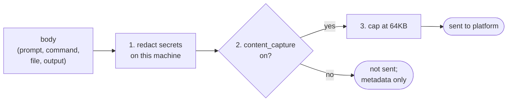

# Data and privacy

What leaves your machine, what never does, and the switches that change it.

## Summary

Content capture and usage capture are **on by default**. Each can be turned
off per tool in `~/.openbox/<tool>/dev.json`, or with an environment variable
(see [Settings](getting-started.md#settings)). An org can lock either one
through managed config.

| What | Sent? | Switch |
|---|---|---|
| Session, tool and MCP metadata: tool name and kind, file path, MCP server and tool name, timing, success or failure | always | none |
| Paths of changed files, working directory, `/clear` and resume events | always | none (never file contents) |
| Token counts and model id, per turn | by default | `finops` |
| Prompt text | by default | `content_capture` |
| Assistant reply text and thinking | by default | `content_capture` |
| Shell commands, file bodies written or read, tool and MCP output (including error text) | by default | `content_capture` |
| The prompt you give a subagent (the whole `Agent` tool input) | by default | `content_capture` |
| Notification text, task titles and descriptions, `/compact` instructions and summary, MCP elicitation prompts and your answers | by default | `content_capture` |
| Why a tool was refused; a failed turn's error detail | by default | `content_capture` |
| Model-call request and response bodies (transport lane only; see [below](#model-calls)) | by default | `content_capture` |
| Your Claude account email and organization UUID, once per session | if signed in | none (see [Account attribution](#account-attribution)) |
| A one-way fingerprint of the provider credential used for a model call | transport lane only | none |
| Git commit trailer: commit sha, tree sha, session id | always | `OPENBOX_INSTALL_GIT_HOOK=false` |
| `CommitCreated` event metadata (commit/tree/parent shas, repo, branch, patch id, session id): first producer is the `git post-commit` hook, only where the hook is installed, agent commits only | always (structural, not content) | `OPENBOX_INSTALL_GIT_HOOK=false` |
| Your credentials, HTTP headers of model calls, slash-command expansions, displayed message text | **never** | |

Structural identifiers (paths, tool names, ids) are metadata and always flow.
Bodies are content, and all of them answer to the one `content_capture` key.

**Why one switch.** A separate switch per content type would let an org
believe it had turned content off while one type kept flowing. The cost is
that you cannot, for example, keep prompts and drop tool output.

**Muse Code sends its own set.** Muse hooks carry the prompt, tool input and
tool output (with error text on a failure), and each model call's request
summary (see [Muse Code](#muse-code)); they carry no assistant reply or
thinking, and no hook carries token counts, so none of those leave through a hook.
Token counts come from Muse's separate telemetry export, which is metadata only.

**Codex sends less.** Codex hooks carry the prompt, the assistant reply and
thinking, but not tool input or output. A gated Codex call sends its tool
input (see [below](#what-an-enforced-call-sends)).

## How content is protected

Every body goes through three steps, in this order:

1. **Local secret redaction** (`secret_detection`, on by default). Anything
   that looks like a credential is replaced with `${OPENBOX_REDACTED_…}`.
2. **Attachment** to the event, only if `content_capture` is on.
3. **Size cap**: at most the first 64KB (65,536 characters; bytes for model
   calls) is sent.

Redacting before attaching is the only protection content has in transit.
There is no server-side redaction.

Redaction is keyword- and pattern-driven. A secret with no known format,
labelled with a key name the detector does not recognise, is sent as ordinary
text. The most likely place for that is a value you type into an MCP
elicitation form. Details and measured limits:
[What the scanner catches](credentials-and-secrets.md#what-the-scanner-catches-and-where-it-stops).
If that matters for your data, turn `content_capture` off.

## Turning content capture off

With `content_capture: false`, sessions still produce full metadata, lineage,
token usage, tool success or failure and lifecycle events. You lose prompt
text, replies, thinking, tool input and output, and every dashboard panel
that reads them (goal alignment and drift go empty).

It also weakens enforcement, **silently**. A policy can only match what reaches
the platform:

- Rules about **which file was touched** keep working: file path and operation
  are metadata.
- Rules about **what a command said** stop matching: the command text is
  content. That covers pipe-to-shell, credential sweeps, recursive deletes,
  destructive SQL and similar rules.

An unmatched rule fails safe, so nothing errors and nothing warns.
`openbox doctor` shows whether capture is on, but not which policies stopped
firing.

## Usage capture

Per model turn: four token counts (input, output, cache creation, cache read),
the model id, the turn index and duration, and the subagent id if one ran the
turn. No cost: the platform computes it from its own pricing table.

The counts come from the session transcript file, which is the only source.
The parser reads an allowlist of fields from it: the token counts, the model
id, timestamps, a subagent marker and the thinking blocks. A test seeds every
other field with markers and checks none of them reach the wire.

`finops: false` stops all of it: no counts, no turn events, and the transcript
is never opened. Because reply text and thinking ride the turn event, turning
`finops` off removes them too.

Claude Code and Codex report usage per turn; Muse reports it only through its telemetry export, never a hook. Codex derives each turn's counts from its
own rollout file; a Codex session that ends with no completed turn sends one
per-session total instead.

## Thinking

The model's extended thinking is sent in its own field
(`activity_output.thinking`), redacted and capped like everything else.

This goes further than the provider does: Anthropic's own telemetry export
always removes thinking. Thinking often repeats prompts, file contents and any
credential the model saw, so redaction matters most here.

`init --provider claude-code` sets `showThinkingSummaries: true` in your
Claude Code settings, because otherwise thinking arrives empty.
`openbox uninstall` restores the previous value.

## What an enforced call sends

A gated tool call is sent to the platform for a decision before it runs:

1. **Metadata, always**: tool name and kind, file path and operation, MCP
   server and tool name.
2. **Secret detection** runs locally on the whole body.
3. **Content, only if `content_capture` is on.**

On Claude Code, content is redacted by default, with two deliberate
exceptions:

| Call | What is sent |
|---|---|
| A shell tool Claude Code names (`Bash`, `BashOutput`, `KillShell`) | the `command`, **verbatim, not redacted** |
| An MCP tool | the whole `tool_input`, **verbatim, not redacted** |
| A file write (`Write`, `Edit`) | the redacted body: the same bytes written to disk |
| Everything else: subagent prompts (`Agent`, `ToolSearch`), read arguments, glob and grep patterns, unknown tools | redacted |

**Why shell and MCP are verbatim:** a policy deciding whether a command is
dangerous has to see the exact command that will run. The consequence: a
gated `curl -H "Authorization: Bearer …"` reaches the platform with the token
intact. The ordinary telemetry copy of the same call is redacted.

The shell exception is an allowlist by tool name, so a tool name Claude Code
adds later gets the redacted default.

On **Codex**, a gated call sends its tool input as-is, except a file body,
which is redacted.

Limits:

- The platform sees at most the first 64KB of a body, so content policy cannot
  match past that point. Local redaction sees the whole body.
- `secret_detection: false` sends everything unredacted.

**Prompts are gated too.** A prompt is sent for a decision when you submit it,
under the same content rules. BLOCK or HALT refuses the prompt; HALT also ends
the session.

## Model calls

The **transport** lane (Claude Code, see
[Getting started](getting-started.md#model-call-lanes-claude-code)) sees real
model-call traffic. For a call tied to a session, it sends:

- a **selection** of the request: the model id, about the first 4KB of the
  system prompt, and the newest conversation messages that fit in 48KB. Tool
  definitions and older messages are dropped. The record says how many were
  dropped;
- the model's response, from its start;
- the method, URL (without query string), status and a credential
  fingerprint. These are not gated by `content_capture`: they are the evidence
  of which account made the call;
- **never** HTTP headers.

Compressed responses (`gzip`, `br`) are decompressed first so redaction can
see them. Any other encoding is stored as a marker naming it. A call that gets
no response is still recorded, with no status. A call with no session header
is recorded nowhere. Token-count probes (`/v1/messages/count_tokens`) send
nothing.

The **telemetry** lane sends no content at all: model id, four token counts,
duration and a request id.

**claude.ai chats (macOS).** With the system proxy active, each claude.ai chat
in a browser or the desktop app becomes its own session, keyed on the
conversation. Each completion is one record with the request and reply,
redacted and gated like any other body. The session cookie never leaves the
machine. Nothing else on claude.ai is recorded.

**api.meta.ai (macOS, any provider).** `api.meta.ai` is in every provider's
host rows, Claude Code's included, so with the system proxy active your
browser's traffic to it is decrypted by the relay, skipped (no session header)
and kept raw in the local trace for 7 days.

**Codex on macOS: browser traffic on the same hosts.** With Codex installed on
macOS the system proxy also routes Codex's hosts through the relay: its API
host, `chatgpt.com` with every subdomain, and `api.meta.ai`. Codex's own model
calls are recorded from the relay once it has seen one (see
[Coverage](coverage.md#1b-model-call-coverage-matrix)). Your **browser's**
`chatgpt.com` and `api.meta.ai` traffic passes through the same relay and is
decrypted by it. It carries no Codex session header, so it is skipped and
nothing of it is sent. Once the relay is elected for Codex, telemetry stands by,
so a Codex-host call the relay cannot record is recorded nowhere; `openbox doctor`
counts those. It is still written raw to the local trace for 7 days
(see [The local trace](#the-local-trace)), the same posture as claude.ai
traffic that is not a chat completion.

## Muse Code

Muse's model calls are recorded by the **telemetry lane** only (see
[Coverage](coverage.md#1b-model-call-coverage-matrix)); no proxy lane exists,
because Muse ignores the system proxy and rejects the relay's certificate.
Two things leave the machine: what its hooks send, and what its own telemetry
export sends.

- **Muse's telemetry export is redirected.** `openbox init --provider muse`
  sets `telemetry` in `~/.config/muse/settings.json` to
  `{enabled: true, destination: "external", endpoint: <the loopback receiver>}`.
  `destination: external` **redirects Muse's own telemetry export to OpenBox's
  receiver instead of Meta's destinations**, so while it is set Meta does not
  receive that export. The previous value is recorded in
  `~/.openbox/muse-prior-settings.json` and restored by `openbox uninstall`.
- **That export is metadata only.** Muse exports no prompt, tool input, file
  body or reply. OpenBox reads one event, `model_call`, and sends the model, the
  provider, the response id (its activity id), the duration and the input,
  output and cached token counts, for a session's subagents in that session.
  Nothing in it is covered by `content_capture`, because nothing in it is
  content; the session, turn and other events Muse exports are received and
  skipped. The receiver also writes each record's attributes (ids and numbers)
  to the local trace ([The local trace](#the-local-trace)), which never leaves
  the machine. `telemetry: false` in Muse's dev config records nothing.

What the hooks send leaves the machine like this; each body is redacted before
attachment and capped like any other:

- **Prompt, tool input and tool output**, under `content_capture`. A gated
  shell command and MCP arguments go to the platform verbatim so a policy can
  judge what will run; a file write goes redacted. The same carve-outs as
  Claude Code (see [What an enforced call sends](#what-an-enforced-call-sends)).
- **Model-call gate.** Every `PreLLMCall` is evaluated before the request is
  sent. Metadata always goes: provider, model, message and tool counts and tool
  names. Under `content_capture` it also sends **message previews**: at most
  16, each cut to 256 characters, after redaction. The closing `PostLLMCall`
  is metadata only (status, finish reason, response id, an error class).
- **Stays local.** `PostLLMCall`'s usage numbers and the request's trace
  context go to the local trace only, never to the platform. Usage reaches the
  platform only through the telemetry lane above.
- **Muse's session log is read locally.** At `Stop` and `SessionEnd`, OpenBox
  reads `~/.local/share/muse/sessions/…/session.jsonl` for the join fields of
  each recorded tool action (its type, name, time, and id where present) to
  spot an action whose hook never ran. Nothing in it is copied, logged or sent.
- **The gate ledger is content-free.** It lists tool names and ids the gate
  was asked about, under the Muse spool directory's `reconcile/` folder, and
  is swept after 14 days.

## Account attribution

Once per session, `openbox` sends your Claude account **email** and
**organization UUID**, read from Claude Code's own `~/.claude.json`. Nothing
else from that file is sent (not the organization name, role, seat tier or
billing type).

The email is personal data. It is not covered by `content_capture`, because it
identifies who ran the session rather than what they did. There is no switch
for it other than not signing in. If you are not signed in, nothing is sent.

Anything running as you can edit `~/.claude.json`. For a stronger signal, use
the transport lane's credential fingerprint, which comes from the credential
actually sent on the wire.

## Local files

Configuration lives under `~/.openbox/` (move it with `OPENBOX_HOME`).
Runtime state lives in the OS config directory:
`~/Library/Application Support/openbox/` on macOS, `~/.config/openbox/` on
Linux, `%AppData%\openbox\` on Windows (move the queue with
`OPENBOX_SPOOL_DIR`). Both are readable only by you, except on Windows.

| File | Where | Holds |
|---|---|---|
| `.env`, `<tool>/.env` | `~/.openbox/` | credentials, plaintext ([details](credentials-and-secrets.md#where-credentials-live)) |
| `dev.json`, `<tool>/dev.json` | `~/.openbox/` | URLs, agent id, settings; no secrets |
| `transport-ca.pem`, `transport-ca.key` | `~/.openbox/` | the transport lane's CA and private key |
| `activation.json` | `~/.openbox/` | every setting the lanes changed, with its previous value; on macOS also the previous network proxy settings |
| `claude-code-prior-settings.json` | `~/.openbox/` | the previous `showThinkingSummaries` value |
| `telemetry.log`, `transport.log` | `~/.openbox/` | lane diagnostics; no traffic |
| `*-delivery-status.json` | `~/.openbox/` | how many lane records the platform did not accept; no content |
| `cc-spool/`, `codex-spool/`, `muse-spool/` | runtime dir | the per-session event queue, already redacted, in plaintext. Normally empty: each event is attempted once and then removed |
| `enforcements.jsonl` | runtime dir | what enforcement did: verdict, source, redaction categories. Never the secret or the body |
| `advisories.jsonl` | runtime dir | guardrail findings |
| `halted-sessions/` | runtime dir | one small file per halted run: the reason and a timestamp. It keeps that run refused |
| `pending-approvals/` | runtime dir | content-free approval markers |
| `trace/trace-YYYY-MM-DD.jsonl[.gz]` | runtime dir (move with `OPENBOX_TRACE_DIR`) | **the local trace: everything, including raw bodies before redaction and any secrets in them.** See [The local trace](#the-local-trace) |

On macOS, `init` also adds the transport CA to the System keychain and sets a
proxy auto-config URL on each enabled network service. `openbox uninstall`
reverses both.

A queued event nothing has attempted yet is deleted after 30 days, and the
count is logged in `.discarded` in the queue directory.

## The local trace

Every `openbox` process (`init`, `auth`, each hook, the lane daemons,
`doctor`, `uninstall`) appends a record of what it does to
`trace/trace-YYYY-MM-DD.jsonl` in the runtime directory: process start and
exit, each hook's raw input and output, local decisions and redactions, what
each lane captured and why it skipped or dropped a call, every delivery
attempt and core's answer, queue drops, halts, and each install and uninstall
step.

**It holds content both before and after redaction, whatever
`content_capture` says.** A secret in a prompt, a command, a file or a model
call is in this file in plaintext, next to its redacted form. It is never sent
anywhere: `content_capture` and managed config govern only what egresses. It
is protected the same way `.env` is: readable only by you (`0600`) on macOS
and Linux, unprotected on Windows, and readable by anything running as you,
including the agent being governed. Treat the directory as a credential.

API keys, bearer tokens and private keys are never written to it. A body over
512 KiB is stored as its first 512 KiB plus its length and SHA-256.

Files are per UTC day. Today's file stays plain; the lane daemons compress
earlier days to `.gz` and delete anything older than 7 days (and older days
first if the directory passes 512 MiB). `openbox trace <session>` prints one
session's timeline; `openbox trace --against-core --agent <id>` compares it
with what the platform stored and flags events it is missing, events it filed
with no session, and activities with only one half.

## Uninstall

`openbox uninstall` deletes all of the above except your organization's
managed config files and the local trace, which is the record of the
uninstall itself; `openbox uninstall --purge-trace` deletes that too. It restores every setting it changed, tries to deliver
queued events first, and reports what could not be delivered. Deletion is an
ordinary unlink, not a secure erase. Details in
[Getting started](getting-started.md#uninstall).

## How this is checked

The conformance suite checks each rule on the actual bytes sent: a gated field
is absent with capture off, and present, redacted and capped with it on. It
runs on every change. Nothing here has been checked against a live platform;
see [Provider coverage](coverage.md) for what is proven.
