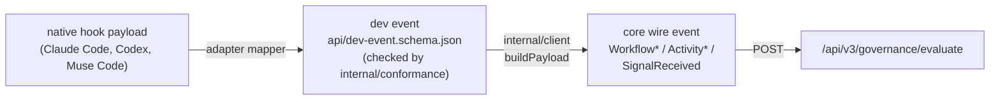

# Developer-runtime event contract

This is the reference for the normalized event every coding-tool adapter
(Claude Code, Codex, Muse Code, …) emits. It is the shape adapters map their native
hook payloads onto (SPI `emit`), before the client re-expresses it onto
openbox-core's own wire model and sends it to `/api/v3/governance/evaluate`.
Read this if you are writing a new adapter or consuming these events
downstream. See [Architecture](architecture.md) for how the adapter, client,
and core fit together.



The schema is the field list. This doc explains what the contract is for and
why it works the way it does; it does not repeat the schema's fields.

## Where things live

| What | Where |
|---|---|
| The contract itself (JSON Schema, draft 2020-12) | [`api/dev-event.schema.json`](../api/dev-event.schema.json) |
| How a dev event maps onto openbox-core's wire model | [`mapping.md`](mapping.md) |
| How each provider's native hooks map onto the lifecycle event types | [`coverage.md`](coverage.md) |
| The Go harness that validates events against the schema | [`internal/conformance/`](../internal/conformance/) |

## Lifecycle events

`event_type` (see the schema's `event_type` enum) is adapter-facing: an
adapter emits one of these types, and the client re-maps it onto a small set
of wire types that openbox-core already understands. No core change is
needed to add a lifecycle type.

| Event type(s) | Fires when | Wire shape |
|---|---|---|
| `SessionStarted` / `SessionEnded` | a session opens / closes | one `WorkflowStarted` and one `WorkflowCompleted`, paired |
| `ToolCall` / `ToolResult` | before / after a tool runs | one `ActivityStarted` and one `ActivityCompleted`, paired by `activity_id` |
| `TurnStarted` / `TurnCompleted` | before / after a model turn | same pairing, with `activity_type: llm_completion` |
| `ModelCallRequested` / `ModelCallFinished` | before a model call is sent / after it finishes (1.10) | same pairing, with `activity_type: model_call_gate` — see [Model-call gate](#model-call-gate-110-request-body-added-in-111) |
| `PromptSubmitted`, `CommitCreated`, `Deploy`, `SubagentStarted`, `PermissionDenied`, `APIError`, and every other lifecycle signal (config changes, notifications, compaction, model switches, elicitations, …) | a one-off lifecycle moment | a single `SignalReceived` row — unpaired |

Every activity that ran gets exactly its two rows; a `SignalReceived` never
pairs with anything else. A tool blocked before it ran (for example a
`PreToolUse` hook that errored) produces only the started half.

One native Claude Code hook, `WorktreeCreate`, is deliberately not in the
enum: its own stdout is the created worktree path, so instrumenting it would
break `claude --worktree`.

No event carries a `spans[]` array. Captured request/response bodies for a
tool call or model turn ride `activity_input` / `activity_output` instead.
The schema's `span` object still exists for adapters to fill in locators,
counts, and (for a model call) bodies — the client reads it into
`activity_input`/`activity_output` rather than serializing it as a wire span.
An adapter author populates `span`; nothing downstream expects a literal span
on the wire.

## Model-call gate (1.10; request body added in 1.11)

Contract 1.10 adds a pre-send gate on a model call: a provider hook that fires
before the call leaves, is evaluated through policy like a tool call, and is
paired with the hook that reports the call finished. Two new `event_type`
values carry it, `ModelCallRequested` (wire `ActivityStarted`) and
`ModelCallFinished` (wire `ActivityCompleted`), and `activity_type` gains
`model_call_gate`.

A gate is not a model-call record, and the contract keeps the two apart:

- `model_call_request_id` is required on both halves: the provider's request
  id, a `.`, and the attempt number, bounded like the producer request ids
  (1 to 128 printable ASCII characters). The `activity_id` is
  `<session>:llmgate:<model_call_request_id>`, disjoint from tool ids,
  `<session>:turn:<n>` and the `:proxy:`, `:otel:`, `:gateway:` and
  `:usage:rollup` shapes.
- `activity_type` is `model_call_gate` on both halves, never `llm_completion`.
- Neither half carries usage (`tokens`, `cost`), a `turn_index`, a producer
  request id or `session_rollup`. `ModelCallFinished` carries no `span`;
  `ModelCallRequested` may carry one only to hand the client the pending
  request (`span.request_body`, below). The client reads that one field and
  drops every other span field, so no `spans[]` reaches the wire.
- `ModelCallRequested`'s `activity_input` carries `model`, `provider`,
  `message_count`, `tool_count`, `tool_names` and, under content capture only,
  `content`: the redacted request, `{"messages":[...],"tools":[...]}`, cut from
  the head to at most 65536 bytes (the newest turn is at the end), with the
  cut named in `truncated_paths`. Capture off, the key is absent.
  `message_previews` (1.10) is retired: no producer sets it and the client
  drops it.
- `ModelCallFinished`'s `activity_output` is metadata only: `status`,
  `finish_reason`, `response_id`, `error_class`, `tool_call_count`, `model`,
  `provider`. Never the reply, thinking or a body.
- A pre-send deny, or a call that never reports finished, leaves the started
  row only. A completion is never fabricated.

An adapter sets these through `DevEvent`: `ModelCallRequestID`, `Model`,
`Status` (on `ModelCallFinished`) and the `Metadata` keys above.

Version history entry, 1.10. Precondition: core must evaluate an
`ActivityStarted` with `activity_type` `model_call_gate` through policy, must
not count it as `llm_completion` or as a turn, and must not route it onto the
approval-bypass path. Checked against openbox-core source on 2026-09-30: usage
extraction and observability key on the literal `llm_completion`, and the
approval-bypass path needs `hook_trigger` together with `spans`, which this
client never sets; policy evaluation (`PolicyEvaluationActivity`) runs on
every event regardless of `activity_type`, which core passes through
unvalidated. That core has to be deployed before a client speaking 1.10
reaches a developer. Restamped, a 1.9 event still validates: 1.10 adds and
removes nothing.

Version history entry, 1.11. `activity_input.content` on the started half is
what lets policy, Guardrails and the judge see the request being sent; core
must pass it through unchanged and accept `schema_version` `1.11`, which the
client stamps on every event. A 1.10 event restamped 1.11 still validates:
1.11 adds `content` and retires `message_previews`, nothing else.

## Invariants

| INV | Statement |
|---|---|
| **INV-1** | A credential value never egresses and never appears in a local decision request, a log line, or an argv. Only a file path or a one-way fingerprint is ever shown or sent. |
| **INV-2** | Content is gated behind one switch, `content_capture`. With it off, no content-bearing field reaches the wire — this includes content-bearing keys inside `metadata` and `signal_args`. Only structural identifiers (paths, tool names, ids) always flow. Local secret detection is keyword-driven: an unlabelled high-entropy value below its floor is invisible to it. |
| **INV-3** | Every gated call is enforced: the verdict from `/evaluate` is acted on, tighten-only. It can add a deny, block, or halt, but it never turns a provider's own deny into an allow. There is no observe-only mode for a gated call. |

`internal/conformance` enforces INV-2 directly: a sample carrying a
content-gated field with capture disabled fails validation. `metadata` and
`signal_args` are filtered by the same function, so they cannot disagree
about which keys are content.

## Privacy

Content capture is on by default. An org opts out with `content_capture:false`
or `OPENBOX_CONTENT_CAPTURE=0`.

- Raw content — prompts, tool input/output, assistant replies, thinking —
  lives only under fields the schema marks `x-content-gated`. With capture
  off, all of it is stripped before egress, including the same keys
  projected into `metadata` and `signal_args`.
- Content is capped before it leaves the machine (`capBody`).
- Local secret detection redacts a body before it is attached, when
  `secret_detection` is on. It runs over every content class an adapter
  attaches; coverage is the adapter's own property, not a contract guarantee
  — see [`coverage.md`](coverage.md) for what each adapter's mapper redacts,
  and [data-and-privacy.md](data-and-privacy.md#what-an-enforced-call-sends)
  for what an enforced call sends verbatim regardless.
- `internal/conformance` rejects any sample carrying content while capture is
  disabled.

## Verdict vocabulary

Canonical priority: `HALT > BLOCK > REQUIRE_APPROVAL > CONSTRAIN > ALLOW`
(see `$defs.verdict` in the schema). Openbox-core serializes it lowercase
(`halt|block|require_approval|constrain|allow`) plus a legacy `action` field;
see [mapping.md](mapping.md) §4. Enforcement is on by default and
tighten-only (INV-3); see [coverage.md](coverage.md) §4 for the enforcement
posture per provider.

A handful of deprecated posture keys (`enforce`, `fail_closed`, and an older
timeout/verification pair) are still parsed, only so `openbox doctor` can warn
when one is set. None of them changes behavior: every gated call is
evaluated, and any event the client can't get delivered denies that call,
without latching the run -- only a real HALT verdict does that.

## Validate

```bash
go build ./internal/conformance/... && go vet ./internal/conformance/... && go test -count=1 ./internal/conformance/...
```

The harness is offline and dependency-free, so this runs anywhere with a Go
toolchain and no network access.

## Consuming the contract

- **Adapter authors:** map your tool's native payloads onto this schema in
  `emit`. See [coverage.md](coverage.md) for the per-provider hook mapping.
- **The client:** builds the wire payload per [mapping.md](mapping.md), and
  calls `internal/conformance` to validate an outbound event before signing
  and sending it.
- **Downstream consumers:** dev events map onto openbox-core's existing
  `WorkflowStarted` / `WorkflowCompleted` / `SignalReceived` /
  `ActivityStarted` / `ActivityCompleted` wire types. No core-side patch is
  needed to accept a new lifecycle type.
