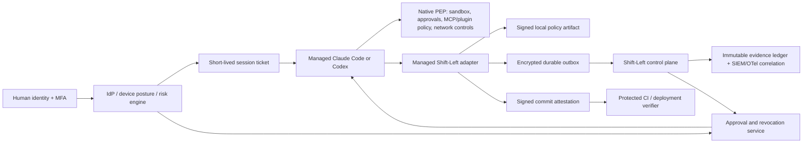

# Enterprise Agentic CLI Governance Assessment for OpenBox Shift-Left

Research date: 28 July 2026  
Audience: Enterprise engineering, security, platform, identity, and developer-experience leaders  
Scope: Agentic CLI governance, thread identity and protection, Claude Code, Codex, and the current OpenBox Shift-Left repository

> Decision: proceed with Shift-Left as the foundation of an enterprise governance and evidence layer, but do not position its current implementation as a standalone enforcement boundary for regulated development. Its architecture is promising; managed deployment, policy integrity, identity binding, durable evidence, and verified provenance must precede an enterprise-wide `--enforce` rollout.

## Executive summary

Shift-Left has the right central idea: move governance from a late deployment gate to the developer-agent action that creates risk, while retaining one lineage from `developer session → commit → deploy → runtime agent`. The repository already has useful building blocks: a provider-neutral event contract, signed requests, local low-latency decisions, a privacy-aware structural-event model, provider adapters, session spooling, and an explicit distinction between an inferred commit claim and a verified relationship.

That is a better enterprise philosophy than treating each coding assistant as a separate, opaque tool. It can give security teams a common policy vocabulary and give developers one understandable control model across Claude Code and Codex.

The current gap is where the trust boundary sits. Much of the effective configuration, policy bundle, hook installation, session registry, and event delivery is user-local and mutable. A local hook is valuable for convenience and early prevention, but it is not sufficient by itself to prove enforcement, preserve forensic evidence, control network egress, or establish that a particular agent session produced a particular commit. Current provider capabilities make it possible to close those gaps, provided Shift-Left uses the providers' managed controls as policy-enforcement points rather than trying to replace them.

The recommended product position is therefore:

1. Shift-Left is the cross-provider policy, identity-context, evidence, and provenance plane.
2. Claude Code and Codex remain the local policy-enforcement points for sandboxing, approvals, hooks, MCP, plugin, and managed-setting restrictions.
3. The enterprise identity, endpoint-management, network, CI, and SIEM platforms provide the independent control and evidence planes.
4. A session is an attestable tree of threads and subagents, not a single opaque string or a transcript.

## Assessment at a glance

| Area | Current assessment | Enterprise implication | Recommendation |
| --- | --- | --- | --- |
| Product philosophy and lineage | Strong | A differentiated, coherent governance story | Keep the `session → commit → deploy` model and make assurance explicit. |
| Provider abstraction | Strong but incomplete | Good portability, but native controls are not fully represented | Version the capability model and ingest native identifiers and telemetry. |
| Session/thread identity | High risk | Forks and subagents can be misattributed or collapsed | Introduce a canonical session-tree identity model immediately. |
| Managed installation and anti-bypass | High risk | A developer can alter local configuration, bundles, or hooks | Deliver managed Claude and Codex deployment paths before enforced rollout. |
| Policy integrity and freshness | High risk | A local policy can be removed, rolled back, or fail open | Sign, expire, pin, and attest policy bundles; use short-lived policy-read credentials. |
| Tool enforcement | Medium | Local pre-tool decisions are useful, but not complete | Combine provider-native controls, local fast decisions, and central approval for high-risk actions. |
| Egress and secret protection | High risk | Telemetry routing is not command/MCP/model egress control | Add endpoint/network controls; do not claim a proxy until one exists. |
| Audit reliability and non-repudiation | Medium | Best-effort spooling cannot establish complete evidence | Add receipts, idempotency, ordered hash chains, and integrity status. |
| Commit/deploy provenance | High risk | A Git trailer is a claim, not proof | Gate protected deployments only on cryptographically verified provenance. |
| Developer experience | Promising | Heavy controls can cause shadow tooling if opaque | Make policy visible, fast, explainable, and task-scoped. |

Severity language used below:

- P0 — required before claiming enterprise enforcement or using the result as a production-release control.
- P1 — required before using Shift-Left for regulated repositories or broad rollout.
- P2 — important maturity and developer-experience improvement.

## What enterprise agentic-CLI governance must cover

“Governing an agentic CLI” is not merely recording prompts or blocking shell commands. It has five connected responsibilities:

1. Identity: determine which human, managed device, developer-agent identity, provider session, thread, subagent, and workload acted.
2. Decision: apply centrally authored, locally fast, data-aware policy to a proposed action.
3. Enforcement: ensure the relevant client, sandbox, MCP server, network boundary, CI system, or deployment system actually honors the decision.
4. Evidence: retain tamper-evident, privacy-minimized evidence of what was allowed, denied, approved, and delivered.
5. Recovery: revoke sessions, credentials, approvals, or network paths when identity risk, a compromised endpoint, or a policy change requires it.

This distinction matters. Hooks can observe and sometimes intercept a tool call, but they do not by themselves constrain all hosted tools, shell subprocesses, plugins, MCP traffic, copied secrets, or offline work. A secure enterprise design uses defense in depth rather than representing every decision as a hook result.

### Threat model

The design should explicitly address these realistic scenarios:

| Threat | Example | Required control |
| --- | --- | --- |
| Prompt injection and untrusted content | A repository instruction, issue, web page, or package tells the agent to exfiltrate a secret | Treat external content as untrusted; sandbox, constrain tools and egress, and require review for sensitive actions. |
| Shadow configuration or bypass | A user disables a hook, edits a local policy, adds an MCP server, or uses an unsafe flag | MDM/system-managed provider settings, signed Shift-Left bundles, posture evidence, and server-side assurance levels. |
| Identity/session hijack | A stolen endpoint token or browser session drives a coding agent | Short-lived user-and-device-bound session credentials, risk signals, revocation, and step-up approval. |
| Secret or source-code egress | An agent uploads a `.env`, private source, or generated archive | Data classification, local redaction, sandbox/network allowlists, proxy/DLP, and purpose-scoped credentials. |
| MCP/plugin supply-chain abuse | A tool definition or plugin causes harmful commands or data access | Managed allowlists, provenance, version pinning, minimal credentials, and per-tool scopes. |
| False lineage | A developer stamps a session ID on an unrelated commit | Signed post-commit provenance verified by CI; label unsigned claims as inferred. |
| Missing or reordered evidence | Endpoint loses connectivity or a local process changes its event spool | Durable ordered outbox, server receipt, idempotency, tamper evidence, and an explicit completeness state. |

## Capability research: Claude Code and Codex

### Claude Code

Claude Code is a strong enforcement partner for Shift-Left, rather than only a telemetry source.

| Native capability | Enterprise value | How Shift-Left should use it |
| --- | --- | --- |
| Hooks include a session context; `PreToolUse` includes `tool_use_id`; subagent activity includes `agent_id` and `agent_type` | Enables one-to-one tool correlation and a thread/subagent tree instead of heuristic pairing | Capture these as first-class fields and retain provider source IDs for evidence correlation. [Claude Code hooks](https://code.claude.com/docs/en/hooks) |
| Native OpenTelemetry provides metrics, logs, and optional traces; the documented data includes session/identity context and usage/cost signals | Gives an independently exportable enterprise observability stream | Use OTel as the primary audit/SIEM feed; retain the Shift-Left hook stream for enforcement decisions and local evidence. Preserve provider privacy defaults unless an approved capture profile applies. [Claude Code monitoring](https://code.claude.com/docs/en/monitoring-usage) |
| Managed permission, hook, MCP, plugin, and sideload controls | Restricts user overrides and unapproved extensions | Install Shift-Left through managed settings, allow only managed hooks/MCP where required, and lock unsafe sideload paths. [Claude Code permissions](https://code.claude.com/docs/en/permissions) and [enterprise setup](https://code.claude.com/docs/en/admin-setup) |
| OS-level Bash sandbox with network/filesystem controls | Enforces a boundary below a model instruction | Require a sandbox where supported, configure no unsandboxed fallback for regulated profiles, and treat sandbox availability as policy evidence. [Claude Code sandboxing](https://code.claude.com/docs/en/sandboxing) |
| Session transcripts and persistent sessions | Useful for investigation and recovery | Store only approved, redacted evidence outside the endpoint; never make raw transcript capture the default enterprise record. [Claude Code sessions](https://code.claude.com/docs/en/sessions) |

Key limitation: sandboxing and permission rules must cover more than a Bash call. Shift-Left should never treat a single hook result as proof that every data path was controlled.

### Codex

Codex offers comparable native controls, but its identity model has an especially important distinction: a current live session-tree root is separate from a thread. Root threads use their own ID as the session ID, while forked threads retain the root session ID. Treating a Codex session as identical to a thread will misrepresent a forked workflow. [Codex App Server](https://learn.chatgpt.com/docs/app-server)

| Native capability | Enterprise value | How Shift-Left should use it |
| --- | --- | --- |
| Lifecycle hooks, including tool, permission, session, and subagent events | Interception and evidence across the local function-tool lifecycle | Capture native tool/event correlation IDs, permission requests, turn IDs, thread IDs, and subagent relationships. Account for hosted tools that do not take the local function-hook path. [Codex hooks](https://learn.chatgpt.com/docs/hooks) |
| System/MDM/cloud-managed `requirements.toml` and managed-only hooks | Stronger protection against local hook/configuration bypass | Deploy the adapter as a managed hook, set managed-only behavior for regulated profiles, and pin required security features. [Codex managed configuration](https://learn.chatgpt.com/docs/enterprise/managed-configuration) |
| Approval policies, OS sandboxing, and managed network constraints | Separates a convenient CLI workflow from an enterprise execution boundary | Require safe approval/sandbox profiles, constrain network access with managed allowlists, and surface the effective profile in Shift-Left. [Codex approvals, sandboxing, and security](https://learn.chatgpt.com/docs/agent-approvals-security) |
| Compliance API and audit records | Independent organizational evidence for governance and investigations | Correlate exported provider records with the Shift-Left session tree and preserve provider event IDs. [Codex Compliance API](https://learn.chatgpt.com/docs/enterprise/compliance-api) |
| Worktrees, app-server threads, non-interactive runs, and cloud/local environments | Useful for parallel coding agents and CI automation | Model execution context explicitly: local/remote, worktree, branch, workload identity, root session, and child thread. |

Key limitation: managed hooks are valuable but are not a complete policy-enforcement point for every hosted or remote capability. The provider's sandbox, managed configuration, network controls, cloud isolation, and server-side audit feed remain necessary.

### Lessons from the supplied references

| Reference | What to borrow | What not to copy blindly |
| --- | --- | --- |
| [Okta Identity Threat Protection](https://www.okta.com/products/identity-threat-protection/) | Continuous identity risk, shared signals, session revocation, and automated containment are the correct pattern for a compromised coding-agent session. | Do not hard-wire a product dependency. Use standards-based OIDC, SCIM, device posture, and a pluggable risk-event interface. |
| [Okta’s AI-agent governance guidance](https://www.okta.com/identity-101/ai-agent-governance/) | Give every agent an owner, scoped non-human identity, short-lived access, execution limits, and auditable actions. | A developer agent must remain linked to the human and device that initiated it; an agent DID alone is not enough. |
| [Netra](https://getnetra.ai/) and its [FAQ](https://docs.getnetra.ai/FAQs/FAQs) | The observe → evaluate → simulate → improve loop is useful for policy regression testing, trace analysis, and cost/quality operations. | Observability/evaluation does not replace a prevention, identity, or egress-control boundary. Validate retention, residency, and data-processing terms before export. |
| [Entire](https://entire.io/) and its [security documentation](https://docs.entire.io/security) | Checkpoints and session-to-Git context handoff can make AI work reviewable and resumable. | Entire explicitly warns that repository-accessible transcript/checkpoint data and raw working snapshots can contain sensitive data. Shift-Left should store redacted summaries and signed attestations, not raw transcripts in Git by default. |

## Comparison with Shift-Left’s philosophy and implementation

Shift-Left’s stated philosophy is well aligned with enterprise needs: reuse the existing agent/session/event/evaluation plane; normalize provider events; degrade gracefully between observe, advisory, and enforce modes; and bind work to Git and deployment lineage. This is the correct product center of gravity.

The implementation currently behaves more like a capable endpoint integration prototype than a fully managed enterprise control plane. The table below separates the product intent from the trust it can presently support.

| Dimension | Claude Code | Codex | Shift-Left today | Recommended enterprise position |
| --- | --- | --- | --- | --- |
| Common governance model | Provider-specific | Provider-specific | Strong normalized developer-agent event model | Keep Shift-Left as the cross-provider abstraction and policy/evidence plane. |
| Session hierarchy | Session plus subagent IDs | Root session tree plus individual threads/forks | Codex mapping conflates session and thread; Claude adapter drops available correlation/subagent fields | Preserve provider hierarchy and mint a canonical OpenBox session root. |
| Managed enforcement | Managed settings and permission/sandbox controls | `requirements.toml`, MDM/cloud controls, managed hooks | User-level adapter install/config is the primary path | Make managed deployment the enterprise path; local install remains an unmanaged tier. |
| Event observability | OTel plus hooks | Hooks plus compliance/audit surfaces | Local spool and signed event requests | Correlate all three streams and report evidence completeness. |
| Network/egress control | Sandbox/managed network controls | Sandbox/managed network controls | No in-repository proxy/allowlist implementation identified | Use provider restrictions plus enterprise network/DLP controls. |
| Git lineage | No native proof of commit authorship | Thread context can help but is not proof | Trailer and optional ownership check are explicitly best effort | Build a signed, CI-verified commit/deploy attestation. |
| Data minimization | Configurable provider telemetry privacy | Managed enterprise controls and audit exports | Structural fields are good; content capture defaults on | Make metadata-only the default; use approved capture profiles. |

## Source-level findings and required changes

The following findings are based on the reviewed repository at the research date. Paths are provided so implementation owners can locate the relevant design quickly.

| ID | Priority | Evidence | Risk | Required change |
| --- | --- | --- | --- | --- |
| SL-01 | P0 | `adapters/common/devconfig/devconfig.go` stores enforcement, fail-closed, capture, and related behavior in user configuration; `adapters/codex/installer.go` installs user-level hooks | A user or local malware can alter the effective enforcement configuration. An enterprise cannot infer “enforced” from the intent to install. | Add a managed configuration layer with precedence over user settings, signed effective-config attestation, device-management deployment, and a server-visible posture state. |
| SL-02 | P0 | `decision/bundle.go` loads a local JSON policy bundle without a visible signature/issuer/rollback guarantee; `cli/cmd/openbox/main.go` documents raw Rego as unlocalized/fail-open | A local user can modify, replace, roll back, or bypass the rule that was supposed to block an action. | Deliver signed bundles with issuer, key ID, version, expiry, monotonic epoch, revocation, and hash. Compile the same policy to a deterministic local artifact; deny high-risk actions if local policy is unsupported, invalid, expired, or unverified. |
| SL-03 | P0 | `cli/internal/devinit` registers and stores a developer agent key; `openbox dev sync` and staleness checks depend on `OPENBOX_CONTROL_TOKEN` | The visible model is a long-lived endpoint agent credential plus an environment token, not a short-lived human/device-bound session. Missing token/config can silently skip freshness checking. | Exchange enterprise OIDC/device posture for a short-lived session ticket scoped to policy read, event ingest, and approval checks. Bind every session to human subject, device, organization, agent key ID, and risk state. |
| SL-04 | P0 | The README provider table refers to egress-proxy/base-URL capability; review found telemetry base-URL routing but no proxy/command/MCP egress allowlist implementation | A telemetry endpoint does not control `curl`, package managers, shell commands, model traffic, or MCP traffic. The claim could create a dangerous false sense of protection. | Correct the product claim now. Implement a reference network architecture using provider sandbox/network controls, managed proxy/firewall allowlists, private-address protections, and DLP; make its posture visible to Shift-Left. |
| SL-05 | P0 | `adapters/common/git` stamps `OpenBox-Session`; `docs/lineage-architecture.md` correctly calls it unverified; `actions/openbox-git-action` defaults to no verification and uses ownership rather than proof of commit production | A user can stamp an owned but unrelated session ID. Current lineage is useful discovery evidence, not release-grade provenance. | Keep the trailer as `inferred`. Add signed post-commit attestation over repo identity, commit/tree/parents, session root/thread, policy hash, and evidence root; have protected CI/deploy verify it with workload identity. |
| SL-06 | P1 | `adapters/codex/hookevent.go` and `mapper.go` equate Codex session with thread; Claude hook event shape lacks native `tool_use_id`, `agent_id`, and `agent_type` | Parallel forks, nested agents, and tool calls can be collapsed or paired heuristically, weakening investigations and provenance. | Add canonical root-session, provider-session, thread, parent-thread, subagent, turn, prompt, and tool-call fields to the event schema and adapters. |
| SL-07 | P1 | `contracts/dev-event/schema/dev-event.schema.json` has only broad lifecycle fields; `COVERAGE.md`, adapter capability files, and current provider documentation disagree on event/token coverage | Policy and assurance decisions may be based on stale or unavailable signals. | Establish a versioned provider capability registry, compatibility tests against supported CLI versions, and explicit coverage labels per event/tool type. |
| SL-08 | P1 | The client signs requests but treats some transport failures as best effort; adapter documentation describes at-most-once spooling and incomplete server idempotency | A session record can be missing, duplicated, or ambiguously delivered without an operator knowing whether its evidence is complete. | Add encrypted durable outbox, monotonic per-session sequence, predecessor hash, server receipt, replay-safe idempotency, retry/resume, and `complete/degraded/unverified` evidence status. |
| SL-09 | P1 | Quickstart and `devconfig` resolve content capture as enabled by default | Prompt content can contain source, secrets, customer data, or regulated data; broad default capture increases privacy and residency risk. | Make metadata-only capture the enterprise default. Add locally enforced secret redaction, data-classification profiles, field-level capture allowlists, retention, legal hold, regional routing, and user-visible capture state. |
| SL-10 | P2 | `adapters/codex/enforce.go` maps a required approval to deny; adapter docs contain stale phase/capability assumptions | Security controls that only deny create avoidable developer friction; stale documentation causes unsafe rollout assumptions. | Build an approval broker/native permission bridge with clear reason and resume flow; publish tested version support and update docs as providers evolve. |
| SL-11 | P2 | `adapters/common/git` zero-value resolver reads `CODEX_THREAD_ID`; the current test run inherited a live value and caused Git/CLI integration tests to fail | This is a test-isolation defect, not proof of a production failure, but it shows ambient agent context can contaminate validation. | Inject environment access in all tests; clear `CODEX_THREAD_ID` in test harnesses; add fork/thread collision tests and verify no real-user state is consulted. |

## Target architecture: a governed session tree

The important design rule is that the adapter augments—but does not impersonate—the provider enforcement point. The effective decision for a high-risk action is the intersection of:

`enterprise identity posture ∩ provider managed policy ∩ local signed policy ∩ central approval (when required) ∩ network/data controls`

### Canonical identity envelope

Create an additive event-schema revision. Do not put these durable identifiers only in an untyped `metadata` map.

| Field | Purpose |
| --- | --- |
| `openbox_session_id` | Canonical, OpenBox-minted root session identifier; never assume a provider ID is globally unique. |
| `provider`, `provider_tenant_id`, `provider_session_id` | Namespaced source identity and provider continuity reference. |
| `thread_id`, `parent_thread_id`, `root_thread_id` | Represents forks and thread hierarchy. For Codex, retain the provider root session separately from each thread. |
| `subagent_id`, `parent_subagent_id`, `agent_type` | Represents Claude subagents and future provider-specific child agents. |
| `turn_id`, `prompt_id`, `tool_call_id`, `source_event_id` | Stable correlation of prompt, tool invocation, result, approval, and native hook/OTel/audit records. |
| `human_subject`, `organization_id`, `device_id`, `device_posture_id`, `developer_agent_did`, `key_id` | Makes the actor accountable without confusing a human with a non-human credential. |
| `repo_id`, `remote_canonical_url`, `worktree_id`, `git_head`, `branch`, `execution_location` | Binds action context to the actual repository and local/cloud/CI execution environment. |
| `policy_bundle_hash`, `policy_epoch`, `effective_provider_profile`, `sandbox_state`, `network_profile` | Records what policy actually applied, not just what was desired. |
| `event_sequence`, `previous_event_hash`, `server_receipt_id`, `evidence_state` | Supports ordering, tamper evidence, delivery recovery, and honest completeness reporting. |

For Codex, use the provider's session-tree root as a continuity field and the thread ID as the execution branch. For Claude Code, use the provider session ID plus native subagent identity and tool-use ID. Generate the OpenBox root session at start and maintain a mapping, rather than overloading one provider field with multiple meanings.

### Session-protection lifecycle

1. The developer signs in through the enterprise IdP. Device posture, group, repository sensitivity, and current risk are evaluated.
2. The endpoint receives a short-lived ticket tied to the human subject, device, managed provider configuration, and Shift-Left agent key. It is not a broad organization control token.
3. The managed provider starts a session. Shift-Left creates the canonical root, records the effective policy/sandbox/network profile, and receives a session challenge.
4. Each high-risk tool action carries its provider correlation ID, sequence, policy decision, and challenge-derived evidence. A local signed policy handles the fast path; a central approval is used where the business decision cannot safely be embedded locally.
5. A risk event—impossible travel, device noncompliance, suspected session theft, termination, or policy revocation—invalidates the ticket, revokes pending approvals, blocks new sensitive actions, and creates a containment event. This follows the adaptive identity pattern described by Okta’s identity-threat protection material.
6. On end, Shift-Left seals the ordered session-tree evidence and emits an integrity/completeness state. A missing receipt means “incomplete,” not “clean.”
7. A post-commit attestation and a CI/deploy verifier bind the sealed session evidence to the immutable Git commit and deployment artifact.

## Controls that should be applied to Shift-Left

### 1. Make managed provider configuration the enforcement baseline

For a regulated profile, package the Shift-Left hook/integration in the provider’s managed configuration—not in a user-owned configuration directory alone.

For Claude Code, require managed permission settings, managed hooks, managed MCP restrictions, plugin/marketplace controls, remote-setting refresh, safe sandbox configuration, and a supported version floor. Disable sideload and unmanaged extension paths when the profile requires it. Use its documented OTel export for independent SIEM evidence.

For Codex, distribute `requirements.toml` through system/MDM/cloud management. Enable required managed hooks and, where appropriate, `allow_managed_hooks_only`; constrain approval/sandbox policy, MCP identities, plugins, and experimental networking through the managed plane. Do not rely on a user trusting a hook hash or on a user-level hook file for enterprise assurance.

The control plane should report an assurance level rather than a binary “installed” flag:

| Assurance level | Meaning | Permitted use |
| --- | --- | --- |
| T0 — Unmanaged | Local integration not independently verified | Personal use or observe-only telemetry; no compliance claim. |
| T1 — Observed | Event feed exists but configuration/evidence is not fully managed | Team insight and policy discovery only. |
| T2 — Managed | Provider/adapter configuration and identity are centrally managed | Low-to-medium-risk repositories with advisory/guarded actions. |
| T3 — Enforced | Signed fresh policy, managed PEP, sandbox/network posture, receipts, and high-risk approvals are active | Enterprise development control for approved repository classes. |
| T4 — Attested | T3 plus verified commit, CI, and deploy provenance | Requirement for protected branches and sensitive deployments. |

### 2. Establish policy integrity, equivalence, and safe failure modes

Local decisions are essential for a responsive CLI. They must still be authoritative in a verifiable way.

- Publish policy as a signed, versioned, expiring artifact with issuer/key ID, monotonic policy epoch, hash, and revocation information.
- Use a deterministic local evaluation artifact (for example, a compiled policy bundle) that is semantically tested against the server evaluation for every supported rule class.
- Do not allow raw or unsupported policy forms to silently become allow/fail-open in an enforced profile.
- Split actions into risk classes. A telemetry upload may fail open with a visible degraded state; secret read, credential use, production cloud mutation, external upload, and untrusted MCP invocation should fail closed or require an explicit break-glass approval when policy freshness cannot be established.
- Make each decision explainable: matched rule, data classification, required approver, expiration, and the minimal safe alternative.

### 3. Use risk-adaptive identity rather than a durable endpoint token

Adopt the principles behind identity-threat protection without coupling the architecture to a single vendor:

- SSO/SCIM establishes user and lifecycle state; endpoint management establishes device posture.
- A just-in-time developer-agent identity is scoped to the human, device, repository class, session, and allowed operations.
- Credentials are short lived, audience restricted, and rotated. The endpoint key signs local evidence but cannot independently acquire broad control-plane authority forever.
- A risk-event interface accepts identity, device, insider-risk, credential, and incident signals; it can revoke or downgrade a session instantly.
- Privileged actions use step-up authentication or a time-bounded approval, not a permanent exception in a local allowlist.

### 4. Treat egress as a separate, enforceable plane

Shift-Left should remove or qualify any current “egress proxy” claim until the product actually enforces egress. The target design needs all of the following:

- Provider sandbox/network restrictions configured through managed Claude Code or Codex controls.
- An enterprise HTTPS proxy/firewall with explicit destination allowlists, private-network/metadata-address denial, DNS-rebinding protections, and authenticated logs.
- Separate allowlists for package registries, Git hosts, approved MCP services, model endpoints, telemetry, and documentation/search services.
- DLP inspection and upload controls for sensitive data where lawful and proportionate.
- Ephemeral, purpose-scoped cloud credentials; no developer workstation secret should authorize broad production changes.
- A visible egress profile in every evidence record so an investigator can tell whether the session was actually constrained.

### 5. Govern MCP, plugins, skills, and prompts as supply chain

MCP and plugin configuration is executable capability, not user preference. Maintain an enterprise registry containing owner, version, publisher provenance, permissions, network destinations, data classification, lifecycle state, and approved repository classes. Require allowlists in native provider configuration. Pin and review package hashes where feasible; revoke compromised tools centrally.

Treat repository instructions, web search output, issue text, PR comments, generated code, and tool responses as untrusted input. The agent may read them, but policy should prevent them from silently changing the agent’s identity, policy, credential scope, or egress permissions.

### 6. Build privacy into evidence collection

Use three capture profiles:

| Profile | Default data | Intended use |
| --- | --- | --- |
| Metadata-only | IDs, tool category, paths classified as structural where approved, decision, duration, policy, receipt | Default enterprise telemetry and operations. |
| Redacted investigation | Metadata plus locally redacted prompt/tool snippets under incident authority | Time-bound investigation with access control and legal basis. |
| Controlled full evidence | Explicitly approved transcript/artifact capture in a regional, encrypted evidence store | High-risk investigations or regulated workflows; never Git by default. |

Secret detection and redaction should occur before event export, but the organization should be honest that redaction is a risk-reduction control rather than a guarantee. Include retention, regional residency, encryption-key ownership, access review, legal hold, and deletion workflows in the product requirements.

### 7. Turn lineage into verified provenance

Keep today’s trailer because it is a useful UX affordance, but label it `inferred`. Do not use it to authorize a protected deployment.

For T4, have the local adapter create a signed post-commit attestation containing at least:

- canonical root session and contributing thread/subagent IDs;
- repository canonical identity, commit SHA, tree SHA, parent SHAs, and worktree context;
- human subject, managed device, developer-agent key ID, and provider/version;
- policy bundle hash/epoch, effective sandbox/network profile, and session evidence root;
- timestamp, signature, server receipt, and whether the record is complete or degraded.

The CI system should exchange its Git-host workload identity for a narrow verification credential, validate the attestation and its binding to the pushed commit, and emit a verified `deploy_session_link`. Protected branches and production deployment rules should require `verified`, never merely `inferred` or “session owner exists.”

## Developer experience: make the secure path the fast path

Security that constantly surprises developers will move work to unmanaged accounts, terminals, or tools. The experience should be designed around clear, proportional control.

| Developer moment | Better Shift-Left experience | Security benefit |
| --- | --- | --- |
| Starting work | A one-line status shows identity, repository sensitivity, assurance tier, policy freshness, sandbox, network, and capture profile | Developers know whether the environment is trustworthy before they start. |
| Planning a task | `openbox preflight` simulates proposed commands/MCP/egress against policy without executing them | Fewer interrupted flows and fewer trial-and-error denials. |
| Normal coding | Low-risk local actions are decided locally in milliseconds; no central round trip for ordinary edits/tests | Strong controls do not make basic work feel slow. |
| A blocked action | Explain the rule, risk, data class, safe alternative, and whether an approval route exists | Converts a cryptic deny into an actionable decision. |
| Approval | Native provider prompt plus a Shift-Left approval card with bounded scope, expiry, reviewer, and resume token | Avoids permanent allowlists and blanket “deny” behavior. |
| Policy rollout | Run policies first in observe/simulate mode; show false positives and projected impact by repository/team | Lets platform teams tune controls without breaking delivery. |
| Debugging | `openbox doctor` verifies managed config, adapter/provider version, policy signature/freshness, OTel/export reachability, and evidence receipts | Reduces support burden and discovers bypass/degradation early. |
| Review and handoff | Show a redacted checkpoint: intent, files touched, commands category, test results, policy decisions, and commit attestation | Preserves the useful session-to-Git context pattern without copying raw transcripts into Git. |

Recommended operating profiles:

- Standard engineering: T2/T3, metadata-only evidence, managed provider configuration, sandbox on, broad internal package/Git access through approved routes, local policy fast path.
- Sensitive repository: T3, stricter MCP/plugin/egress allowlists, short approval windows, no unmanaged cloud credentials, redacted investigation capture only on demand.
- Production automation or regulated release: T4, dedicated CI/cloud environment, workload identity, immutable evidence receipts, verified provenance gate, and an explicit break-glass process.

## Implementation roadmap

### First 30 days: remove false assurance and establish the trust foundation

| Workstream | Deliverable | Acceptance criterion |
| --- | --- | --- |
| Product truth | Correct README/quickstart wording on proxy, policy staleness, content capture, and lineage assurance | No document states a local hook, trailer, or telemetry URL is a complete egress/provenance control. |
| Schema and adapters | Add the canonical session-tree fields; ingest Claude `tool_use_id`/subagent fields and Codex root-session/thread/fork fields | A fork/subagent test reconstructs an unambiguous tree and every tool result pairs with its invocation. |
| Policy integrity | Signed, expiring, rollback-protected local bundle; unsupported raw policy is rejected for enforced profiles | A modified, expired, unsigned, or downgraded bundle cannot allow a high-risk action. |
| Managed posture | Define MDM/provider-managed installation for Claude and Codex, plus a server-visible assurance report | A user-level config change cannot make a T3 endpoint appear compliant. |
| Privacy | Make metadata-only the default and expose capture profile in the CLI and events | New enterprise installs export no raw prompt content without approved policy. |
| Lineage safety | Label all existing Git trailers `inferred`; prevent inferred links from satisfying release gates | A fabricated trailer cannot qualify a protected deployment. |
| Test hygiene | Inject environment/state dependencies and clear ambient provider variables in tests | Git/CLI tests pass under an active Codex session and cannot read a real user registry. |

### Days 31–90: make the control plane dependable

| Workstream | Deliverable | Acceptance criterion |
| --- | --- | --- |
| Identity | OIDC/device-bound short-lived session tickets, policy-read scopes, risk/revocation API | Revoking a user/device/risk state blocks high-risk actions within the defined SLA. |
| Evidence | Encrypted durable outbox, sequence/hash chain, server receipt, idempotency, evidence completeness dashboard | A network interruption is recovered without duplicate or silently missing events. |
| Provider integration | Native OTel/Compliance correlation, full supported hook coverage, capability/version conformance tests | Each supported provider/tool type has an explicit coverage and enforcement tier. |
| Approval | Central scoped approval broker integrated with native provider prompts | A required approval can resume only the approved action within scope and expiry. |
| Network and supply chain | Managed egress posture reporting, MCP/plugin registry, endpoint-network reference implementation | Sensitive repositories can run only with approved tools and destination classes. |
| CI provenance | Signed post-commit attestation and Git-host workload-identity verifier | CI rejects a mismatched, unsigned, incomplete, or stale attestation for protected branches. |

### Days 91–180: operate it as an enterprise product

| Workstream | Deliverable | Acceptance criterion |
| --- | --- | --- |
| Risk-adaptive governance | Identity/device/SOC signals adjust session permissions and revoke access | A simulated compromised endpoint is contained, recorded, and reviewable end to end. |
| Policy engineering | Offline replay, simulation, canary rollout, exception lifecycle, policy regression suite | Policy changes have measurable false-positive, bypass, and developer-impact evidence before enforcement. |
| Governance operations | SIEM dashboards, retention/residency controls, legal-hold workflow, executive assurance reports | Security can answer who/what/policy/provenance questions without relying on endpoint transcript access. |
| Developer platform | IDE/CLI status, self-service safe exceptions, repository templates, documentation | Developers can diagnose a deny and complete a legitimate workflow without platform-team intervention in the common case. |

## Measures that show the program is working

Track controls and developer friction together:

- Percentage of active sessions at T0 through T4, by repository sensitivity.
- Percentage of high-risk tool classes with a native PEP and a correlated Shift-Left event.
- Percentage of events with a valid receipt, ordered sequence, and fresh signed policy.
- Policy freshness and endpoint posture compliance; number of attempted bypasses and unmanaged starts.
- Percentage of commits/deploys that are inferred versus cryptographically verified.
- Mean approval latency, deny rate by policy, false-positive rate, and developer resolution time.
- Secret/regulated-data export blocks, egress-policy violations, and time to revoke a risky session.
- Coverage of thread/subagent hierarchy and rate of ambiguous tool-event correlation.

Avoid vanity metrics such as “number of prompts captured.” The desired result is reliable, minimally invasive control with demonstrably lower risk and no incentive to bypass the approved workflow.

## Validation note

This assessment combines static source review with current primary product documentation; it is not a penetration test or a vendor security certification. The repository’s Go test modules were also exercised. Most module packages passed, but the Git adapter and CLI Git-hook integration tests failed in this active Codex environment because the zero-value session resolver reads an inherited `CODEX_THREAD_ID`. The failures demonstrate missing test isolation from ambient agent context; they should be fixed before treating the lineage test suite as a release gate.

## Conclusion

Shift-Left should become the enterprise-wide connective tissue for agentic coding governance: one identity-aware session-tree model, one policy/evidence vocabulary, and one verified path from agent action to release. Its current best features—provider neutrality, local decisions, structural telemetry, and lineage intent—are worth preserving.

The most important change is architectural discipline about trust. A provider hook is not endpoint management; a user-owned JSON bundle is not an enterprise policy; a transport signature is not full event provenance; a session trailer is not a commit attestation; and telemetry routing is not egress protection. Once those distinctions are reflected in the product’s assurance levels, managed deployment, identity binding, evidence receipts, and CI verification, Shift-Left can offer both a better developer experience and meaningfully stronger controls for enterprise “vibe coding.”

## Primary sources

- [Claude Code hooks](https://code.claude.com/docs/en/hooks)
- [Claude Code monitoring and OpenTelemetry](https://code.claude.com/docs/en/monitoring-usage)
- [Claude Code permissions](https://code.claude.com/docs/en/permissions)
- [Claude Code sandboxing](https://code.claude.com/docs/en/sandboxing)
- [Claude Code enterprise setup](https://code.claude.com/docs/en/admin-setup)
- [Codex hooks](https://learn.chatgpt.com/docs/hooks)
- [Codex managed configuration](https://learn.chatgpt.com/docs/enterprise/managed-configuration)
- [Codex approvals, sandboxing, and security](https://learn.chatgpt.com/docs/agent-approvals-security)
- [Codex App Server](https://learn.chatgpt.com/docs/app-server)
- [Codex Compliance API](https://learn.chatgpt.com/docs/enterprise/compliance-api)
- [Okta Identity Threat Protection](https://www.okta.com/products/identity-threat-protection/)
- [Okta AI agent governance](https://www.okta.com/identity-101/ai-agent-governance/)
- [Netra](https://getnetra.ai/) and [Netra FAQs](https://docs.getnetra.ai/FAQs/FAQs)
- [Entire](https://entire.io/) and [Entire security](https://docs.entire.io/security)
