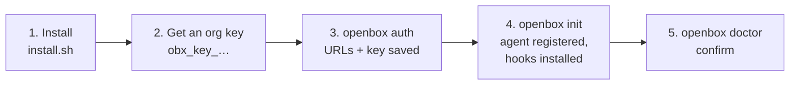

# Getting started

This guide takes one developer machine from nothing to governed, then covers
settings, CI, day-to-day operation and troubleshooting. The
[README](../README.md) has the short version.

Setup is two commands:

```
openbox auth                     save your platform URLs and organization key (once)
openbox init --provider <tool>   register that tool's agent and install its hooks (once per tool)
```



## Before you start

- [ ] An OpenBox platform is running, and you know the URLs of its
      **backend** (control plane) and **core** (data plane). The hosted
      service is the default.
- [ ] You have an **organization API key** (see [step 2](#2-get-the-right-credential)).
- [ ] An OpenBox admin has initialized your organization's identity provider
      (once per organization). If not, `init` stops with "your org's identity
      provider is not initialized".
- [ ] You are on macOS or Linux, with Claude Code, Codex or Muse Code installed.

## 1. Install

```bash
curl -fsSL https://raw.githubusercontent.com/OpenBox-AI/openbox-shift-left/main/install.sh | bash
openbox version
```

The script downloads the prebuilt binary for your OS and CPU (macOS or Linux,
amd64 or arm64), verifies its checksum and installs it to `~/.local/bin`
(override with `OPENBOX_INSTALL_DIR`). If no prebuilt binary matches, it builds
from source, which needs Go 1.27+.

**Windows:** the binary builds, but `install.sh` is bash and nothing tests
Windows at runtime. Build from source with `go build ./cmd/openbox`.

## 2. Get the right credential

OpenBox has two kinds of key, and the dashboard shows both. You need the
**organization key**.

| | Organization key (you need this) | Agent key (not this) |
|---|---|---|
| Looks like | `obx_key_…` | `obx_…` or `obx_test_…` |
| Belongs to | your organization | one agent |
| Where | dashboard → **Organization → API Keys** | dashboard → agent detail page |
| Used for | registering a new agent | the agent's own calls |
| Stored as | `OPENBOX_CONTROL_TOKEN` | `OPENBOX_API_KEY`, written by `init` |

The organization key needs the `create:agent` and `read:agent` scopes. It is
only used to **register** an agent; once a tool has one, re-running `init`
works offline without it. `openbox` never accepts a secret as a command-line
flag, so it cannot leak through shell history or `ps`.

## 3. Connect your organization

```bash
openbox auth
```

```
Backend URL (control plane)   [https://api.openbox.ai]:
Core URL (data plane)         [https://core.openbox.ai]:
Organization control token (obx_key_… or JWT):

✓ wrote ~/.openbox/.env       (0600; plaintext;)
✓ wrote ~/.openbox/dev.json   (URLs; no secrets)

Next: openbox init --provider <claude-code|codex|muse>
```

Each prompt is prefilled with the current value, and a blank answer keeps it,
so re-running `auth` to fix one URL is safe. `auth` registers nothing.

**Self-hosted platform:** answer **both** URL prompts with your own hosts. The
backend cannot tell `openbox` where your core is, so leaving core at its
default sends every event to the hosted service, which answers 401.

The organization key is saved in plaintext in `~/.openbox/.env`. It can create
agents for your whole organization. To keep it off disk, leave the prompt
blank and export `OPENBOX_CONTROL_TOKEN` for the one `init` run instead.

## 4. Govern a tool

```bash
openbox init --provider claude-code
```

`init` first settles the tool's **identity** (its agent on the platform):

1. **The tool already has an agent** (`~/.openbox/claude-code/.env` exists):
   it is reused, offline.
2. **No agent yet, and you are at a terminal:** `init` asks whether to
   **adopt** an existing agent, for example one moved from another machine.
   You paste its agent id, API key and workload private-key file.
3. **Otherwise** it registers a new agent with your organization key. If the
   default name is taken, it registers `<name>-<6 hex>` instead and prints
   both.

Then it installs:

- the hooks, in your **user-wide** settings (`~/.claude/settings.json` or
  `~/.codex/hooks.json`). Your own hooks are left alone;
- the tool's settings and identity, in `~/.openbox/<tool>/dev.json`;
- the [model-call lanes](#model-call-lanes-claude-code), where the tool
  supports them;
- git `prepare-commit-msg` and `post-commit` hooks for
  [lineage](lineage.md). Set `OPENBOX_INSTALL_GIT_HOOK=false` to skip them;
- on Claude Code, `showThinkingSummaries: true`, so thinking arrives with
  content. `openbox uninstall` restores the previous value.

On Claude Code the hooks take effect immediately, in every session on the
machine, including open ones. Codex needs its trust step and Muse needs a
restart (below). `init` prints what it changed.

### Codex differences

Same command with `--provider codex`. The agent lives in `~/.openbox/codex/`.

- Codex asks you to **trust new hooks** (`/hooks` inside Codex) before running
  them. Until you do, nothing is governed.
- A require-approval verdict becomes a **block**: Codex cannot pause a call.
- A HALT verdict ends the session only on a prompt. On a tool call it blocks
  that call.
- Codex hooks do not carry tool output, so less content is sent than on
  Claude Code ([details](data-and-privacy.md#summary)).

### Muse Code differences

```bash
openbox init --provider muse
```

It needs Muse Code 1.4.0 or newer and refuses an older one, or one whose
version it cannot read, before anything is written. The agent lives in
`~/.openbox/muse/`, and the hooks go into `~/.config/muse/settings.json`.
A Muse that is not on your `PATH` installs with a warning.

- **Restart open Muse sessions.** Muse reads its settings at session start, and
  whether an edit reaches a running session is not documented, so `init` tells
  you to restart rather than promise it.

- **Muse's telemetry is redirected.** `init` also starts the local telemetry
  receiver and, once it is listening, sets the `telemetry` key of
  `~/.config/muse/settings.json` to `destination: "external"` with the
  receiver as its endpoint. Muse then sends its own telemetry (model, token
  counts and response ids; no prompts, tool content or replies) to OpenBox's
  loopback receiver **instead of Meta's destinations**. The value that was there
  is recorded first, and `openbox uninstall` puts it back exactly, or removes the
  key if there was none; a value you changed after `init` is left alone. If
  `init` created `~/.config/muse/settings.json`, uninstall removes it again once
  only OpenBox's own `schema_version` is left. If Muse's settings cannot be
  restored (the file is unreadable, or a newer Muse changed its schema),
  uninstall keeps the telemetry daemon running and says so, so Muse never points
  at a dead port; fix the file and run `openbox uninstall` again. An
  existing `telemetry` setting of your own is replaced, and `init` says so.
  `doctor` reports whether the lane is routed, and why not when it is not. A
  policy that forces `privacy.telemetry` off stops the export; `doctor` reports
  it when Muse's status shows it. No proxy lane exists for Muse: it ignores the
  system proxy and rejects the relay's certificate. Prompts, tool calls and
  model calls are still gated: every model call is checked before it is sent.
- A HALT verdict, a block and an unanswered approval all come back to Muse as
  a plain refusal.
- Muse's hook payloads and refusal answers were observed on Muse 1.4.1; what
  is still unverified is listed in `internal/adapters/muse/README.md`. A hook payload over 256 KiB is never delivered to any hook,
  so that action is not gated; `doctor` counts such actions from Muse's own
  session log, it cannot stop them.
- A commit made by Muse keeps its trailer, but no commit event is sent.
- Muse drops every hook in a settings file it cannot parse, so `init` refuses
  to touch one, and `openbox doctor` says so when it finds one.
- Every Muse handler also carries a deny-only fallback that runs if the gate
  crashes or times out, so a failed gate is a denial rather than an allow.
- An org can deploy a managed hooks file and policy with its own MDM; see
  `deployments/managed/muse/README-mdm.md`. Nothing here resists a local
  administrator.

## 5. Confirm it

```bash
openbox doctor
```

`doctor` prints, per tool: the identity in use, every setting with its value
and source (default, config file, environment, or org mandate), whether the
platform is reachable and accepts the credential, the lane status, halted
sessions, and warnings for anything silently broken. Run it first for any
problem.

## Settings

Settings live in each tool's `~/.openbox/<tool>/dev.json`. An environment
variable overrides the file. An org can set defaults, or lock a value, through
managed config ([`deployments/managed/`](../deployments/managed/)).

| Key | Env var | Default | Effect |
|---|---|---|---|
| `content_capture` | `OPENBOX_CONTENT_CAPTURE` | `true` | Send prompts, replies, thinking, tool input and output. See [Data and privacy](data-and-privacy.md). |
| `finops` | `OPENBOX_FINOPS` | `true` | Send token counts and model id per turn. |
| `secret_detection` | `OPENBOX_SECRET_DETECTION` | `true` | Redact secrets locally before sending. |
| `findings` | `OPENBOX_FINDINGS` | `false` | Show asynchronous guardrail findings back in the session. |
| `realtime_flush` | `OPENBOX_REALTIME` | `true` | Deliver events within seconds instead of at session end. |
| `approval_hold_ms` | `OPENBOX_APPROVAL_HOLD_MS` | `20000` | How long a call waits for an approver. Less if the policy check itself was slow, since the whole hook has 30s. |

For environment variables, `1`, `true`, `yes` or `on` means on; anything else
means off.

Enforcement and fail-closed behaviour cannot be turned off. A few retired keys
(such as `enforce` and `fail_closed`) still parse so an old config does not
break, but they do nothing, and `openbox doctor` lists them as ignored.

## Automation and CI

`auth` needs a terminal. On a machine without one:

```bash
# Option 1 (recommended): export the organization key and let init register agents.
export OPENBOX_CONTROL_TOKEN=${OPENBOX_REDACTED_SECRET_ASSIGNMENT}
openbox init --provider claude-code

# Option 2: provide an existing agent's identity directly. These variables
# apply to EVERY governed tool on the machine, so use this for single-tool
# images only.
export OPENBOX_API_KEY=… OPENBOX_WORKLOAD_PRIVATE_KEY=… OPENBOX_AGENT_ID=…
```

Other useful variables:

| Variable | Use |
|---|---|
| `OPENBOX_BACKEND_URL`, `OPENBOX_BASE_URL` | Override the backend and core URLs. |
| `OPENBOX_HOME` | Move the whole `~/.openbox` directory. |
| `OPENBOX_CONFIG` | Point at one specific `dev.json`. One tool only: two tools sharing it would share an agent id but not a key, and the platform rejects that. |

An environment variable beats every file, for every tool, with one exception:
for `OPENBOX_CONTROL_TOKEN` the saved `~/.openbox/.env` wins. That stops a
forgotten `export` in an old shell from silently overriding what `auth` just
saved.

## Where files live

| Path | Contents |
|---|---|
| `~/.openbox/.env` | organization key (`0600`, plaintext) |
| `~/.openbox/dev.json` | backend and core URLs |
| `~/.openbox/<tool>/.env` | that tool's agent API key and workload private key (`0600`, plaintext) |
| `~/.openbox/<tool>/dev.json` | that tool's agent id, URLs and settings |
| `~/.openbox/<tool>/workload-token.json` | short-lived access token cache (safe to delete) |
| `~/.openbox/transport-ca.*`, `activation.json`, `*.log` | model-call lane files |
| `~/Library/Application Support/openbox/` (macOS), `~/.config/openbox/` (Linux) | runtime state: event queue, enforcement log, halted-session markers, local trace |

`init` copies the URLs from `~/.openbox/dev.json` into each tool's `dev.json`.
If you change a URL with `auth`, re-run `init` for each tool; `doctor` flags
the mismatch.

Never commit any of these files. What each holds, and what is and is not
protected: [Credentials](credentials-and-secrets.md) and
[Data and privacy](data-and-privacy.md#local-files).

## Model-call lanes (Claude Code)

Hooks see what the agent does, but not the request it sends to the model. The
**lanes** fill that gap. `init --provider claude-code` installs two background
services on your machine:

- **transport**: a local HTTPS proxy. It decrypts traffic to the model
  provider's hosts with a certificate authority (CA) generated on your
  machine, records the request and response, and passes them on unchanged.
  Traffic to any other host passes through without decryption.
- **telemetry**: a local OTLP receiver. Claude Code sends its own usage
  telemetry here (tokens, model, timing). It never sits in the path of a model
  call. Codex gets this lane too.

Only one lane reports each model call, so token counts are never doubled.
`openbox doctor` shows which one and warns if it is not running.

Each lane is installed in a safe order: start the service, confirm it is
listening, and only then point the tool at it. If a step fails, the service is
removed and your settings are left untouched. Every setting the lanes change
is recorded with its previous value in `~/.openbox/activation.json` and
restored on uninstall.

Restart open sessions after installing or removing a lane: a running process
keeps the environment it started with. (Hook changes need no restart.)

The transport lane blocks only one kind of call: a model call from a session
that is already halted. Everything else is recorded, not blocked. It detects
bypass rather than preventing it: unsetting one environment variable routes
around it, which shows up as a gap in the record and a `doctor` warning.

### macOS: system-wide proxy and CA trust

On macOS, once the transport lane is running, `init` also:

1. trusts the lane's CA in the System keychain, and reads it back;
2. sets a proxy auto-config (PAC) URL on each enabled network service.

This extends coverage to browsers and desktop apps on the same hosts, for
example claude.ai chats. It asks for your `sudo` password once. If you
decline, the lane still works for the CLI and `init` prints the commands to
finish later.

What this means: browser and desktop traffic to those hosts passes through a
local proxy that decrypts it with a key stored in `~/.openbox`. The CA is not
restricted to those hosts, so a leaked key could forge a certificate for any
site. `openbox uninstall` restores the network settings, untrusts the CA, then
deletes it.

`openbox init --provider codex` does the same on macOS, in this order: the
relay's service, then the telemetry service restarted onto the same binary,
then the CA trust and PAC, committed last. The same PAC then also routes
Codex's hosts (and your browser's `chatgpt.com` and `api.meta.ai`) through the
relay; see [Data and privacy](data-and-privacy.md). Codex's model calls stay
with the telemetry lane until the relay has seen one.

Codex's model calls stay with the telemetry lane until **both** are true: the
PAC is committed and lists Codex, and the relay has seen a real Codex request
(one carrying Codex's own `Originator` header). After that the relay records
them and telemetry stands down; `openbox doctor` names which lane is producing.
An existing Codex install gets the relay only when `init --provider codex` is
re-run on the upgraded binary (an upgrade alone changes nothing). If `init`
warns that the system PAC was not activated because the telemetry lane did not
come up, fix that and run `init` again. A Codex that ignores the PAC never
silences telemetry.

Linux and Windows do not get this yet; `init` says so and changes nothing at
the OS level. Codex there stays telemetry-only, and Muse is telemetry-only on
every platform.

## Enforcement in practice

Every gated tool call and every prompt is checked with your platform before it
runs:

| Verdict | Result |
|---|---|
| allow | the action runs |
| block | this one action is refused |
| require approval | the call waits for an approver (see below) |
| halt | the session stops; every later prompt and tool call in it is refused |

If the check gets no answer (platform down, timeout, 5xx, 401), that action is
denied. Nothing else is: your next action gets its own fresh attempt. A 401 is
retried once with a freshly fetched credential first.

After a HALT, every later prompt and tool call in that run is refused locally,
without asking the platform again. On Claude Code, `/clear` and `--resume`
start a fresh run that is not halted. On Codex, `resume` continues the same run
and stays halted.

## Approvals

When your policy requires approval, the call is filed with the platform and
waits (20 seconds by default, `approval_hold_ms`). An approver decides from
the dashboard with their own login.

- Answered in time: the call proceeds or is refused.
- No answer: the call is denied, with the approval id in the reason. When the
  decision arrives later, Claude Code wakes the session with the outcome;
  Codex shows it as a finding instead.

You cannot approve your own request from the machine that made it.

## Uninstall

```bash
openbox uninstall
```

This removes hooks, lanes, the CA and its key, settings, the event queue and
all credentials, including the organization key. It prints the full list
first, tries to deliver queued events, and restores every setting it changed.
The local trace is kept as the record of the uninstall; add `--purge-trace` to
delete it too. Your organization's managed settings files are left alone.

Credentials cannot be recovered afterwards; a later `init` registers a new
agent. To keep the same agent on a new machine, answer yes to the adopt prompt
during `init`; that needs the agent's original workload private key.

## Troubleshooting

Start with `openbox doctor`, then the local trace:

```bash
openbox trace --list                  # recent sessions
openbox trace <session-id> --bodies   # what happened in one, with content
```

To check a session against what the platform stored, set `OPENBOX_API_KEY` and
run `openbox trace <session-id> --against-core --agent <agent-id>`; point
`--backend` at your backend if it is not the default.

| Symptom | Fix |
|---|---|
| `no agent identity for this tool, and no organization credential` | Run `openbox auth` or export `OPENBOX_CONTROL_TOKEN`, then re-run `init`. Or adopt an existing agent at the prompt. |
| `your org's identity provider is not initialized` | Ask your OpenBox admin to initialize it, then re-run `init`. |
| `your org issues agent identities from an external provider (Okta/Entra)` | Not supported: `openbox` registers only OpenBox-generated identities. |
| `looks like an AGENT RUNTIME key` | You pasted an agent key where the organization key goes. See [step 2](#2-get-the-right-credential). |
| `openbox auth needs a terminal` | Use [Automation and CI](#automation-and-ci). |
| `doctor` reports no agent, or a legacy identity | Identities from older versions are not read. Re-run `init` for each tool. |
| `doctor` shows `401 identity rejected` | Usually a self-hosted core URL that was never set: re-run `auth` with both URLs, then `init` per tool. Otherwise the agent's key was revoked. |
| Token exchange returns 400 about the assertion or expiry | Your clock is off; check NTP. |
| `OPENBOX_WORKLOAD_PRIVATE_KEY: not a PEM block…` | The key is truncated or in PKCS#1 format. Convert it: `openssl pkcs8 -topk8 -nocrypt -in key.pem -out key8.pem`. |
| Hooks never fire | On Codex, trust them with `/hooks`. On a managed machine, check `doctor`'s "can they run" line: managed policy may block user hooks. |
| One tool call is denied with a delivery error | The platform did not answer in time. Check connectivity and `doctor`; the next call retries on its own. |
| Every prompt and tool call is refused | The session was halted by a HALT verdict. `doctor` shows why. Start a new session. |
| `Session is no longer active` with no `(policy: …)` suffix | The platform ended its record of this session early. Start a new session. |
| A tool call hangs | An approval is pending in the dashboard. |
| `doctor` warns a hook was `installed with a shorter timeout` | Your settings predate a timeout increase, and Claude Code could kill the hook and let the call through ungoverned. Re-run `init`. |
| Every tool call appears twice | An OpenBox hook is registered twice. Re-running `init` fixes it. |
| Every model call fails after install | The lane is not running. Check `doctor` and `~/.openbox/transport.log`. `openbox uninstall` restores a working state immediately. |
| `… is already in use; refusing to continue` | Another program holds the lane's port. Stop it and re-run `init`. |
