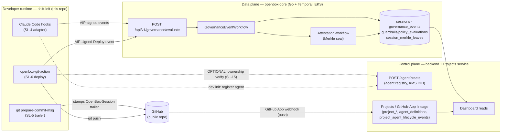
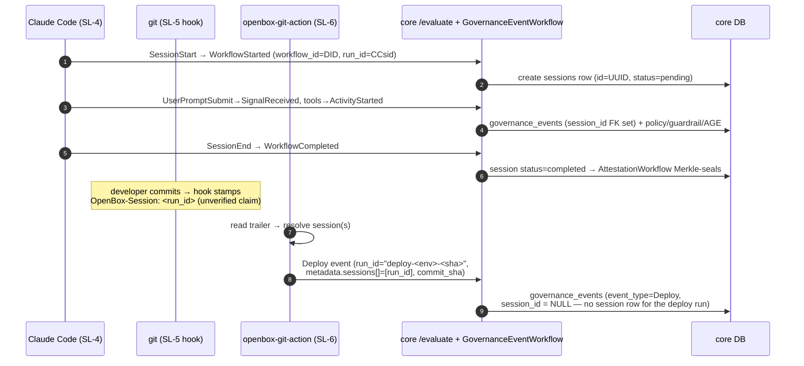
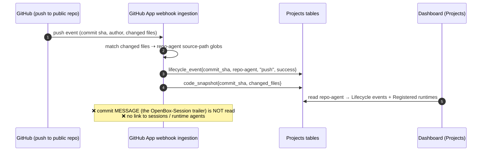
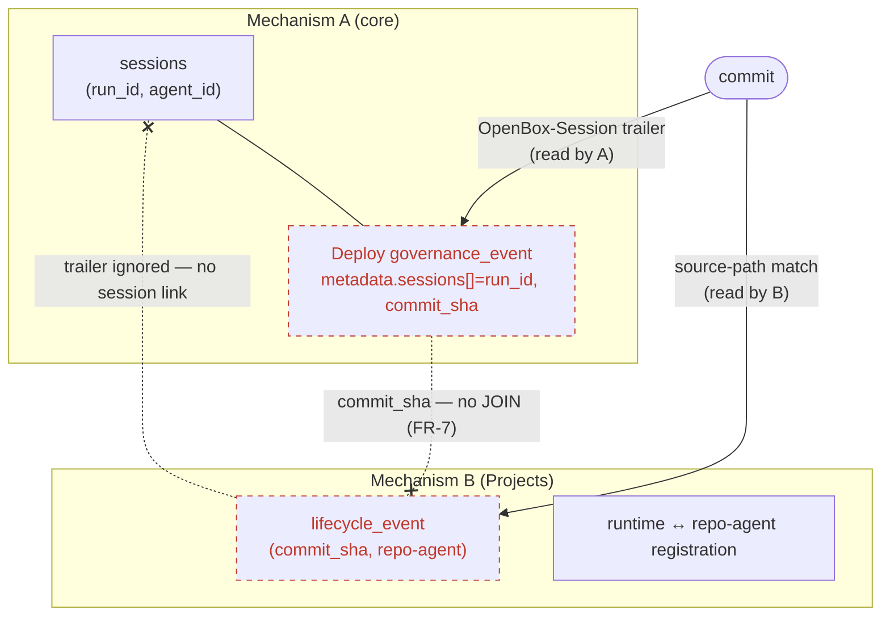
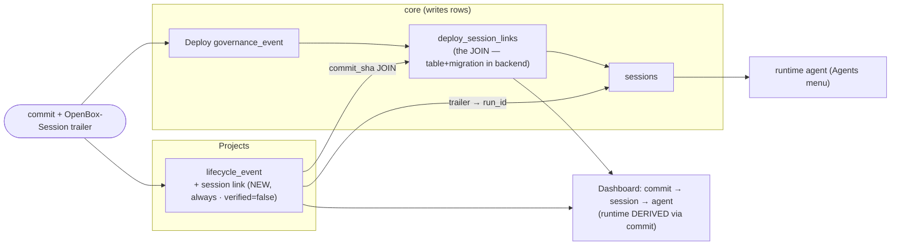

# Developer-Runtime Lineage — Architecture

> **Scope.** How `session → commit → deploy` lineage flows across the three planes
> (**shift-left** developer runtime · **openbox-core** data plane · **control-plane
> Projects** service), and why the chain does not render end-to-end today. This doc
> is the *model*. **Implementation — branch strategy, change points, schemas,
> build/test — is in [`lineage-development.md`](./lineage-development.md).**

## TL;DR

There are **two independent lineage mechanisms** that never join:

- **Mechanism A — governance telemetry** (shift-left → core): session events, the
  `OpenBox-Session` commit trailer, and the Deploy event. Knows `commit → session →
  deploy`, but only as **references in the Deploy event's `metadata`** — there is **no
  queryable JOIN** (FR-7, deferred).
- **Mechanism B — GitHub-App "Projects"** (control plane): a repo connected via a
  GitHub App; on push, commits are attributed to "repo-agents" **by source-path**.
  Renders `commit → repo-agent`, but **ignores the `OpenBox-Session` trailer**, so it
  never links a commit to a **session** or **runtime agent**.

Result: the commit shows in the project lineage (B), the session/deploy exist in core
(A), but the dashboard cannot draw **commit → session → agent** — the trailer that
connects them is produced by A and ignored by B.

A third, orthogonal invariant: a Deploy event **cannot be a member of its authoring
session** (that session is terminal / Merkle-sealed by deploy time), so lineage must be a
**reference / JOIN, not membership**.

---

## 1. Planes & roles

| Plane | Role |
|---|---|
| **shift-left** | **Produces** lineage: session events, commit trailer, deploy event |
| **openbox-core** | **Ingests & stores** governance events; runs the governance workflow; Merkle-seals sessions |
| **Control plane (backend + Projects)** | Agent registry; **GitHub-App project lineage**; dashboard reads |

---

## 2. The identity / join keys

Everything hinges on a few identifiers:

| Concept | Key |
|---|---|
| Session identity | `(workflow_id = agent DID, run_id = CC session id)` → a session (UUID). Created on `WorkflowStarted`. |
| Governance event | `{agent_id, session_id (FK, nullable), run_id, workflow_id, event_type, verdict, metadata}` |
| **commit → session** | `OpenBox-Session: <run_id>` git trailer (SL-5) — an *unverified claim* |
| **deploy → commit → session** | Deploy event `metadata.{commit_sha, deploy_id, sessions[]}` (each `sessions[].session_id` is a **run_id**) |
| commit → repo-agent | GitHub-App lifecycle event `{commit_sha, repo-agent}` — matched **by source-path** |
| runtime ↔ repo-agent | a runtime↔repo-agent registration |

> **Gotcha:** `metadata.sessions[].session_id` is a **run_id**, not the session UUID.
> Resolving it needs `(agent_id, run_id)` (the unique session key).

---

## 3. Mechanism A — governance-telemetry lineage (shift-left → core)

**What's solid:** every *session* event belongs to a real session (`session_id` FK set),
and terminal sessions are Merkle-sealed. The `commit → session → deploy` chain **exists**,
but only as **references in the Deploy event's `metadata.sessions[]`** — making it a
queryable `commit ⋈ session ⋈ deploy` relation is **FR-7 (deferred)**.

**Invariant — a Deploy is not a *member* of its authoring session.** A deploy always runs
*after* the coding session ends, so that session is already **terminal and Merkle-sealed**
by deploy time. Core enforces **append-only-until-complete**: adding an event to a
completed session is rejected (HALT) — that is the tamper-evidence guarantee of the Merkle
chain. (Verified live: attaching the deploy to its session → `status completed` → HALT →
dropped.) So the Deploy is its **own run** that *points at* the authoring session(s); the
connection is a **reference / JOIN, never membership**.

---

## 4. Mechanism B — GitHub-App "Projects" lineage (control plane)

Verified **live on UAT** (2026-07-17): a connected repo, commits attributed to a repo-agent
**by path**, rendered in the dashboard's **Projects** view.

> **Note.** Mechanism B lives in the control plane's **Projects service** and attributes
> commits to repo-agents purely by source-path — it **does not read the commit message**,
> so it never sees the `OpenBox-Session` trailer. The natural bridge key is **`commit_sha`**
> (present on both sides) and/or the **trailer → session `run_id`**.

---

## 5. The gap — where A and B fail to meet

- **A** has `commit → session → deploy` (trailer + Deploy metadata) but **no queryable JOIN**
  and doesn't feed the Projects UI.
- **B** has `commit → repo-agent` (by path) and renders it, but **ignores the trailer**, so
  no `session` / `runtime` link.

---

## 6. Target state

**Gaps to close** (conceptually — the *how* + build order is in [`lineage-development.md`](./lineage-development.md)):
1. **`deploy_session_links` (first):** materialize the `commit → session → deploy` JOIN from the Deploy event's session references (FR-7). Table + migration in the control plane; core writes the rows.
2. **Core:** attestation must tolerate sessionless (Deploy) events instead of retrying "session not found".
3. **Projects:** **always** read the `OpenBox-Session` trailer (and/or join on `commit_sha`) so the project lineage links `commit → session → runtime agent`. The runtime is **derived via the commit** — no explicit runtime→project registration (shift-left stays project-unaware).

---

## 7. Design decisions

| Question | Decision |
|---|---|
| **Attribution gate** | **Always** link `commit → session`; carry `verified=false` for unverified trailers (surface "inferred"). No SL-15 ownership gate. |
| **JOIN relation** | A single materialized relation, **`deploy_session_links`** — no Projects-DB mirror, no cross-service read. |
| **Table ownership** | The `deploy_session_links` **table + migration live in the control plane** (backend / TypeORM, shared DB); **core writes** the rows. |
| **Runtime ↔ project** | **Derived via the commit** (`commit → session → agent`), shown on the dashboard. **No explicit registration** for now; shift-left stays project-unaware. |
| **Membership vs reference** | A deploy is **never a member** of its (sealed) authoring session — the link is a **reference / JOIN** (`deploy_session_links`), not an appended event. |

*Implementation of each: [`lineage-development.md`](./lineage-development.md).*
