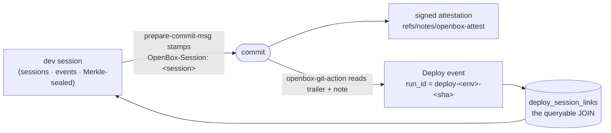

# Lineage — session → commit → deploy

The question lineage answers: *for this commit, or this deploy, which session
produced it, with which agent, under which policy — and how sure are we?*

## How the chain is produced



Three producers, all in this repo:

1. **The session** emits its events as it runs. When it ends, core seals it — a Merkle
   root over its leaves, signed.
2. **The commit hook** (`prepare-commit-msg`) stamps `OpenBox-Session: <id>` into the
   commit message, mirrors it into `refs/notes/openbox`, and signs an attestation
   envelope into `refs/notes/openbox-attest` covering the commit sha, the tree sha
   and the session ids
   ([ADR-0010](adr/ADR-0010-signed-commit-attestation.md)).
3. **The deploy action** (`openbox-git-action`) resolves the pushed range back to
   sessions, carries the attestation, and emits one Deploy event per environment —
   idempotent on `deploy-<env>-<sha>`, so re-running a pipeline does not duplicate.

Core then materialises `deploy_session_links`, which is what makes the chain
*queryable* rather than a string of references buried in event metadata.

**A deploy is never a member of its authoring session.** By deploy time that session
is terminal and Merkle-sealed, and appending to a sealed session is rejected — that
rejection *is* the tamper-evidence guarantee. So the link is a reference, not
membership.

## How sure are we — three honest states

| State | Means | Rendered as |
|---|---|---|
| `unattributed` | no trailer: a human commit, or a tool with no adapter | a gap, never a guess |
| `inferred` | the trailer says which session was live | amber — an unverified claim |
| `verified` | ownership **and** an accepted signed attestation both hold | green |

A trailer can be hand-written, so `inferred` is exactly that: a claim. Getting to
`verified` needs the pipeline to fetch `refs/notes/openbox-attest` (not the default)
and the platform to have a verifier for the signing DID. The distinction is surfaced
rather than smoothed over — a chain that showed green for an unverified claim would be
worse than one that showed nothing.

## The join keys

| Concept | Key |
|---|---|
| session identity | `(workflow_id = agent DID, run_id = tool session id)` |
| commit → session | the `OpenBox-Session` trailer (a claim) + the attestation note (proof) |
| deploy → commit → session | `deploy_session_links (deploy_id, commit_sha, session_run_id, session_id, verified, source)` |
| deploy identity | `run_id = deploy-<env>-<sha>` — idempotent by construction |

A fan-in — several sessions in one push — gets one link row per session. There is no
"primary session" to pick.

## Reading it back

The control plane exposes the chain from any anchor: `GET /lineage/deploys`,
`/lineage/commits/:sha`, `/lineage/sessions/:id/chain`, and the dashboard renders the
five hops with per-hop evidence. Two things to expect:

- **The production-runtime hop is not joined yet.** A chain shows four of five hops
  and reports the fifth as a known gap.
- **A deployed commit with no authoring session has no chain** — the deploy appears in
  the feed, but the commit-anchored view returns 404 rather than a chain whose session
  hop reads "missing". That is a read-side gap, tracked in
  [`docs/test/e2e.md`](test/e2e.md) §9a.

## Doing it yourself

```bash
# in a governed session, commit as usual — the trailer is stamped for you
git log -1 --format='%(trailers:key=OpenBox-Session,valueonly)'
git notes --ref=openbox-attest show HEAD          # the signed envelope

# in CI, after the push
openbox-git-action --sha "$GITHUB_SHA" --repo "$GITHUB_REPOSITORY" --environment production
```

Add `--dry-run` to see the resolution — sessions, source, attribution status — without
emitting anything. For CI to reach `verified`, fetch the notes ref:

```yaml
- run: git fetch origin 'refs/notes/*:refs/notes/*'
```
