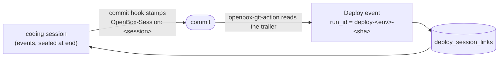

# Lineage: session → commit → deploy

Lineage answers: *for this commit or deploy, which coding session produced it,
with which agent, and how sure are we?*

## How the chain is built


```mermaid
flowchart LR
  S["coding session<br/>(events, sealed at end)"]
  C(["commit"])
  D["Deploy event<br/>run_id = deploy-&lt;env&gt;-&lt;sha&gt;"]
  L[("deploy_session_links")]
  S -- "commit hook stamps<br/>OpenBox-Session: &lt;session&gt;" --> C
  C -- "openbox-git-action reads the trailer" --> D
  D --> L
  L --> S
```

Three producers, all in this repo:

1. **The session** sends its events as it runs. When it ends, the platform
   seals it with a signed Merkle root.
2. **The commit hook** (`prepare-commit-msg`, installed by `openbox init`)
   adds an `OpenBox-Session: <id>` trailer to each commit made during a
   governed session, and mirrors it into `refs/notes/openbox`. A second,
   `post-commit` hook then sends one `commit_created` event into that
   session's own event stream, when the commit was made by a governed agent
   tool (see Limits) -- this is the evidence a deploy link grades against,
   not the trailer.
3. **The deploy action** (`openbox-git-action`, in `cmd/openbox-git-action/`)
   runs in CI. It resolves the pushed commits back to sessions and sends one
   Deploy event per environment. It is idempotent on `deploy-<env>-<sha>`, so
   re-running a pipeline does not duplicate it.

The platform then fills `deploy_session_links`, which makes the chain
queryable.

A deploy is linked to its session by reference, never added to it. The
tamper-evidence guarantee is the session's sealed, signed Merkle root, which
exists only after the session sends `SessionEnded`.

## How sure are we

| State | Means |
|---|---|
| `unattributed` | no trailer: a human commit, or a tool with no adapter. Shown as a gap, never a guess |
| `unverified` | the trailer names the session that was live, but the platform found no matching commit event from the deploying agent's session. A trailer can be hand-written, so this is a claim, not proof |
| `linked` | the deploying agent's own session sent a `commit_created` event matching the claim commit and session; the platform tied it to this deploy, but that session has not sealed (yet, or ever) |
| `attested` | the commit event is a leaf in that session's sealed Merkle root, signed with a publicly verifiable key -- the strongest guarantee the platform makes. `verified` (as a boolean) is true only in this state |

`inferred` is a different, narrower name that survives only inside
`openbox-git-action`'s own `Resolution.Status`: "session id(s) were recovered
from the push, but ownership of the pusher was not verified." That is a
question about who pushed; the four grades above are a question about what the
platform can prove about the commit itself. Do not conflate the two.

## Limits

- **Agent commits only.** A commit event is produced only when the tool
  marker of the agent that made the commit (Claude Code, Codex) agrees with
  the session's own recorded tool. A hand commit made inside a governed
  worktree keeps its trailer claim but never produces a commit event, so it
  stays `unverified`.
- **Local-signed sessions never attest.** A session sealed with the local
  dev-mode key (`OPENBOX_LOCAL_KMS_SECRET`, a shared-secret HMAC) is not
  publicly verifiable, so it can reach `linked` but never `attested`.
- **Deploy before seal reads `linked`.** Deploying a commit before its
  session ends grades `linked`; if the session later seals, a reconcile pass
  run at seal time upgrades the existing link to `attested` -- there is no
  re-deploy and no new event.
- **A commit event stored after its session sealed stays `linked`.** The
  sealed root cannot cover a leaf added later.
- **A crashed or never-ended session stays `linked` forever.** There is no
  idle-seal: a session that never sends `SessionEnded` never seals, so any
  link resting on it never advances past `linked`.
- **History rewrites are not covered.** A rebase, squash, or cherry-pick
  changes the commit sha, so the rewritten commit is not the one the original
  commit event named. The new commit falls back to whatever its own trailer
  or notes mirror provides (`unattributed` or `unverified`).
- **Both `linked` and `attested` need a server that records commit
  evidence** (a leaf keyed to the deploying agent, the claim commit sha, and
  the claim session id). Against an older server that does not, a deploy
  still resolves and sends, but never grades past `unverified`.

## Join keys

| Link | Key |
|---|---|
| session | `workflow_id` = the agent's derived attribution id, `run_id` = the tool's session id |
| commit → session | the `OpenBox-Session` trailer |
| commit evidence → session | `claim_commit_sha`, `evidence_state` (the commit event's own grading state, joined by the claim commit and claim session id, not by `link.session_id`) |
| deploy → commit → session | `deploy_session_links (deploy_id, commit_sha, session_run_id, session_id, verified, source)` |
| deploy | `run_id = deploy-<env>-<sha>` |

A push containing commits from several sessions gets one link row per session.

## Reading it back

The platform exposes the chain from any starting point:
`GET /lineage/deploys`, `/lineage/commits/:sha` and
`/lineage/sessions/:id/chain`. The dashboard renders each hop with its
evidence. A deployed commit with no authoring session has no chain: the
commit view returns 404.

## Try it

```bash
# in a governed session, commit as usual, then:
git log -1 --format='%(trailers:key=OpenBox-Session,valueonly)'

# in CI, after the push
openbox-git-action --sha "$GITHUB_SHA" --repo "$GITHUB_REPOSITORY" --environment production
```

Add `--dry-run` to print the resolved event without sending it. Use `--base`
to resolve a specific commit range (`base..sha`).
