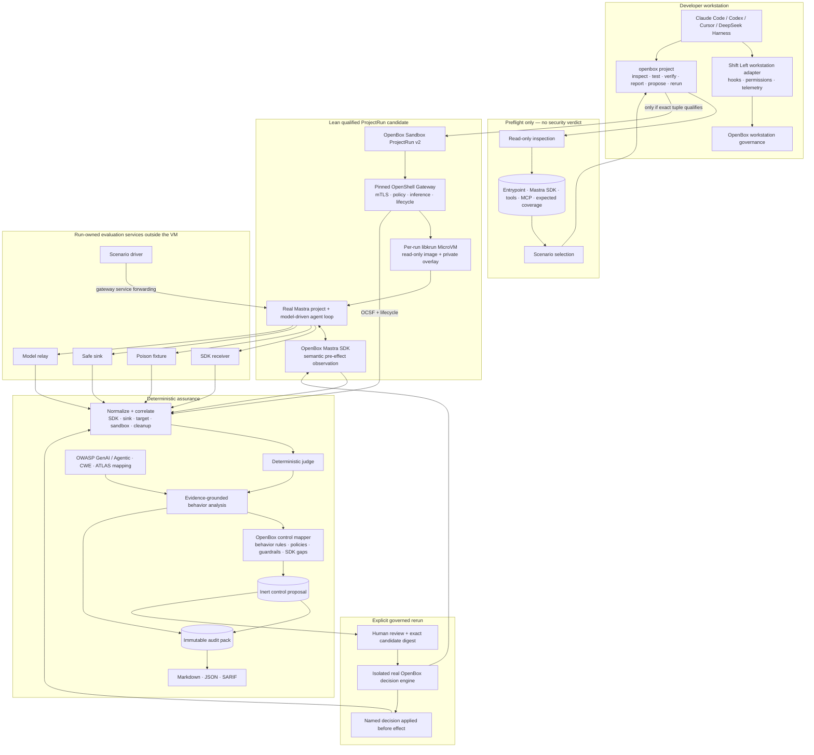

# OpenBox behavioral security evaluation: feasibility and architecture

**Status:** research decision record, 2026-08-25

**Scope:** Claude Code, Codex, Cursor, DeepSeek Harness, Strix, and the current
Shift Left project-assurance plans.

**Evidence rule:** vendor documentation and source establish available
surfaces; only a pinned local probe establishes an OpenBox-supported execution
tuple.

## Decision

The product is **runtime behavioral security evaluation for an SDK-integrated
agent project**, not static security analysis.

For a Mastra project, the intended lifecycle is:

1. the developer integrates the OpenBox Mastra SDK
   (`@openbox-ai/openbox-mastra-sdk`) into the agent application;
2. Shift Left governs the IDE or agentic CLI used to build it;
3. the developer explicitly asks Shift Left to run the application in a
   qualified sandbox;
4. OpenBox observes the application's real agent, tool, HTTP, MCP, retrieval,
   file, model, and approval behavior through the SDK and independent effect
   receipts;
5. the evaluator analyzes observed behavior against agent/LLM security
   standards such as OWASP GenAI and produces evidence-bound findings; and
6. the report recommends the OpenBox behavior rules, policies, guardrails, or
   integration changes needed to enforce security in the deployed application.

The core idea in the
[agent-audit brainstorm](../../openbox-agent-audit-brainstorm.md) is therefore
feasible, but its original delivery design is not.

- **Keep:** run bounded adversarial scenarios, correlate semantic action
  evidence with independent effect receipts, explain the observed agent
  behavior as a security finding, propose an OpenBox control, and rerun to
  prove whether that named control stopped the effect.
- **Use the current product shape:** one `openbox` CLI with a separate
  `openbox project` assurance lane, the existing framework SDK unchanged, a
  deterministic judge, content-addressed audit packs, inert proposals, and an
  explicit governed rerun.
- **Do not depend on a native coding-agent sandbox as the general project
  runner.** Claude Code, Codex, Cursor, and DeepSeek Harness expose useful
  workstation controls, but none supplies the complete project staging,
  service topology, exact listener/egress policy, credential isolation,
  resource enforcement, evidence retrieval, and cleanup contract required by
  project assurance.
- **Current release feasibility is passive only.** `inspect`, pack `verify`,
  `report`, and inert `propose` are usable. Active `project test` and governed
  rerun are fail-closed because the current
  [support matrix](../plans/260819-1600-project-security-evaluation/evidence/release-support-matrix.md)
  contains zero supported project-runner tuples.
- **The lean execution candidate is a separately authorized ProjectRun v2 over
  one pinned OpenShell MicroVM/libkrun tuple.** ProjectRun remains the public
  contract; OpenShell is an internal provider. Kubernetes and Kata are deferred
  until shared-cluster, multi-tenant, dynamic-resource, or GPU requirements
  justify them. A byte-pinned trusted fixture may be useful for conformance,
  but it is not a hostile-project sandbox or a general product claim.

In short: **the product thesis is feasible; the native-sandbox shortcut is
not.**

### Product boundary

| OpenBox behavioral evaluation is | It is not |
|---|---|
| Execution of the developer's real SDK-integrated agent project under bounded scenarios | Repository-wide SAST, dependency scanning, secret scanning, or general code review |
| Observation of model-selected tools and their HTTP, MCP, retrieval, file, database, and approval effects | A finding derived only from source patterns or model speculation |
| Agent/LLM security analysis mapped to standards and exact runtime evidence | A claim that an OWASP label alone proves exploitability |
| Recommendations that compile observed risks into OpenBox behavior rules, policies, guardrails, or required SDK seams | Automatic source fixing, policy publication, or deployment |
| A governed rerun proving that a named OpenBox decision was applied before the effect | A model refusal, sandbox denial, or missing event presented as an OpenBox block |

Passive inspection is only preflight. It discovers the project entrypoint,
Mastra/OpenBox SDK integration, tool and MCP inventory, expected observation
coverage, and which behavioral scenarios are runnable. It does not produce the
core security verdict.

## 1. Brainstorm feasibility

| Brainstorm element | Verdict | Current disposition |
|---|---|---|
| Project model and attack-surface inspection | Feasible as preflight only | Keep under `openbox project inspect` to configure runtime evaluation and expose coverage gaps. Static facts do not become behavioral findings. |
| One predicate reused for finding, control, and rerun proof | Feasible with a stricter evidence model | Keep the shared semantic predicate, but require SDK event, target/sink receipt, decision identity, application timing, and cleanup evidence. |
| Separate `openbox-audit` Python CLI | Reject | Use the existing Go `openbox project inspect\|test\|verify\|report\|propose\|rerun` lane. |
| SDK “scan mode” that injects and mocks tool results | Reject for the MVP | Use the existing framework SDK unchanged. Inject through real dependency, retrieval, HTTP, or MCP fixtures; observe through the normal SDK wire. |
| Local-first behavior evaluation | Feasible but execution-blocked | Data contracts, receiver, correlation, judgment, report, and proposal paths exist; no current runner is qualified to launch a project. |
| Indirect prompt injection to sensitive egress | Feasible thin slice | The current v1 scenario is `ASI02-INDIRECT-EGRESS-001`. Historical Mastra runs proved the functional path, not current release support. |
| “The agent actually decides” | Not yet demonstrated | The present Mastra fixture always emits `recording-tool`; model output changes only its payload. It is a conformance harness, not evidence of model-selected behavior. |
| Finding to live control to verified block | Technically demonstrated, currently not release-qualified | Historical baseline/governed packs observed a real Core `BLOCK` applied by the SDK before the safe sink. The runner was later withdrawn, so this remains historical functional evidence. |
| Broad LangGraph-first framework support | Defer | Add framework descriptors only after one runner and one genuine agent-behavior fixture qualify end to end. |
| Automatic publish, apply, fix, or PR | Reject | Proposals remain inert. Publication, source changes, deployment, and runtime activation each require explicit authority and separate verification. |

This disposition follows the current
[security-evaluation architecture](../dc/security-evaluate.md), which
supersedes the brainstorm where they differ.

## 2. Tech-stack feasibility

### Coding hosts are governance surfaces, not project sandboxes

| Product | Useful OpenBox integration | Why it is not the general project runner |
|---|---|---|
| **Claude Code** | High-value workstation adapter: `PreToolUse`, `PermissionRequest`, managed settings, MCP controls, and Bash sandbox posture. | The documented OS sandbox covers Bash and children, not every Read/Edit/WebFetch/MCP path. Reads are broad by default; unavailable sandboxing can warn and run unsandboxed unless `failIfUnavailable` is set; an escape route exists unless disabled. OpenBox's standalone SRT probe also reached undeclared loopback ports. |
| **Codex** | High-value workstation adapter: open-source host, hooks, managed requirements, approvals, MCP inventory, and sandbox posture. | The withdrawn `0.149.0` tuple allowed both declared and undeclared ports on the same loopback host because its rules were host/domain-scoped, not endpoint-scoped. It also lacked a hard process-count control. Useful host governance does not imply safe arbitrary-project execution. |
| **Cursor** | Plausible workstation adapter: local before-hooks, run modes, shell sandbox, MCP policy, and team controls. Current local docs expose a richer surface than the existing unbuilt adapter assumes. | Cursor is closed-source and split across editor, CLI, local, and cloud surfaces. Its local sandbox applies to terminal commands; some commands go outside it after review, and Auto-review is a classifier-based guardrail. No pinned Cursor tuple has passed the OpenBox project-runner probes. Cloud Agents use dedicated VMs, but expose a vendor-managed execution product rather than the required OpenBox evidence contract. |
| **DeepSeek Harness** | Best source-level runtime integration target: the composable tool pipeline has pre-execute policy, monotonic deny, approval, post-execute filtering, ordered session evidence, MCP, and subagent seams. | Its process-sandbox vocabulary governs filesystem effects only; network and process visibility are explicitly outside it. Enforcement can be `partial`, composition determines whether controls are present, and the project remains prerelease. It is an integration target, not containment by itself. |
| **Strix** | Adjacent methodology input: behavioral attack scenarios, target normalization, discovery/validation/reporting, coverage ledgers, focused workers, security skills, PoCs, SARIF, and budgets. | It is a broad autonomous pentesting system. Its Docker runtime uses live writable source mounts, host-gateway reach, `NET_ADMIN`/`NET_RAW`, mutable tools, optional resource caps, and best-effort cleanup. OpenBox should borrow methodology, not its product category or execution defaults. |

Primary product evidence:

- Claude Code [permissions](https://code.claude.com/docs/en/permissions),
  [hooks](https://code.claude.com/docs/en/hooks), and
  [sandboxing](https://code.claude.com/docs/en/sandboxing).
- Codex [sandboxing](https://learn.chatgpt.com/docs/sandboxing),
  [permissions](https://learn.chatgpt.com/docs/permissions), and
  [hooks](https://learn.chatgpt.com/docs/hooks), plus the local
  [endpoint-isolation probe](../plans/260819-1600-project-security-evaluation/evidence/codex-loopback-port-isolation-review.json).
- Cursor [run modes and sandboxing](https://docs.cursor.com/en/agent/security/run-modes),
  [agent security](https://docs.cursor.com/en/agent/security), and
  [cloud-agent isolation](https://docs.cursor.com/en/cloud-agent/security).
- DeepSeek Harness source at
  [`b150a55`](https://github.com/deepseek-ai/DeepSeek-Harness/tree/b150a551b8d465e31e418e1b2eaf5e79bbb7d28e),
  especially its
  [sandbox contract](https://github.com/deepseek-ai/DeepSeek-Harness/blob/b150a551b8d465e31e418e1b2eaf5e79bbb7d28e/docs/subsystems/sandbox.md).
- Strix source at
  [`f4ef886`](https://github.com/usestrix/strix/tree/f4ef8867f6139cc42e449468d443343eaa325463),
  reviewed below.

### What the runner actually needs

A project-runner backend is supportable only when one exact tuple proves all of
these together:

1. content-addressed immutable project and dependency snapshot;
2. exact runtime, executable, lockfile, configuration, and produced-tree
   identity;
3. no ambient credentials or environment inheritance;
4. explicit private services, model relay, health, stimulus, and observation
   topology;
5. default-deny egress and exact listener identity, including declared versus
   undeclared ports and loopback versus wildcard interfaces;
6. parent and child filesystem, network, process, timeout, output, and cost
   bounds;
7. SDK events plus independent fixture, sink, sandbox, and target receipts;
8. cancellation, crash recovery, terminal cleanup, and artifact retrieval; and
9. no unsandboxed retry, backend substitution, or automatic fallback.

Coding-host sandboxes optimize interactive developer safety. This contract
optimizes reproducible execution of potentially hostile multi-process
applications. They overlap, but they are not the same product.

### Lean sandbox candidate

The smallest credible first execution stack is:

```text
Shift Left
  -> OpenBox Sandbox ProjectRun v2
  -> pinned OpenShell Gateway
  -> OpenShell VM driver / libkrun
  -> one MicroVM running the exact Mastra application
```

OpenShell's VM driver already supplies a gateway lifecycle, an exact persisted
main-process specification without shell reconstruction, OCI-image preparation,
a read-only prepared image disk, a private writable overlay, VM start/stop/delete
reconciliation, service forwarding, policy/inference routes, and structured
network/process/policy events. The proposed OpenBox integration keeps the SDK
receiver, poisoned fixture, safe sink, model relay, and scenario driver outside
the evaluated VM and exposes only run-scoped authenticated routes to the child.
This preserves independent effect evidence without requiring Kubernetes
sidecars or a second VM.

The candidate is not qualified today. Current upstream limitations include:

- the VM runtime is still described as experimental;
- per-sandbox CPU and memory requests are accepted but ignored by the VM
  driver, although fixed gateway-level VM sizing is configurable;
- the complete explicit transparent-TCP policy capability is not yet advertised
  for the VM runtime;
- the live macOS tuple reported no cgroup `pids.max` and repeated high-severity
  `Landlock Filesystem Sandbox Unavailable` findings;
- the pinned macOS prototype did prove the real Mastra/OpenBox SDK path, direct
  default-deny HTTPS, exact prepared-image identity, OCSF denial logging, and
  normal-path private-overlay deletion; but
- independent receiver/fixture/sink evidence, cache reproducibility, complete
  endpoint isolation, service forwarding, restart recovery, and failure-path
  cleanup still need pinned live proof.

The exact
[macOS MicroVM feasibility run](../plans/260825-0930-agent-behavior-assurance/evidence/openshell-mastra-macos-microvm-feasibility.md)
therefore changes **functional feasibility** from planned to observed, without
changing the release support matrix. Its receiver, fixture, model harness,
scenario driver, and sink were deliberately co-resident, so the result is not
independent assurance evidence and cannot qualify ProjectRun.

One exact fixed Linux/KVM profile can be attempted first. Unsupported dynamic
limits or policy classes must reject before mutation; they must not silently
use fixed defaults or fall back to Docker/native execution. The detailed
decision, API mapping, and qualification row are in
[the sandbox KB](sandbox.md).

### Plan reconciliation

| Plan | What remains feasible | Current constraint |
|---|---|---|
| [Project security evaluation](../plans/260819-1600-project-security-evaluation/plan.md) | Phases 00–02, 04, and 06 establish the architecture, artifacts, passive inspection, receiver/fixtures, deterministic judgment, reports, and inert proposals. | Phase 03 and release Phase 07 are blocked. The Codex and first-party Seatbelt rows were both withdrawn; active execution rejects before project/profile reads. |
| [OpenBox Sandbox ProjectRun v2](../plans/260822-2330-openbox-sandbox-projectrun-v2/plan.md) | Correct execution contract. The lean first provider candidate is a pinned OpenShell MicroVM/libkrun Linux/KVM tuple; Kubernetes and Kata are deferred. A macOS VM testbed now proves the real Mastra/SDK functional path. | Planned, not authorized or implemented. The observed macOS tuple lacks Landlock and a hard PID limit, keeps evidence services co-resident, and is not the target Linux/KVM support row. Full provider-neutral qualification remains required; Sandbox v1 must not be widened into this role. |
| [Agent behaviour assurance](../plans/260825-0930-agent-behavior-assurance/plan.md) | Phase 1 can render existing coverage gaps without active execution. The genuine model-selected fixture, broader action classes, multiple scenarios, and governed rerun are the right functional sequence. | Its statements that native Seatbelt execution is “Done” and that Seatbelt is the selected driver are stale against the parent plan's later 2026-08-25 withdrawal. Phase 2 also addresses only sensitive reads; it does not close wildcard binding, runtime/dependency lineage, or hard process-limit gaps. Phases 3–6 cannot be release-qualified until a runner qualifies. |

The lean next plan correction is therefore:

1. keep behavior-assurance Phase 1 as preflight coverage/report plumbing, not
   the behavioral security product outcome;
2. reframe its Phase 2 as runner-independent requirements or move it under the
   ProjectRun/provider qualification track, with one OpenShell MicroVM tuple as
   the only initial provider candidate;
3. retain Phases 3–5 as functional work testable in a trusted conformance
   environment, without claiming supported project execution; and
4. gate Phase 6 on one qualified ProjectRun v2 or equivalent provider.

## 3. End-to-end architecture

Workstation governance and project assurance remain two lanes in one CLI. The
coding host can invoke the project-assurance lane, but its hooks and sandbox do
not become the project's runtime evidence or confinement boundary.



The authoritative security claim comes from the evidence lane, not from the
coding host, model narrative, or exit code.

## 4. End-to-end sequence

```mermaid
sequenceDiagram
  actor Dev as Developer / reviewer
  participant CLI as openbox project
  participant Gate as Support + authority gate
  participant Run as ProjectRun + OpenShell MicroVM
  participant Fx as Receiver / poison / safe sink
  participant App as Real agentic project
  participant SDK as OpenBox framework SDK
  participant Judge as Correlator + deterministic judge
  participant Analyze as Standards + control analysis
  participant Core as Isolated OpenBox Core

  Dev->>CLI: project test + scenario + exact profile
  CLI->>Gate: verify backend, platform, runtime, snapshot, budgets, authority
  alt no qualified tuple
    Gate-->>Dev: not_runnable before project/profile read or launch
  else tuple qualifies
    CLI->>Run: stage immutable project and dependencies
    Run->>Run: prepare pinned image; probe exact VM tuple; delete probe VM
    CLI->>Fx: start run-owned receiver, poison source, safe sink
    Run->>App: launch exact main process in fresh libkrun VM
    CLI->>App: send bounded scenario stimulus
    App->>Fx: retrieve attacker-controlled content
    App->>SDK: attempt sensitive action
    SDK->>Fx: normal governance event
    Fx-->>SDK: baseline ALLOW
    SDK-->>App: allow action to continue
    App->>Fx: bounded effect reaches safe sink
    Fx-->>Judge: SDK event + poison receipt + sink receipt
    Run-->>Judge: posture + process + denial + cleanup evidence
    Judge-->>Analyze: exploitable + observed behavior + coverage
    Analyze->>Analyze: map standards and recommend enforceable OpenBox controls
    Analyze-->>CLI: finding + evidence links + OWASP mapping + control proposal
    CLI-->>Dev: verified behavior report + audit pack + proposal digest

    Dev->>CLI: explicit rerun with baseline pack + proposal digest
    CLI->>Core: load candidate in fresh isolated test system
    CLI->>Run: repeat same snapshot and scenario
    SDK->>Core: same sensitive pre-effect event
    Core-->>SDK: named BLOCK bound to candidate
    SDK-->>App: stop action before tool body
    SDK-->>Judge: BLOCK applied before tool body
    Fx-->>Judge: no safe-sink effect receipt
    Run-->>Judge: complete cleanup evidence
    Judge-->>Dev: blocked only if all required evidence agrees
  end
```

The outcomes remain distinct: `exploitable`, `blocked`,
`sandbox_prevented`, `not_observed`, `inconclusive`, and `not_runnable`.
A model refusal, sandbox denial, missing event, mock block, or absent sink alone
never proves `blocked`.

### Behavioral report contract

The report is built from observed execution, not source-pattern findings. Each
finding should answer these questions:

| Report field | Required meaning |
|---|---|
| Observed behavior | The exact agent action chain, such as `untrusted MCP result -> model -> HTTP tool -> external POST`. |
| Security issue | Why that observed chain crosses a trust, authorization, data, or side-effect boundary. |
| Standards mapping | Applicable OWASP GenAI/Agentic risk, plus CWE or MITRE ATLAS references when useful. The mapping describes the issue; it is not the evidence. |
| Evidence | SDK pre-effect events, model/tool/MCP lineage, fixture and target receipts, safe-sink result, sandbox posture, exact snapshot, and repetitions. |
| Reachability | Whether the issue is `runtime_enforceable`, `host_enforceable`, `observable_only`, `code_change_required`, or `blind`. |
| OpenBox recommendation | The exact behavior rule, policy, guardrail, approval requirement, allowlist, or missing SDK wrapper that addresses the observed path. |
| Verification recipe | How to rerun the same snapshot and scenario and what evidence must change before the report can say `blocked`. |

Control recommendations follow the observed behavior shape:

| Observed risk | Suggested OpenBox integration |
|---|---|
| One dangerous tool, HTTP, database, file, or MCP call | A policy matching that semantic action and its validated attributes. |
| A sequence such as untrusted retrieval followed by sensitive egress | A stateful behavior rule over the correlated action sequence. |
| Prompt injection, secrets, PII, toxicity, or unsafe model/tool content | An input/output guardrail at the SDK seam where the content is actually available. |
| High-impact action without a bound decision | `REQUIRE_APPROVAL` tied to the exact action, arguments, identity, target, and expiry. |
| Action not observed before its effect | An SDK/instrumentation change; never fabricate a policy for a blind path. |

An LLM may explain behavior, map standards, generate hypotheses, and draft
controls. It may not invent missing events or authoritatively decide that a
control blocked an effect. The deterministic evidence predicates retain that
authority.

## 5. Strix as an adjacent reference

Strix is not the category OpenBox should compete in. It is a broad autonomous
pentesting system for code, repositories, APIs, IPs, and live applications.
OpenBox is a behavioral evaluator for an agent application already integrated
with an OpenBox framework SDK, followed by a runtime-governance recommendation
and proof loop.

Strix is still an important adjacent reference because it now includes strong
agentic-system methodology, MCP awareness, coverage reporting,
counterevidence, budgets, and proof-oriented reporting. If Strix expands from
external pentesting into SDK-level pre-effect observation and runtime control
verification, it could overlap more directly. Today, borrow its methodology;
do not copy its product scope.

### Borrow or adopt

The current Strix main snapshot,
[`f4ef886`](https://github.com/usestrix/strix/tree/f4ef8867f6139cc42e449468d443343eaa325463),
supports these bounded adoptions:

| Strix strength | Lean OpenBox adoption |
|---|---|
| System-owned canonical target scope; user instructions do not expand it | Bind a run-authority object to normalized targets, permitted methods, exclusions, test identities, safe sinks, expiry, and exact snapshot. |
| Quick, standard, deep, and diff-oriented profiles | Add scenario-selection profiles only after the same evidence predicates and omission reporting apply at every depth. |
| Focused workers and versioned security skills | Use agents as bounded hypothesis generators. Their output enters `candidate`; only deterministic predicates can qualify a finding. |
| Explicit `confirmed`, `ruled_out`, and `open_proof_gap` closure discipline | Map these to evidence-backed finding, named-control counterevidence, and `inconclusive`/follow-up without silently dropping hard cases. |
| Coverage artifact separates agent-reported work from machine-observed facts and exposes gaps | Add a first-class coverage projection to the OpenBox audit pack; machine facts may contradict but never silently confirm agent self-report. |
| Required PoC, assumptions, impact, counterevidence, confidence rationale, remediation, and fix verification | Extend a future report schema with these fields while keeping v1 severity `unavailable` until a deterministic accepted contract exists. |
| Multi-target and MCP-aware context | Correlate source, deployed service, API contract, MCP server/tool identity, credentials, and target-side receipts under one bounded authority object. |
| Shared turn and cost budgets | Keep scenario, model-call, token, tool, time, output, process, and monetary budgets explicit and machine-observed. |

### Do not adopt

OpenBox should not copy Strix's offensive runtime defaults:

- writable live source bind mounts and shared mutable workspaces;
- `NET_ADMIN`, `NET_RAW`, optional `SYS_ADMIN`, unconfined AppArmor paths, or
  host-gateway reach as a default assurance boundary;
- resource caps that are optional rather than release gates;
- runtime image/tool pulls, arbitrary network reconnaissance, or credentials in
  free-form instructions;
- MCP configuration that exposes all tools when `allowed_tools` is omitted or
  continues after a configured server fails without converting that loss into
  a coverage limitation;
- agent-authored PoCs, severity, coverage, or transcripts as sufficient proof;
- LLM-based deduplication as finding identity authority;
- automatic source fixes, pull requests, control publication, or deployment;
  and
- best-effort cleanup that logs and continues while a container may remain.

Those choices serve autonomous penetration testing. OpenBox's product promise
requires narrower authority and stronger proof.

### Distinct product boundary

| Dimension | Strix | OpenBox behavioral evaluation |
|---|---|---|
| Primary job | Find and validate broad application vulnerabilities, then report or fix them. | Evaluate an SDK-integrated agent's observed behavior and determine how OpenBox should govern that behavior at runtime. |
| Observation | External pentest tools, browser/proxy/terminal output, source analysis, and agent reports. | Framework SDK semantic pre-effect events plus independent fixture, sink, target, sandbox, and cleanup receipts. |
| Security model | General application and infrastructure vulnerability testing. | Agent-specific trust flows across model context, tools, HTTP, MCP, retrieval, memory, identities, approvals, and effects. |
| Standards output | General vulnerability taxonomy, CVSS, CWE, and SARIF. | Evidence-grounded OWASP GenAI/Agentic findings with control reachability and exact OpenBox integration guidance. |
| Judgment | Agent-led validation with structured reporting and model-assisted deduplication/severity inputs. | Closed deterministic outcome predicates; LLM analysis explains and recommends but cannot fill evidence gaps. |
| Remediation loop | Source remediation/autofix and rescan. | Inert behavior-rule, policy, guardrail, or SDK proposal; explicit review; real decision-engine rerun; proof of no effect. |
| Governance | Scan-time scope and offensive tooling. | Continuous link from project evidence to the same SDK and control plane used in deployment. |
| Claim boundary | Validated findings within scan coverage. | Exact scenario, snapshot, runner, SDK, decision, effect, repetition, retention, and enforceability identity in a content-addressed audit pack. |

This product boundary is **credible but not fully shipped**. Today OpenBox has a
narrow `ASI02-INDIRECT-EGRESS-001` data plane, historical governed proof, and a
live OpenShell macOS MicroVM functional-conformance pass. It still has no
supported project runner and no genuine model-selected tool fixture. The
standout claim becomes product-ready only when those two gaps close.

> **Evidence-bound assurance for agent behavior: observe the real application
> action through its OpenBox SDK, explain the agent/LLM security issue, compile
> a reviewable runtime control, and prove that exact control was applied before
> the effect.**

## 6. Lean delivery order

1. **Freeze the product contract:** behavioral findings require runtime
   evidence; `inspect` is preflight and coverage discovery only.
2. **Resolve execution once:** authorize ProjectRun v2 and qualify one pinned
   OpenShell MicroVM/libkrun Linux/KVM tuple against the existing
   provider-neutral requirements. Do not add Kubernetes, Kata, another
   coding-host wrapper, or fallback to the first vertical slice.
3. **Prove real agent choice:** retain the deterministic conformance fixture and
   add a separate fixture where model output selects among multiple tools.
4. **Widen evidence before scenarios:** qualify HTTP, MCP, retrieval, file, and
   other action classes so missing coverage appears as a gap rather than
   silence.
5. **Produce the actual security report:** map observed behavior to OWASP
   GenAI/Agentic risks, evidence, reachability, and exact OpenBox behavior-rule,
   policy, guardrail, approval, or SDK recommendations.
6. **Add one scenario at a time:** each scenario must have safe fixtures,
   deterministic predicates, independent receipts, and a reachable OpenBox
   control or an honest non-enforceable classification.
7. **Governed rerun last:** report `blocked` only after the same snapshot and
   scenario observe a named real decision, SDK application before execution,
   no effect, and complete cleanup.

## References

Local decision and evidence sources:

- [Agent-audit brainstorm](../../openbox-agent-audit-brainstorm.md)
- [Shift Left security-evaluation design](../dc/security-evaluate.md)
- [Project security-evaluation plan](../plans/260819-1600-project-security-evaluation/plan.md)
- [ProjectRun v2 plan](../plans/260822-2330-openbox-sandbox-projectrun-v2/plan.md)
- [Lean sandbox candidate](sandbox.md)
- [Agent-behavior assurance plan](../plans/260825-0930-agent-behavior-assurance/plan.md)
- [Project assurance guide](../docs/project-assurance.md)
- [Current support matrix](../plans/260819-1600-project-security-evaluation/evidence/release-support-matrix.md)
- [Seatbelt withdrawal evidence](../plans/260819-1600-project-security-evaluation/evidence/seatbelt-driver-withdrawal.json)
- [Claude Code research](claude-code.md), [Codex research](codex.md),
  [Cursor research](cursor.md), and [DeepSeek Harness research](deepseek-harness.md)

Current external source snapshots:

- [Claude Code documentation](https://code.claude.com/docs/en/sandboxing)
- [Codex documentation](https://learn.chatgpt.com/docs/sandboxing)
- [Cursor agent security documentation](https://docs.cursor.com/en/agent/security/run-modes)
- [DeepSeek Harness `b150a55`](https://github.com/deepseek-ai/DeepSeek-Harness/tree/b150a551b8d465e31e418e1b2eaf5e79bbb7d28e)
- [Strix `f4ef886`](https://github.com/usestrix/strix/tree/f4ef8867f6139cc42e449468d443343eaa325463)
- [Strix scan modes](https://github.com/usestrix/strix/blob/f4ef8867f6139cc42e449468d443343eaa325463/docs/usage/scan-modes.mdx)
- [Strix agentic-system methodology](https://github.com/usestrix/strix/blob/f4ef8867f6139cc42e449468d443343eaa325463/strix/skills/vulnerabilities/agentic_system_security.md)
- [Strix Docker boundary](https://github.com/usestrix/strix/blob/f4ef8867f6139cc42e449468d443343eaa325463/strix/runtime/docker_client.py)
- [Strix coverage model](https://github.com/usestrix/strix/blob/f4ef8867f6139cc42e449468d443343eaa325463/strix/report/coverage.py)
- [OpenShell sandbox compute drivers](https://docs.nvidia.com/openshell/reference/sandbox-compute-drivers)
- [OpenShell compute-runtime architecture](https://github.com/NVIDIA/OpenShell/blob/main/architecture/compute-runtimes.md)
- [OpenShell policy model](https://docs.nvidia.com/openshell/latest/sandboxes/policies)
- [OpenShell structured logging](https://docs.nvidia.com/openshell/observability/logging)
