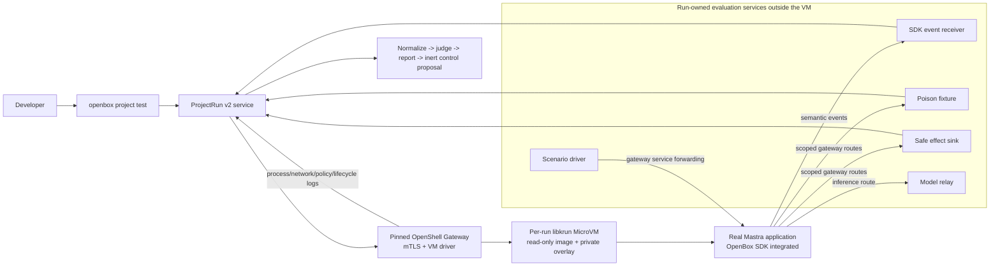

# Lean sandbox candidate for project assurance

**Status:** research decision record, 2026-08-25

**Decision:** qualify one pinned OpenShell MicroVM/libkrun tuple behind
ProjectRun v2 before considering Kubernetes, Kata Containers, or another
coding-host sandbox.

**Current support:** candidate only. A pinned macOS/Hypervisor.framework tuple
has passed a real Mastra/OpenBox **functional conformance** run, but it failed
sandbox qualification. Shift Left still has zero supported project-runner
tuples, ProjectRun v2 is planned but not implemented, and no OpenShell tuple is
qualified.

## Decision

The leanest credible sandbox for running the developer's real agent application
is:

```text
Shift Left
  -> OpenBox Sandbox ProjectRun v2
  -> pinned OpenShell Gateway API
  -> OpenShell VM compute driver
  -> one libkrun MicroVM
  -> exact application entrypoint
```

This removes Kubernetes, the Agent Sandbox controller, containerd, Kata, and a
separate hypervisor-selection layer from the first vertical slice. OpenShell's
VM driver uses libkrun with Hypervisor.framework on macOS and KVM on Linux. It
prepares a requested OCI image into a cached read-only image disk and gives each
sandbox a private writable `overlay.ext4` that is removed with sandbox state.

OpenShell is the execution substrate, not the OpenBox product contract.
Shift Left must see only typed ProjectRun operations and normalized evidence;
it must never receive an OpenShell handle, arbitrary exec surface, provider
credential, runtime path, or host port.

## Lean architecture



The fixture, receiver, sink, model relay, and their durable receipts remain
outside the evaluated VM. The application may call them only through
run-scoped authenticated routes. A compromised application therefore cannot
rewrite the evidence authority that determines whether an effect occurred.

## Component boundary

| Component | Owns | Must not own |
|---|---|---|
| Shift Left | User command, passive inspection, scenario selection, report and audit-pack publication | Provider API, host paths, VM handles, runtime credentials |
| ProjectRun v2 service | Closed run envelope, content-addressed inputs, lifecycle capabilities, logical services, evidence normalization, artifact retrieval, cleanup proof | Arbitrary shell, provider switching, unsandboxed fallback |
| OpenShell Gateway | Sandbox lifecycle, exact main-process specification, VM driver session, policy/inference routes, service forwarding, logs | OpenBox security judgment or control publication |
| OpenShell VM driver | Image preparation, libkrun VM, private overlay, VM networking, start/stop/delete reconciliation | Scenario meaning, OWASP mapping, OpenBox verdict |
| Real application | Normal Mastra entrypoint and OpenBox SDK integration | Provider choice, raw service coordinates, production credentials, evidence mutation |
| Evaluation services | Test data, SDK receipts, target receipts, safe effects, model relay | Production destinations or automatic policy application |

## Invocation mapping

The production integration uses the OpenShell Gateway API. CLI examples are
useful for a disposable prototype only; Shift Left must not shell out to the
OpenShell CLI in the supported path.

| ProjectRun operation | Lean OpenShell mapping |
|---|---|
| `capabilities` | Return one exact gateway, VM driver, platform, image, policy, evidence, and enforced-budget tuple. Reject drift before mutation. |
| `begin_project_run` / input upload | Store the canonical source objects and bind their digests to a run. Do not mount the host worktree. |
| `prepare` | Produce or select an OCI application image pinned by digest, with lockfile/runtime/produced-tree identities recorded. Preparation is separate from the hostile run. |
| `probe` | Launch a short-lived VM from the same pinned image and policy, run the fixed parent/child qualification helper, delete it, and mint a consuming capability only if every mandatory predicate passes. |
| `start_services` | Start the run-owned receiver, fixture, sink, model relay, and scenario driver outside the VM; issue only scoped logical routes and test identities. |
| `start_project` | Ask the Gateway to create one VM whose persisted main-process specification is the exact application argv and CWD. No shell reconstruction or idle bootstrap is permitted. |
| `wait_ready` / `stimulate` | Reach the application's declared listener only through gateway-managed service forwarding; send the one canonical scenario request. |
| `observe` | Merge SDK events and fixture/sink receipts with OpenShell OCSF network, HTTP, process, policy, and lifecycle observations. Missing channels remain explicit. |
| `seal_artifacts` | Stop the application, redact and seal normalized evidence, then publish the exact logical-role/CID inventory. Raw provider logs never become findings directly. |
| `delete` / `wait_deleted` | Delete the VM and its overlay, stop evaluation services, revoke scoped identities, and independently prove terminal absence. |

OpenShell documents one exact persisted main-process specification without
shell parsing, lifecycle reconciliation across gateway restart, and separate
stop versus delete semantics. ProjectRun must preserve those distinctions:
`stop` is not cleanup, and an accepted delete is not terminal absence until the
owned VM, overlay, routes, identities, sockets, and services are verified gone.

## Live macOS feasibility result

The 2026-08-25 self-verification used OpenShell `0.0.111`, its VM driver,
macOS `26.5.2`/arm64 with Hypervisor.framework, a fixed 2-vCPU/4096-MiB guest,
Node `26.7.0`, Mastra `1.8.0`, and OpenBox Mastra SDK `1.0.0`.

The VM reached Ready and ran the exact absolute argv. The real SDK authenticated
and emitted one marker-bearing `recordingTool` / `ActivityStarted` event before
the single safe-sink effect. With an empty external endpoint policy, a direct
Node HTTPS request to `example.com:443` was denied and recorded in OCSF. Normal
delete removed the sandbox state directory and private `overlay.ext4`.
The same behavioral result repeated from the cached prepared image. A separate
attempt also showed that VM Ready can precede sealed-result readiness, so
ProjectRun needs its own bounded application/result wait predicate.

This proves the execution substrate can run the real application path. It does
not prove ProjectRun assurance: the test receiver, fixture, model harness,
scenario driver, and sink were co-resident in the VM; the deterministic model
still had only one tool choice; and the supervisor reported both unavailable
Landlock enforcement and unavailable cgroup `pids.max`.

The former direct OpenShell MicroVM fixture was removed when the public
one-shot image evaluator replaced it. Its exact historical observations remain
in the [feasibility record](../plans/260825-0930-agent-behavior-assurance/evidence/openshell-mastra-macos-microvm-feasibility.md).

Operational findings for the lean prototype:

- macOS image preparation additionally requires Homebrew `e2fsprogs`;
- custom slim images need `iproute2`, with `nftables` used for bypass detection;
- the VM driver uses `/sandbox`, not the OCI `WORKDIR`, so the main command must
  use exact absolute paths; and
- fast one-shot processes need a durable result retrieval contract because they
  can exit before CLI attachment; and
- VM Ready is only supervisor readiness, not application or artifact readiness.

## Why not the other options first

| Option | Disposition |
|---|---|
| Docker or Podman | Leaner operationally but shares the host kernel. Keep for trusted development and the disposable OpenBox system plane, not the hostile evaluated application. |
| OpenShell + Kubernetes + Kata | Stronger shared-cluster and multi-tenant direction, but adds a cluster, CRDs/controller, container runtime, Kata shim, guest agent, and hypervisor layer before the first assurance scenario works. |
| Direct Kata or Firecracker | Strong VM boundary, but OpenBox would need to build image preparation, networking, lifecycle, service forwarding, policy transport, logs, and reconciliation that OpenShell already exposes. |
| Claude Code, Codex, Cursor, or Seatbelt sandbox | Useful workstation governance surfaces, but existing qualification work found listener, filesystem, runtime-lineage, or hard-process-bound gaps. Do not add another native wrapper. |

Kubernetes plus Kata becomes justified only when the product actually requires
shared-cluster scheduling, stronger tenant administration, dynamic per-run
resources, GPU scheduling, or independent cluster reconciliation.

## Current qualification gaps

OpenShell's MicroVM driver is promising but not qualified as-is:

1. the upstream architecture still labels the VM runtime experimental;
2. per-sandbox `--cpu` and `--memory` values are accepted but currently ignored
   by the VM driver, although fixed gateway-level `vcpus`, `mem_mib`, and
   `overlay_disk_mib` settings exist;
3. the current runtime architecture advertises the complete transparent TCP
   policy substrate for Docker and Podman, while other runtimes reject explicit
   TCP policy until they implement and validate the same contract;
4. the live macOS tuple explicitly reported unavailable cgroup `pids.max`, so
   it does not satisfy the ProjectRun process budget;
5. the same tuple emitted high-severity `Landlock Filesystem Sandbox
   Unavailable` findings; its observed `/app` denial was child/DAC evidence,
   not proof of the required filesystem-policy substrate;
6. application image identity, direct default-deny HTTPS, OCSF denial logging,
   normal-path overlay deletion, and the real Mastra/SDK path have live proof,
   but cache reproducibility, gateway restart, service forwarding, credential
   redaction, independent receipts, and complete OCSF delivery do not; and
7. macOS/Hypervisor.framework and Linux/KVM are different support tuples. A
   pass on one must not qualify the other.

Fixed gateway sizing can support one narrow first profile only if the service
advertises that exact fixed limit and rejects every incompatible request before
launch. It does not justify claiming dynamic per-run CPU or memory enforcement.

## First qualification row

Prefer one pinned Linux/KVM row first because its TAP/nftables behavior and
host cleanup can be inspected directly:

```text
OpenShell gateway digest
+ VM driver/libkrun digest
+ Linux kernel/KVM identity
+ bootstrap image digest
+ application image digest
+ OpenShell policy digest
+ mTLS identity/config digest
+ fixed VM sizing
+ ProjectRun schema/conformance digest
```

The row remains unsupported until it passes the existing PR01-PR15 and
TM01-TM17 suite, including:

- no host mount, ambient environment, inline secret, or production coordinate;
- declared and undeclared listener/port/interface probes;
- direct, proxied, redirected, DNS, HTTP, MCP, and model-route probes;
- parent and child filesystem, credential, process, timeout, and fallback
  probes;
- hard process, request, byte, duration, output, token, cost, and cleanup
  limits;
- SDK, receiver, fixture, effect, OpenShell, process, denial, and cleanup
  evidence with explicit missing states;
- gateway/provider crash and restart at every mutation stage; and
- terminal absence of VM, overlay, routes, credentials, processes, sockets,
  services, and artifacts.

If a mandatory capability is absent, ProjectRun returns `not_runnable` before
reading project/profile inputs or creating provider state. It never retries on
Docker, a coding-host sandbox, or the native host.

## Sources

- [OpenShell sandbox compute drivers](https://docs.nvidia.com/openshell/reference/sandbox-compute-drivers)
- [OpenShell compute-runtime architecture](https://github.com/NVIDIA/OpenShell/blob/main/architecture/compute-runtimes.md)
- [OpenShell sandbox policy](https://docs.nvidia.com/openshell/latest/sandboxes/policies)
- [OpenShell sandbox lifecycle and service forwarding](https://docs.nvidia.com/openshell/latest/sandboxes/manage-sandboxes)
- [OpenShell structured logging](https://docs.nvidia.com/openshell/observability/logging)
- [ProjectRun v2 plan](../plans/260822-2330-openbox-sandbox-projectrun-v2/plan.md)
- [Provider-neutral ProjectRun requirements](../plans/260819-1600-project-security-evaluation/evidence/openbox-sandbox-projectrun-requirements.md)
- [ProjectRun threat model](../plans/260819-1600-project-security-evaluation/evidence/openbox-sandbox-projectrun-threat-model.md)
