# OpenBox Shift Left Security Evaluation

## Understand how an AI agent behaves, identify the risk, and apply the right control

AI agents do more than generate text. They can call tools, connect to APIs,
query databases, use MCP servers, read files, retrieve external content, and
take actions on behalf of users.

OpenBox Shift Left Security Evaluation helps organizations understand whether
those actions are safe before an agent is deployed. It runs the real agent
application in a controlled environment, observes its behavior under realistic
security scenarios, explains the risks, and recommends the OpenBox controls
needed to govern that behavior.

```text
Run the real agent
  -> observe its behavior
  -> identify the security risk
  -> recommend a runtime control
  -> verify that the control works
```

## The problem

Traditional security tools are important, but they do not fully explain how an
AI agent will behave at runtime.

A code scanner can show that an HTTP tool or database connector exists. It
cannot always determine:

- whether the model will choose that tool after receiving manipulated input;
- what information the agent will send;
- how untrusted content influences the agent's decision;
- whether an approval or policy is applied before the action; or
- whether the security control actually prevents the effect.

This creates a gap between identifying possible risks and understanding what
the agent can actually do.

### Why this matters

Agent behavior is dynamic. It can depend on:

- user prompts;
- model responses;
- retrieved documents and external data;
- tool and API results;
- MCP servers;
- memory and previous context; and
- the sequence of actions taken during a run.

An application may look safe during source review but behave unexpectedly when
these elements interact.

Security teams need evidence of the real behavior. Developers need specific
guidance on where to add protection. Organizations need a way to verify that
the protection works.

## The solution

Shift Left Security Evaluation provides behavioral security assurance for
AI-agent applications.

The developer integrates the appropriate OpenBox SDK into the application. For
example, an agent built with Mastra uses the OpenBox Mastra SDK. The SDK observes
supported agent actions at meaningful points, such as before a tool is
executed.

Shift Left then runs controlled security scenarios against the real
application. It combines two types of evidence:

1. **Inside the agent:** OpenBox SDK events explain which agent, tool, or action
   was selected and what context led to it.
2. **Outside the agent:** the controlled environment records network requests,
   test-system interactions, and whether the expected effect occurred.

Together, this evidence explains both the agent's intent and the real outcome.

## How it works

```mermaid
flowchart LR
  PROJECT["Real AI-agent application\nwith OpenBox SDK"]
  INSPECT["1. Understand\ntools, APIs, MCP, data flows"]
  RUN["2. Run\nin a controlled environment"]
  TEST["3. Test\nwith realistic security scenarios"]
  OBSERVE["4. Observe\nagent decisions and effects"]
  ANALYZE["5. Analyze\nrisk and security standards"]
  CONTROL["6. Recommend\nrules, policies, guards, approvals"]
  VERIFY["7. Verify\nby running the scenario again"]

  PROJECT --> INSPECT --> RUN --> TEST --> OBSERVE --> ANALYZE --> CONTROL --> VERIFY
```



### 1. Understand the application

Shift Left identifies the application entrypoint, framework, tools, APIs, MCP
connections, and OpenBox SDK coverage.

This creates a clear map of where the agent can act and which security
scenarios are relevant.

### 2. Run the real application safely

The application runs in a controlled, isolated environment with test data and
safe destinations. Production credentials and production systems are kept out
of the evaluation.

This allows realistic behavior to be tested without exposing real customers,
data, or infrastructure.

### 3. Exercise realistic security scenarios

Shift Left introduces controlled security conditions through the same types of
interfaces the application normally uses.

Examples include:

- indirect prompt injection from an external document;
- unsafe instructions returned by an MCP tool;
- sensitive data being passed to an HTTP tool;
- an agent attempting a high-impact action without approval;
- unsafe action sequences across multiple tools; and
- missing security visibility around a custom integration.

### 4. Observe decisions and effects

The evaluation records:

- what untrusted input the agent received;
- which tool or action the model selected;
- what the OpenBox SDK observed before execution;
- what network, MCP, file, database, or other effect was attempted;
- whether the effect reached the controlled destination; and
- whether an OpenBox decision or another security boundary stopped it.

This prevents different events from being confused. For example, a model
refusing a request is different from an OpenBox policy blocking a tool, and a
sandbox denying a network connection is different from runtime governance.

### 5. Explain the security issue

Shift Left correlates the evidence into a clear behavioral finding.

Each finding answers:

- What did the agent do?
- What influenced the behavior?
- Which trust or authorization boundary was crossed?
- What effect occurred or was attempted?
- Why is the behavior risky?
- Which security standard is relevant?
- Where can the behavior be controlled?

Findings can be mapped to standards such as OWASP guidance for generative AI
and agentic applications. The standards help describe the risk; the recorded
behavior remains the evidence.

### 6. Recommend the right OpenBox control

The report connects the observed behavior to a practical runtime protection.

| Observed risk | Recommended OpenBox integration |
|---|---|
| A dangerous tool, HTTP, database, file, or MCP action | A policy that controls the action and its validated attributes. |
| Untrusted content followed by a sensitive action | A behavior rule that recognizes and controls the sequence. |
| Secrets, personal data, unsafe prompts, or unsafe output | A guard at the point where the content is available. |
| A high-impact action requiring human judgment | An approval step before execution. |
| An action the SDK cannot currently observe | A clear coverage gap and required integration change. |

Recommendations are reviewable. Organizations decide whether and how to apply
them.

### 7. Verify the control

After the control is reviewed, Shift Left runs the same application and
security scenario again.

The evaluation verifies whether:

- the expected OpenBox decision was issued;
- the application received the decision;
- the SDK applied it before the action;
- the unsafe effect was prevented; and
- the evidence from the repeated run agrees.

This closes the gap between writing a policy and proving that it protects the
real application.

## Example: indirect prompt injection

Consider an AI customer-support agent that reads external documents and can
send information through an HTTP tool.

An attacker places hidden instructions in a document. The instructions tell the
agent to send information to an external destination.

Shift Left evaluates the behavior as follows:

1. The agent reads a controlled document containing the unsafe instruction.
2. The model decides whether to select the HTTP tool.
3. The OpenBox SDK records the tool attempt before execution.
4. A safe test destination records whether the effect occurred.
5. The report explains the full chain from untrusted content to sensitive
   egress.
6. Shift Left recommends a behavior rule, policy, guard, or approval step at
   the point where the action can be controlled.
7. The scenario runs again to verify whether the selected control prevents the
   effect.

Instead of reporting only “prompt injection may be possible,” the evaluation
shows what the agent attempted, why it was risky, where to apply protection,
and whether that protection worked.

## The benefits

### For development teams

- Find security issues while the application is still being built.
- Reproduce risky agent behavior in a safe environment.
- Receive specific guidance instead of generic security warnings.
- Understand where SDK coverage or integration work is missing.
- Verify fixes and controls before release.

### For security teams

- Prioritize behavior that is observable and reachable.
- Review evidence connecting agent decisions to real effects.
- Distinguish model refusal, sandbox prevention, and runtime governance.
- Map observed behavior to recognized AI-security standards.
- Create repeatable security scenarios for release reviews.

### For organizations

- Reduce uncertainty around autonomous agent behavior.
- Shorten the path from finding a risk to applying protection.
- Produce clear evidence for internal review, governance, and audit processes.
- Connect pre-release testing with the controls used in deployment.
- Build a reusable library of scenarios, findings, and verified control
  patterns.

## How it differs from security scanning

Shift Left Security Evaluation complements existing security tools. It does not
replace source-code analysis, dependency scanning, secret detection, or general
penetration testing.

| Traditional security scanning | Shift Left Security Evaluation |
|---|---|
| Inspects code, packages, configuration, or exposed systems. | Runs the real SDK-integrated agent application. |
| Identifies possible vulnerabilities and known patterns. | Observes how the agent behaves under a controlled scenario. |
| Often reports the location of a technical issue. | Connects untrusted input, agent decisions, actions, and effects. |
| Recommends code or configuration changes. | Recommends OpenBox runtime rules, policies, guards, or approvals. |
| Rescans to see whether a finding remains. | Reruns the behavior to verify whether the control was applied before the effect. |

The key difference is not simply finding a risk. It is connecting observed
agent behavior to an enforceable runtime control and verifying that the control
works.

## Where it fits

Shift Left Security Evaluation is designed for organizations building AI
agents that can use tools or affect external systems.

Common use cases include:

- security review before an agent release;
- testing new tools, MCP servers, or data sources;
- validating controls for high-impact agent actions;
- investigating unsafe behavior reported during development;
- preparing evidence for internal AI-governance review; and
- verifying that a proposed OpenBox control protects the application.

It is especially relevant when an agent can access sensitive information,
communicate externally, modify data, trigger workflows, or act on behalf of a
user or organization.

## Business value

Shift Left Security Evaluation creates value by reducing the distance between
security discovery and runtime protection.

```text
Possible risk
  -> observed behavior
  -> clear evidence
  -> practical control
  -> verified protection
```

This can reduce manual investigation, improve collaboration between developers
and security teams, accelerate security approval, and make runtime governance
more actionable.

For OpenBox, it connects three parts of the agent lifecycle:

1. governing the tools used to build the application;
2. evaluating the behavior of the application before release; and
3. enforcing reviewed controls when the application is deployed.

The result is a continuous security workflow rather than a one-time report.

## In one sentence

> OpenBox Shift Left Security Evaluation runs the real AI-agent application in
> a controlled environment, observes how it behaves, explains the security
> risk, recommends the right runtime control, and verifies that the control
> works.
