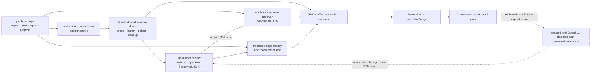
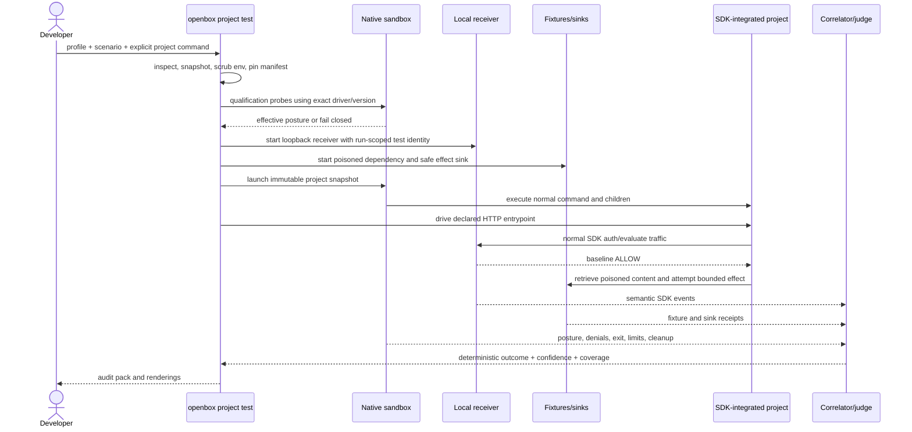

# Project security evaluation implementation plan

This is the execution ledger for the architecture in
[`dc/security-evaluate.md`](../../dc/security-evaluate.md). Execution was
briefly unblocked on 2026-08-24 by a first-party Seatbelt driver, then
**re-blocked on 2026-08-25** after live review proved that its declared TCP
bind rule also permitted `0.0.0.0`, its profile permitted host-wide reads, its
launcher did not apply the declared snapshot CWD, and an unqualified Node 22
runtime could produce a verified pack. The CWD defect is fixed, but no runner
currently satisfies the whole confinement and lineage contract. A prior
2026-08-23 conformance review withdrew the native Codex support row after its
exact `0.149.0` profile reached both a declared and undeclared
`127.0.0.1` listener, violating Phase 03's endpoint-isolation stop condition.
The CLI now fails closed for both drivers before reading project or profile bytes. Docker Compose
remains authorized only for the local OpenBox system and is not an evaluated-
project fallback. Historical completion evidence below remains useful functional
observation, but it no longer proves a supported sandbox tuple. Research and source
inspection used to write this plan are planning evidence, not implementation or
runtime verification.

Do not resume persistent project execution until SE-03-10 has a replacement
tuple or configuration that proves exact endpoint isolation.

The feature is delivered inside the existing `openbox` binary as a separate
project-assurance lane. Passive inspection and verified-pack reporting remain
available. The implemented execution path is retained but disabled until a
runner proves every sandbox gate; historical runs captured framework SDK,
mock-effect, and sandbox evidence. The feature does not add an SDK scan mode,
mutate project source, upload baseline attack traffic, publish policy, or claim
that a sandbox denial is an OpenBox runtime block.

## Outcome and delivery form

The first usable slice is:

```text
openbox project inspect [path] [--output DIR]
openbox project test [path] --profile FILE --scenario ID --sandbox DRIVER -- COMMAND...
openbox project report --pack DIR [--format markdown|json|sarif]
openbox project propose --pack DIR [--format json|markdown]
```

It ships as five coordinated pieces:

1. new `openbox project` commands and internal Go packages in this repository;
2. versioned project-model, run-profile, SDK-coverage, sandbox-posture,
   security-test, audit-pack, and policy-proposal schemas;
3. the developer's existing framework-specific OpenBox SDK, unchanged and
   configured only in the child process environment;
4. a fail-closed sandbox boundary plus local fixture/receiver components for a
   future qualified runner;
5. a content-addressed local audit pack used by console, Markdown, JSON, and
   SARIF renderers.

The MVP target is a Node/TypeScript Mastra application using the local
`openbox-mastra-sdk` clone pinned by SE-00-04.
No MVP sandbox candidate is currently qualified. The former standalone Codex
`0.149.0` tuple is withdrawn; Docker remains excluded as the evaluated-project
sandbox, and no evidence may claim a hard process ceiling. Docker Compose may
operate the isolated local OpenBox system plane only. Claude remains comparative
native-sandbox evidence, not an automatic fallback.

## Architecture and ownership



| Boundary | Plan decision | Reason |
|---|---|---|
| CLI/package | Put implementation under `cli/internal/assurance/...`; do not add a twelfth Go module for the MVP | Only the CLI consumes it initially; avoids new `go.work` and replace/CI surface under ADR-0011 |
| Existing SDK | Reuse it unchanged as middleware; no scan mode, injection API, or SDK fork | The SDK owns semantic action observation and verdict application, not project launching or fixture substitution |
| Scenario injection | Supply attacker data through real HTTP/retrieval/MCP/dependency seams and record the fixture response | Avoids claiming that the SDK returned a tool result it did not return |
| Sandbox | Launch only through an exact tuple that passes every gate; none currently does | A host or product name is not confinement evidence; every required probe gates launch |
| Receiver | Loopback-only, run-scoped test bearer, normal SDK endpoints, baseline `ALLOW` | Captures the real SDK wire without sending synthetic attacks to production |
| Judgment | Deterministic predicates over correlated evidence | An LLM may generate hypotheses, but it may not decide `blocked` or fill missing evidence |
| OpenBox Core | Absent from baseline; real isolated decision path only in an explicitly authorized governed rerun | A hard-coded mock `BLOCK` proves only error handling, not policy reachability |
| OpenBox Sandbox | Do not use its current v1 as the MVP project runner; design a separate `ProjectRun` v2 contract in Phase 08 | Current v1 deliberately has an empty workspace, no environment/secrets/mounts, fixed `/sandbox`, and a 300-second single-command contract |

Project assurance must not be added to `provider.HookEngine` or
`adapters/common/hookflow`. Those interfaces govern coding-host events. This
feature has a different subject, execution authority, evidence store, and
failure contract.

### Sandbox recommendation

| Option | Use in this plan | Benefit | Cost/limit |
|---|---|---|---|
| First-party Seatbelt profile (`sandbox-exec`) | **Withdrawn candidate** | Expresses per-port outbound loopback rules | Its local TCP bind rule is port-scoped but not interface-scoped; it permitted `0.0.0.0`, broad host reads, and the reviewed runner lacked snapshot/runtime lineage |
| Native Codex sandbox, standalone command | **Withdrawn candidate** | Reuses the installed agentic sandbox and runs the developer's real command and existing SDK | Host-scoped loopback rules failed exact endpoint isolation; hard process count is also unsupported |
| Native host sandbox, inherited from Codex/Claude | Optional convenience tuple after standalone | Avoids nested launcher setup when already inside a host | Harder to attest effective config; never accepted from process ancestry alone |
| OpenBox Sandbox v1 | **Do not use for project runs** | Strong lifecycle, mTLS, fixed policy, typed evidence | Cannot stage/configure a real project under its deliberately narrow request contract |
| OpenBox Sandbox `ProjectRun` v2 | Gated later backend | Reproducible CI/remote execution, durable cleanup, stable typed evidence | Requires a new threat model, protocol, client, staging, service topology, and operations |

This sequencing preserves the passive assurance surface while active execution
stays fail-closed. A later runner, including a separately authorized OpenBox
Sandbox v2, must qualify without becoming an implicit fallback.

## Execution sequence



No driver fallback occurs after a run begins. If the selected driver is absent,
its effective restrictions cannot be proven, the child cannot reach the local
receiver, or the production endpoint cannot be excluded, the result is
`not_runnable` and the project command is not started.

## Plan baseline to record in ADR-0020

These are implementation defaults, not accepted architecture until Phase 00
lands and indexes ADR-0020:

- schema identifiers retain the names in `dc/security-evaluate.md` and add
  `openbox.project-run-profile/v1`;
- JSON schemas live under `contracts/project-assurance/`; Go implementation
  remains internal to `cli`;
- the first callable project form is an HTTP service declared by a versioned
  run profile (health probe, stimulus request, fixture bindings, and budgets);
- Mastra is the only MVP SDK descriptor; exact package/config keys are
  qualified against a pinned SDK release rather than inferred from README copy;
- Codex standalone sandbox is the preferred first candidate, not an assumed
  dependency; Claude standalone/inherited modes follow after the common probes;
- baseline receiver implements `GET /api/v1/auth/validate` and
  `POST /api/v1/governance/evaluate`; approval polling is unsupported until a
  scenario requires it;
- the only v1 disk retention is normalized/redacted evidence plus content
  digests; raw content is not a v1 persistence mode;
- there is no audit-pack upload, project-source edit, policy publish, or legacy
  `openbox-audit` shim unless Phase 00 finds evidence that the old binary shipped.

## Phases and progress

Phases are sequential through the first vertical slice. Work inside a phase may
run in parallel only when its task dependencies permit it.

| # | Phase | Tasks | Effort | Status | Exit gate |
|---|---|---:|---:|---|---|
| 00 | [Architecture decision and dependency qualification](phase-00-architecture-and-qualification.md) | 8 | 3d | verified | ADR accepted; exact SDK and sandbox candidates pinned; unresolved branches have owners |
| 01 | [Artifact contracts and immutable run workspace](phase-01-artifacts-and-workspace.md) | 8 | 5d | verified | Schemas validate; normalized content is deterministic; source is unchanged |
| 02 | [Passive inspection and SDK coverage](phase-02-inspection-and-sdk-coverage.md) | 8 | 5d | verified | `inspect` emits evidence-backed graph and expected coverage without executing code |
| 03 | [Sandbox SPI and first local driver](phase-03-native-sandbox-driver.md) | 10 | 6d | blocked | SPI is implemented, but every candidate is rejected and active execution fails closed |
| 04 | [Local receiver, fixtures, and run profile](phase-04-receiver-fixtures-run-profile.md) | 9 | 6d | verified | Receiver, fixture, relay, profile, and service-overlay component gates passed; combined launch belongs to Phase 05 |
| 05 | [Mastra baseline vertical slice](phase-05-mastra-baseline.md) | 9 | 7d | implemented; historical | Functional Mastra observations and packs exist, but no current runner qualifies their execution lineage |
| 06 | [Correlation, audit pack, reports, and proposal](phase-06-judgment-report-proposal.md) | 8 | 6d | verified | The data plane is wired to the run lane; a live run's pack verifies, validates, renders and proposes |
| 07 | [Governed rerun, second host, and release qualification](phase-07-governed-rerun-and-release.md) | 9 | 8d | blocked | Real-engine observations exist, but there is no supported project runner or release row |
| 08 | [OpenBox Sandbox `ProjectRun` v2 decision track](phase-08-openbox-sandbox-v2.md) | 8 | 5d discovery | verified | Reuse decision and separate implementation plan are evidence-backed; v1 remains unchanged |

**Effort model:** engineer-days, not elapsed calendar time; excludes model/API
spend, external Core/backend repairs, and implementation of OpenBox Sandbox v2.
Phases 00–06 are the baseline MVP (38d). Phase 07 raises the claim from local
baseline evaluation to a qualified governed rerun (46d cumulative). Phase 08 is
a cross-repository discovery gate; accepted implementation is estimated as a
separate 46 engineer-day plan plus provider infrastructure/live qualification.

## Progress protocol

The table above and each phase task table are the sole progress ledger for this
work item. Update both in the same change.

Allowed task states:

| State | Meaning |
|---|---|
| `planned` | No implementation work has started |
| `in_progress` | An owner is actively working; evidence link may be partial |
| `blocked` | A named dependency prevents progress; the blocker and next action are recorded |
| `implemented` | Code and scoped automated tests pass, but required live proof has not run |
| `verified` | The phase's exit proof ran against the pinned real SDK/host/runtime combination |
| `not_applicable` | The ADR chose another branch; rationale and replacement task are linked |

Rules:

1. Exactly one task per owner may be `in_progress` unless parallel ownership is
   explicit.
2. A task cannot become `implemented` without a commit/diff link and test
   evidence. A document or mock is not live evidence.
3. A phase cannot become `verified` while a required task is merely
   `implemented`, or while an exit-gate artifact says `inconclusive`.
4. Every status change adds a dated row to the phase's progress log with owner,
   evidence, and any changed assumption.
5. Record exact CLI/SDK/framework/model versions in evidence. “Latest” is not a
   support claim.
6. Missing semantic evidence fails to `inconclusive`/`not_runnable`; it never
   silently downgrades a predicate or becomes `not_observed`.
7. Cross-repository work is tracked as a dependency or separate plan. Do not
   mark a Shift Left phase verified because another repository has a proposal.

## End-to-end acceptance matrix

| Claim | Required proof |
|---|---|
| Static inspection is passive | Import/exec tripwire fixture remains untouched; subprocess spy records zero launches |
| Snapshot is exact | Selected source-byte manifest, exclusions, Git state, and before/after source digests are recorded |
| Sandbox is effective | Parent and spawned child both fail an outside-write probe and unapproved-egress probe; allowed loopback succeeds; fallback probe cannot escape |
| Production credentials are absent | Child environment allowlist test plus production-key/URL sentinels; receiver uses only a run-scoped `obx_test_...` bearer |
| SDK integration is real | Pinned framework SDK emits startup and scenario events to the receiver through its normal configuration path |
| Behavior is exploitable | SDK records the covered pre-effect attempt and the safe mock sink independently records the synthetic protected payload |
| Coverage failure is honest | Disabling the required hook or bypassing the wrapped path produces `inconclusive`/`not_runnable`, never a pass |
| Sandbox prevention is distinct | SDK attempt plus sandbox denial plus no sink receipt yields `sandbox_prevented`, not `blocked` |
| OpenBox block is real | Named real decision, SDK pre-effect application, no sink receipt, same pinned baseline/scenario/snapshot |
| Reports are projections | JSON, Markdown, and SARIF facts resolve to audit-pack object digests; renderers cannot invent findings |
| Proposal is inert | No source bytes, production API, policy store, or deployed configuration change during `propose` |
| Results are reproducible | Same normalized fixture inputs produce byte-stable content objects; runtime envelope differences remain explicit |

## Supported outcome and control vocabulary

The implementation must use the architecture's closed outcomes:
`exploitable`, `blocked`, `sandbox_prevented`, `not_observed`, `inconclusive`,
and `not_runnable`. Confidence, repetitions, evidence level, and coverage are
separate fields.

Each finding also has exactly one control-reachability class:
`runtime_enforceable`, `host_enforceable`, `observable_only`,
`code_change_required`, or `blind`. A native host sandbox can contribute to
`host_enforceable`; it cannot make a deployed project `runtime_enforceable`.

## Source and capability baseline

| Subject | Planning observation | Implementation implication |
|---|---|---|
| Shift Left | `eaea69b8ace33b8900d6ea0138a71e5f18e18fe3`; no `openbox project` route or assurance package | New lane is real implementation, not wiring an existing command |
| Mastra SDK | local `db9863bd6659f8b1ce6a33903ea61e4e564be38b`; package `1.0.0`, base SDK alias `1.0.1`, and Mastra Core `1.8.0` are lock-pinned; normal `withOpenBox` auth/evaluate path is qualified | Use unchanged middleware with explicit `apiUrl`/`apiKey`, fail-closed start gating, and unsigned test identity |
| Codex CLI | local `codex-cli 0.149.0`; standalone `codex sandbox` exposes command, working directory, permission profile, sandbox state, Unix-socket allowance, and denial logging | Sole MVP candidate; capability tests still gate support |
| Claude Code | local `2.1.235`; documented Bash sandbox covers child processes and exposes fail-unavailable/unsandboxed-command controls | Second driver; require `failIfUnavailable=true` and no escape hatch when inherited |
| OpenBox Sandbox | local `5e88a4548d391e7a0b6c9cb0154e06128f1d00fc`; v1 omits env/secrets/mounts, creates a fresh empty workspace, fixes workdir, caps a command at 300s, and exports its client only to tests | Do not stretch v1 into a project runner; Phase 08 specifies a new contract |

Host documentation is capability input, not proof. Current source references:
[Codex sandboxing](https://learn.chatgpt.com/docs/sandboxing),
[Codex permissions](https://learn.chatgpt.com/docs/permissions),
[Codex app-server command execution](https://github.com/openai/codex/blob/main/codex-rs/app-server/README.md),
[Claude Code sandboxing](https://code.claude.com/docs/en/sandboxing), and
[Claude sandbox environments](https://code.claude.com/docs/en/sandbox-environments).

## Risks and pre-decided responses

| Risk | Signal | Response |
|---|---|---|
| Native sandbox semantics drift by version/platform | Qualification fixture changes or denial probe fails | Remove that tuple from support matrix; stop before project launch |
| Native tuple cannot enforce hard process count | `maxProcesses` has no Codex control surface | Record the limit as unsupported; retain timeout, process-group ownership, and cleanup proof without relabeling them as a count ceiling |
| Loopback receiver and external model need incompatible network posture | Receiver/model readiness fails under least privilege | Do not enable broad network silently; revise profile/driver or mark scenario `not_runnable` |
| SDK docs overstate coverage | Outer sink sees effect without expected SDK pre-effect event | Record coverage gap and `inconclusive`; fix descriptor/integration before a verdict |
| Framework config keys differ from base SDK | Startup probe reaches wrong endpoint or production sentinel | Pin descriptor to tested package version; never guess a universal environment key |
| Scrubbed environment breaks dependency startup | Project readiness fails with explicit missing input | Add a declared non-secret input to the run profile; never inherit the full parent environment |
| Model nondeterminism hides a reachable exploit | Mixed repeated outcomes | Record every run and frequency; do not translate a majority refusal into safety |
| Raw traces contain project secrets | Redaction detects content or cap/parse fails | Keep bounded raw only in memory until normalization/finalization, persist redacted projection/digest, mark lost evidence |
| Synthetic traffic pollutes production | Any request targets non-loopback OpenBox URL during baseline | Terminate run, classify `not_runnable`, preserve sentinel evidence |
| OpenBox Sandbox v1 is weakened for convenience | Proposal adds host mounts/env/secrets to existing request shape | Reject; use versioned `ProjectRun` contract and separate threat model/ADR |

## Global completion criteria

- [ ] Phases 00–06 are `verified` for the one pinned Mastra MVP SDK, one pinned
      native host sandbox, and one indirect-prompt-injection-to-mock-egress scenario.
- [ ] Phase 07 proves `blocked` through an isolated real decision path and
      publishes a support matrix with at least one macOS tuple; unsupported
      platforms are explicit.
- [x] Source worktree remains byte-identical apart from declared `.openbox`
      artifacts; cleanup evidence exists for every run-owned process and temp path.
- [x] No production credential, endpoint, control-plane write, or destructive
      target appears in baseline test evidence.
- [x] Disabling required instrumentation, denial logging, child inheritance, or
      receiver reachability prevents a positive security claim.
- [x] Documentation distinguishes implemented, unit-tested, observed,
      repeated, and release-qualified behavior.
- [x] Phase 08 either rejects current OpenBox Sandbox reuse with a stable reason
      or produces an accepted v2 ADR plus a separately estimated implementation
      plan; it does not mutate the v1 contract under this plan.

## Progress log

| Date | Change | Status/evidence |
|---|---|---|
| 2026-08-19 | Plan created from current Shift Left, SDK, host-sandbox documentation, and OpenBox Sandbox source inspection | Planning only; delivery remains 0/77 tasks complete |
| 2026-08-19 | Started Phase 00 task SE-00-01 | Baseline qualification evidence collection in progress; no delivery task complete yet |
| 2026-08-19 | Verified SE-00-01 and started SE-00-02 | `evidence/baseline.json`; `jq` structure and transcript-digest checks passed; Codex `0.148.0`, Claude Code `2.1.235`, macOS `26.5.2` arm64; LangGraph tuple remains owned by SE-00-04 |
| 2026-08-19 | Verified SE-00-02 and started SE-00-03 | Accepted and indexed `docs/adr/ADR-0020-project-assurance-native-sandbox.md`; index/link/whitespace checks and `git diff --check` passed; tuple support remains unclaimed pending executable qualification |
| 2026-08-19 | Verified SE-00-03 and started SE-00-04 | ADR-0020 freezes seven v1 schema IDs, strict compatibility, RFC 8785/JCS plus SHA-256, atomic manifest-last pack layout, and six inventory-test gates; no schema code exists yet |
| 2026-08-19 | Verified SE-00-04 and started SE-00-05 | Exact SDK lock and loopback-wire records qualify LangGraph SDK `1.0.0` plus base SDK `1.2.0` on Python `3.12.9`; signed normal auth/evaluate traffic placed tool `ActivityStarted` before the effect, while the mock stop remains non-OpenBox evidence; focused tests passed with recorded cleanup warnings and strict-context/subagent limitations; Codex native-sandbox qualification is now the sole active root task |
| 2026-08-19 | Verified SE-00-05 and started SE-00-06 | Codex CLI `0.148.0` on macOS Seatbelt passed deterministic parent/child cwd, filesystem, sanitized-environment, proxy-loopback, unlisted-network, denial-log, timeout-cleanup, invalid-state, and backend-unavailable fault probes; no unsandboxed fallback ran; the standalone command lacks a native output cap, so Phase 03 owns bounded streaming before launch; Claude qualification is now the sole active root task |
| 2026-08-19 | Verified SE-00-06 and started SE-00-07 | Standalone SRT `0.0.73` and inherited Claude Code `2.1.235` passed parent/child filesystem, loopback, unlisted-network, credential-removal, escape-denial, backend-fault, timeout, and cleanup checks against local fixtures; `allowLocalBinding=true` exposes every local port on this tuple; inherited backend failure is a Bash error while Claude itself exits zero, so the qualification wrapper proved explicit nonzero mapping `86`; the Claude parent was not syscall-confined and no paid/provider request ran; v1 run-profile and receiver decisions are now the sole active root task |
| 2026-08-19 | Verified SE-00-07 and started SE-00-08 | ADR-0020 and the profile draft freeze the loopback receiver state machine, production-coordinate rejection, sole redacted retention, closed template/environment/relay authority, and aggregate/parser/budget bounds; strict Ajv `8.17.1` passed one positive, 15 schema-negative, and 18 semantic-negative cases; a fresh exact five-package reinstall matched recorded hashes/integrities and reproduced the result byte-for-byte; no paid/provider/live run occurred; shipped `openbox-audit` history is now the sole active root task |
| 2026-08-19 | Owner selected local `openbox-mastra-sdk` for the MVP and reopened SE-00-04 | Delivery rollup returns to 5/77: the prior LangGraph wire qualification remains comparative evidence, but it no longer satisfies the first SDK gate; LangGraph-pinned SE-00-07 is planned again and partially researched SE-00-08 is paused; Mastra tuple qualification is now the sole active root task |
| 2026-08-20 | Verified Mastra SE-00-04 and restarted SE-00-07 | Local tag/commit `db9863b` and the committed npm lock qualify `@openbox-ai/openbox-mastra-sdk@1.0.0`, base SDK `1.0.1`, Mastra Core `1.8.0`, and Node `26.7.0`; real `withOpenBox` loopback auth/evaluate wire placed `ActivityStarted` before the bounded effect and stopped a second effect on mock BLOCK, which remains SDK-only evidence; 60 focused and 195 full-module tests plus lint/typecheck/build passed; rollup is 6/77 and the Mastra run-profile descriptor is now the sole active root task |
| 2026-08-20 | Verified Mastra-only SE-00-07 and restarted SE-00-08 | The exact profile descriptor now accepts only the qualified Mastra/base/Core tuple and `recordingTool` sensitive-action gate; Ajv `8.17.1` exact replay passed one positive, 16 schema negatives, and 18 semantic negatives with current decision/input hashes; safe `withOpenBox` literal-or-trusted-fallback shapes are frozen and other event classes remain unqualified until live readiness proof; rollup is 7/77 and the paused no-shim release search is now the sole active root task |
| 2026-08-20 | Verified SE-00-08, closed Phase 00, and started SE-01-01 | Local/public history, 19 repositories/48 releases, checksum-matched Shift Left archives, and relevant registry searches found no shipped `openbox-audit`; bounded negative evidence excludes private/deleted/manual distribution visibility, but supplies no basis for a shim, alias, redirect, second binary, or second engine; all eight Phase 00 tasks and exit gates are verified, rollup is 8/77, and the seven-schema inventory is now the sole active root task |
| 2026-08-20 | Verified SE-01-01 and started SE-01-02 | The closed public inventory now has exactly seven strict draft-2020-12 schemas, seven frozen valid examples, a compact mutation corpus, fixed Mastra MVP/manifest/sandbox/judgment/retention/authority semantics, and exact Ajv `8.17.1` evidence; 41 basic, 24 structural-adversarial, and 7 semantic-adversarial negatives passed, the run-profile replay retained 16 schema plus 18 semantic negatives, and the evidence record explicitly defers JCS, object resolution, finalization, tamper, SDK, sandbox, and live claims; rollup is 9/77 and canonical JSON/content digests are the sole active root task |
| 2026-08-20 | Verified SE-01-02 and started SE-01-03 | RFC 8785 canonical bytes and lowercase SHA-256 content IDs are deterministic across map insertion order; official serialization, UTF-16 ordering, 22 finite-number vectors, malformed-input, depth, cycle, and closed custom-marshaler tests passed with race, 96,216 bounded fuzz executions, full CLI module tests, and vet on Go `1.26.7`; exact final hashes and proof limits are recorded in `evidence/canonical-json-validation.json`; rollup is 10/77 and the run-directory lifecycle is the sole active root task |
| 2026-08-20 | Verified SE-01-03 and started SE-01-04 | The Darwin/APFS run-directory lifecycle now uses durable lifecycle sentinels, exclusive handle-relative manifest publication, closed read-only pack paths, no-follow/mount-aware sealing and cleanup, an xattr-bound orphan state, explicit closed orphan cleanup, and truthful receipts; abrupt finalization, cleanup, and markerless-final-window subprocess exits plus hard-link and replacement fixtures passed with package/race/full CLI tests, vet, and cross-compilation; exact source/module hashes and the Linux-runtime, xattr, power-loss, filesystem-validity, and same-identity final-entry limits are recorded in `evidence/run-directory-lifecycle-validation.json`; rollup is 11/77 and safe project-root/source selection is the sole active root task |
| 2026-08-20 | Verified SE-01-04 and started SE-01-05 | Canonical root/boundary resolution and descriptor-relative sorted traversal now reject external symlink hops, filesystem/mount transitions, unsafe dot-dot, unrepresentable paths, and run-owned boundaries without reading special-file contents; nonblocking descriptor opens and post-open type checks close regular-to-FIFO hangs; adversarial package/race/full CLI tests, vet, and Darwin/Linux/Windows cross-compilation passed; exact source/module hashes and Linux-runtime/mount, atomicity, invalid-UTF-8, copy/exclusion/omission, and live-proof limits are recorded in `evidence/project-source-selection-validation.json`; independent review found no remaining high/medium issue; rollup is 12/77 and deterministic snapshot copying is the sole active root task |
| 2026-08-20 | Verified SE-01-05 and started SE-01-06 | Caller-owned private destinations now receive deterministic regular-file copies with canonical per-file hashes, executable-bit semantics, bounded mutable-file reads, immediate source re-verification, exact copied-tree rehashing, stable mount/source-alias rejection, and owner-only read-only modes; repeated/adversarial package and race tests, full CLI tests, vet, and Darwin/Linux/Windows cross-compilation passed; `evidence/deterministic-snapshot-copy-validation.json` pins exact hashes and the caller-cleanup, operational-size, Linux-runtime/mount, hostile-relocation, atomicity, and pending-exclusion limits; rollup is 13/77 and closed default/profile exclusions are the sole active root task |
| 2026-08-20 | Verified SE-01-06 and started SE-01-07 | Closed, deterministic path-first rules now exclude VCS/cache/audit/temp/recognized-secret paths and map sockets, FIFOs, devices, unsupported specials, external/broken symlinks, and external mounts to the public omission vocabulary; repeated/focused/race/full CLI tests, vet, and Darwin/Linux/Windows cross-compilation passed, and secret path examples are suppressed from evidence; `evidence/source-exclusion-validation.json` pins exact hashes and proof limits; rollup is 14/77 and normalized-object manifest assembly is the sole active root task |
| 2026-08-20 | Verified SE-01-07 and started SE-01-08 | Typed v1 manifest assembly now fixes role/schema/media authority, derives judgments from one canonical value, separates timestamp/temp provenance from retained bytes, and binds deduplicated CID payloads to manifest-last publication through sealed exact-set/identity/byte verification; mutation and extra-object adversarial tests remain explicitly incomplete, and focused/race/repeated/full CLI/vet/format plus Darwin/Linux/Windows cross-compilation passed; `evidence/manifest-assembly-validation.json` pins exact hashes and limits; rollup is 15/77 and CLI-internal schema/semantic/fuzz/path conformance is the sole active root task |
| 2026-08-20 | Verified SE-01-08, closed Phase 01, and started SE-02-01 | The CLI-internal opt-in suite reuses separately qualified Ajv `8.17.1` without a new Go dependency, passes the current 7-schema/81-negative and Mastra 16-schema/18-semantic matrices, and proves real snapshot omissions remain in a validated CID-bound finalized manifest; two bounded fuzzers, repeated/race/all-11-module/vet/format/cross-compile proofs passed; `evidence/contract-conformance-validation.json` pins hashes, commands, cleanup, and limits; all Phase 01 exits are verified, rollup is 16/77, and the passive `project inspect` parser surface is the sole active root task |
| 2026-08-20 | Verified SE-02-01 and started SE-02-02 | The existing CLI now routes only `project inspect [path] [--output DIR]`; parser tests pin defaults, interspersed output, missing/empty/unknown arguments, delimited dash paths, help precedence, inert failure, and absence of future-route aliases; focused/full/race/full-CLI/vet/format and Linux/Windows compilation passed; `evidence/project-cli-parser-validation.json` records exact hashes and limits; rollup is 17/77 and bounded declarative Python/Node manifest reading is the sole active root task |
| 2026-08-20 | Verified SE-02-02 and started SE-02-03 | Closed Python/npm readers now consume exact immutable-snapshot bytes with per-file/aggregate/count/path/JSON-depth caps, strict JSON-object validation, explicit opaque-text semantics, and Darwin/Linux descriptor protections; the real selected Mastra clone exposes its pinned package and npm lock without execution; repeated/race/full-CLI/vet/format/cross-compile tests passed and independent review found no high/medium blocker; `evidence/manifest-reader-validation.json` records exact hashes and inherited limits; rollup is 18/77 and non-executing source-evidence detection is the sole active root task |
| 2026-08-20 | Verified SE-02-03 and started SE-02-04 | Exact-location bounded lexical discovery now reports only declared/inferred static evidence, strips credential values and URL detail, and converts dynamic imports/environment keys, interpolation, malformed/ambiguous syntax, opaque manifests, unsupported languages, and runtime-only registration into explicit uncertainty; import/script sentinels stayed inert, the pinned local Mastra clone was discovered without execution, and focused/adversarial/race/full-CLI/all-11-module/vet/format/cross-compile proofs passed; `evidence/source-detector-validation.json` pins final hashes and limits; independent review approved the closure bytes; rollup is 19/77 and deterministic graph normalization is the sole active root task |
| 2026-08-20 | Verified SE-02-04 and started SE-02-05 | Deterministic JCS/SHA-256 normalization now preserves rich passive provenance and explicit uncertainty, separates source-local declaration identities, merges only shared semantic surfaces, rejects injected collisions and node-less v1 graphs, retains non-node package/entrypoint/environment signals only for descriptor/coverage derivation, and invents no relationship edge; the phase ledger now truthfully distinguishes rich internal evidence from the frozen v1 projection; repeated/race/full-CLI/all-11-module/vet/format/cross-compile proofs passed and independent review approved final hashes; `evidence/graph-normalization-validation.json` records exact limits; rollup is 20/77 and the pinned Mastra/base-SDK descriptor is the sole active root task |
| 2026-08-21 | Verified SE-02-05 and started SE-02-06 | The sole Mastra MVP descriptor now binds the exact qualified local source and dependency fingerprints, rejects registry/consumer lookalikes and initialization/config drift, preserves the trusted-runner and unsigned-identity boundaries, and declares only the observed receiver/readiness/ignored-route metadata plus `recordingTool` pre-effect capability; focused/repeated/race/full-CLI/all-11-module/vet/format/cross-compile and independent review passed; `evidence/mastra-sdk-descriptor-validation.json` records exact hashes and static/trusted-attestation limits; rollup is 21/77 and expected SDK coverage derivation is the sole active root task |
| 2026-08-21 | Verified SE-02-06 and started SE-02-07 | Passive coverage derivation now requires the exact hashed `1.0.0` declaration for an enabled local-clone integration expectation, rejects wrong/conflicting versions, keeps installed consumer bytes and execution unobserved, maps required `recordingTool` only to unknown/`missing`, and cannot emit observed or ready; enabled/disabled/bypassed/unknown, repeated/race/full-CLI/all-11-module/vet/format/cross-compile proofs passed and independent review approved the frozen hashes; `evidence/expected-sdk-coverage-validation.json` records exact inputs and limits; rollup is 22/77 and schema-valid project-model/SDK-coverage emission is the sole active root task |
| 2026-08-21 | Verified SE-02-07 and started SE-02-08 | Canonical project-snapshot, project-model, and sdk-coverage role inputs are byte-stable, pinned-Ajv-valid, bound to immutable snapshot provenance and a private rich-graph digest, and cannot upgrade passive absence to observed/ready; Phase 02 does not publish an incomplete audit-pack root; 101 focused tests/subtests with zero skips, 10 repeats, race, all 11 modules, vet, format, and Darwin/Linux/Windows compilation passed, both source and copied-snapshot script tripwires stayed inert, and independent review approved the final hashes; `evidence/inspection-artifact-validation.json` records exact CIDs, inputs, commands, and caller-identity/live-proof limits; rollup is 23/77 and real-CLI safety acceptance is the sole active root task |
| 2026-08-21 | Reopened SE-01-01; dependency-paused SE-02-08 | Owner accepted the narrow amendment: represent filesystem-detected Git with unknown HEAD/dirty state plus explicit uncertainty, and keep standalone inspection output separate from audit-pack lifecycle; rollup returns to 22/77 while the affected Phase 01 contract is reverified; no Git execution/parser, new schema version, output index, manifest, or lifecycle engine is authorized |
| 2026-08-21 | Reverified SE-01-01 and reopened SE-01-06 | The amended project-model schema and producer now bind `present=true`, null HEAD/dirty state, and one exact `git-status` uncertainty without invoking Git; strict Ajv `8.17.1` and focused Go tests passed; rollup remains 22/77 because the built-in `.openbox/inspect` exclusion is now the sole active root task |
| 2026-08-21 | Reverified SE-01-06 and reopened SE-01-08 | The closed source policy now excludes all default `.openbox/inspect` output alongside audit output, with deterministic omission evidence and no new vocabulary; repeated/race/all-assurance/full-CLI/vet/cross-compilation proofs passed; rollup remains 22/77 while the affected contract/manifest integration exit is the sole active root task |
| 2026-08-21 | Reverified SE-01-08, restored Phase 01, and resumed SE-02-08 | Pinned contract conformance and actual omission/manifest/inspection-artifact integrations passed after the amendment; every Phase 01 exit is verified again, rollup is 23/77, and the fixed three-file real-CLI inspection output is the sole active root task |
| 2026-08-21 | Verified SE-02-08, closed Phase 02, and started SE-03-01 | Real CLI tests and the clean pinned Mastra clone prove exact three-file atomic output, repeated bytes, prior-output exclusion, failure cleanup, Git-marker race detection, explicit Git uncertainty, no execution/tripwire/network/secret/source mutation, schema conformance, and truthful `not_runnable` readiness; all 11 modules, race, vet, format, and Darwin/Linux/Windows proofs passed; independent review approved the corrected boundary; `evidence/project-inspect-cli-safety-validation.json` records hashes, CIDs, commands, and limits; rollup is 24/77 and the minimal sandbox driver contract is the sole active root task |
| 2026-08-21 | Verified SE-03-01 and started SE-03-02 | The assurance-only four-method SPI now has closed failure reasons, exact v1 posture mapping, and one canonical qualification binding over executable bytes, effective configuration, immutable snapshot, declared roots/targets/environment/timeout, and child requirement; focused count-10, race, all-assurance, vet, Ajv 7-schema/83-negative, format, and Linux/Windows compile proofs passed; independent review approved the final hashes; `evidence/sandbox-driver-contract-validation.json` records commands and limits; rollup is 25/77 and executable identity/config discovery is the sole active root task |
| 2026-08-21 | Verified SE-03-02 and started SE-03-03 | Exact candidate discovery now reads only the fixed SE-00-05 Codex path, streams and rechecks its qualified bytes without executing it, rejects aliases/FIFOs/replacements/in-place mutation/drift, and hashes ordered argv plus isolated config-file identities canonically; the real 214716336-byte file matched its pinned digest; count-10, race, all-assurance, vet, format, and Linux/Windows compile proofs passed; independent review approved final hashes; `evidence/sandbox-identity-validation.json` records commands and point-in-time/platform limits; rollup is 26/77 and the standalone probe helper is the sole active root task |
| 2026-08-21 | Verified SE-03-03 and started SE-03-04 | A bounded strict helper now records parent/child filesystem, IP-literal HTTP, environment-name, output, and timeout observations without values or verdict upgrades; managed mode accepts only an explicit loopback HTTP proxy, records its digest, and is bound into the probe envelope; adversarial redirect/body/input/FIFO/symlink/closed-port/remote-proxy/secret tests, count-10, race, vet, schema replay, format, and Linux/Windows compilation passed; independent review approved final hashes; `evidence/sandbox-probe-helper-validation.json` records limits; rollup is 27/77 and exact Codex argv/config construction is the sole active root task |
| 2026-08-21 | Verified SE-03-04 and started SE-03-05 | Exact Codex 0.148.0 standalone argv/config construction now retains payload metacharacters as data, accepts only the qualified loopback/config surface, and derives `CODEX_HOME` from a private fresh-empty state token rechecked for path identity, mode, and emptiness; exact digest/drift tests, count-10, race, all-assurance, vet, format, and Darwin/Linux/Windows compile-only checks passed; independent review approved final hashes; `evidence/sandbox-codex-invocation-validation.json` records the point-in-time and no-execution limits; rollup is 28/77 and fail-closed probe execution is the sole active root task |
| 2026-08-21 | Verified SE-03-05 and started SE-03-06 | The existing binary now re-enters one hidden built-in parent/child probe through the exact qualified Codex vector; binding/input/identity/state/backend failures stop before launch, protected sentinels distinguish real denial from missing paths and take fallback precedence on every outcome, and allowed-proxy/denied-proxy/direct-socket observations are exact and bounded; focused count-10, hidden re-entry, race, vet, schema replay, format, and Darwin/Linux/Windows compile-only checks passed; independent review approved core source; `evidence/sandbox-probe-execution-validation.json` records no-live-run and later-environment/denial limits; rollup is 29/77 and bounded project process launch is the sole active root task |
| 2026-08-21 | Verified SE-03-06 and started SE-03-07 | Each project launch now requires a fresh one-shot probe authorization tied to the exact private Codex state, qualified posture/config/helper, and immutable probe binding; stdout/stderr, duration, cancellation, exit evidence, and process-group cleanup are bounded, including normal-parent exit and a bounded group-absence check; focused count-10, leak count-100, package/race/all-assurance/vet/format and Darwin/Linux/Windows compile-only proofs passed; independent review approved the narrow task; `evidence/sandbox-run-execution-validation.json` records that max-process enforcement remains a mandatory Phase 03 exit gate and is not inferred from cleanup; rollup is 30/77 and the minimal child-environment policy is the sole active root task |
| 2026-08-21 | Verified SE-03-07 and started SE-03-08 | The closed child environment now requires the safe loopback OpenBox URL, generated test credential, and private temp root; probe and run compare the same private values while posture retains names only, ambient production coordinates fail before launch, and no parent environment is inherited; focused count-10, package/race/all-assurance/vet/format, pinned Ajv contract replay, and Darwin/Linux/Windows compile-only proofs passed; independent review approved the lean initializer boundary; `evidence/sandbox-environment-validation.json` records that Phase 04 must prove omitted controls are exact safe literals; rollup is 31/77 and denial/config evidence normalization is the sole active root task |
| 2026-08-21 | Verified SE-03-08 and started SE-03-09 | Successful probes now emit one bounded path-free evidence record tied to the exact driver binary, configuration, helper, and probe envelope; helper effects independently prove denial, native logging is observed only from one exact record per parent/child effect, and missing/partial/drifted logs remain unavailable; cross-binary/config/probe or zero evidence cannot project a pass or authorize a run; focused count-25, package/race/all-assurance/full-CLI/vet/format and Darwin/Linux/Windows compile-only proofs passed; independent review approved final hashes; `evidence/sandbox-evidence-normalization-validation.json` records no-live-run and format-drift limits; rollup is 32/77 and cleanup verification is the sole active root task |
| 2026-08-21 | Verified SE-03-09 and started SE-03-10 | Cleanup proof now comes only from an opaque run result bound to the exact post-exit process-group observation, sole writable TMPDIR, isolated CODEX_HOME, loopback sockets, and randomized parent/child outside sentinels; abrupt-parent/orphan, open-socket, residual-path, cross-binding, mutated-count, count-25, race, all-assurance/full-CLI/vet/format and Darwin/Linux/Windows compile-only proofs passed; independent review approved the non-destructive verifier; `evidence/sandbox-cleanup-validation.json` records point-in-time and orchestrator-crash limits; rollup is 33/77 and the live supported-or-rejected Codex tuple is the sole active root task |
| 2026-08-21 | SE-03-10 preflight is not runnable; awaiting owner decision | The exact Codex `0.148.0`/macOS arm64 tuple has no hard enforcement surface for the accepted `maxProcesses=32` budget: source and argv/config inspection found duration/output/process-group cleanup but no process-count field, rlimit, or PID controller; process-group absence remains cleanup evidence and was not relabeled as a count bound; `evidence/sandbox-tuple-preflight.json` records the failed mandatory preflight, so no live sandbox/project run or support row occurred; rollup remains 33/77 pending selection of a hard-cap candidate/enforcement ADR or an explicit decision to keep the MVP execution path not runnable |
| 2026-08-21 | Owner accepted the narrow SE-03-10 successor amendment | Codex remains rejected and no budget was weakened; read-only qualification selected installed Docker Desktop `4.86.0` / Engine `29.7.2` with cgroup v2, a digest-pinned Node `26.7.0` linux/arm64 image, `--pids-limit=32`, `--network=none`, and one receiver/fixture/project container boundary; `evidence/sandbox-driver-selection.json` records official docs, exact local observations, the absent local image, and the separately authorized live gates; rollup remains 33/77 and SE-03-10 remains the sole active root task |
| 2026-08-21 | Implemented the static SE-03-10 process-budget boundary | Probe and run specifications now carry the same closed `1..256` process budget, the canonical qualification binding changes with it, mismatches cannot reuse a posture, and all exported Codex build/probe/run paths reject the accepted budget before discovery or launch; focused count-25, race, all-assurance, full CLI, vet, format, and cross-compile proofs passed, with final hashes independently approved; `evidence/sandbox-driver-selection.json` records the code and limits; rollup remains 33/77 because Docker has not been pulled, implemented, or live-qualified and SE-03-10 remains the sole active root task |
| 2026-08-21 | Implemented the fail-closed SE-03-10 Docker serializer | The exact candidate argv now fixes the pinned CLI/image/platform, none network, private cgroup namespace, PID cap, read-only filesystem/mounts, bounded tmpfs, dropped capabilities, non-root direct Node entrypoint, names-only child environment, disabled persistent logging, and no shell; a private state owns and content-binds the package bootstrap and CID path, while the current package-owned bootstrap throws before project launch; repeated/race/full-CLI/vet/format/cross-compile proofs and independent review passed; `evidence/sandbox-driver-selection.json` records exact hashes and limits; rollup remains 33/77 because no Docker daemon command, image acquisition, container, functional bootstrap, live probe, or support proof occurred and SE-03-10 remains the sole active root task |
| 2026-08-21 | Implemented the staged SE-03-10 Docker prestart boundary | The candidate now creates without starting, correlates exact create output with its private CID file, validates bounded duplicate-free daemon inspection against the selected image/config/envelope, and issues opaque start or exact-ID removal only from that state; every Docker command uses one rechecked private empty client config, preventing ambient profile/proxy injection; repeated/race/full-CLI/vet/format/cross-compile proofs and independent review passed; `evidence/sandbox-driver-selection.json` records the current hashes, configuration digest, and limits; rollup remains 33/77 because no Docker daemon mutation, image acquisition, container, executor, functional bootstrap, live probe, or support proof occurred and SE-03-10 remains the sole active root task |
| 2026-08-21 | Stopped the SE-03-10 Docker CLI executor as `not_runnable` | Independent cleanup review proved the frozen create path cannot safely recover a daemon container when cancellation occurs before stdout/CID but the daemon commits later; bounded name/label absence checks do not close that late-commit race, so the transient executor was removed and the approved serializers remain non-executing; `evidence/sandbox-driver-selection.json` records the exact gap and options; no daemon command ran, rollup remains 33/77, and SE-03-10 awaits an owner decision between a separately accepted durable recovery/idempotency protocol or Docker tuple rejection |
| 2026-08-21 | Reconciled the SE-03-10 parent and phase authority summaries | Parent architecture, sandbox recommendation, risk response, ADR amendment summary, and Phase 03 stop condition now all state the same result: the Docker CLI executor is `not_runnable`, static serializers remain non-executing, and only an accepted durable recovery/idempotency protocol or tuple rejection can advance the gate; parse/whitespace checks passed, no code or control-plane action occurred, and rollup remains 33/77 |
| 2026-08-21 | Verified SE-03-10 by owner-approved rejection, closed Phase 03, and started SE-04-01 | Both exact sandbox candidates are rejected without fallback or project launch: Codex lacks the hard process cap, while Docker cannot prove cleanup across canceled create before CID publication; the owner chose rejection instead of a new control-plane protocol, and `evidence/sandbox-driver-selection.json` records that final disposition; live Docker parent/child and cleanup gates are explicitly `not_applicable`, not passes; JSON/Markdown/whitespace and scope checks passed; rollup is 34/77 and the sandbox-independent loopback receiver lifecycle is the sole active root task |
| 2026-08-21 | Verified SE-04-01 and started SE-04-02 | The receiver lifecycle now binds only ephemeral `127.0.0.1`, creates distinct run-scoped project/readiness identities, accepts one exact readiness request, closes project/readiness counts plus body/header/time bounds, and shuts down idempotently within the declared grace; `evidence/receiver-lifecycle-validation.json` records focused count-25, race, full affected-module, vet, format, cross-compile, and independent-review proof; no SDK route, project, sandbox, Docker, provider, production, or control-plane action occurred; rollup is 35/77 and the qualified Mastra auth/evaluate wire contract is the sole active root task |
| 2026-08-21 | Verified SE-04-02 and started SE-04-03 | The receiver now exposes only the qualified auth/evaluate routes with immutable auth and baseline-ALLOW bytes, auth-once ordering, and no approval route; an exact source-archive/Node/package/runtime-tree-bound Mastra client completed real loopback auth/evaluate and parsed ALLOW as `continue`, with its fetch authority closed to the exact receiver origin and two paths; `evidence/mastra-receiver-wire-validation.json` records the proof and npm acquisition warnings; no project, sandbox, Docker, provider, production, or control-plane execution occurred; rollup is 36/77 and bounded validation/redacted evidence is the sole active root task |
| 2026-08-21 | Verified SE-04-03 and started SE-04-04 | The receiver now validates and records one closed processing-order stream with exact bearer attribution, canonical body checks, bounded admission/concurrency, one retained overflow per budget, no raw body retention, known receiver credentials rejected before hashing, generic secrets reduced to canonical redacted-projection digests, and malformed/oversized/redaction failures marked inconclusive without content; a fresh exact pinned Mastra client replay and focused count-25/race/affected/full CLI/vet/format/cross-compile proofs passed, and independent review approved the frozen hashes; `evidence/receiver-request-validation.json` records that receiver events alone do not prove tool identity, pre-effect gating, decision application, or side-effect prevention; no project, sandbox, Docker, provider, production, BLOCK decision, or control-plane execution occurred; rollup is 37/77 and the run-profile parser/HTTP entrypoint contract is the sole active root task |
| 2026-08-21 | Verified SE-04-04 and started SE-04-05 | The accepted v1 profile now has one closed parser, typed whole-value template renderer, and literal-loopback HTTP driver enforcing exact shape, binding correlations, budgets, path/SSRF rules, response handling, a shared duration deadline, and cleanup reserve; count-25, race, affected/full CLI, vet, format, cross-compile, and independent review approved the frozen hashes; `evidence/run-profile-driver-validation.json` records that public relay authority remains unavailable until SE-04-08 and that launch-context integration belongs to SE-04-09; no project, sandbox, provider, production, BLOCK decision, or control-plane execution occurred; rollup is 38/77 and the poisoned dependency fixture is the sole active root task |
| 2026-08-21 | Verified SE-04-05 and started SE-04-06 | The package-owned poisoned dependency fixture now serves one canonical bounded run-specific response from an ephemeral literal-loopback/private-route service and records only closed labels, sequence, marker/response digests, byte counts, and status under a saturating cap; repeated and fresh-instance replay, concurrent run isolation, wrong-request, overflow, cancellation, per-caller cleanup deadlines, count-50/race count-10/affected/full CLI/vet/format/cross-compile proofs passed, and independent review approved the frozen hashes; `evidence/poison-fixture-validation.json` keeps the response private and makes no consumption, effect, project, sandbox, provider, production, or BLOCK claim; rollup is 39/77 and the marker-only safe effect sink is the sole active root task |
| 2026-08-21 | Verified SE-04-06 and started SE-04-07 | The package-owned effect sink now accepts exactly one canonical synthetic marker at a private literal-loopback route, rejects duplicates/wrong runs/oversize/secret-bearing requests, and records independent canonical safe-header/body digests only for exact marker attempts under ordered saturating bounds; adversarial, concurrent-isolation, count-25/race count-5/affected/full CLI/vet/format/cross-compile proofs passed, and independent review approved the frozen hashes; `evidence/effect-sink-validation.json` states that sequence is processing order and no application causality, SDK gate, sandbox, provider, production, or security verdict was inferred; rollup is 40/77 and the harness-only deterministic local model fixture is the sole active root task |
| 2026-08-21 | Verified SE-04-07 and started SE-04-08 | The package-owned local model harness now accepts one private marker-only protocol and emits a deterministic canonical `recording-tool` selection labeled `harness_only`; all receipts preserve that class, secret-bearing or malformed requests receive no promotable content digest, and the component owns no outbound client or provider/model authority; replay, isolation, adversarial, count-25/race count-5/affected/full CLI/vet/format/cross-compile proofs passed, and independent review approved the frozen hashes; `evidence/model-harness-validation.json` explicitly disclaims Mastra/provider compatibility, real model/security behavior, and project/sandbox execution; rollup is 41/77 and the separately authorized provider-relay boundary is the sole active root task |
| 2026-08-21 | Implemented SE-04-08; stopped at the paid-provider authority gate | The compiled opt-in relay now pins OpenAI Responses, `gpt-4o-mini-2024-07-18`, origin/path/method, text-only input, strict `recording-tool`, one-time child bearer, host-held credential, no proxy/redirect/retry/stream/store authority, and exact byte/token/cost bounds; count-25/race count-5/affected/full CLI/vet/format/cross-compile proofs and independent review passed against bounded local TLS fakes; `evidence/provider-relay-validation.json` records conservative cost evidence on every provider-attempt branch and explicitly records that no credential or paid/live provider request was authorized; rollup remains 41/77 with 1 implemented task because current model availability, token-count/create equality, production headers, and live pricing are unobserved, and SE-04-09 cannot start until SE-04-08 is verified or the accepted dependency is changed |
| 2026-08-22 | Owner replaced the unverified OpenAI qualification with local Ollama/Granite and reopened SE-01-01 | The replacement target is the installed Ollama server `0.31.1`, client `0.32.14`, and `granite4.1:3b` digest `sha256:6fd349357287c7ffc9e38189a93b48ea175d24fc566b38f09cfc564fb7f303eb`; the prior OpenAI path will be removed, not retained as a compatibility surface; the exact native `/api/chat` tool-call relay remains child-bearer protected, loopback-only, bounded, zero-cost, and redacted-digest only | Literal-loopback `/api/version`, `/api/tags`, and `/api/show` observed the tuple and `completion`/`tools` capabilities; current v1 schema/ADR require HTTPS and positive spend, so rollup returns to 40/77 with SE-01-01 the sole active root task and SE-04-08 dependency-blocked until strict schema/semantic conformance is reverified |
| 2026-08-22 | Reverified SE-01-01 and resumed SE-04-08 | The public profile, compiled descriptor, and ADR now authorize only local Ollama server `0.31.1`, exact `granite4.1:3b` digest/details/capabilities, parent-only version/tag inspection, child-only native chat, and zero monetary cost; the prior OpenAI route was removed without a compatibility path | Strict Ajv `8.17.1` passed the 7-schema inventory, 48 basic, 25 structural-adversarial, 10 semantic-adversarial, and run-profile 16 schema/18 semantic matrices; Go-Ajv conformance, repeated/race/vet/format, reproducible evidence, and independent review passed; Phase 01 is restored, rollup is 41/77, and the exact local relay runtime proof is the sole active root task |
| 2026-08-22 | Verified SE-04-08 and started SE-04-09 | The exact local Ollama relay now enforces one compiled tuple and one child-authorized synthetic tool request, verifies version/model digest/details/capabilities before and after inference, records zero monetary cost and truthful unavailable postflight evidence, and retains no OpenAI compatibility path | A real local `granite4.1:3b` exchange produced the exact `recording-tool` selection with 218 input/46 output tokens, five transaction-associated upstream calls, and empty immediate `ollama ps`; adversarial/repeated/race/all-assurance/full-CLI/vet/format/cross-platform proofs and independent review passed; rollup is 42/77 and service lifecycle/env preflight integration is the sole active root task |
| 2026-08-22 | Verified SE-04-09, closed Phase 04, and started SE-05-01 | The service preflight now rejects unsafe SDK/ambient coordinates before listeners, starts and readies only the closed loopback receiver/fixture/model set under one cleanup-reserved context, derives the exact sorted child overlay, and clears launch-only values while closing every listener on normal, cancellation, and injected-failure paths | `evidence/service-preflight-validation.json`; focused/repeated/race/all-assurance/full-CLI/vet/format/cross-platform proofs and independent review passed; the combined SDK-through-overlay project launch exit is formally `not_applicable` because both accepted sandbox tuples were rejected, not counted as observed; rollup is 43/77 with SE-05-01 the sole active root task |
| 2026-08-22 | Verified SE-05-01 and started SE-05-02 | The exact `ASI02-INDIRECT-EGRESS-001` scenario now binds its finding, nine required preconditions, runner-owned marker format, causal invariant, observation map, deterministic facts, forbidden substitutes, and one-run budgets; unknown/drifted scenario semantics remain schema-compatible artifacts but are `not_runnable` for the sole MVP executor | `evidence/security-test-scenario-validation.json`; the exact qualification-lock Ajv tree passed 26 structural and 16 semantic adversarials, Go conformance and affected/full tests passed, and independent threat review approved final hashes; rollup is 44/77 and the pinned SDK-integrated conformance project is the sole active root task |
| 2026-08-22 | Implemented SE-05-02; stopped before project launch | The exact-profile Mastra fixture now uses the clean local SDK archive, deterministic model harness, normal Agent/Mastra/createTool APIs, and only the SDK-wrapped top-level `recording-tool` for the safe-sink effect; fresh locked install, syntax/type checks, byte-reproducible archive build, and passive inspection passed | `evidence/mastra-conformance-project-validation.json`; passive readiness remains inconclusive with zero SDK events, `npm ls --all` truthfully retains the Mastra transitive Zod peer warning, and independent review found no remaining high/medium static blocker. Both accepted native sandbox tuples were already rejected, so the required startup receipt is `not_runnable`; rollup remains 44/77 with 1 implemented task and no dependency-ready Phase 05 successor |
| 2026-08-22 | Owner restored native-only execution; reverified SE-03-10 and resumed SE-05-02 | Removed the alternate-driver code and artificial Codex process-budget rejection, recorded hard process count as unsupported, re-pinned installed Codex drift to exact `0.149.0`, and qualified that native tuple as the sole MVP execution path | `evidence/codex-sandbox-requalification.json` repeated byte-identically and `evidence/sandbox-driver-selection.json` binds the exact binary/source/config; parent/child filesystem, network, loopback, credential, fallback, timeout, inheritance, and cleanup passed, with no project/model launch; rollup remains 44/77 and SE-05-02 is the sole active root task for the missing startup receipt |
| 2026-08-22 | Reopened SE-03-10 after the native project startup probe | The first exact-profile startup attempt proved the native tuple could not execute the required HTTP application shape because `allow_local_binding=false` denied Node's literal `127.0.0.1` listener; SE-05-02 remains implemented while the sole native tuple requalifies one config amendment | The opt-in startup test exited before readiness with `listen EPERM` and a matching native `network-bind` denial; no stimulus/model/sink path or fallback ran; rollup is 43 verified, 1 implemented, and 1 in progress |
| 2026-08-22 | Reverified native SE-03-10, verified SE-05-02, and started SE-05-03 | The sole native profile now permits the project's exact literal-loopback listener while still denying direct external sockets, unlisted proxied HTTP, outside writes, and fallback; the fresh locked Mastra project then authenticated its normal SDK and reached readiness in 10 sandboxed repetitions | `evidence/codex-sandbox-requalification.json`, `evidence/sandbox-driver-selection.json`, and `evidence/mastra-conformance-project-validation.json`; prepared bytes were unchanged, processes/listeners cleaned, affected/race/full/vet/format/cross-compile proofs passed, and no stimulus/model/sink/provider/Docker/production path ran; rollup is 45/77 with SE-05-03 as the sole active root task |
| 2026-08-22 | Verified SE-05-03 and started SE-05-04 | Reused the single pinned Mastra project for a closed local-Ollama profile; the child gets only a random loopback relay URL and one-time relay bearer, while the parent retains exact server/model/destination/inspection authority and the same SDK-wrapped recording-tool seam remains unchanged | `evidence/mastra-live-model-project-validation.json`; five sandboxed SDK/readiness starts, exact tuple preflight, fresh typecheck, unchanged prepared bytes, empty startup relay receipts, affected/race/full/vet/format/cross-compile and current official Ollama tool-call documentation checks passed; no inference or security outcome was claimed; rollup is 46/77 with SE-05-04 as the sole active root task |
| 2026-08-22 | Verified SE-05-04 and started SE-05-05 | Implemented the native-only `openbox project test` state machine across bounded profile read, passive inspect, immutable snapshot, local services, exact Codex parent/child probe, literal child launch, readiness/stimulus, cleanup, source recheck, and release; Docker, fallback, shell insertion, verdicts, and pack publication are absent | `evidence/project-test-orchestration-validation.json`; failure injection at every boundary plus focused count-10, race, all-assurance/full-CLI, vet, format, cross-compile, native fail-closed launch, and fixed loopback lifecycle-success proof passed with no residue; the helper proves orchestration only and hard process-count enforcement remains unsupported; rollup is 47/77 with SE-05-05 as the sole active root task |
| 2026-08-22 | Verified SE-05-05 and started SE-05-06 | Added the exact runtime gate for successful SDK authentication plus a normalized direct `recordingTool` `ActivityStarted` pre-effect event, wired project-test success to that gate, and retained every unqualified Mastra/model/HTTP/lifecycle class as an unsupported or unobserved gap | `evidence/sdk-runtime-readiness-validation.json`; five enabled and five disabled-hook executions on the fresh pinned dependency tree ran inside native Codex. Enabled observed one event and was ready; disabled authenticated but remained inconclusive with zero events. Repeated/adversarial/race/full/vet/format/cross-compile proofs passed with unchanged prepared bytes; rollup is 48/77 and SE-05-06 is the sole active root task |
| 2026-08-22 | Verified SE-05-06 and started SE-05-07 | The deterministic Mastra project now completes the exact poison → SDK-gated `recordingTool` → safe-sink scenario through the one-shot native Codex probe-to-run authorization; its fixed local model object emits only the raw v2 tool-call result Mastra expects, while all model evidence remains explicitly harness-only | `evidence/deterministic-conformance-validation.json`; five fresh runs each recorded eight bounded receiver events, one qualified SDK event, one poison receipt, one scripted harness receipt, one accepted sink effect, normalized process cancellation, and one cleanup digest; Ollama requests stayed zero, prepared bytes were unchanged, focused/race/full/vet/format/cross-compile proofs passed, and rollup is 49/77 with SE-05-07 as the sole active root task |
| 2026-08-22 | Verified SE-05-07 and started SE-05-08 | The live profile completed five executions through the same native sandbox/project/SDK/tool path against local Ollama `0.31.1` and exact `granite4.1:3b` digest with temperature zero; the parent relay retained upstream authority and exact-matched the tuple before and after every chat | `evidence/live-model-repetition-validation.json`; all five runs emitted one qualified SDK event and one accepted sink effect, used five upstream requests, recorded `0.00` cost, cleaned run-owned state, left `ollama ps` empty, and preserved the prepared-tree digest; bounded token variation is recorded without a byte-determinism claim, rollup is 50/77, and SE-05-08 is the sole active root task |
| 2026-08-22 | Verified SE-05-08 and started SE-05-09 | Negative coverage now exercises the required disabled hook, raw sink bypass, controlled refusal, sink timeout, native denied write, and receiver loss without adding a runtime variant surface or performing Phase 06 judgment | `evidence/negative-variants-validation.json`; actual native and loopback observations stayed `inconclusive` or candidate `sandbox_prevented`, the exact live-refusal case is `not_runnable` because changing the fixed prompt would widen relay authority, and no variant produced a positive or `blocked` state; repeated/race/full/vet/format/cross-compile checks passed, rollup is 51/77, and SE-05-09 is the sole active root task |
| 2026-08-22 | Verified SE-05-09, closed Phase 05, and started SE-06-01 | The full baseline evidence now binds unchanged source/prepared bytes, zero production-coordinate matches, exact child/relay network authority, bounded token/request/cost totals, and removal of every run-owned process, listener, and path; all six Phase 05 exits are verified | `evidence/phase05-run-invariants-validation.json`; five deterministic plus five live native runs, five disabled-hook and five sandbox-denial variants, repeated loopback adversarials, 25-repeat production-preflight checks, empty post-run process/socket/temp scans, and empty `ollama ps` passed; maxProcesses remains explicitly unsupported, rollup is 52/77, and versioned evidence normalization is the sole active root task |
| 2026-08-22 | Verified SE-06-01 and started SE-06-02 | The internal normalizer now produces canonical, content-addressed SDK/fixture/effect JSONL from existing bounded producer records, promotes static SDK coverage only from descriptor-owned runtime readiness, and reuses sandbox posture and cleanup objects; every record binds its retained source projection while unavailable content and raw process-output omission remain explicit | `evidence/normalization-validation.json`; golden digests, per-record source recomputation, ordering/input-mutation adversarials, focused count-25, race count-5, all-assurance/full-CLI, vet, format, Linux/Windows compile-only, and whitespace checks passed; no Docker or execution authority was added, rollup is 53/77, and strong evidence correlation is the sole active root task |
| 2026-08-22 | Verified SE-06-02 and started SE-06-03 | Correlation now operates only on immutable normalized objects and requires one exact run/snapshot/profile/scenario envelope, marker digest/length, framework causal ID, qualified pre-effect SDK semantics, independent receipts, and complete bounded channel evidence; it never uses clock proximity | `evidence/correlation-validation.json`; shuffle, duplicate, conflict, cross-run, marker, causal-ID, and clock-skew adversarials passed with explicit ambiguity/contradiction output; raw marker, ephemeral sink URL, SDK timing, process output, Docker, and preflight-only denial cannot become positive correlation evidence; rollup is 54/77 and the pure six-outcome judge is the sole active root task |
| 2026-08-22 | Verified SE-06-03 and started SE-06-04 | The fixed ASI02 v1 judge now applies exact fail-safe precedence for all six outcomes, rejects contrary or multiple positive predicates, and requires at least three independent evidence digests before `blocked`; mock block, model refusal, process failure, missing events, and sandbox denial cannot substitute for the named predicates | `evidence/judgment-validation.json`; exhaustive and adversarial table tests plus the normalized baseline path passed repeated/race/all-assurance/full-CLI/vet/format/cross-compile checks; confidence, evidence level, repetition, and reachability remain separate, rollup is 55/77, and their classifier is the sole active root task |
| 2026-08-22 | Verified SE-06-04 and started SE-06-05 | Added a pure classifier that preserves the judge-owned outcome while separately reporting explicit evidence level, exact-matrix repetition with contrary-run retention, named-channel confidence inputs, and evidence-bound control reachability; repeated and release-qualified cannot be asserted as base levels | `evidence/classification-validation.json`; repetition-inflation, cross-matrix, contrary-run, inconclusive-repeat, all five reachability classes, missing provenance, and confidence/outcome separation tests passed count-50/race count-10/all-assurance/full-CLI/vet/format/cross-compile checks; independent review approved the final hashes, no Docker path exists or ran, rollup is 56/77, and verified audit-pack finalization is the sole active root task |
| 2026-08-22 | Verified SE-06-05 and started SE-06-06 | Reused the typed assembler and manifest-last finalizer, added an immutable canonical manifest/object reader and `openbox project verify PACK`, and bound success to the exact fixed v1 role set, content IDs, byte counts, encodings, filesystem shape, file identity, and final point-in-time mutation checks | `evidence/audit-pack-verification.json`; changed, same-size mutated, missing, extra, truncated, noncanonical, incomplete, hard-link, special-file, mount, and defensive-copy adversarials plus focused count-50, race count-10, all-assurance/full-CLI, vet, format, Darwin/Linux/Windows compile-only, scope, and whitespace checks passed; independent review approved the frozen hashes, public-schema conformance remains a separate renderer input boundary, no Docker path exists or ran, rollup is 57/77, and verified-pack renderers are the sole active root task |
| 2026-08-22 | Verified SE-06-06 and started SE-06-07 | The renderer now promotes only schema- and semantic-valid verified packs with exact cross-role identities and judge-owned outcome predicates, then recomputes bounded JSON, Markdown, console, and canonical SARIF 2.1.0 from one immutable model; addressed report drift prevents any output, and v1 severity remains explicitly unavailable | `evidence/report-rendering-validation.json`; owner-approved pinned offline validator dependencies, exact official SARIF validation, all six outcome predicates, schema/semantic/digest/projection adversarials, repeated/race/all-assurance/full-CLI/vet/format/module/cross-platform proofs, and independent frozen-hash review passed; no project/network/control-plane/Docker path ran, rollup is 58/77, and inert proposal compilation is the sole active root task |
| 2026-08-22 | Verified SE-06-07 and started SE-06-08 | The inert compiler now derives one exact recordingTool candidate only from the schema-valid baseline exploitable finding, judgment-bound pre-effect SDK event, ready coverage, and exact qualified native Codex posture; it content-binds the governed rerun and maps every non-runtime reachability to guidance without fabricating policy | `evidence/proposal-compilation-validation.json`; posture, event, finding, mode, coverage, binding, reachability, deterministic-byte, defensive-copy, repeated/race/all-assurance/full-CLI/vet/format/module/cross-platform, scope, and whitespace proofs passed with independent frozen-hash approval; no candidate was applied, no BLOCK was claimed, no project/network/control-plane/Docker path ran, rollup is 59/77, and report/propose CLI wiring is the sole active root task |
| 2026-08-22 | Verified SE-06-08, closed Phase 06, and started SE-07-01 | The exact `--pack` report/propose commands now structurally verify and schema/semantic-validate the authoritative pack before emitting stdout-only Markdown/JSON/SARIF reports or digest-bound JSON/Markdown inert proposals | `evidence/report-propose-cli-validation.json`; all five formats and finalized-pack/tamper/argument/candidate-digest/process/network/source/control-plane/write sentinels passed repeated/race/full/vet/module/format/cross-platform checks with independent approval; all Phase 06 exits are verified, no project/network/control-plane/Docker path ran, rollup is 60/77, and isolated governed-decision separation is the sole active root task |
| 2026-08-22 | Blocked SE-07-01 before any candidate or control-plane action | Exact source qualification found only the Docker Compose local stack, whose shared Postgres/Redis/MinIO/Temporal/Keycloak state, organization-wide bundle publication, durable governance/observability/trust/attestation histories, and deliberately non-erasing teardown cannot satisfy the per-run isolation/cleanup gate; the owner prohibited Docker and no existing native disposable real-engine delivery was found | `evidence/governed-isolation-qualification.json`; all candidate clones were clean and exact-commit bound, no Docker/network/database/credential/control-plane action ran, Phase 07 and the parent plan are blocked at 60/77 pending explicit authority and coordinates for a dedicated native isolated environment |
| 2026-08-22 | Resumed SE-07-01 after Docker scope clarification | Owner clarified that Compose is the authorized local OpenBox system, while Docker remains forbidden as the evaluated-project sandbox. The next proof will isolate a run-owned Compose project and keep Mastra execution on the exact qualified native Codex path | Phase 07 and the parent return to `in_progress` at 60/77 with SE-07-01 as the sole active root task; the prior static review remains the isolation threat model, not a rejection of Compose |
| 2026-08-22 | Verified SE-07-01 and started SE-07-02 | A unique Compose project with fresh volumes, exact source-built backend/Core images, loopback-only publications, test-only signed identity, and one harmless ALLOW policy proved the local system-plane boundary; project-scoped teardown erased every run resource and listener while pre-existing `openbox-local` identity digests remained unchanged | `evidence/governed-isolation-qualification.json` and `testbed/project-assurance/compose.governed.override.yml`; no evaluated project/model/candidate/BLOCK/production endpoint or Docker sandbox path ran, rollup is 61/77, and the explicit governed gateway/candidate lifecycle is the sole active root task |
| 2026-08-22 | Verified SE-07-02 and started SE-07-03 | The reviewed runtime proposal now yields an opaque exact candidate; an authenticated lifecycle loads it into the isolated backend, proves its active OPA decision, exposes only the qualified SDK routes through a loopback gateway, forwards to real Core without a hard-coded verdict, and erases the full run-owned system | `evidence/governed-gateway-lifecycle-validation.json`; the live exact-source system returned candidate-bound BLOCK with two gateway records and cleanup left zero containers, volumes, networks, or listeners. No evaluated project/model/SDK/fixture/sink path ran, Docker remained system-plane only, rollup is 62/77, and baseline-equivalence drift rejection is the sole active root task |
| 2026-08-22 | Verified SE-07-03 and started SE-07-04 | The reviewed candidate and current rerun are now compared through opaque exact bindings for the verified baseline pack, snapshot, profile, scenario, coverage, posture, and control before any candidate load or project launch | `evidence/governed-equivalence-validation.json`; missing bindings and every individual drift class stopped with zero Backend and lifecycle calls, affected/race/full/vet/cross-platform gates passed, no Docker/network/control-plane/project/model path ran, rollup is 63/77, and strict governed correlation is the sole active root task |
| 2026-08-22 | Verified SE-07-04 and started SE-07-05 | The candidate-bound real Core BLOCK is now correlated to the same native Codex project flow, exact SDK application-before-effect, independent zero-sink observation, bounded local Ollama exchange, clean process exit, and complete cleanup; Compose remained exclusively the disposable local OpenBox system plane | `evidence/governed-block-correlation-validation.json`; the live run produced deterministic `blocked` only with all required facts, exhaustive false-block negatives remained fail-safe, focused/race/full/vet/format/cross-platform gates passed, rollup is 64/77, and linked baseline/governed pack production is the sole active root task |
| 2026-08-22 | Verified SE-07-05 and started SE-07-06 | The same normalized Mastra snapshot/profile/scenario now yields an independently verified `exploitable` baseline pack and a candidate-bound `blocked` governed pack; the governed pack retains the exact inert proposal, real SDK application-before-effect evidence, and zero safe-sink effects | `evidence/governed-pack-pair-validation.json` and `evidence/governed-pack-pair/`; public verify/report/propose replayed both packs and the proposal byte-exactly, affected/repeated/race/all-assurance/full-CLI/vet/format/cross-platform gates passed, and cleanup left zero run-owned Compose resources/listeners/loaded models. Docker Compose remained only the disposable local OpenBox system plane; the evaluated project ran exclusively in native Codex. Rollup is 65/77 and Claude standalone qualification is the sole active root task |
| 2026-08-22 | Verified SE-07-06 as unsupported and started SE-07-07 | The exact standalone `@anthropic-ai/sandbox-runtime` 0.0.73/Node 22.20.0 tuple now runs the common native parent/child probe through a bounded, no-fallback candidate adapter, but fails the mandatory loopback-isolation gate because `allowLocalBinding=true` reaches every local port | `evidence/claude-standalone-driver-validation.json` and pinned package/lock files; three fresh-install live repetitions reached the approved listener twice and an unapproved listener four times, while backend fault injection ran no payload or unsandboxed retry. Repeated/race/all-assurance/full-CLI/vet/format/cross-platform gates passed; no project Run API, Docker path, model/provider request, production coordinate, or external write was added. Rollup is 66/77 and inherited Claude qualification is the sole active root task |
| 2026-08-22 | Verified SE-07-07 as unsupported and started SE-07-08 | Inherited Claude mode is explicitly rejected: the pinned 2.1.235 binary is absent, installed 2.1.240 is unqualified drift, and the retained exact feasibility proof does not establish kernel-network confinement of the Claude parent | `evidence/claude-inherited-driver-validation.json` replays the exact strict-settings, Bash inheritance, disabled-escape, backend-failure mapping, and no-fallback predicates from `evidence/claude-sandbox-qualification.json`; current official settings docs were source-qualified without substituting for execution. No project, model/provider, Docker, production coordinate, code, or external write ran. Rollup is 67/77 and the release support matrix is the sole active root task |
| 2026-08-22 | Verified SE-07-08 and started SE-07-09 | The release matrix now publishes exactly one supported Darwin arm64/native Codex/Mastra/local Ollama/local OpenBox tuple and keeps Claude standalone, Claude inherited, Linux/Windows runtime, drifted versions, and all other unqualified combinations explicitly unsupported | `evidence/release-support-matrix.json` and `.md`; exact evidence hashes and current tuple identity matched, public verify/report reproduced the linked exploitable/blocked packs, the repetition ledger separates five deterministic and five live baselines from one governed pair, Docker Compose is named only as the disposable local OpenBox system plane, and `maxProcesses=32` is bound but not hard-enforced. Rollup is 68/77 and final release reconciliation is the sole active root task |
| 2026-08-22 | Verified SE-07-09, closed Phase 07, and started Phase 08 discovery | CLI help and user docs now state exact support, native-Codex project execution, Compose-system-only use, local data/cost effects, evidence levels, and known threats; all repository normal/race/vet/cross-build gates plus fresh locked fixture checks and public pack verification/reporting passed | `evidence/release-validation.json`; live governed evidence remains separately retained in `evidence/governed-pack-pair-validation.json`, final residue checks were empty, and the rollup is 69/77. Phase 08 is limited to discovery, ADR, and a separate implementation plan; no v2 code is authorized |
| 2026-08-22 | Verified SE-08-01 and started SE-08-02 | The exact clean OpenBox Sandbox commit is frozen as strict v1: fixed empty workspace/environment/stdin, argv plus timeout/output-only exec, versioned mTLS lifecycle, durable cleanup, and typed terminal evidence; it has no project snapshot, preparation, services, relay, artifact retrieval, or production client surface | `evidence/openbox-sandbox-v1-inventory.json`; non-live conformance/fmt/clippy passed, the real macOS lifecycle path passed, two SRT denial-evidence assertions failed, and the unconfigured OpenShell tests are explicitly `not_runnable`. No sibling source or v1 wire bytes changed; rollup is 70/77 and provider-neutral requirement translation is the sole active root task |
| 2026-08-22 | Verified SE-08-02 and started SE-08-03 | Fifteen provider-neutral requirements now trace the exact native `RunSpec`/posture/evidence behavior to reusable v1 primitives and the missing ProjectRun capabilities, without encoding Codex, Seatbelt, host paths, or proxy environment details into the future contract | `evidence/openbox-sandbox-projectrun-requirements.md`; immutable source/preparation, scoped identity/environment, services/egress, probe-to-run authority, lifecycle/budgets, normalized evidence, artifacts/retention, failures/cleanup, and production-client boundaries are covered. No v1 or v2 code changed; rollup is 71/77 and the reuse option matrix is the sole active root task |
| 2026-08-22 | Verified SE-08-03 and started SE-08-04 | The four-option matrix selects a versioned v2 capability beside unchanged v1 as the later design direction, keeps native Codex as the current runner, rejects v1 shell/mount/env wrapping, and defers a duplicate project-run service | `evidence/openbox-sandbox-options.md`; the choice is conditional on requirements, threats, conformance, client, rollout, and rollback and is not an implementation or release claim. Rollup is 72/77 and the paper lifecycle/protocol/schema is the sole active root task |
| 2026-08-22 | Verified SE-08-04 and started SE-08-05 | A paper-only v2 lifecycle now defines version-distinct capability negotiation, content-addressed inputs, preparation, one-shot probe authorization, services/project/readiness/stimulus, normalized observation, sealed artifacts, and terminal cleanup while preserving v1 bytes and conformance | `evidence/openbox-sandbox-projectrun-protocol.md`; 12 paper conformance cases cover version skew, mutation, stale capabilities, cancellation/restart, budgets, evidence, artifacts/redaction, Phase 05/07 parity, and no fallback. No prototype/schema/service/client/provider code exists; rollup is 73/77 and the threat model is the sole active root task |
| 2026-08-22 | Verified SE-08-05, marked SE-08-06 not applicable, and started SE-08-07 | Seventeen threats now have fail-closed controls and verification gates. The owner explicitly limited Phase 08 to discovery, ADR, and a separate plan, resolving the ledger's prototype branch as out of scope rather than authorizing v2 code | `evidence/openbox-sandbox-projectrun-threat-model.md`; the later implementation plan must own the disposable Phase 05 prototype and benchmark. No sandbox/source/protocol/runtime code changed; 74 tasks are verified plus one formally not applicable, 75/77 resolved, and production-client/conformance/provider/rollout planning is the sole active root task |
| 2026-08-22 | Verified SE-08-07 and started SE-08-08 | Production-client scope, conformance layers, provider qualification, migration, rollback, and operational ownership are frozen without changing v1 or adding a backend. Native Codex stays current; Compose is only the disposable local OpenBox system plane | `evidence/openbox-sandbox-projectrun-rollout.md` SHA-256 `89919f877de15386284d67355683153f1dee31f7aed9241e7a22b4cf9c819f17`; every provider remains unsupported pending exact live qualification, 75 tasks are verified plus one formally not applicable, 76/77 resolved, and the ADR/separate-plan decision is the sole active root task |
| 2026-08-22 | Verified SE-08-08, closed Phase 08, and completed the plan | ADR-0021 accepts a versioned ProjectRun v2 design direction beside unchanged Sandbox v1; the separate 46-day implementation plan owns schema/service/client/provider/prototype/parity/rollout work and begins planned, not authorized. Native Codex remains the only supported project runner and Compose remains system-plane-only | `evidence/openbox-sandbox-v2-decision-validation.json` SHA-256 `2ec10a2ad92b6961e733dd32c84ceba3889239ac9accfb90b177c8deffcbbca0`; exact v1 source hashes and the sibling clean commit replayed, no v2 implementation or driver exists, every global criterion is resolved, and the final rollup is 76 verified plus 1 formally not applicable = 77/77 |
| 2026-08-23 | Reopened SE-03-10 and withdrew the native support row | A model-free exact-tuple probe reached both the declared and undeclared `127.0.0.1` ports (`200`, `200`); Codex domain rules are host-scoped. The implementation now rejects project execution before reading project/profile bytes and cannot mint a qualified Codex posture | `evidence/codex-loopback-port-isolation-review.json`; Phases 05–07 retain functional observations but are no longer release-qualified. ProjectRun v2 remains planned and unauthorized |
| 2026-08-24 | Phase 03 unblocked and verified on a first-party driver | Both third-party candidates failed the endpoint-isolation gate for the same reason, and it was never an OS limitation: Seatbelt expresses per-port loopback rules natively, but Codex's domain policy is host-scoped and SRT exposes only `allowLocalBinding`. An OpenBox-owned profile reaches the rule directly and needs no proxy, since external egress is denied outright. `project test` now runs end to end against the pinned Mastra fixture | `evidence/seatbelt-driver-qualification.json`; ADR-0020 amendment |
| 2026-08-25 | Phases 05 and 06 verified: the baseline slice runs end to end | The analysis pipeline was orphaned — `evidence.Normalize/Correlate/Judge` and `report.Build/BuildPack` had zero production callers, so a run proved only that the fixture started. `project test` now correlates, judges, and publishes a verified audit pack that `verify`/`report`/`propose` consume. Wiring it immediately exposed a latent run-lane defect: the runner cancelled the project after the stimulus, but the fixture self-terminates cleanly, so the kill produced a non-zero exit, `processComplete` failed, and a real `exploitable` observation was being downgraded to `inconclusive`. Reachability is now classified from observed control evidence rather than hard-coded, which is what lets `propose` emit a runtime policy candidate. The judgment matches the retained 2026-08-22 baseline pack on every compared field | `evidence/mastra-baseline-end-to-end.json` |
| 2026-08-25 | Reopened SE-03-10 and withdrew the Seatbelt support row | Adversarial review proved the declared bind capability also permits `0.0.0.0`, the profile permits host-wide reads, the project launch dropped its validated snapshot CWD, and Node 22 outside the claimed tuple could mint a verified pack. The CWD defect is fixed, both driver gates now reject before input reads, and the plan again has zero supported project runners | `evidence/seatbelt-driver-withdrawal.json`; Phase 05 packs remain functional observations, Phase 06 data-only tooling remains available, and ProjectRun v2 remains planned and unauthorized |
