# Lean local OpenShell project security evaluation

## Scope boundary

This is a development assurance workflow. OpenShell supplies reproducible,
bounded execution and observable runtime signals; it is not the product's
enforcement plane, a production-grade security boundary, or a sandbox
certification target. The product outcome is a truthful behavior record, an
evidence-linked analysis against pinned standards, and inert suggestions for
OpenBox rules, policies, guards, approvals, and SDK integration coverage.

OpenShell filesystem or PID-limit gaps and the bearer-only evaluation identity
are recorded as coverage limitations, not blockers to this development lane,
provided production credentials, identities, endpoints, data, and workloads
remain out of scope. The workflow must not claim that OpenShell prevented an
action it could only observe, and must not turn an OpenShell warning alone into
an agent-security finding. OpenBox is the suggested enforcement target; this
workflow does not apply those suggestions.

## Intention and decision

Implement one straightforward product workflow:

```text
developer-provided working image + evaluation variables
  -> run the image in a pinned local OpenShell VM
  -> connect its OpenBox SDK to the local OpenBox Core system plane
  -> route inference to local Ollama granite4.1:3b
  -> crawl the persisted run from local openbox-backend
  -> correlate semantic, OpenShell, model, and effect behavior
  -> analyze the sealed evidence in the developer's native agentic host using a dedicated OpenBox skill
  -> produce evidence-bound security issues mapped to standards
  -> connect read-only to the target OpenBox system
  -> recommend the rules, policies, guards, approvals, or SDK coverage needed
```

Remove the unfinished use of Codex, Claude/SRT, and first-party Seatbelt as
project sandboxes. A native agentic host remains in one separate role: bounded
post-run security analysis. It never runs the evaluated project, supplies
sandbox evidence, decides that an effect was blocked, or applies an OpenBox
control.

OpenShell owns development-run orchestration and infrastructure observations.
Its confinement signals describe coverage, not production enforcement. The
framework OpenBox SDK emits semantic runtime events to local OpenBox Core;
OpenBox Core and its workers persist sessions, governance events, and spans;
Shift Left reads the completed run through local openbox-backend. Local Ollama
provides model execution but is not an evidence authority. The developer owns
the runnable image. The first release ends with a report and inert
recommendations; applying or verifying a recommendation is a separately
authorized workflow.

The reference verification and cleanup recorded below are completed feasibility
evidence. Phases 1–3 are verified. Phase 4 contracts and implementation are
complete through OS-04-03; OS-04-04 is the sole `in_progress` task because live
GET-only finalization and human report review remain. Exactly one
delivery-ledger task may be `in_progress`. Control publication is outside this
plan.

## Pre-Phase 0 implementation review

Before the verified Phase 0 cleanup, the assurance feature was uncommitted work
on a branch based on `origin/main`. Its baseline was too large and centered on
withdrawn native runners:

| Area | Current size | Disposition |
|---|---:|---|
| `cli/internal/assurance` | 160 Go files / 39,075 lines | Retain only behavior observation, evidence integrity, reporting, and passive inspection that the new workflow consumes. |
| `cli/internal/assurance/sandbox` | 38 Go files / 7,311 lines | Remove Codex, Claude/SRT, and Seatbelt project-runner implementations and compatibility surfaces. Replace with one OpenShell adapter. |
| `cli/cmd/openbox/project*.go` | 19 files / 3,504 lines | Replace native-driver/profile/scenario orchestration with the image-first command. |
| `snapshot` + `runfs` | 6,390 lines | Keep only passive inspection and sealed-pack behavior; never stage the executed project from the host worktree. |
| `fixture` + `governed` | 7,799 lines | Keep small independent receipt services where needed; remove trusted native-host shortcuts and defer governed rerun machinery. |

Historical native-runner and OpenShell feasibility evidence remains labelled
historical. It does not authorize current execution. The deterministic Mastra
fixture remains an internal adapter/SDK qualification asset only; it is not the
project evaluated by the public workflow and cannot produce a customer-facing
security assessment. The Phase 0 ledger and implementation document record the
completed removal; this table is retained only to explain that disposition.

The local system pieces are available but not yet wired into the public path:
`../local-stack` supplies OpenBox Core, openbox-backend, workers, PostgreSQL,
Redis, Temporal, OPA, and related services; local Ollama currently exposes
`granite4.1:3b`; and the Mastra image initializes the OpenBox SDK. Its Docker
harness remains protocol/conformance evidence only. The separate live harness
proved SDK-to-Core/backend persistence for the recorded reference run, but the
public evaluator and bounded backend collector are not implemented yet.

## User-facing workflow

The normal invocation is intentionally small:

```text
openbox project evaluate \
  --image IMAGE \
  --env-file evaluation.env \
  --openbox-agent AGENT_ID \
  --output DIR
```

The developer supplies:

- an OpenShell VM-compatible OCI image; local tags are resolved to their local
  image ID, copied into a run-scoped OCI registry, and consumed by OpenShell
  through the resulting immutable registry digest;
- a non-empty standard OCI `Entrypoint + Cmd` whose first element is an
  absolute executable and whose application/script paths are absolute;
- evaluation-only environment variables required by the application;
- a self-contained one-shot command that performs its agent behavior and exits;
- an OpenBox framework SDK integration that sends the real agent lifecycle to
  the configured Core endpoint;
- the target local OpenBox test-agent identity used for runtime ingestion and
  read-only capability lookup; and
- test credentials or credential references only—never production secrets.

The CLI does not require a local project path, run profile, scenario ID,
sandbox selector, replacement argv, port, health route, or invoke route. There
is one runner; because OpenShell replaces image defaults, the evaluator passes
the inspected OCI argv after `--`. The first supported lane preflights the configured local-stack
and local Ollama rather than accepting arbitrary Core, backend, or model
coordinates. OpenBox injects only run-scoped observation coordinates, an
OpenShell-managed `OPENBOX_API_KEY` placeholder, budgets, and safe test
destinations. OpenShell holds the real runtime key and rewrites the placeholder
only on the explicitly provider-bound Core endpoint. The backend read
credential, agent signing key, and Ollama upstream authority stay outside the
VM. The first local lane reuses the pre-existing project agent established by
`openbox auth` in bearer-observation posture; the evaluator neither provisions
an agent nor changes that agent's signing requirement. Secrets are referenced
through the selected provider rather than baked into the image, passed through
`--env`, or retained in the report.

An optional future scenario/probe workflow may drive additional behavior after
the first observed run. It is not an input to this initial image-to-report
workflow and may not predetermine a finding.

## First supported local topology

The initial qualification target is one exact, fully local tuple:

| Component | First-lane contract |
|---|---|
| OpenBox system plane | The sibling `local-stack` Compose topology. Core receives SDK evaluate/approval traffic; its workers persist the run; openbox-backend provides read-only session, event, span, and control APIs. Direct PostgreSQL reads are test diagnostics only and are not a product interface. |
| Project runner | One pinned local OpenShell Gateway/VM/libkrun tuple for reproducible development evaluation. The developer image runs with its own `CMD`; Docker alone does not prove the intended observation path. OpenShell limitations are disclosed and never promoted into a production-confinement claim. |
| Core ingress | The SDK uses `http://host.openshell.internal:<run-port>` only with the exact OpenShell `OPENBOX_API_KEY` provider placeholder. A run-owned host relay forwards only Core validate/evaluate/approval routes to local Core. The OpenShell policy uses `protocol: rest`, binds the endpointless OpenBox provider instance with `credential_binding.provider`, and permits the Node binary plus exact routes. Ordinary keys and every other non-loopback HTTP URL remain rejected by the SDK. |
| Model | Local Ollama `granite4.1:3b`, bound to the exact observed model digest for the run. Prefer OpenShell's OpenAI-compatible `https://inference.local/v1` routing. Retain one bounded evaluator-owned native `/api/chat` relay only for an image that cannot use the compatible route. The VM never receives direct Ollama administration or model-pull authority. |
| Security-analysis host | The developer explicitly invokes the installed `openbox-security-evaluation` skill in their existing native agentic host after evaluation. Shift Left neither selects nor launches the host or model. The workflow passes only the consumer-safe verified observation pack and checked-in catalogs; the skill must not read or use credential state, a live VM handle, or OpenBox endpoints. The native host's ambient user filesystem/shell authority is disclosed rather than represented as sandboxed away. Codex and Claude Code are qualified first; Cursor uses an exact manual skill placement until an installer adapter exists. |
| Evidence services | Run-owned poison/retrieval fixtures and safe sinks outside the VM. They prove external effects; they do not impersonate OpenBox Core. |
| Credentials | `openbox auth` establishes one development project agent with `signing_required=false` and validates one exact-scope `OPENBOX_CONTROL_TOKEN` for agent lifecycle plus security-evaluation reads. Shift-left and security evaluation reuse that agent UUID and runtime `OPENBOX_API_KEY`; an endpointless `openbox-local` provider exposes only an opaque placeholder inside the VM. The control token and Ed25519 seed remain outside the VM. Bearer traffic still yields real backend behavior evidence; missing cryptographic attribution is retained as a coverage gap rather than blocking observation. No production identity is accepted, provisioned, or modified. |

Local qualification records the OpenShell version and policy digest, local-stack
source/image identities, Core/backend API versions, Ollama server version, full
Granite model digest, developer-image ID, and all run-scoped endpoint identities.
Availability of these components is a precondition, not evidence that the tuple
is supported; the phase qualification must still pass.

Current feasibility observation on 2026-08-25: local Ollama server `0.31.1`
(client `0.32.15`) reports `granite4.1:3b` with digest
`sha256:6fd349357287c7ffc9e38189a93b48ea175d24fc566b38f09cfc564fb7f303eb`.
One direct local `/api/chat` preflight produced the expected single
`recording-tool` selection, and no model remained loaded after cleanup.

### Live local verification findings — 2026-08-25

This verification is pre-implementation evidence, not acceptance of any
delivery task. The development reference path is verified and finalized. The
tested macOS tuple has disclosed isolation limitations and is not qualified or
represented as a production security boundary:

| Check | Observation | Planning consequence |
|---|---|---|
| Source refresh | All nine OpenBox checkouts use `git@github.com-box:OpenBox-AI/<repo>.git`; SSH access was verified. The local-stack component checkouts were refreshed to current integration branches because three manifest feature refs no longer exist. | Phase 2 preflight must resolve deleted manifest refs explicitly and record the selected upstream branch/commit; a stale manifest is a hard failure. |
| Local system plane | The latest refreshed local-stack was rebuilt and all 15 services were running; Core, backend, frontend, PostgreSQL, Redis, Temporal, Keycloak, and MinIO reported healthy where health checks exist. Backend `/health` returned `200`. | Local availability is proven for this run only; version/commit identities remain mandatory run evidence. |
| Developer image | `ai.openbox/mastra-conformance:local` rebuilt successfully as `sha256:34344508191fee041e64f43e80b9ad6ce82ac16bdab96fced1c215eb0fc7dbf8`, with only the `ai.openbox.project-evaluation.*` contract labels. | Keep `ai.openbox` as the image-label namespace and resolve the local tag to this immutable ID before mutation. |
| OpenShell launch | OpenShell `0.0.111` built the local Dockerfile and launched `/usr/local/bin/node /app/src/index.mjs` under the endpoint policy. Its image-import path did not reliably supply Dockerfile environment defaults, so the fixed port default is also explicit in the testbed application. | Phase 1 must qualify image `ENV` propagation and bound injected environment/credential payloads; the runner may not assume Docker behavior carries into the VM. |
| Provider-bound SDK-to-Core path | The endpointless `openbox-local` profile and `obx-openbox-local` provider produced one opaque environment value. With `credential_binding.provider` on the REST endpoint, `/api/v1/auth/validate` returned `200`; all six governance events returned `allow`. No raw runtime key or signing seed entered the VM. | Make provider creation/attachment and the exact endpoint binding part of preflight. The SDK must accept only the OpenShell `OPENBOX_API_KEY` placeholder for `host.openshell.internal`; do not add a general insecure-HTTP bypass. |
| Mastra lifecycle | The original testbed invoked its governed tool after `WorkflowCompleted`, and Core correctly halted it with `Session is no longer active`. Moving the real tool execution into the agent step produced ordered activity events before workflow completion. | The evaluator must observe the project's real framework lifecycle; it may not synthesize a tool event after the framework has closed the session. |
| Backend persistence | The successful OpenShell run produced exactly one terminal backend session, `1df1acd1-e380-4bcb-aac9-4de3a4fc0a0a`, with `WorkflowStarted`, `SignalReceived`, `ActivityStarted(recordingTool)`, `ActivityCompleted`, `SignalReceived`, and `WorkflowCompleted`. Ollama selected `recording-tool`; poison and safe-sink receipts were each exactly one. | The SDK/OpenShell/local-stack observation path is feasible. The public backend collector and omission checks were subsequently verified; cross-image diversity qualification is post-MVP backlog. |
| Signing boundary | OpenShell providers never reveal the real credential, so an Ed25519 seed cannot be used for SDK-side request signing. The proof temporarily disabled signing on the disposable local agent and restored `signing_required=true` immediately afterward. | Ed25519 is attribution evidence, not a prerequisite for development behavior observation. `openbox auth` prepares the shared project identity once with `signing_required=false`; evaluation never toggles it. Backend lifecycle/tool evidence remains valid, while `coverage.json` must state that signed-agent attribution is absent. |
| Isolation coverage | OpenShell emitted two high-confidence `Landlock Filesystem Sandbox Unavailable` findings and reported that runtime `cgroup pids.max` was unavailable. | Retain both as runner-coverage limitations. They do not block development observation, but they prohibit production-confinement claims and require exclusion of production workloads, identities, credentials, and data. |
| Cleanup | Final checks showed no OpenShell sandboxes, no active forwards, and an empty `ollama ps`. | Reference finalization passed. Cleanup remains a required invariant for every evaluation. |

Reference finalization retained the `openbox-local` profile and
`obx-openbox-local` provider for repeatable development runs, restored the
disposable test agent to `signing_required=true`, and left no sandbox, active
forward, or loaded Ollama model. The verified image is
`ai.openbox/mastra-conformance:local` at immutable ID
`sha256:34344508191fee041e64f43e80b9ad6ce82ac16bdab96fced1c215eb0fc7dbf8`.
The base SDK suite passed 42 files / 592 tests, the Mastra SDK suite passed 15
files / 199 tests, the image conformance checks passed, and the live OpenShell
harness passed. These results prove the reference transport and observation
path only; they do not prove the unimplemented public evaluator, analysis, or
reporting phases.

Detailed, secret-free observations are retained in
`evidence/2026-08-25-local-openshell-mastra-backend-verification.json`.

## End-to-end architecture

```mermaid
flowchart LR
  DEV["Developer\nimage + variables"] --> CLI["openbox project evaluate"]
  CLI --> RUNNER["Private bounded runner"]
  RUNNER --> OS["Pinned local OpenShell Gateway"]
  OS --> VM["Fresh VM\nreal project image"]

  VM --> SDK["Framework OpenBox SDK"]
  SDK --> INGRESS["Provider-bound local Core ingress"]
  INGRESS --> CORE["local-stack OpenBox Core"]
  CORE --> STORE["Persisted sessions\nevents + spans"]
  STORE --> BACKEND["local openbox-backend\nread APIs"]
  BACKEND --> COLLECT["Shift Left run collector"]

  VM --> INF["OpenShell inference.local"]
  INF --> OLLAMA["Local Ollama\ngranite4.1:3b"]
  OLLAMA --> MODEL["Model route receipts"]
  VM --> OSE["OpenShell runtime events"]
  VM --> FX["Independent target/effect receipts"]

  COLLECT --> PACK["Sealed behavior evidence"]
  MODEL --> PACK
  OSE --> PACK
  FX --> PACK

  PACK --> HOST["Native agentic host\ndedicated OpenBox security skill"]
  STDS["Pinned OWASP / CWE / ATLAS catalog"] --> HOST
  HOST --> CANDIDATE["Untrusted closed\nissue-only candidate"]

  PACK --> FINALIZE["Offline validation + bounded GET posture\nproject finalize"]
  CANDIDATE --> FINALIZE
  STDS --> FINALIZE
  CAPS["Phase 4-owned GET-only posture\n+ recommendation catalog"] --> FINALIZE
  FINALIZE --> REPORT["Sealed security report\nvalidated inert recommendations"]
```



The runtime SDK does not write an evaluator-owned evidence receiver. It sends
normal signed governance payloads to the real local Core path. After the image
finishes, Shift Left locates the exact agent session by the fresh run identity,
fetches every paginated event and attached span from openbox-backend, waits for
the terminal persistence boundary, and only then seals the behavior evidence.
An absent, ambiguous, truncated, or cross-run session is `not_runnable`.

The skill is passed no OpenShell handle, project credential, OpenBox endpoint,
or production coordinate and must not inspect ambient credential state. The
native host is not a sandbox and may already have user filesystem or shell
authority; the product boundary is explicit workflow plus independent offline
validation, not a claim that this ambient authority does not exist. Its output
is untrusted issue-only candidate analysis until deterministic Phase 4
validation confirms every evidence reference and standards identifier. The
candidate carries no control, capability, or recommendation claim.

## Observable behavior contract

“Capture all behavior” means all behavior available through the declared
channels below, plus an explicit coverage gap for anything unavailable. The
product must never claim literal completeness when an integration is blind.

| Channel | Required observation |
|---|---|
| Persisted OpenBox SDK run | Backend-returned session identity, workflow lifecycle, prompts/signals under the selected data posture, model spans, wrapped tool/workflow activities, supported MCP/retrieval/file/database/HTTP spans, approvals, decisions, SDK application status, event IDs, and persistence timestamps. The SDK-to-Core request stream alone is not the durable evidence source. |
| Local model route | Exact Ollama server/model digest, route identity, bounded request/result metadata, token counts, tool-selection metadata when available, errors, and zero external provider use. Prompt/completion content follows the same data posture as SDK evidence. |
| OpenShell | Image/runtime/policy identity, process lifecycle, filesystem/policy denials, network destinations and decisions, resource limits, sandbox lifecycle, and cleanup. |
| Independent services | Target requests, safe effects, fixture access, model-relay receipts, timestamps, run markers, and counts outside the evaluated VM. |
| Coverage ledger | Expected but unobserved SDK seams, opaque traffic/content, dropped or truncated events, unsupported protocols, and other blind spots. |

The durable local observation pack reuses the dashboard session-list,
session-detail, and chronological-log APIs. Shift Left removes only internal
ORM `agent` relations, canonicalizes the public dashboard activity projection,
and then checks, hashes, and retains that projection; the raw response is never
hashed or stored. No observation-only backend endpoint or build tuple is
required. Safe behavior pages may include prompt, model, MCP, and tool content
under the selected data posture. The pack is sensitive:
create it with owner-only permissions, never print or upload its bodies, and
exclude normal evaluation-output locations from version control. Completeness
means every safe backend page within the selected run boundary plus explicit
coverage gaps, not visibility into behavior the SDK or backend did not observe.

OpenShell evidence cannot by itself explain agent intent. Agent transcripts or
the native host's prose cannot by themselves prove an external effect. A
finding must bind semantic SDK evidence, relevant runtime evidence, and an
independent effect or coverage receipt where the claim requires one.

MCP visibility is integration-dependent. A framework SDK-wrapped MCP tool may
produce tool activity and HTTP spans, but direct/custom clients, stdio MCP, and
unwrapped dynamically discovered tools are not assumed visible. Expected MCP
traffic without matching semantic events is recorded as a coverage gap; an
OpenShell network event is not promoted into a fabricated MCP call.

## Security-analysis skill contract

Create one dedicated, versioned, portable OpenBox skill for the developer's
native agentic host. `openbox init` installs the same canonical bytes for Claude
Code and Codex; Cursor uses documented manual placement until an installer
adapter exists. Shift Left does not select or launch the host or model. Phase 3
owns schema-dispatched observation verification and candidate production only;
Phase 4 independently reverifies and finalizes later. The skill receives only:

- the verified sensitive observation pack and evidence index;
- a closed candidate-issue schema;
- the pinned standards catalog and mapping guidance;
- explicit analysis limits and coverage gaps.

For each candidate issue it must return:

| Field | Meaning |
|---|---|
| Observed behavior | Evidence-linked chain such as `untrusted MCP result -> model-selected HTTP tool -> external POST`. |
| Security issue | The crossed trust, authorization, data, approval, or effect boundary. |
| Evidence | Exact retained evidence IDs; missing evidence must be stated. |
| Standards | Applicable pinned OWASP GenAI/Agentic, CWE, or MITRE ATLAS identifiers with a short rationale. |
| Confidence and coverage | Confidence based on evidence plus relevant blind spots; not invented severity. |

The skill may explain and map standards into one issue-only closed candidate,
then print the separate future `project finalize` command. It
does not call that command in Phase 3. It may not
invent events, convert a sandbox denial into an OpenBox block, assign
unsupported severity, mutate evidence, inspect credential state, connect to
OpenBox, publish controls, or obey instructions embedded in captured project
content. Native-host ambient authority remains a disclosed limitation; it is
not evidence that the skill read or used that authority.

## OpenBox system connection

The workflow uses two deliberately separate local OpenBox connections:

1. The project SDK receives the local Core URL and the opaque
   `OPENBOX_API_KEY` placeholder for the project agent established by `openbox auth`.
   OpenShell resolves the real runtime key only on the bound Core endpoint.
   The VM receives neither a signing seed nor a backend control-plane
   credential.
2. After execution, Shift Left reuses the exact-scope organization key validated
   by `openbox auth` through a GET-only backend client. It searches the
   target agent's sessions by the exact fresh run identity, requires one
   matching terminal session, fetches all paginated logs and attached spans,
   and records the backend/API identity and crawl window.

The runtime key is not reused for backend crawling and the control-plane key is
not injected into OpenShell. Phase 3 does not collect current controls, a
backend build tuple, or an OpenBox capability catalog. Phase 4 keeps the exact
three-flag finalizer command, validates the complete candidate offline first,
then uses the existing host-side control credential for one bounded GET-only
snapshot of the observation agent's current guardrails, policies, and behavior
rules. It seals only safe projected control identities and maps through a
checked-in read-contract catalog. The backend exposes no build/version identity
through this contract, so Phase 4 records that limitation instead of inventing
a tuple or accepting one from candidate prose.

The collector must prove that the expected SDK startup event reached Core and
that the terminal backend session contains the same agent, workflow/run
identity, evaluation marker, and bounded time window. Missing terminal events,
multiple matching sessions, pagination gaps, span/event count drift, or backend
read failure stop analysis instead of falling back to the temporary receiver,
direct database reads, container logs, or native-host interpretation.

The Phase 4 control mapper independently captures its safe GET-only target
posture and resolves the checked-in recommendation catalog before producing a
mapping. Recommendations are inert report artifacts. No policy/rule publication
endpoint, approval grant, mutation, or deployment is permitted by this plan.

Each recommendation must connect:

```text
observed behavior
  -> evidence-bound security issue
  -> security standard
  -> target OpenBox agent/action
  -> supported enforcement seam
  -> suggested rule/policy/guard/approval/SDK change
  -> expected protected behavior
  -> verification recipe
```

## Keep, rewrite, remove

| Disposition | Current area | Rule |
|---|---|---|
| Keep | `artifact`, required `evidence`, pack verification, report projections | Preserve deterministic evidence identity and make every retained artifact consumable. |
| Keep narrowly | `inspect`, `model`, `sdkdesc`, `snapshot`, required `runfs` | Passive/image metadata and coverage support only; no host-worktree execution path. |
| Remove | SDK evidence `receiver` | The evaluated project sends normal SDK traffic to local OpenBox Core. The obsolete ephemeral receiver and its native execution coupling are removed; backend persistence is the only future product evidence path. |
| Rewrite | effect fixtures and observation normalization | Keep independent poison/retrieval/safe-sink receipts outside the VM, accept arbitrary developer-image behavior, crawl semantic events from openbox-backend, and emit explicit coverage gaps. |
| Replace | `sandbox`, native sections of `project_run.go` and `project_rerun.go` | One private runner and one OpenShell adapter; no native runner names, fallback, or compatibility reader. |
| Keep narrowly | exact Ollama tuple preflight and bounded relay logic | Prefer OpenShell `inference.local` to the local OpenAI-compatible Ollama endpoint. Use the native `/api/chat` relay only when required by the image; remove old runner/profile/scenario coupling and preserve exact model-digest, path, request, budget, and receipt bounds. |
| Add | provider-bound local Core ingress and backend run collector | Permit only required Core routes from the VM; bind the endpointless OpenBox provider; keep the backend credential host-side; crawl one exact terminal session through public read APIs with pagination and omission checks. |
| Add | dedicated portable OpenBox security-analysis skill | Explicit post-run candidate-only invocation in the developer's host, with closed inputs/outputs and no credential or OpenBox access by the skill. Native-host ambient authority is disclosed. Shift Left has no host adapter or launch path. |
| Add | Safe projected target-posture index, contract-bound recommendation catalog, and deterministic control mapper | Suggestions may cite only the exact agent/action derived from evidence, a stable GET-observed target seam, and applicable projected current-control identities. Missing seams remain explicit; no Apply or publication path exists. |
| Defer | scenario generation, governed rerun, generalized ProjectRun v2 service | Separate explicit plans after the image-to-report workflow is supported. |

## Delivery ledger

Allowed task states are `planned`, `in_progress`, `implemented`, `verified`,
`blocked`, and `not_applicable`. `implemented` requires code and scoped tests;
`verified` requires the stated real evidence. Exactly one task may be
`in_progress`.

### [Phase 0 — Reconcile and remove the abandoned execution path](phase-00-reconcile-and-remove-abandoned-execution.md)

| ID | Status | Work and exit evidence |
|---|---|---|
| OS-00-01 | verified | Retained public behavior is frozen by focused passive-inspection, historical-pack verification/report/proposal, legacy judgment/profile, and removed-route tests. No read-only backend client existed to retain; Phase 2 owns that implementation. |
| OS-00-02 | verified | ADR-0020/0021 and superseded plans now identify native execution and ProjectRun v2 as historical; this file is the sole execution ledger and OpenShell remains development observation infrastructure. |
| OS-00-03 | verified | Native drivers, profiles, probes, receiver, scenarios, governed rerun, trusted native fixture path, and producer-only analysis APIs are removed. Passive evidence/reporting and the poison/sink/Ollama relay remain. |
| OS-00-04 | verified | Retained commands, historical output bytes, removed-route/import scans, conformance assets, cleanup scope, repository tests, race/vet/cross-build checks, and whitespace gates passed as recorded in the Phase 0 evidence. |

Phase exit: unnecessary native-runner code is gone; retained evidence and
reporting behavior has direct consumers and tests; no project can run yet.

### [Phase 1 — Developer image and OpenShell execution](phase-01-developer-image-openshell-execution.md)

| ID | Status | Work and exit evidence |
|---|---|---|
| OS-01-01 | verified | Strict public flags, environment codec, standard OCI command/platform/user/label validation, local image resolution, no-clobber output, and unsupported-platform early return passed focused tests and the public live invocation. |
| OS-01-02 | verified | The pinned direct OpenShell adapter reached `Ready`, launched the exact OCI argv, captured live logs, observed command exit, and deleted the exact sandbox in the public Mastra run. |
| OS-01-03 | verified | Live evidence binds the immutable image/registry publication, entrypoint-scoped Core policy, one matching SDK validation, six governance events, and the reusable OpenAI-compatible Granite route without retaining credential values. |
| OS-01-04 | verified | `evidence/2026-08-26-phase-01-public-mastra-success-17` reached `execution_recorded`; sandbox, registry tag/container/volume, and Ollama cleanup passed with empty residue checks. |

Phase exit is met. The exact public command completed against the fixed local
tuple and left no run-owned or loaded-model residue.

### [Phase 2 — Capture real project and LLM behavior](phase-02-backend-observation-bundle.md)

| ID | Status | Work and exit evidence |
|---|---|---|
| OS-02-01 | verified | The collector uses the existing dashboard session-list, session-detail, and chronological-log APIs with exact session resolution, bounded pagination, and stability checks; focused and corrected live tests pass. |
| OS-02-02 | verified | Public evaluation now publishes either the exclusive diagnostic form or the sealed observation form. `evidence/2026-08-26-phase-02-public-mastra-observation-03` proves one Mastra terminal session, Granite tool selection, one independent safe effect, and complete cleanup. |
| OS-02-03 | verified | Bounded exact-session pagination, canonical public dashboard projections, stability rechecks, deterministic source indexing, explicit gaps, and contradiction refusal pass adversarial and corrected live-pack verification. |
| OS-02-04 | verified | The separate closed schema inventory, exact six-payload manifest-last transaction, immutable reader, and semantic validator pass live-pack, historical-suite, runfs adversarial, race/vet, and cross-platform checks recorded in `evidence/2026-08-26-phase-02-verification.md`. |
| OS-02-05 | verified | Observation-only backend endpoint/build-tuple dependencies and the control crawl are removed. Backend source is unchanged, the shared key is reused, and `...dashboard-observation-04` contains only health, profile, session, detail, and chronological dashboard reads. |

The original collection exit was met: Phase 1 was qualified first, and one real sealed Mastra pack
contains exactly one stable terminal backend session and every chronological
event/span page. This is the sole MVP qualification image. A second real
developer project is post-MVP diversity backlog, not a release gate. No
analysis or product report is produced, and the deterministic conformance image
remains a qualification asset rather than a customer security assessment.
Phase 3 consumer readiness is met by the regenerated dashboard-API pack, which
passed immutable verification with no retained credential material and a
complete stable runtime-activity index.

### [Phase 3 — Native-agent security issue analysis](phase-03-native-host-security-analysis-skill.md)

| ID | Status | Work and exit evidence |
|---|---|---|
| OS-03-01 | verified | Public schema dispatch, embedded schema-valid observation verification, issue-only candidate contract, fixed standards catalog, and evidence-authority rules pass focused and full qualification gates. |
| OS-03-02 | verified | The public selected-provider init path installs the one managed bundle for Claude Code or Codex and prints digest-verifiable Cursor manual placement. Transaction, preservation, and fresh-host discovery cases pass. |
| OS-03-03 | verified | The explicit skill verifies first, reads the sealed pack and installed references, publishes only a new mode-0600 issue candidate, and prints—but does not call—the future Phase 4 command. Installed-host and adversarial workflow cases pass. |
| OS-03-04 | verified | Fresh authenticated installed Claude/Codex lanes and adversarial variants pass the internal oracle and fail-closed checks. The owner accepted `evidence/2026-08-27-phase-03-skill-evaluation-review.md` when authorizing Phase 4 start on 2026-08-27. Cursor remains manual-install compatibility only. |

Phase exit: the native host produces closed candidate security issues from
observed behavior. Its output cannot alter evidence or become authoritative
until separately invoked deterministic Phase 4 validation succeeds. Phase 3
acceptance does not require or call `project finalize`.

### [Phase 4 — OpenBox-specific recommendations and development release](phase-04-report-and-openbox-recommendations.md)

| ID | Status | Work and exit evidence |
|---|---|---|
| OS-04-01 | implemented | Frozen public contracts, independent offline candidate authority, exact Phase 2/3 identity reconciliation, and no-clobber command/output preflight pass focused adversarial tests. Integrity failures precede credential, runner, network, and output access. |
| OS-04-02 | implemented | The exact local two-pass GET-only posture contract and frozen inert catalog map only evidence-derived targets. Safe projection, identity/permission, drift, unsafe-response, mapping-status, and zero-write tests pass; no backend/Core route or write client was added. |
| OS-04-03 | implemented | The owner-only exact-inventory report pack embeds its verified inputs and matching JSON/Markdown/SARIF projections. Schema-dispatched verify/report, no-replace, mutation, exact reconstruction, race, and pinned SARIF validation tests pass. |
| OS-04-04 | in_progress | Machine qualification is retained in `evidence/2026-08-27-phase-04-machine-verification.md`. A real GET-only finalization and before/after zero-control-mutation proof require an existing host-side control token that is absent here; retained report review and human acceptance also remain before `verified`. |

Phase exit: a developer can provide a working image and variables and receive
an evidence-bound standards report with target-specific inert OpenBox mappings
when supported, or an explicit unavailable mapping when target/evidence
authority is missing. `no_supported_issue` and `inconclusive` remain distinct
non-pass results with no fabricated recommendation. No recommendation is
applied.

## Global acceptance criteria

| Intention | Required proof |
|---|---|
| Previous implementation is clean | Native sandbox drivers, stale paths, unused contracts, and unsupported claims are removed; retained code has direct product consumers and behavioral tests. |
| Workflow is straightforward | The public path requires only a pinned working image, evaluation variables, target OpenBox agent, and output directory. |
| The real project runs | The developer image's own entrypoint and agent/model loop run inside the exact supported development OpenShell tuple. |
| Execution and evidence stay local | Project execution, OpenBox Core/backend/workers/storage, project inference through Ollama, independent receipts, and evidence sealing use only the supported local development tuple. Analysis runs only when explicitly invoked in the developer's selected native host; Shift Left neither launches the host nor exports the pack. |
| Behavior is captured truthfully | The SDK sends normal events to local Core; Shift Left crawls one exact persisted backend session; all declared channels are correlated and stably indexed; raw/derived credential fields are excluded; missing or blind behavior is explicit and cannot become a positive claim. |
| Issues come from behavior | Every issue cites observed evidence and a pinned standard; the native host cannot invent authoritative facts. |
| Recommendations fit OpenBox | Every suggestion names only an evidence-derived target agent/action, a current-control identity when applicable, and a seam observed through the sealed GET-only posture under the exact recommendation-catalog digest. Absent or opaque seams remain unavailable rather than becoming fabricated capability claims. |
| Authority is preserved | OpenShell has no OpenBox judgment authority; native-host prose has no authority and the skill does not inspect credentials or call OpenBox; ambient host authority is disclosed; Shift Left performs no OpenBox control-plane mutation. Runtime event persistence is the only intended system write. |
| Development scope is honest | Production workloads, identities, credentials, endpoints, and data are rejected; OpenShell isolation/signing gaps remain visible; neither observation nor a sandbox warning is represented as enforcement proof. |

## Post-MVP backlog

- **OS-BL-01 — Real-project diversity qualification:** run the complete
  observation, analysis, and report workflow on an owner-selected
  SDK-integrated developer image and compare behavior-specific evidence and
  coverage with the Mastra baseline. This broadens supported-project evidence;
  it is not required for MVP acceptance or release.

## Stop conditions

Stop the active phase and keep evaluation unsupported if:

- the image cannot run without host mounts, production secrets, or an
  unsandboxed helper;
- OpenShell cannot bound and finalize the development run, prove cleanup, or
  expose its isolation and observation gaps truthfully;
- the local Core ingress accepts an ordinary API key over non-loopback HTTP,
  lacks an exact OpenShell provider binding, exposes an undeclared Core route,
  or cannot be distinguished from the old fake receiver;
- local-stack is unhealthy or the exact local Core/backend/worker persistence
  path cannot be proven;
- local Ollama or `granite4.1:3b` is missing, drifted from the accepted digest,
  lacks the required inference/tool capability, remains loaded after cleanup,
  or requires an external provider fallback;
- the installed native-host skill cannot keep captured project content in the
  evidence role, or attempts to invoke the project or use OpenBox write
  authority;
- the project can mutate independent evidence;
- the SDK run cannot be resolved to exactly one terminal backend session with
  complete pagination and attached spans;
- required observations are missing but the pipeline would still issue a
  positive claim;
- the pack retains a raw or derived credential field, a digest over an unsafe
  response, or an analysis-citable record without a stable resolvable ID;
- the native host cannot safely read the sensitive local pack or produce the
  closed candidate schema;
- candidate issues cannot be traced to retained evidence;
- the observation agent's current controls cannot be captured twice through
  the closed local GET-only contract with stable safe projections, or the
  checked-in recommendation catalog cannot account honestly for an observed or
  unavailable seam; or
- a recommendation requires automatic control publication, approval, or
  deployment.

## References

- [Shift Left security-evaluation overview](../../kb/shift-left-security-evaluation-overview.md)
- [Behavioral assurance feasibility](../../kb/agent-assurance-feasibility.md)
- [Lean sandbox candidate](../../kb/sandbox.md)
- [OpenShell macOS MicroVM feasibility evidence](../260825-0930-agent-behavior-assurance/evidence/openshell-mastra-macos-microvm-feasibility.md)
- [Original project security-evaluation plan](../260819-1600-project-security-evaluation/plan.md)
- [Original ProjectRun v2 plan](../260822-2330-openbox-sandbox-projectrun-v2/plan.md)
- [Original behavior-assurance plan](../260825-0930-agent-behavior-assurance/plan.md)
- [Local OpenBox system plane](../../../local-stack/README.md)
- [Mastra OCI conformance testbed](../../testbed/project-assurance/mastra-conformance/README.md)
- [2026-08-25 local OpenShell/Mastra/backend verification](evidence/2026-08-25-local-openshell-mastra-backend-verification.json)
- [OpenShell gateway architecture](https://github.com/NVIDIA/OpenShell/blob/main/architecture/gateway.md)
- [OpenShell sandbox architecture](https://github.com/NVIDIA/OpenShell/blob/main/architecture/sandbox.md)
- [OpenShell policy documentation](https://docs.nvidia.com/openshell/latest/sandboxes/policies)
- [OpenShell local Ollama tutorial](https://github.com/NVIDIA/OpenShell/blob/main/docs/get-started/tutorials/inference-ollama.mdx)
- [Ollama API](https://github.com/ollama/ollama/blob/main/docs/api.md)
- [OWASP Top 10 for Agentic Applications 2026](https://genai.owasp.org/resource/owasp-top-10-for-agentic-applications-for-2026/)
- [OWASP GenAI LLM Top 10 2026](https://genai.owasp.org/resource/owasp-genai-llm-top-10-2026/)
- [MITRE ATLAS](https://atlas.mitre.org/)
